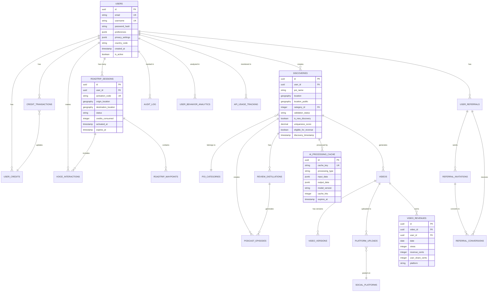

# Roadtrip-Copilot Database Documentation
## Production Database Schema v2.0

**Last Updated:** January 2025  
**Database:** PostgreSQL 15+ with PostGIS, TimescaleDB, Vector extensions  
**Target:** Production deployment with 1M+ users, 10M+ POIs  
**Performance:** <200ms query response time for POI discovery  

---

## 📊 Entity Relationship Diagram

---

## 🗃️ Complete Data Dictionary

### Core Tables

#### **users** - User Management with Enhanced Privacy
| Column | Type | Constraints | Description |
|--------|------|-------------|-------------|
| `id` | UUID | PK, DEFAULT gen_random_uuid() | Unique user identifier |
| `email` | VARCHAR(255) | UNIQUE, NOT NULL | User email (encrypted in production) |
| `username` | VARCHAR(50) | UNIQUE, NOT NULL | Display name |
| `password_hash` | VARCHAR(255) | NOT NULL | Encrypted password |
| `privacy_settings` | JSONB | DEFAULT privacy config | Granular privacy controls |
| `country_code` | CHAR(2) | ISO format | For compliance and tax reporting |
| `subscription_status` | VARCHAR(20) | DEFAULT 'free_trial' | 'free_trial', 'active', 'expired' |
| `gdpr_consent` | BOOLEAN | DEFAULT false | GDPR compliance flag |
| `data_retention_expires_at` | TIMESTAMPTZ | NULL | Auto-deletion timestamp |

#### **roadtrip_sessions** - Pay-per-roadtrip Core Functionality
| Column | Type | Constraints | Description |
|--------|------|-------------|-------------|
| `id` | UUID | PK | Session identifier |
| `user_id` | UUID | FK → users(id) | Session owner |
| `activation_code` | VARCHAR(20) | UNIQUE | 6-digit activation code |
| `session_token` | VARCHAR(255) | UNIQUE | JWT for session auth |
| `status` | VARCHAR(20) | CHECK values | 'active', 'completed', 'cancelled', 'expired' |
| `credits_consumed` | INTEGER | DEFAULT 1 | Credits used for this trip |
| `total_discoveries` | INTEGER | DEFAULT 0 | POIs discovered in session |
| `new_discoveries` | INTEGER | DEFAULT 0 | Revenue-eligible discoveries |
| `expires_at` | TIMESTAMPTZ | NOT NULL | Session expiration time |

#### **discoveries** - POI Discovery with Revenue Tracking
| Column | Type | Constraints | Description |
|--------|------|-------------|-------------|
| `id` | UUID | PK | Discovery identifier |
| `user_id` | UUID | FK → users(id) | Discoverer |
| `poi_name` | VARCHAR(255) | NOT NULL | POI name |
| `location` | GEOGRAPHY(POINT, 4326) | NOT NULL | Precise location (internal) |
| `location_public` | GEOGRAPHY(POINT, 4326) | NULL | Anonymized location (city center) |
| `category_id` | INTEGER | FK → poi_categories(id) | POI category |
| `validation_status` | VARCHAR(50) | CHECK values | 'pending', 'ai_validated', 'community_validated' |
| `is_new_discovery` | BOOLEAN | DEFAULT false | Revenue eligibility flag |
| `uniqueness_score` | DECIMAL(4,3) | 0-1 range | AI-calculated uniqueness |
| `eligible_for_revenue` | BOOLEAN | GENERATED | Auto-calculated revenue eligibility |
| `revenue_potential_score` | DECIMAL(4,3) | 0-1 range | Expected earnings potential |
| `discovery_method` | VARCHAR(50) | CHECK values | 'voice', 'manual', 'auto_detected' |

#### **ai_processing_cache** - Gemma 3n AI Optimization
| Column | Type | Constraints | Description |
|--------|------|-------------|-------------|
| `id` | UUID | PK | Cache entry identifier |
| `cache_key` | VARCHAR(255) | UNIQUE | Hash of input parameters |
| `processing_type` | VARCHAR(50) | CHECK values | 'poi_analysis', 'script_generation', etc. |
| `input_data` | JSONB | NOT NULL | AI processing inputs |
| `output_data` | JSONB | NOT NULL | AI processing results |
| `model_version` | VARCHAR(50) | DEFAULT 'gemma-3n-v1' | AI model used |
| `cache_hits` | INTEGER | DEFAULT 0 | Performance metric |
| `expires_at` | TIMESTAMPTZ | NULL | Cache expiration |

#### **review_distillations** - 6-Second Podcast Content
| Column | Type | Constraints | Description |
|--------|------|-------------|-------------|
| `id` | UUID | PK | Distillation identifier |
| `discovery_id` | UUID | FK → discoveries(id) | Related discovery |
| `source_reviews` | JSONB | NOT NULL | Array of original reviews |
| `source_platforms` | TEXT[] | NOT NULL | ['google', 'yelp', 'tripadvisor'] |
| `distilled_script` | JSONB | NOT NULL | 6-second summary structure |
| `podcast_script` | JSONB | NULL | Two-person conversation |
| `estimated_reading_time_seconds` | DECIMAL(4,2) | NULL | Time to read aloud |
| `processed_by_model` | VARCHAR(50) | DEFAULT 'gemma-3n-v1' | AI model version |

#### **podcast_episodes** - Voice Content Generation
| Column | Type | Constraints | Description |
|--------|------|-------------|-------------|
| `id` | UUID | PK | Episode identifier |
| `discovery_id` | UUID | FK → discoveries(id) | Related discovery |
| `title` | VARCHAR(255) | NOT NULL | Episode title |
| `script` | JSONB | NOT NULL | Full conversation script |
| `duration_seconds` | INTEGER | NOT NULL | Episode length |
| `audio_url` | TEXT | NULL | Generated audio file |
| `voice_actors` | JSONB | DEFAULT voices | Voice personalities used |
| `play_count` | INTEGER | DEFAULT 0 | Usage analytics |
| `completion_rate` | DECIMAL(4,3) | NULL | Average % listened |
| `status` | VARCHAR(20) | CHECK values | 'generated', 'published', 'archived' |

#### **voice_interactions** - CarPlay/Android Auto Logs
| Column | Type | Constraints | Description |
|--------|------|-------------|-------------|
| `id` | UUID | PK | Interaction identifier |
| `session_id` | UUID | FK → roadtrip_sessions(id) | Associated trip |
| `user_id` | UUID | FK → users(id) | User making interaction |
| `interaction_type` | VARCHAR(50) | CHECK values | 'question', 'command', 'feedback' |
| `user_input_text` | TEXT | NULL | Transcribed speech |
| `ai_response_text` | TEXT | NULL | AI response |
| `processing_time_ms` | INTEGER | NULL | Performance metric |
| `confidence_score` | DECIMAL(4,3) | NULL | AI confidence level |
| `location_context` | GEOGRAPHY(POINT, 4326) | NULL | Where interaction occurred |
| `audio_data_retained` | BOOLEAN | DEFAULT false | Privacy compliance |

### Revenue and Monetization Tables

#### **video_revenues** - UGC Monetization (TimescaleDB Hypertable)
| Column | Type | Constraints | Description |
|--------|------|-------------|-------------|
| `id` | UUID | PK | Revenue record identifier |
| `video_id` | UUID | FK → videos(id) | Source video |
| `user_id` | UUID | FK → users(id) | Revenue recipient |
| `discovery_id` | UUID | FK → discoveries(id) | Original discovery |
| `date` | DATE | NOT NULL | Revenue date (partitioning key) |
| `platform_id` | INTEGER | FK → social_platforms(id) | YouTube, TikTok, etc. |
| `views` | INTEGER | DEFAULT 0 | Video views |
| `net_revenue_cents` | INTEGER | DEFAULT 0 | Revenue after platform fees |
| `user_share_cents` | INTEGER | GENERATED | 50% user share |
| `platform_share_cents` | INTEGER | GENERATED | 50% platform share |

#### **user_credits** - Roadtrip Credit Management
| Column | Type | Constraints | Description |
|--------|------|-------------|-------------|
| `user_id` | UUID | PK, FK → users(id) | Credit owner |
| `balance` | INTEGER | DEFAULT 7 | Current credit balance |
| `total_earned` | INTEGER | DEFAULT 0 | Lifetime credits earned |
| `total_used` | INTEGER | DEFAULT 0 | Lifetime credits consumed |
| `conversion_rate_cents` | INTEGER | DEFAULT 50 | $0.50 per roadtrip |
| `auto_conversion_enabled` | BOOLEAN | DEFAULT true | Automatic revenue conversion |

#### **credit_transactions** - Credit History
| Column | Type | Constraints | Description |
|--------|------|-------------|-------------|
| `id` | UUID | PK | Transaction identifier |
| `user_id` | UUID | FK → users(id) | Credit recipient/payer |
| `transaction_type` | VARCHAR(50) | CHECK values | 'earned', 'used', 'expired', 'promotional' |
| `amount` | INTEGER | NOT NULL | Credits (can be negative) |
| `source` | VARCHAR(100) | NOT NULL | 'video_revenue', 'referral', 'roadtrip_usage' |
| `description` | TEXT | NOT NULL | Human-readable description |
| `balance_before` | INTEGER | NOT NULL | Balance before transaction |
| `balance_after` | INTEGER | NOT NULL | Balance after transaction |

### Referral System Tables

#### **user_referrals** - Viral Referral System
| Column | Type | Constraints | Description |
|--------|------|-------------|-------------|
| `user_id` | UUID | PK, FK → users(id) | Referrer |
| `referral_code` | VARCHAR(20) | UNIQUE | 'ROAD-XXXX-YYYY' format |
| `referral_link` | TEXT | NOT NULL | Shareable URL |
| `qr_code_url` | TEXT | NULL | QR code image |
| `total_friends_joined` | INTEGER | DEFAULT 0 | Successful conversions |
| `total_credits_earned` | INTEGER | DEFAULT 0 | Credits from referrals |

#### **referral_conversions** - Referral Tracking
| Column | Type | Constraints | Description |
|--------|------|-------------|-------------|
| `id` | UUID | PK | Conversion identifier |
| `referrer_id` | UUID | FK → users(id) | User who referred |
| `referred_user_id` | UUID | FK → users(id) | New user |
| `referral_code` | VARCHAR(20) | FK → user_referrals | Code used |
| `conversion_status` | VARCHAR(50) | CHECK values | 'pending', 'qualified', 'credited' |
| `referrer_credits_earned` | INTEGER | DEFAULT 1 | Credits awarded to referrer |

### Privacy and Compliance Tables

#### **data_retention_policies** - GDPR/CCPA Compliance
| Column | Type | Constraints | Description |
|--------|------|-------------|-------------|
| `id` | SERIAL | PK | Policy identifier |
| `table_name` | VARCHAR(100) | NOT NULL | Target table |
| `retention_period_days` | INTEGER | NOT NULL | Data retention period |
| `policy_type` | VARCHAR(50) | CHECK values | 'automatic_deletion', 'anonymization' |
| `applies_to_regions` | TEXT[] | DEFAULT ['EU','CA','US'] | Geographic scope |
| `cleanup_frequency` | VARCHAR(20) | CHECK values | 'daily', 'weekly', 'monthly' |
| `is_active` | BOOLEAN | DEFAULT true | Policy status |

#### **audit_log** - Immutable Audit Trail (TimescaleDB Hypertable)
| Column | Type | Constraints | Description |
|--------|------|-------------|-------------|
| `id` | UUID | PK | Log entry identifier |
| `table_name` | VARCHAR(100) | NOT NULL | Table affected |
| `operation` | VARCHAR(20) | CHECK values | 'INSERT', 'UPDATE', 'DELETE', 'SELECT' |
| `user_id` | UUID | FK → users(id) | User performing operation |
| `old_values` | JSONB | NULL | Previous data (for updates/deletes) |
| `new_values` | JSONB | NULL | New data (for inserts/updates) |
| `legal_basis` | VARCHAR(100) | CHECK values | GDPR legal basis |
| `user_jurisdiction` | VARCHAR(10) | NULL | User's legal jurisdiction |
| `created_at` | TIMESTAMPTZ | NOT NULL | Immutable timestamp |

#### **api_usage_tracking** - Rate Limiting (TimescaleDB Hypertable)
| Column | Type | Constraints | Description |
|--------|------|-------------|-------------|
| `id` | UUID | PK | Usage record identifier |
| `user_id` | UUID | FK → users(id) | API user |
| `endpoint` | VARCHAR(255) | NOT NULL | API endpoint called |
| `time_bucket` | TIMESTAMPTZ | NOT NULL | Rounded timestamp for bucketing |
| `bucket_type` | VARCHAR(20) | CHECK values | 'per_minute', 'per_hour', 'per_day' |
| `request_count` | INTEGER | DEFAULT 1 | Number of requests |
| `rate_limited_count` | INTEGER | DEFAULT 0 | Rate-limited requests |

---

## 🏗️ Database Architecture Principles

### Performance Optimization Strategy
1. **TimescaleDB Hypertables** for time-series data (revenues, analytics, audit logs)
2. **PostGIS Spatial Indexing** for location-based queries (<200ms target)
3. **Strategic Compound Indexes** for common query patterns
4. **Materialized Views** for expensive aggregations
5. **Connection Pooling** for high-concurrency access

### Privacy-First Design
1. **Location Anonymization** - Public locations rounded to city center
2. **Data Retention Policies** - Automatic cleanup per jurisdiction
3. **Immutable Audit Trail** - All operations logged for compliance
4. **Granular Privacy Settings** - User controls for data sharing
5. **Right to be Forgotten** - GDPR deletion capabilities

### Scalability Architecture
1. **Horizontal Partitioning** ready for 10M+ POIs
2. **Read Replicas** for analytics workloads
3. **Vector Search** optimization for AI operations
4. **Cache-First** design with AI processing cache
5. **Row Level Security** for multi-tenant isolation

### Monetization Support
1. **Revenue Attribution** tracks every dollar to discoverer
2. **Credit System** converts earnings to free roadtrips
3. **Viral Mechanics** with milestone-triggered referral prompts
4. **Tax Compliance** with 1099 reporting capabilities
5. **Multi-Platform** revenue tracking and reconciliation

---

## 📈 Query Performance Targets

| Query Type | Target | Strategy |
|------------|--------|----------|
| POI Discovery (nearby) | <50ms | PostGIS spatial index + caching |
| User Dashboard Load | <100ms | Materialized views + compound indexes |
| Voice Interaction Response | <200ms | AI cache + optimized lookups |
| Revenue Calculation | <150ms | TimescaleDB continuous aggregates |
| Referral Status Check | <30ms | Optimized referral indexes |

## 🔐 Security Implementation

### Row Level Security Policies
- Users can only access their own data
- Admin bypass for system operations
- Anonymous analytics through RPC functions
- Discovery data visible to creators only

### Data Protection
- PII encryption at rest and in transit
- Password hashing with bcrypt
- Session token security
- API rate limiting per user tier

### Compliance Features
- GDPR Article 17 (Right to Erasure) support
- CCPA data export capabilities
- Automatic data retention enforcement
- Legal basis tracking for all operations

---

## 🚀 Production Deployment Checklist

### Pre-Deployment
- [ ] Change default admin password
- [ ] Configure connection pooling (PgBouncer)
- [ ] Set up read replicas for analytics
- [ ] Configure automated backups
- [ ] Test migration rollback procedures

### Post-Deployment
- [ ] Monitor query performance metrics
- [ ] Set up data retention job scheduling
- [ ] Configure rate limiting rules per tier
- [ ] Enable real-time monitoring and alerting
- [ ] Run full database integrity verification

### Scaling Preparation
- [ ] Set up horizontal partitioning triggers
- [ ] Configure TimescaleDB chunk intervals
- [ ] Optimize vacuum and analyze schedules
- [ ] Implement connection pooling
- [ ] Set up monitoring dashboards

This database schema provides the complete foundation for Roadtrip-Copilot's production deployment, supporting all product requirements while maintaining exceptional performance, privacy compliance, and scalability for millions of users.