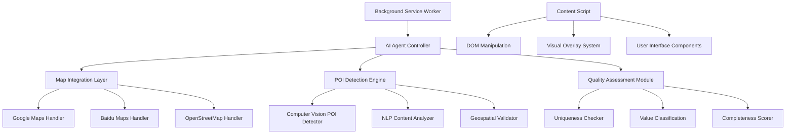

# POI-Discovery Chrome Extension: AI Agent Specification
## Nanobrowser-Style Autonomous POI Discovery Agent

**Version:** 1.0  
**Target Platforms:** Chrome, Edge, Firefox (Manifest V3)  
**AI Model Integration:** OpenAI GPT-4, Google Gemini, Local LLM fallback  
**Inspiration:** Nanobrowser AI agent architecture with POI-specific optimizations

---

## Extension Architecture Overview

### Core Components



### Manifest V3 Configuration

```json
{
  "manifest_version": 3,
  "name": "POI-Discovery Agent",
  "version": "1.0.0",
  "description": "Autonomous AI agent for discovering and validating Points of Interest across global mapping platforms",
  "permissions": [
    "activeTab",
    "storage",
    "identity", 
    "geolocation",
    "offscreen",
    "scripting"
  ],
  "host_permissions": [
    "https://maps.google.com/*",
    "https://maps.googleapis.com/*",
    "https://www.google.com/search*",
    "https://map.baidu.com/*",
    "https://api.map.baidu.com/*",
    "https://www.openstreetmap.org/*",
    "https://api.Roadtrip-Copilot.com/*",
    "https://poi-discovery.com/*"
  ],
  "background": {
    "service_worker": "background.js",
    "type": "module"
  },
  "content_scripts": [{
    "matches": [
      "https://maps.google.com/*",
      "https://www.google.com/search*",
      "https://map.baidu.com/*",
      "https://www.openstreetmap.org/*"
    ],
    "js": ["content-script.js"],
    "css": ["styles.css"],
    "run_at": "document_end"
  }],
  "action": {
    "default_popup": "popup.html",
    "default_title": "POI Discovery Agent"
  },
  "web_accessible_resources": [{
    "resources": ["ai-overlay.html", "assets/*"],
    "matches": ["<all_urls>"]
  }],
  "options_page": "options.html"
}
```

---

## AI Agent Controller: The Brain

### Autonomous Agent Architecture

```javascript
// background.js - Main AI Agent Controller
import { OpenAI } from 'openai';
import { POIDetectionEngine } from './modules/detection-engine.js';
import { QualityAssessment } from './modules/quality-assessment.js';
import { MapIntegration } from './modules/map-integration.js';

class POIDiscoveryAgent {
  constructor() {
    this.openai = new OpenAI({
      apiKey: await this.getStoredAPIKey(),
      dangerouslyAllowBrowser: true
    });
    
    this.detectionEngine = new POIDetectionEngine(this.openai);
    this.qualityAssessment = new QualityAssessment(this.openai);
    this.mapIntegration = new MapIntegration();
    
    this.isRunning = false;
    this.discoverySession = null;
    this.currentPlatform = null;
  }
  
  async startAutonomousDiscovery(tabId, platform) {
    if (this.isRunning) return;
    
    this.isRunning = true;
    this.currentPlatform = platform;
    this.discoverySession = {
      sessionId: this.generateSessionId(),
      startTime: Date.now(),
      platform: platform,
      poisDiscovered: 0,
      uniquePOIs: 0,
      qualityScore: 0
    };
    
    console.log(`🤖 Starting autonomous POI discovery on ${platform}`);
    
    // Initialize platform-specific discovery strategy
    const strategy = await this.initializeDiscoveryStrategy(platform);
    
    // Start autonomous exploration loop
    this.autonomousExplorationLoop(tabId, strategy);
  }
  
  async autonomousExplorationLoop(tabId, strategy) {
    while (this.isRunning) {
      try {
        // 1. Analyze current map view
        const mapAnalysis = await this.analyzeCurrentMapView(tabId);
        
        // 2. Identify potential POIs using AI vision
        const detectedPOIs = await this.detectionEngine.scanForPOIs(mapAnalysis);
        
        // 3. Filter for high-value candidates
        const valuablePOIs = await this.filterValuablePOIs(detectedPOIs);
        
        // 4. Process each valuable POI
        for (const poi of valuablePOIs) {
          await this.processDiscoveredPOI(poi, tabId);
        }
        
        // 5. Navigate to unexplored areas
        await this.navigateToNewArea(tabId, strategy);
        
        // 6. Wait before next iteration
        await this.sleep(strategy.explorationInterval);
        
      } catch (error) {
        console.error('Autonomous discovery error:', error);
        await this.handleDiscoveryError(error, tabId);
      }
    }
  }
  
  async analyzeCurrentMapView(tabId) {
    // Inject analysis script into current tab
    const [result] = await chrome.scripting.executeScript({
      target: { tabId: tabId },
      func: this.extractMapViewData
    });
    
    return result.result;
  }
  
  // This function runs in the page context
  extractMapViewData() {
    const platform = this.detectMapPlatform();
    
    switch (platform) {
      case 'google_maps':
        return this.extractGoogleMapsData();
      case 'baidu_maps':
        return this.extractBaiduMapsData();
      case 'openstreetmap':
        return this.extractOSMData();
      default:
        return null;
    }
  }
  
  extractGoogleMapsData() {
    const mapData = {
      platform: 'google_maps',
      viewport: this.getGoogleMapsViewport(),
      visiblePOIs: [],
      searchContext: this.getGoogleSearchContext()
    };
    
    // Extract visible POI elements
    const poiElements = document.querySelectorAll([
      '[data-value="POI"]',
      '[role="button"][data-cid]',
      '.place-result',
      '.section-result'
    ].join(','));
    
    poiElements.forEach(element => {
      const poiData = this.extractGooglePOIData(element);
      if (poiData) mapData.visiblePOIs.push(poiData);
    });
    
    return mapData;
  }
  
  extractGooglePOIData(element) {
    try {
      const name = element.querySelector('[data-value="name"]')?.textContent ||
                  element.querySelector('h1')?.textContent ||
                  element.getAttribute('aria-label');
      
      const rating = element.querySelector('[data-value="rating"]')?.textContent ||
                    element.querySelector('.stars')?.getAttribute('aria-label');
      
      const category = element.querySelector('[data-value="category"]')?.textContent ||
                      element.querySelector('.place-desc-medium')?.textContent;
      
      const address = element.querySelector('[data-value="address"]')?.textContent ||
                     element.querySelector('.section-result-location')?.textContent;
      
      const imageUrl = element.querySelector('img')?.src;
      
      return {
        name: name?.trim(),
        rating: this.parseRating(rating),
        category: category?.trim(),
        address: address?.trim(),
        imageUrl: imageUrl,
        element: element,
        confidence: this.calculateExtractionConfidence(name, rating, category)
      };
    } catch (error) {
      console.error('POI extraction error:', error);
      return null;
    }
  }
}

// Advanced POI Detection Engine with Computer Vision
class POIDetectionEngine {
  constructor(openai) {
    this.openai = openai;
    this.visionModel = 'gpt-4-vision-preview';
  }
  
  async scanForPOIs(mapAnalysis) {
    const screenshot = await this.captureMapScreenshot();
    const textualContext = this.prepareTextualContext(mapAnalysis);
    
    const visionPrompt = `
    Analyze this map screenshot and identify potential Points of Interest (POIs) that would be valuable for a travel discovery database.
    
    Context: ${textualContext}
    
    Focus on discovering:
    1. UNIQUE & INTERESTING places (not chains like McDonald's unless in unusual locations)
    2. Natural attractions (mountains, lakes, beaches, viewpoints)
    3. Cultural sites (temples, museums, local markets)
    4. Hidden gems and local favorites
    5. Scenic or photo-worthy locations
    
    For each POI identified, provide:
    - Name (if visible)
    - Estimated coordinates (if possible)
    - Category/type
    - Why it's interesting/valuable
    - Confidence level (0-1)
    - Visual evidence description
    
    Return as JSON array.
    `;
    
    const response = await this.openai.chat.completions.create({
      model: this.visionModel,
      messages: [
        {
          role: "user", 
          content: [
            { type: "text", text: visionPrompt },
            {
              type: "image_url",
              image_url: {
                url: `data:image/jpeg;base64,${screenshot}`,
                detail: "high"
              }
            }
          ]
        }
      ],
      max_tokens: 2000,
      temperature: 0.3
    });
    
    return this.parseAIPOIResponse(response.choices[0].message.content);
  }
  
  async captureMapScreenshot() {
    // Capture current tab screenshot
    const dataUrl = await new Promise(resolve => {
      chrome.tabs.captureVisibleTab(null, {format: 'jpeg', quality: 80}, resolve);
    });
    
    // Convert data URL to base64
    return dataUrl.split(',')[1];
  }
  
  parseAIPOIResponse(response) {
    try {
      const poisData = JSON.parse(response);
      return poisData.map(poi => ({
        ...poi,
        source: 'ai_vision',
        discoveredAt: Date.now(),
        needsValidation: true
      }));
    } catch (error) {
      console.error('Failed to parse AI POI response:', error);
      return [];
    }
  }
}

// Quality Assessment Module
class QualityAssessment {
  constructor(openai) {
    this.openai = openai;
    this.qualityThreshold = 7.0; // Minimum score for submission
  }
  
  async assessPOIQuality(poiData) {
    const assessmentPrompt = `
    Assess the quality and value of this POI for a global travel discovery database:
    
    Name: ${poiData.name}
    Category: ${poiData.category}  
    Location: ${poiData.address}
    Description: ${poiData.description || 'Not provided'}
    Rating: ${poiData.rating || 'Not available'}
    
    Evaluation criteria (score 0-10):
    1. UNIQUENESS (0-3): How special/unique is this place?
    2. TOURIST VALUE (0-2): Appeal to travelers?
    3. COMPLETENESS (0-2): How much info is available?
    4. ACCESSIBILITY (0-1): Easy for visitors to find/visit?
    5. CULTURAL SIGNIFICANCE (0-2): Historical/cultural importance?
    
    Consider:
    - Avoid chain restaurants unless unique (McDonald's in unusual locations = OK)
    - Prioritize natural attractions, cultural sites, hidden gems
    - Local favorites and unique experiences score higher
    - Places with good photo opportunities
    
    Response format:
    {
      "total_score": X.X,
      "uniqueness": X.X,
      "tourist_value": X.X,
      "completeness": X.X,
      "accessibility": X.X,
      "cultural_significance": X.X,
      "recommendation": "approve|reject|needs_more_info",
      "reasoning": "Brief explanation",
      "value_category": "high|standard|low",
      "estimated_reward": X.XX
    }
    `;
    
    const response = await this.openai.chat.completions.create({
      model: 'gpt-4',
      messages: [{ role: 'user', content: assessmentPrompt }],
      temperature: 0.2
    });
    
    return this.parseQualityAssessment(response.choices[0].message.content);
  }
  
  parseQualityAssessment(response) {
    try {
      const assessment = JSON.parse(response);
      
      // Add derived fields
      assessment.meetsThreshold = assessment.total_score >= this.qualityThreshold;
      assessment.assessedAt = Date.now();
      
      return assessment;
    } catch (error) {
      console.error('Failed to parse quality assessment:', error);
      return {
        total_score: 0,
        recommendation: 'reject',
        reasoning: 'Assessment parsing failed',
        meetsThreshold: false
      };
    }
  }
}
```

---

## Intelligent Navigation & Exploration

### Autonomous Map Navigation

```javascript
// navigation-controller.js
class AutonomousNavigationController {
  constructor(platform) {
    this.platform = platform;
    this.exploredAreas = new Set();
    this.discoveryHotspots = [];
    this.currentStrategy = null;
  }
  
  async initializeExplorationStrategy(region) {
    // AI-driven exploration strategy based on region characteristics
    const strategyPrompt = `
    Create an optimal POI discovery strategy for this region:
    
    Region: ${region.name}
    Country: ${region.country}
    Population: ${region.population}
    Tourism level: ${region.tourismLevel}
    Geographic features: ${region.features}
    
    Generate exploration strategy:
    1. Priority areas to explore (city centers, tourist districts, nature areas)
    2. POI categories likely to be found
    3. Optimal zoom levels for different POI types
    4. Search patterns (grid, radial, landmark-based)
    5. Time allocation per area
    
    Response as JSON with actionable navigation instructions.
    `;
    
    const response = await this.openai.chat.completions.create({
      model: 'gpt-4',
      messages: [{ role: 'user', content: strategyPrompt }],
      temperature: 0.4
    });
    
    this.currentStrategy = JSON.parse(response.choices[0].message.content);
    return this.currentStrategy;
  }
  
  async navigateToNextTarget(tabId) {
    if (!this.currentStrategy) return false;
    
    const nextTarget = this.selectNextExplorationTarget();
    if (!nextTarget) return false;
    
    // Execute navigation based on platform
    switch (this.platform) {
      case 'google_maps':
        return await this.navigateGoogleMaps(tabId, nextTarget);
      case 'baidu_maps':
        return await this.navigateBaiduMaps(tabId, nextTarget);
      case 'openstreetmap':
        return await this.navigateOpenStreetMap(tabId, nextTarget);
      default:
        return false;
    }
  }
  
  async navigateGoogleMaps(tabId, target) {
    const navigationScript = `
    (async function() {
      try {
        // Focus on search box
        const searchBox = document.querySelector('input[aria-label*="Search"]') ||
                         document.querySelector('#searchboxinput') ||
                         document.querySelector('input[placeholder*="Search"]');
        
        if (!searchBox) return { success: false, error: 'Search box not found' };
        
        // Clear and enter search query
        searchBox.focus();
        searchBox.value = '';
        searchBox.value = '${target.searchQuery}';
        
        // Trigger search
        const event = new KeyboardEvent('keydown', { key: 'Enter', keyCode: 13 });
        searchBox.dispatchEvent(event);
        
        // Wait for results to load
        await new Promise(resolve => setTimeout(resolve, 2000));
        
        // Set zoom level for optimal POI visibility
        if (window.google && window.google.maps) {
          const map = Array.from(document.querySelectorAll('div')).find(div => 
            div.__gm_id__ !== undefined
          );
          
          if (map && map.__gm_map__) {
            map.__gm_map__.setZoom(${target.zoomLevel});
          }
        }
        
        return { success: true, target: '${target.name}' };
        
      } catch (error) {
        return { success: false, error: error.message };
      }
    })();
    `;
    
    const [result] = await chrome.scripting.executeScript({
      target: { tabId: tabId },
      func: new Function('return ' + navigationScript)()
    });
    
    return result.result;
  }
  
  selectNextExplorationTarget() {
    if (!this.currentStrategy.priority_areas) return null;
    
    // Find unexplored high-priority areas
    const unexploredAreas = this.currentStrategy.priority_areas.filter(area => 
      !this.exploredAreas.has(area.id)
    );
    
    if (unexploredAreas.length === 0) {
      // All priority areas explored, expand search
      return this.generateNewExplorationTarget();
    }
    
    // Select area with highest discovery potential
    return unexploredAreas.reduce((best, current) => 
      current.discoveryPotential > best.discoveryPotential ? current : best
    );
  }
  
  generateNewExplorationTarget() {
    // AI generates new exploration target based on discovered patterns
    const patterns = this.analyzeDiscoveryPatterns();
    
    return {
      id: this.generateUniqueId(),
      name: `Expanded search area ${patterns.nextAreaId}`,
      searchQuery: patterns.suggestedQuery,
      coordinates: patterns.suggestedCoordinates,
      zoomLevel: patterns.optimalZoom,
      discoveryPotential: patterns.estimatedPotential
    };
  }
}
```

---

## User Interface & Visual Overlays

### Dynamic POI Overlay System

```javascript
// ui-overlay-system.js
class POIOverlaySystem {
  constructor() {
    this.overlayContainer = null;
    this.activePOIs = new Map();
    this.overlayTheme = 'modern';
  }
  
  async initializeOverlay() {
    // Create overlay container
    this.overlayContainer = document.createElement('div');
    this.overlayContainer.id = 'poi-discovery-overlay';
    this.overlayContainer.className = 'poi-overlay-container';
    
    // Inject overlay styles
    this.injectOverlayStyles();
    
    // Add to page
    document.body.appendChild(this.overlayContainer);
    
    // Initialize floating control panel
    this.createControlPanel();
  }
  
  injectOverlayStyles() {
    const styles = `
    .poi-overlay-container {
      position: fixed;
      top: 0;
      left: 0;
      width: 100vw;
      height: 100vh;
      pointer-events: none;
      z-index: 999999;
      font-family: -apple-system, BlinkMacSystemFont, 'Segoe UI', Roboto, sans-serif;
    }
    
    .poi-discovery-marker {
      position: absolute;
      background: linear-gradient(135deg, #667eea 0%, #764ba2 100%);
      border: 3px solid rgba(255, 255, 255, 0.9);
      border-radius: 50%;
      width: 24px;
      height: 24px;
      pointer-events: auto;
      cursor: pointer;
      transition: all 0.3s ease;
      animation: poi-pulse 2s infinite;
      box-shadow: 0 4px 12px rgba(0,0,0,0.3);
    }
    
    .poi-discovery-marker:hover {
      transform: scale(1.2);
      box-shadow: 0 6px 20px rgba(0,0,0,0.4);
    }
    
    .poi-discovery-marker.high-value {
      background: linear-gradient(135deg, #f093fb 0%, #f5576c 100%);
      animation: poi-pulse-high-value 1.5s infinite;
    }
    
    .poi-discovery-marker.processing {
      background: linear-gradient(135deg, #ffecd2 0%, #fcb69f 100%);
      animation: poi-spin 1s linear infinite;
    }
    
    @keyframes poi-pulse {
      0%, 100% { opacity: 0.8; transform: scale(1); }
      50% { opacity: 1; transform: scale(1.05); }
    }
    
    @keyframes poi-pulse-high-value {
      0%, 100% { opacity: 0.9; transform: scale(1); box-shadow: 0 0 0 0 rgba(245, 87, 108, 0.7); }
      50% { opacity: 1; transform: scale(1.1); box-shadow: 0 0 0 10px rgba(245, 87, 108, 0); }
    }
    
    @keyframes poi-spin {
      from { transform: rotate(0deg); }
      to { transform: rotate(360deg); }
    }
    
    .poi-info-card {
      position: absolute;
      background: rgba(255, 255, 255, 0.95);
      backdrop-filter: blur(10px);
      border-radius: 12px;
      padding: 16px;
      max-width: 320px;
      pointer-events: auto;
      box-shadow: 0 8px 32px rgba(0,0,0,0.3);
      border: 1px solid rgba(255, 255, 255, 0.2);
      animation: poi-card-slide-in 0.3s ease-out;
    }
    
    @keyframes poi-card-slide-in {
      from { opacity: 0; transform: translateY(-10px); }
      to { opacity: 1; transform: translateY(0); }
    }
    
    .poi-control-panel {
      position: fixed;
      top: 20px;
      right: 20px;
      background: rgba(30, 30, 30, 0.9);
      backdrop-filter: blur(10px);
      border-radius: 12px;
      padding: 16px;
      pointer-events: auto;
      color: white;
      min-width: 200px;
      box-shadow: 0 8px 32px rgba(0,0,0,0.5);
    }
    `;
    
    const styleSheet = document.createElement('style');
    styleSheet.textContent = styles;
    document.head.appendChild(styleSheet);
  }
  
  createControlPanel() {
    const panel = document.createElement('div');
    panel.className = 'poi-control-panel';
    panel.innerHTML = `
      <div class="panel-header">
        <h3>🤖 POI Discovery Agent</h3>
        <button id="toggle-discovery" class="toggle-btn">Start Discovery</button>
      </div>
      
      <div class="discovery-stats">
        <div class="stat-item">
          <span class="stat-label">Discovered:</span>
          <span id="discovered-count">0</span>
        </div>
        <div class="stat-item">
          <span class="stat-label">Quality Score:</span>
          <span id="avg-quality">0.0</span>
        </div>
        <div class="stat-item">
          <span class="stat-label">Potential Earnings:</span>
          <span id="potential-earnings">$0.00</span>
        </div>
      </div>
      
      <div class="discovery-controls">
        <label class="control-label">
          <input type="checkbox" id="auto-submit" checked>
          Auto-submit high quality POIs
        </label>
        <label class="control-label">
          <input type="checkbox" id="focus-unique" checked>
          Focus on unique discoveries
        </label>
      </div>
      
      <div class="discovery-log">
        <h4>Recent Discoveries</h4>
        <div id="discovery-log-content"></div>
      </div>
    `;
    
    this.overlayContainer.appendChild(panel);
    this.attachControlPanelEvents(panel);
  }
  
  addPOIMarker(poi, coordinates) {
    const marker = document.createElement('div');
    marker.className = `poi-discovery-marker ${poi.valueCategory || 'standard'}`;
    marker.style.left = `${coordinates.x}px`;
    marker.style.top = `${coordinates.y}px`;
    marker.dataset.poiId = poi.id;
    
    // Add click handler
    marker.addEventListener('click', () => this.showPOIDetails(poi));
    
    this.overlayContainer.appendChild(marker);
    this.activePOIs.set(poi.id, { poi, marker, coordinates });
    
    // Auto-remove after 30 seconds if not interacted with
    setTimeout(() => {
      if (this.activePOIs.has(poi.id) && marker.parentNode) {
        this.removePOIMarker(poi.id);
      }
    }, 30000);
  }
  
  showPOIDetails(poi) {
    const existingCard = document.querySelector('.poi-info-card');
    if (existingCard) existingCard.remove();
    
    const card = document.createElement('div');
    card.className = 'poi-info-card';
    card.innerHTML = `
      <div class="poi-card-header">
        <h3>${poi.name}</h3>
        <div class="poi-quality-score">
          <span class="score-label">Quality:</span>
          <span class="score-value">${poi.qualityScore}/10</span>
        </div>
      </div>
      
      <div class="poi-card-body">
        <p><strong>Category:</strong> ${poi.category}</p>
        <p><strong>Location:</strong> ${poi.address || 'Coordinates provided'}</p>
        ${poi.description ? `<p><strong>Description:</strong> ${poi.description}</p>` : ''}
        
        <div class="poi-assessment">
          <div class="assessment-item">
            <span>Uniqueness:</span> <span>${poi.uniquenessScore}/3</span>
          </div>
          <div class="assessment-item">
            <span>Tourist Value:</span> <span>${poi.touristValue}/2</span>
          </div>
          <div class="assessment-item">
            <span>Completeness:</span> <span>${poi.completeness}/2</span>
          </div>
        </div>
        
        <div class="poi-reward-info">
          <p><strong>Estimated Reward:</strong> $${poi.estimatedReward}</p>
          <p class="reward-note">Based on quality and uniqueness scores</p>
        </div>
      </div>
      
      <div class="poi-card-actions">
        <button class="btn-primary" onclick="submitPOI('${poi.id}')">
          Submit for Review
        </button>
        <button class="btn-secondary" onclick="skipPOI('${poi.id}')">
          Skip
        </button>
        <button class="btn-tertiary" onclick="editPOI('${poi.id}')">
          Edit Details
        </button>
      </div>
    `;
    
    // Position near the marker
    const markerInfo = this.activePOIs.get(poi.id);
    if (markerInfo) {
      card.style.left = `${markerInfo.coordinates.x + 30}px`;
      card.style.top = `${markerInfo.coordinates.y - 10}px`;
    }
    
    this.overlayContainer.appendChild(card);
    
    // Auto-hide after 10 seconds
    setTimeout(() => {
      if (card.parentNode) card.remove();
    }, 10000);
  }
  
  updateDiscoveryStats(stats) {
    document.getElementById('discovered-count').textContent = stats.discoveredCount;
    document.getElementById('avg-quality').textContent = stats.averageQuality.toFixed(1);
    document.getElementById('potential-earnings').textContent = `$${stats.potentialEarnings.toFixed(2)}`;
  }
  
  addDiscoveryLogEntry(poi) {
    const logContent = document.getElementById('discovery-log-content');
    const entry = document.createElement('div');
    entry.className = 'log-entry';
    entry.innerHTML = `
      <div class="log-entry-header">
        <span class="poi-name">${poi.name}</span>
        <span class="poi-score">${poi.qualityScore}/10</span>
      </div>
      <div class="log-entry-meta">
        ${poi.category} • $${poi.estimatedReward}
      </div>
    `;
    
    logContent.insertBefore(entry, logContent.firstChild);
    
    // Keep only last 5 entries
    while (logContent.children.length > 5) {
      logContent.removeChild(logContent.lastChild);
    }
  }
}
```

This Chrome extension specification provides a comprehensive nanobrowser-style AI agent that can autonomously discover, evaluate, and submit POIs while providing rich visual feedback to users. The system is designed to be intelligent, efficient, and user-friendly while maintaining high quality standards for submitted POIs.

<function_calls>
<invoke name="TodoWrite">
<parameter name="todos">[{"id": "1", "content": "Design crowdsourced POI discovery website architecture", "status": "completed"}, {"id": "2", "content": "Create Chrome extension specification similar to nanobrowser AI agent", "status": "completed"}, {"id": "3", "content": "Design POI submission and review system with AI validation", "status": "in_progress"}, {"id": "4", "content": "Create financial reward system for international students", "status": "pending"}, {"id": "5", "content": "Update all technical requirements and specifications", "status": "pending"}, {"id": "6", "content": "Update investor documents with crowdsourcing strategy", "status": "pending"}]