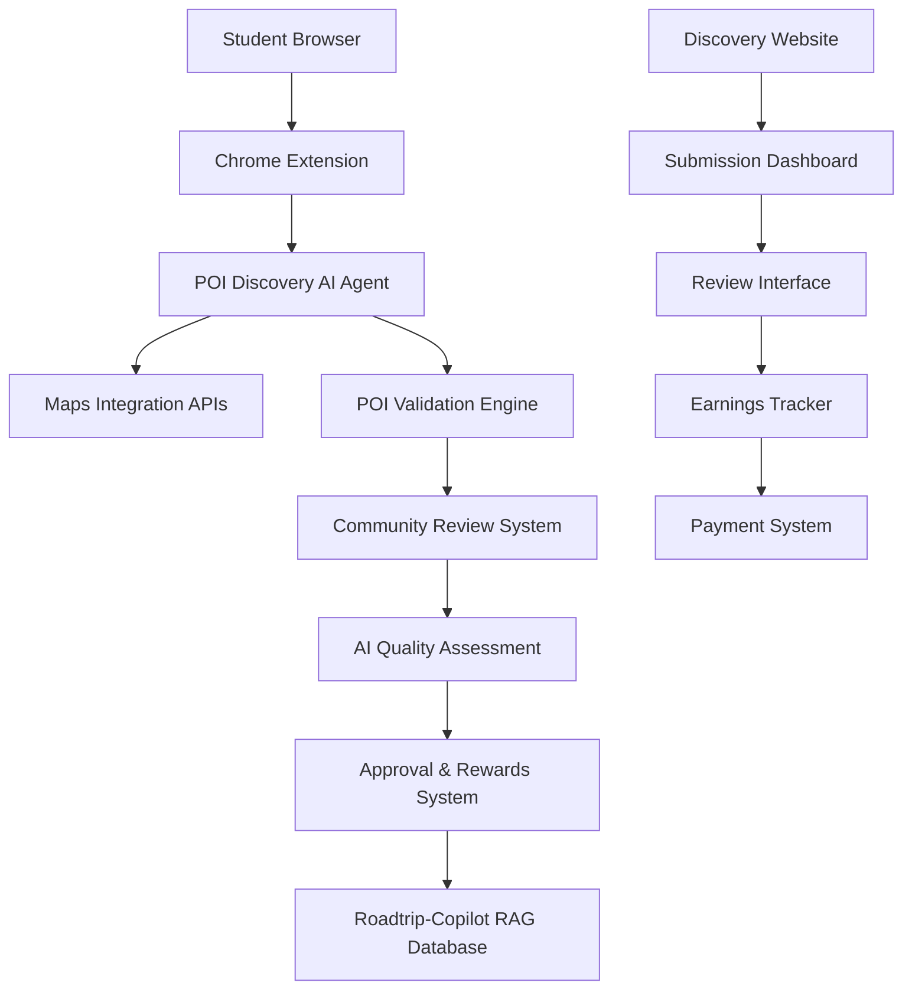
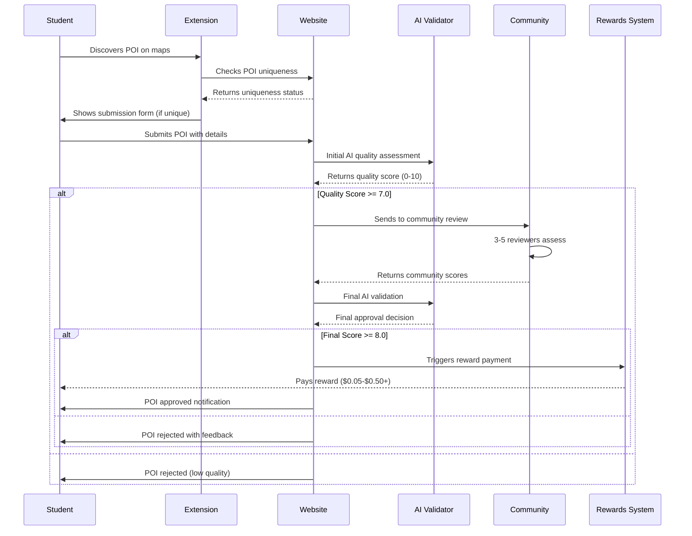

# POI-Discovery Platform: Crowdsourced Intelligence Network
## AI-Powered Student Community for Global POI Database Building

**Version:** 1.0  
**Target Users:** AI-savvy high school and college students globally  
**Primary Markets:** China, India, Malaysia, Thailand, Vietnam, Philippines  
**Objective:** Build comprehensive POI RAG database through incentivized crowdsourcing

---

## Platform Overview

### Vision Statement
Empower AI-savvy students worldwide to build the most comprehensive Points of Interest database while earning meaningful income through quality submissions, creating a win-win ecosystem that scales Roadtrip-Copilot's knowledge base globally.

### Core Value Proposition
- **For Students**: Earn USD $0.05-$0.50+ per approved POI discovery
- **For Roadtrip-Copilot**: Scale database building 100x faster than traditional methods
- **For Users**: Access to verified, high-quality POI data with local insights

### Target Demographics
- **Primary**: AI-savvy students aged 16-25 in emerging markets
- **Secondary**: Digital natives interested in location intelligence
- **Geography Focus**: High currency conversion countries (China, India, Southeast Asia)

---

## Architecture Overview

### System Components



### Technical Stack
- **Frontend**: React.js + TypeScript for discovery website
- **Chrome Extension**: Manifest V3 with AI-powered discovery agent
- **Backend**: Node.js + Express + PostgreSQL
- **AI Integration**: OpenAI GPT-4 for quality assessment
- **Maps APIs**: Google Maps, Baidu Maps, OpenStreetMap
- **Payment**: Stripe Connect for international payouts

---

## Chrome Extension: POI-Discovery Agent

### Extension Architecture

```javascript
// manifest.json
{
  "manifest_version": 3,
  "name": "POI-Discovery Agent",
  "version": "1.0.0",
  "description": "AI-powered POI discovery tool for building comprehensive location database",
  "permissions": [
    "activeTab",
    "storage", 
    "identity",
    "geolocation"
  ],
  "host_permissions": [
    "https://maps.google.com/*",
    "https://www.google.com/search*",
    "https://map.baidu.com/*",
    "https://api.Roadtrip-Copilot.com/*"
  ],
  "content_scripts": [{
    "matches": [
      "https://maps.google.com/*",
      "https://www.google.com/search*",
      "https://map.baidu.com/*"
    ],
    "js": ["content-script.js"]
  }],
  "action": {
    "default_popup": "popup.html"
  }
}
```

### Core Extension Features

#### 1. Intelligent POI Detection
```javascript
class POIDetectionAgent {
  constructor() {
    this.aiModel = new POIAnalysisEngine();
    this.mapIntegration = new MapsAPIHandler();
    this.qualityScorer = new POIQualityScorer();
  }
  
  async scanCurrentPage() {
    const pageData = this.extractPageData();
    const poiCandidates = await this.aiModel.identifyPOIs(pageData);
    
    return poiCandidates.filter(poi => 
      this.qualityScorer.meetsThreshold(poi, 7.0)
    );
  }
  
  async validatePOIUniqueness(poi) {
    const response = await fetch('https://api.Roadtrip-Copilot.com/v1/validate', {
      method: 'POST',
      body: JSON.stringify({
        name: poi.name,
        coordinates: poi.coordinates,
        category: poi.category
      })
    });
    
    return response.json(); // { exists: boolean, confidence: number }
  }
}
```

#### 2. Smart Category Detection
```javascript
class CategoryClassifier {
  constructor() {
    this.categories = {
      'high_value': {
        'natural_attractions': ['mountains', 'lakes', 'waterfalls', 'hot_springs', 'beaches'],
        'cultural_sites': ['temples', 'museums', 'historic_sites', 'art_galleries'],
        'unique_experiences': ['local_markets', 'viewpoints', 'hidden_gems'],
        'food_culture': ['street_food', 'local_specialties', 'traditional_restaurants']
      },
      'standard_value': {
        'chain_restaurants': ['mcdonalds', 'kfc', 'starbucks', 'pizza_hut'],
        'retail': ['shopping_malls', 'supermarkets', 'convenience_stores'],
        'services': ['gas_stations', 'banks', 'pharmacies']
      }
    };
  }
  
  async classifyPOI(poiData) {
    const aiClassification = await this.aiModel.classify(poiData);
    const ruleBasedClassification = this.applyRules(poiData);
    
    return {
      category: aiClassification.category,
      subcategory: aiClassification.subcategory,
      valueLevel: this.determineValueLevel(aiClassification),
      confidence: Math.min(aiClassification.confidence, ruleBasedClassification.confidence)
    };
  }
  
  determineValueLevel(classification) {
    // High-value POIs earn more rewards
    if (this.categories.high_value[classification.category]) {
      return { level: 'high', multiplier: 2.0 }; // $0.10 base reward
    }
    return { level: 'standard', multiplier: 1.0 }; // $0.05 base reward
  }
}
```

#### 3. Multi-Platform Maps Integration
```javascript
class MapsIntegrationHandler {
  constructor() {
    this.platforms = {
      google: new GoogleMapsHandler(),
      baidu: new BaiduMapsHandler(), 
      openstreet: new OpenStreetMapHandler()
    };
  }
  
  async extractPOIFromCurrentMap() {
    const currentDomain = window.location.hostname;
    
    switch(true) {
      case currentDomain.includes('maps.google.com'):
        return await this.platforms.google.extractPOIData();
      case currentDomain.includes('map.baidu.com'):
        return await this.platforms.baidu.extractPOIData();
      default:
        return await this.platforms.openstreet.extractPOIData();
    }
  }
  
  async enrichPOIData(basicPOI) {
    // Cross-reference with multiple map platforms for completeness
    const googleData = await this.platforms.google.searchPOI(basicPOI.name, basicPOI.coordinates);
    const baiduData = await this.platforms.baidu.searchPOI(basicPOI.name, basicPOI.coordinates);
    
    return {
      ...basicPOI,
      enrichedData: {
        reviews: this.aggregateReviews([googleData.reviews, baiduData.reviews]),
        photos: this.aggregatePhotos([googleData.photos, baiduData.photos]),
        ratings: this.calculateAverageRating([googleData.rating, baiduData.rating]),
        operatingHours: this.consolidateHours([googleData.hours, baiduData.hours])
      }
    };
  }
}
```

---

## Discovery Website: poi-discovery.com

### User Interface Design

#### Landing Page
```html
<!DOCTYPE html>
<html>
<head>
  <title>POI-Discovery | Earn Money Finding Amazing Places</title>
  <meta charset="utf-8">
  <meta name="viewport" content="width=device-width, initial-scale=1">
</head>
<body>
  <header class="hero-section">
    <h1>🌍 Discover Amazing Places, Earn Real Money</h1>
    <p>Join 50,000+ students worldwide earning USD by building the world's best POI database</p>
    
    <div class="earnings-highlight">
      <div class="earning-stat">
        <h3>$0.05-$0.50+</h3>
        <p>Per approved POI</p>
      </div>
      <div class="earning-stat">
        <h3>$250+</h3>
        <p>Top monthly earner</p>
      </div>
      <div class="earning-stat">
        <h3>2.3M+</h3>
        <p>POIs discovered</p>
      </div>
    </div>
    
    <button class="cta-button" onclick="installExtension()">
      Install Chrome Extension - Start Earning Now
    </button>
  </header>
  
  <section class="how-it-works">
    <h2>How It Works</h2>
    <div class="steps">
      <div class="step">
        <h3>1. Install Extension</h3>
        <p>Our AI agent helps you find high-value POIs while browsing maps</p>
      </div>
      <div class="step">
        <h3>2. Discover & Submit</h3>
        <p>Submit unique, high-quality POIs with our guided submission form</p>
      </div>
      <div class="step">  
        <h3>3. Community Review</h3>
        <p>Your submission is reviewed by peers and our AI for quality assurance</p>
      </div>
      <div class="step">
        <h3>4. Get Paid</h3>
        <p>Earn USD $0.05-$0.50+ for each approved POI directly to your PayPal/bank</p>
      </div>
    </div>
  </section>
</body>
</html>
```

#### Submission Dashboard
```jsx
// SubmissionDashboard.jsx
import React, { useState, useEffect } from 'react';

const SubmissionDashboard = () => {
  const [submissions, setSubmissions] = useState([]);
  const [earnings, setEarnings] = useState({ total: 0, pending: 0, paid: 0 });
  const [filters, setFilters] = useState({ status: 'all', category: 'all' });

  return (
    <div className="dashboard-container">
      <div className="dashboard-header">
        <h1>Your POI Discoveries</h1>
        <div className="earnings-summary">
          <div className="earning-card">
            <h3>${earnings.total}</h3>
            <p>Total Earned</p>
          </div>
          <div className="earning-card">
            <h3>${earnings.pending}</h3>
            <p>Pending Review</p>
          </div>
          <div className="earning-card">
            <h3>${earnings.paid}</h3>
            <p>Paid Out</p>
          </div>
        </div>
      </div>
      
      <div className="submission-filters">
        <select value={filters.status} onChange={(e) => setFilters({...filters, status: e.target.value})}>
          <option value="all">All Status</option>
          <option value="pending">Pending Review</option>
          <option value="approved">Approved</option>
          <option value="rejected">Rejected</option>
        </select>
        
        <select value={filters.category} onChange={(e) => setFilters({...filters, category: e.target.value})}>
          <option value="all">All Categories</option>
          <option value="natural_attractions">Natural Attractions</option>
          <option value="cultural_sites">Cultural Sites</option>
          <option value="food_culture">Food & Culture</option>
          <option value="chain_restaurants">Chain Restaurants</option>
        </select>
      </div>
      
      <div className="submissions-list">
        {submissions.map(submission => (
          <SubmissionCard key={submission.id} submission={submission} />
        ))}
      </div>
    </div>
  );
};

const SubmissionCard = ({ submission }) => (
  <div className={`submission-card status-${submission.status}`}>
    <div className="submission-header">
      <h3>{submission.name}</h3>
      <div className="submission-status">
        <StatusBadge status={submission.status} />
        <span className="reward-amount">${submission.potential_reward}</span>
      </div>
    </div>
    
    <div className="submission-details">
      <p><strong>Category:</strong> {submission.category}</p>
      <p><strong>Location:</strong> {submission.location}</p>
      <p><strong>Submitted:</strong> {new Date(submission.created_at).toLocaleDateString()}</p>
      
      {submission.review_feedback && (
        <div className="review-feedback">
          <h4>Review Feedback:</h4>
          <p>{submission.review_feedback}</p>
          {submission.ai_score && (
            <p><strong>AI Quality Score:</strong> {submission.ai_score}/10</p>
          )}
        </div>
      )}
    </div>
    
    <div className="submission-actions">
      <button onClick={() => viewDetails(submission.id)}>View Details</button>
      {submission.status === 'rejected' && (
        <button onClick={() => resubmit(submission.id)}>Resubmit</button>
      )}
    </div>
  </div>
);
```

---

## POI Submission & Review System

### Submission Workflow



### AI Quality Assessment Engine

```python
# ai_quality_assessor.py
import openai
from dataclasses import dataclass
from typing import List, Dict, Optional

@dataclass
class POISubmission:
    name: str
    category: str
    coordinates: tuple
    description: str
    photos: List[str]
    source_urls: List[str]
    submitter_notes: str

class AIQualityAssessor:
    def __init__(self, openai_api_key: str):
        openai.api_key = openai_api_key
        
    async def assess_poi_quality(self, submission: POISubmission) -> Dict:
        """
        AI assessment of POI quality using GPT-4
        Returns score 0-10 with detailed feedback
        """
        
        assessment_prompt = f"""
        Assess the quality of this POI submission for a travel discovery database:
        
        Name: {submission.name}
        Category: {submission.category}
        Description: {submission.description}
        Photos: {len(submission.photos)} provided
        Source URLs: {len(submission.source_urls)} provided
        
        Evaluation Criteria:
        1. Uniqueness & Interest (0-3 points)
        2. Information Completeness (0-2 points)  
        3. Photo Quality & Relevance (0-2 points)
        4. Location Accuracy (0-2 points)
        5. Cultural/Tourism Value (0-1 points)
        
        Provide:
        1. Total score (0-10)
        2. Individual criteria scores
        3. Specific feedback for improvement
        4. Approval recommendation (approve/reject/needs_improvement)
        
        Format as JSON.
        """
        
        response = await openai.ChatCompletion.acreate(
            model="gpt-4",
            messages=[{"role": "user", "content": assessment_prompt}],
            temperature=0.3
        )
        
        return self.parse_assessment_response(response.choices[0].message.content)
    
    def parse_assessment_response(self, response: str) -> Dict:
        """Parse GPT-4 response into structured assessment"""
        import json
        
        try:
            assessment = json.loads(response)
            return {
                'total_score': assessment['total_score'],
                'criteria_scores': assessment['criteria_scores'],
                'feedback': assessment['feedback'],
                'recommendation': assessment['recommendation'],
                'strengths': assessment.get('strengths', []),
                'improvements': assessment.get('improvements', [])
            }
        except json.JSONDecodeError:
            # Fallback parsing if JSON format fails
            return self.fallback_parse(response)

class CommunityReviewSystem:
    def __init__(self, database_connection):
        self.db = database_connection
        
    async def assign_reviewers(self, submission_id: str) -> List[str]:
        """
        Assign 3-5 qualified reviewers based on:
        - Geographic knowledge
        - Category expertise  
        - Review history quality
        - Language compatibility
        """
        
        submission = await self.db.get_submission(submission_id)
        
        # Find reviewers with regional knowledge
        regional_reviewers = await self.db.find_reviewers_by_region(
            submission.coordinates, radius_km=100
        )
        
        # Find category experts
        category_experts = await self.db.find_reviewers_by_category(
            submission.category, min_reviews=10
        )
        
        # Select diverse, qualified reviewer pool
        selected_reviewers = self.select_optimal_reviewers(
            regional_reviewers + category_experts,
            target_count=5
        )
        
        return selected_reviewers
    
    async def calculate_community_score(self, submission_id: str) -> Dict:
        """
        Calculate weighted community score based on reviewer credibility
        """
        reviews = await self.db.get_submission_reviews(submission_id)
        
        weighted_score = 0
        total_weight = 0
        
        for review in reviews:
            reviewer_credibility = await self.calculate_reviewer_credibility(
                review.reviewer_id
            )
            
            weighted_score += review.score * reviewer_credibility
            total_weight += reviewer_credibility
        
        final_score = weighted_score / total_weight if total_weight > 0 else 0
        
        return {
            'community_score': round(final_score, 2),
            'review_count': len(reviews),
            'consensus_level': self.calculate_consensus(reviews),
            'detailed_feedback': [r.feedback for r in reviews if r.feedback]
        }
```

---

## Financial Rewards System

### Reward Structure

```python
# rewards_system.py
from enum import Enum
from dataclasses import dataclass
import stripe

class POIValueLevel(Enum):
    HIGH_VALUE = "high_value"      # Natural attractions, cultural sites
    STANDARD_VALUE = "standard"    # Chain restaurants, common POIs
    PREMIUM_VALUE = "premium"      # Rare discoveries, expert submissions

@dataclass
class RewardTier:
    base_amount: float
    currency: str
    multipliers: dict
    
class GlobalRewardsSystem:
    def __init__(self):
        self.base_rewards = {
            POIValueLevel.HIGH_VALUE: RewardTier(
                base_amount=0.10,
                currency="USD", 
                multipliers={
                    "quality_bonus": 1.5,      # Up to 50% bonus for 9+ rating
                    "uniqueness_bonus": 2.0,   # Double for truly unique POIs
                    "expert_bonus": 1.25       # 25% bonus for category experts
                }
            ),
            POIValueLevel.STANDARD_VALUE: RewardTier(
                base_amount=0.05,
                currency="USD",
                multipliers={
                    "quality_bonus": 1.3,
                    "uniqueness_bonus": 1.5,
                    "expert_bonus": 1.15
                }
            ),
            POIValueLevel.PREMIUM_VALUE: RewardTier(
                base_amount=0.50,
                currency="USD",
                multipliers={
                    "quality_bonus": 2.0,      # Premium discoveries can earn $1.00+
                    "uniqueness_bonus": 3.0,
                    "expert_bonus": 1.5
                }
            )
        }
        
        # Currency multipliers for purchasing power adjustment
        self.currency_multipliers = {
            "CN": 1.2,  # China - 20% bonus for purchasing power
            "IN": 1.5,  # India - 50% bonus 
            "MY": 1.3,  # Malaysia - 30% bonus
            "TH": 1.3,  # Thailand - 30% bonus
            "VN": 1.8,  # Vietnam - 80% bonus
            "PH": 1.4,  # Philippines - 40% bonus
            "ID": 1.6,  # Indonesia - 60% bonus
        }
    
    async def calculate_reward(
        self, 
        submission: POISubmission, 
        quality_score: float,
        user_location: str
    ) -> Dict:
        """
        Calculate final reward amount with all bonuses applied
        """
        
        # Determine POI value level
        value_level = self.classify_poi_value(submission)
        base_reward = self.base_rewards[value_level]
        
        # Start with base amount
        reward_amount = base_reward.base_amount
        
        # Apply quality bonus
        if quality_score >= 9.0:
            reward_amount *= base_reward.multipliers["quality_bonus"]
        elif quality_score >= 8.5:
            reward_amount *= (base_reward.multipliers["quality_bonus"] * 0.7)
        
        # Apply uniqueness bonus (if truly unique discovery)
        if submission.uniqueness_score >= 0.9:
            reward_amount *= base_reward.multipliers["uniqueness_bonus"]
        
        # Apply geographic purchasing power adjustment
        country_code = user_location[:2].upper()
        if country_code in self.currency_multipliers:
            reward_amount *= self.currency_multipliers[country_code]
        
        # Apply user expertise bonus
        user_expertise_level = await self.get_user_expertise_level(
            submission.submitter_id, 
            submission.category
        )
        
        if user_expertise_level == "expert":
            reward_amount *= base_reward.multipliers["expert_bonus"]
        
        return {
            "base_amount": base_reward.base_amount,
            "final_amount": round(reward_amount, 2),
            "bonuses_applied": self.get_applied_bonuses(reward_amount, base_reward.base_amount),
            "currency": "USD",
            "local_equivalent": self.convert_to_local_currency(reward_amount, country_code)
        }
    
    async def process_payment(self, user_id: str, amount: float) -> Dict:
        """
        Process payment via Stripe Connect for international payouts
        """
        try:
            user_payment_info = await self.db.get_user_payment_info(user_id)
            
            # Create payout via Stripe
            payout = stripe.Transfer.create(
                amount=int(amount * 100),  # Convert to cents
                currency='usd',
                destination=user_payment_info.stripe_account_id,
                description=f"POI Discovery Reward - {amount} USD"
            )
            
            # Log successful payment
            await self.db.log_payment({
                'user_id': user_id,
                'amount': amount,
                'currency': 'USD',
                'stripe_transfer_id': payout.id,
                'status': 'completed',
                'processed_at': datetime.now()
            })
            
            return {
                'success': True,
                'payment_id': payout.id,
                'amount': amount,
                'message': f'${amount} USD sent to your account'
            }
            
        except Exception as e:
            return {
                'success': False,
                'error': str(e),
                'message': 'Payment processing failed. Please contact support.'
            }
```

### International Payment Integration

```javascript
// payment-integration.js
class GlobalPaymentSystem {
  constructor() {
    this.stripe = require('stripe')(process.env.STRIPE_SECRET_KEY);
    this.supportedCountries = {
      'CN': { method: 'alipay', currency: 'cny' },
      'IN': { method: 'bank_transfer', currency: 'inr' },
      'MY': { method: 'grabpay', currency: 'myr' },
      'TH': { method: 'promptpay', currency: 'thb' },
      'VN': { method: 'bank_transfer', currency: 'vnd' },
      'PH': { method: 'gcash', currency: 'php' }
    };
  }
  
  async setupUserPayment(userId, countryCode, paymentDetails) {
    const paymentMethod = this.supportedCountries[countryCode];
    
    if (!paymentMethod) {
      throw new Error(`Payment not supported in ${countryCode}`);
    }
    
    // Create Stripe Connect account for user
    const account = await this.stripe.accounts.create({
      type: 'express',
      country: countryCode.toLowerCase(),
      email: paymentDetails.email,
      capabilities: {
        transfers: { requested: true }
      }
    });
    
    // Store account info
    await this.db.updateUserPayment(userId, {
      stripe_account_id: account.id,
      payment_method: paymentMethod.method,
      currency: paymentMethod.currency,
      status: 'pending_verification'
    });
    
    // Generate onboarding link
    const accountLink = await this.stripe.accountLinks.create({
      account: account.id,
      refresh_url: `${process.env.BASE_URL}/payment-setup?refresh=1`,
      return_url: `${process.env.BASE_URL}/payment-setup?success=1`,
      type: 'account_onboarding'
    });
    
    return {
      account_id: account.id,
      onboarding_url: accountLink.url
    };
  }
  
  async calculateLocalEquivalent(usdAmount, countryCode) {
    const exchangeRates = await this.getExchangeRates();
    const paymentConfig = this.supportedCountries[countryCode];
    
    if (!paymentConfig) return { amount: usdAmount, currency: 'USD' };
    
    const rate = exchangeRates[`USD_${paymentConfig.currency.toUpperCase()}`];
    const localAmount = usdAmount * rate;
    
    return {
      amount: Math.round(localAmount * 100) / 100,
      currency: paymentConfig.currency.toUpperCase(),
      formatted: this.formatCurrency(localAmount, paymentConfig.currency)
    };
  }
}
```

---

## Database Integration & RAG Enhancement

### POI Data Schema

```sql
-- Enhanced POI database schema for crowdsourced data
CREATE TABLE crowdsourced_pois (
    id UUID PRIMARY KEY DEFAULT gen_random_uuid(),
    name VARCHAR(255) NOT NULL,
    category VARCHAR(100) NOT NULL,
    subcategory VARCHAR(100),
    coordinates POINT NOT NULL,
    address TEXT,
    country_code CHAR(2) NOT NULL,
    
    -- Submission details
    submitter_id UUID REFERENCES users(id),
    submission_date TIMESTAMP DEFAULT NOW(),
    source_platform VARCHAR(50), -- google_maps, baidu, manual
    source_urls TEXT[], -- Original URLs where POI was found
    
    -- Content
    description TEXT NOT NULL,
    photos TEXT[], -- URLs to submitted photos
    operating_hours JSONB,
    contact_info JSONB,
    amenities TEXT[],
    
    -- Quality & validation
    ai_quality_score DECIMAL(3,2), -- 0-10 AI assessment
    community_score DECIMAL(3,2), -- 0-10 community rating
    review_count INTEGER DEFAULT 0,
    uniqueness_score DECIMAL(3,2), -- How unique/special this POI is
    
    -- Status & rewards
    status VARCHAR(20) DEFAULT 'pending', -- pending, approved, rejected
    reward_amount DECIMAL(8,2), -- USD amount earned
    reward_paid BOOLEAN DEFAULT FALSE,
    
    -- RAG integration
    embedding VECTOR(1536), -- OpenAI embedding for similarity search
    rag_indexed BOOLEAN DEFAULT FALSE,
    
    created_at TIMESTAMP DEFAULT NOW(),
    updated_at TIMESTAMP DEFAULT NOW()
);

-- Indexes for performance
CREATE INDEX idx_crowdsourced_pois_coordinates ON crowdsourced_pois USING GIST(coordinates);
CREATE INDEX idx_crowdsourced_pois_category ON crowdsourced_pois(category);
CREATE INDEX idx_crowdsourced_pois_status ON crowdsourced_pois(status);
CREATE INDEX idx_crowdsourced_pois_embedding ON crowdsourced_pois USING ivfflat (embedding vector_cosine_ops);

-- Community review system
CREATE TABLE poi_reviews (
    id UUID PRIMARY KEY DEFAULT gen_random_uuid(),
    poi_id UUID REFERENCES crowdsourced_pois(id),
    reviewer_id UUID REFERENCES users(id),
    
    -- Review scores (each 0-2 points)
    uniqueness_score INTEGER CHECK (uniqueness_score BETWEEN 0 AND 3),
    completeness_score INTEGER CHECK (completeness_score BETWEEN 0 AND 2),
    photo_quality_score INTEGER CHECK (photo_quality_score BETWEEN 0 AND 2),
    accuracy_score INTEGER CHECK (accuracy_score BETWEEN 0 AND 2),
    cultural_value_score INTEGER CHECK (cultural_value_score BETWEEN 0 AND 1),
    
    total_score DECIMAL(3,2) GENERATED ALWAYS AS (
        uniqueness_score + completeness_score + photo_quality_score + 
        accuracy_score + cultural_value_score
    ) STORED,
    
    feedback TEXT,
    reviewed_at TIMESTAMP DEFAULT NOW()
);

-- User expertise tracking
CREATE TABLE user_expertise (
    id UUID PRIMARY KEY DEFAULT gen_random_uuid(),
    user_id UUID REFERENCES users(id),
    category VARCHAR(100) NOT NULL,
    submissions_count INTEGER DEFAULT 0,
    approval_rate DECIMAL(4,3), -- 0.000 to 1.000
    average_quality_score DECIMAL(3,2),
    expertise_level VARCHAR(20) DEFAULT 'novice', -- novice, intermediate, expert
    
    UNIQUE(user_id, category)
);
```

### RAG Database Integration

```python
# rag_integration.py
import openai
import numpy as np
from typing import List, Dict
import asyncpg

class RAGDatabaseIntegrator:
    def __init__(self, openai_api_key: str, database_url: str):
        openai.api_key = openai_api_key
        self.db_pool = None
        self.database_url = database_url
    
    async def initialize(self):
        self.db_pool = await asyncpg.create_pool(self.database_url)
    
    async def process_approved_poi(self, poi_id: str) -> Dict:
        """
        Process newly approved POI for RAG database integration
        """
        async with self.db_pool.acquire() as conn:
            # Get POI data
            poi_data = await conn.fetchrow(
                "SELECT * FROM crowdsourced_pois WHERE id = $1 AND status = 'approved'",
                poi_id
            )
            
            if not poi_data:
                return {"success": False, "error": "POI not found or not approved"}
            
            # Generate embedding for semantic search
            embedding_text = self.prepare_embedding_text(poi_data)
            embedding = await self.generate_embedding(embedding_text)
            
            # Update POI with embedding
            await conn.execute(
                """
                UPDATE crowdsourced_pois 
                SET embedding = $1, rag_indexed = TRUE, updated_at = NOW()
                WHERE id = $2
                """,
                embedding, poi_id
            )
            
            # Add to main POI database for mobile app
            await self.sync_to_main_database(poi_data, embedding)
            
            return {
                "success": True,
                "poi_id": poi_id,
                "embedding_generated": True,
                "synced_to_main": True
            }
    
    def prepare_embedding_text(self, poi_data) -> str:
        """
        Prepare comprehensive text for embedding generation
        """
        text_parts = [
            f"Name: {poi_data['name']}",
            f"Category: {poi_data['category']}",
            f"Location: {poi_data['address']}",
            f"Description: {poi_data['description']}"
        ]
        
        if poi_data['amenities']:
            text_parts.append(f"Amenities: {', '.join(poi_data['amenities'])}")
        
        return " | ".join(text_parts)
    
    async def generate_embedding(self, text: str) -> List[float]:
        """
        Generate OpenAI embedding for semantic search
        """
        response = await openai.Embedding.acreate(
            input=text,
            model="text-embedding-ada-002"
        )
        
        return response['data'][0]['embedding']
    
    async def sync_to_main_database(self, poi_data, embedding: List[float]):
        """
        Sync approved crowdsourced POI to main Roadtrip-Copilot database
        """
        # This would integrate with the main POI database used by mobile apps
        main_poi_data = {
            "id": poi_data["id"],
            "name": poi_data["name"],
            "category": poi_data["category"],
            "coordinates": poi_data["coordinates"],
            "description": poi_data["description"],
            "photos": poi_data["photos"],
            "source": "crowdsourced",
            "quality_score": float(poi_data["community_score"]),
            "embedding": embedding,
            "created_at": poi_data["created_at"]
        }
        
        # Insert into main POI database (this would be the production database)
        # await self.main_db_client.insert_poi(main_poi_data)
        
        return True
    
    async def find_similar_pois(self, query_embedding: List[float], limit: int = 10) -> List[Dict]:
        """
        Find similar POIs using vector similarity search
        """
        async with self.db_pool.acquire() as conn:
            similar_pois = await conn.fetch(
                """
                SELECT 
                    id, name, category, coordinates, description,
                    (embedding <-> $1::vector) as similarity_distance
                FROM crowdsourced_pois 
                WHERE status = 'approved' AND rag_indexed = TRUE
                ORDER BY embedding <-> $1::vector
                LIMIT $2
                """,
                query_embedding, limit
            )
            
            return [dict(poi) for poi in similar_pois]
```

This comprehensive crowdsourcing platform will dramatically accelerate POI database building while providing meaningful economic opportunities for students in emerging markets. The system ensures quality through AI validation and community review, while the Chrome extension makes discovery efficient and user-friendly.

<function_calls>
<invoke name="TodoWrite">
<parameter name="todos">[{"id": "1", "content": "Design crowdsourced POI discovery website architecture", "status": "completed"}, {"id": "2", "content": "Create Chrome extension specification similar to nanobrowser AI agent", "status": "in_progress"}, {"id": "3", "content": "Design POI submission and review system with AI validation", "status": "pending"}, {"id": "4", "content": "Create financial reward system for international students", "status": "pending"}, {"id": "5", "content": "Update all technical requirements and specifications", "status": "pending"}, {"id": "6", "content": "Update investor documents with crowdsourcing strategy", "status": "pending"}]