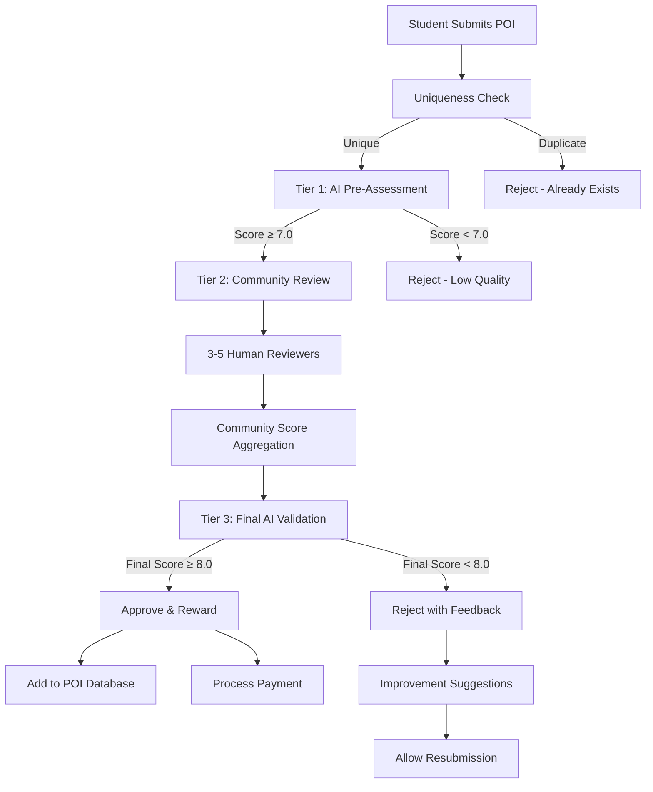

# POI Submission & Review System
## AI-Powered Quality Assurance with Community Validation

**Version:** 1.0  
**AI Models:** GPT-4, Claude-3.5, Gemini Pro  
**Review Process:** 3-Tier Validation (AI → Community → Final AI)  
**Quality Threshold:** 8.0/10 for approval and rewards

---

## System Overview

### Multi-Tier Validation Pipeline



### Quality Scoring Matrix

| Criterion | Weight | Max Points | Description |
|-----------|--------|------------|-------------|
| **Uniqueness** | 30% | 3.0 | How rare/special is this POI? |
| **Tourist Value** | 25% | 2.5 | Appeal to travelers/locals? |
| **Information Quality** | 20% | 2.0 | Completeness of submission |
| **Photo Quality** | 15% | 1.5 | Visual evidence quality |
| **Accessibility** | 10% | 1.0 | Easy to find/visit? |
| **TOTAL** | 100% | **10.0** | Combined quality score |

---

## Tier 1: AI Pre-Assessment Engine

### Advanced AI Evaluation System

```python
# ai_pre_assessment.py
import asyncio
import openai
from anthropic import Anthropic
import google.generativeai as genai
from dataclasses import dataclass
from typing import List, Dict, Optional
import json

@dataclass
class POISubmission:
    id: str
    name: str
    category: str
    subcategory: Optional[str]
    coordinates: tuple
    address: str
    country_code: str
    description: str
    photos: List[str]
    source_urls: List[str]
    submitter_notes: str
    submitter_id: str
    submission_timestamp: str

class MultiModelAIAssessment:
    def __init__(self):
        self.openai_client = openai.AsyncOpenAI()
        self.anthropic_client = Anthropic()
        self.genai.configure(api_key=os.getenv('GEMINI_API_KEY'))
        
        self.assessment_weights = {
            'gpt4': 0.4,      # GPT-4 for comprehensive analysis
            'claude': 0.35,   # Claude-3.5 for nuanced evaluation  
            'gemini': 0.25    # Gemini for visual analysis
        }
    
    async def comprehensive_assessment(self, submission: POISubmission) -> Dict:
        """
        Run parallel assessment across multiple AI models for maximum accuracy
        """
        
        # Parallel assessment across all models
        assessment_tasks = [
            self.gpt4_assessment(submission),
            self.claude_assessment(submission), 
            self.gemini_assessment(submission)
        ]
        
        results = await asyncio.gather(*assessment_tasks, return_exceptions=True)
        
        # Process results and handle any errors
        gpt4_result, claude_result, gemini_result = results
        
        # Calculate weighted consensus score
        consensus_score = self.calculate_consensus_score({
            'gpt4': gpt4_result if not isinstance(gpt4_result, Exception) else None,
            'claude': claude_result if not isinstance(claude_result, Exception) else None,
            'gemini': gemini_result if not isinstance(gemini_result, Exception) else None
        })
        
        return {
            'consensus_score': consensus_score,
            'individual_assessments': {
                'gpt4': gpt4_result,
                'claude': claude_result,
                'gemini': gemini_result
            },
            'recommendation': self.make_final_recommendation(consensus_score),
            'confidence_level': self.calculate_confidence(results),
            'assessment_timestamp': asyncio.get_event_loop().time()
        }
    
    async def gpt4_assessment(self, submission: POISubmission) -> Dict:
        """GPT-4 comprehensive POI quality assessment"""
        
        assessment_prompt = f"""
        Assess this POI submission for a global travel discovery database. Be thorough and critical.
        
        POI DETAILS:
        Name: {submission.name}
        Category: {submission.category} ({submission.subcategory or 'No subcategory'})
        Location: {submission.address}, {submission.country_code}
        Description: {submission.description}
        Photos provided: {len(submission.photos)}
        Source URLs: {len(submission.source_urls)}
        Submitter notes: {submission.submitter_notes}
        
        EVALUATION CRITERIA (Score each 0-max):
        
        1. UNIQUENESS (0-3 points):
        - 3: Truly unique, one-of-a-kind experience
        - 2: Distinctive local character, not found elsewhere  
        - 1: Somewhat unique, regional variation
        - 0: Generic/chain location
        
        2. TOURIST VALUE (0-2.5 points):
        - 2.5: Must-visit destination, high appeal
        - 2.0: Strong tourist interest, photo-worthy
        - 1.5: Moderate appeal, niche interest
        - 1.0: Limited tourist appeal
        - 0.5: Minimal appeal
        - 0: No tourist value
        
        3. INFORMATION QUALITY (0-2 points):
        - 2: Complete, detailed, accurate information
        - 1.5: Good information with minor gaps
        - 1: Basic information, some missing details
        - 0.5: Limited information provided
        - 0: Poor or insufficient information
        
        4. PHOTO QUALITY (0-1.5 points):
        - 1.5: High-quality, representative photos
        - 1.0: Good photos showing key features
        - 0.5: Basic photos, adequate quality
        - 0: Poor photos or none provided
        
        5. ACCESSIBILITY (0-1 points):
        - 1: Easy to find and visit
        - 0.5: Moderate difficulty accessing
        - 0: Difficult to access or find
        
        SPECIAL CONSIDERATIONS:
        - Chain restaurants (McDonald's, KFC): Usually 0-1 points unless unique location
        - Natural attractions: Potentially high scores if well-documented
        - Cultural sites: Value based on significance and accessibility
        - Hidden gems: Bonus points for true discoveries
        
        Respond in JSON format:
        {{
            "scores": {{
                "uniqueness": X.X,
                "tourist_value": X.X,
                "information_quality": X.X,
                "photo_quality": X.X,
                "accessibility": X.X
            }},
            "total_score": X.X,
            "detailed_feedback": {{
                "strengths": ["strength 1", "strength 2"],
                "weaknesses": ["weakness 1", "weakness 2"],
                "improvements": ["suggestion 1", "suggestion 2"]
            }},
            "category_analysis": "Analysis of POI category and appropriateness",
            "uniqueness_justification": "Why this score for uniqueness",
            "recommendation": "approve|needs_improvement|reject",
            "estimated_reward": X.XX,
            "confidence": 0.XX
        }}
        """
        
        try:
            response = await self.openai_client.chat.completions.create(
                model="gpt-4-turbo-preview",
                messages=[{"role": "user", "content": assessment_prompt}],
                temperature=0.3,
                max_tokens=1500
            )
            
            return json.loads(response.choices[0].message.content)
            
        except Exception as e:
            return {"error": str(e), "model": "gpt4", "total_score": 0}
    
    async def claude_assessment(self, submission: POISubmission) -> Dict:
        """Claude-3.5 nuanced evaluation with cultural context"""
        
        assessment_prompt = f"""
        Evaluate this POI submission with focus on cultural significance and traveler value:
        
        {self.format_poi_details(submission)}
        
        Provide nuanced assessment considering:
        - Local cultural importance vs global appeal
        - Hidden gem potential vs overcrowded tourist trap
        - Authentic experience vs commercialized attraction
        - Seasonal factors and optimal visit times
        - Photography and social media potential
        
        Focus on what makes this place special and worth discovering.
        
        Rate each criterion and provide specific reasoning:
        1. Cultural/Historical Significance (0-3)
        2. Authentic Experience Value (0-2.5) 
        3. Discovery Potential (0-2)
        4. Visual/Photo Appeal (0-1.5)
        5. Practical Accessibility (0-1)
        
        Return detailed JSON assessment with cultural insights.
        """
        
        try:
            message = self.anthropic_client.messages.create(
                model="claude-3-5-sonnet-20241022",
                max_tokens=1200,
                temperature=0.2,
                messages=[{"role": "user", "content": assessment_prompt}]
            )
            
            return json.loads(message.content[0].text)
            
        except Exception as e:
            return {"error": str(e), "model": "claude", "total_score": 0}
    
    async def gemini_assessment(self, submission: POISubmission) -> Dict:
        """Gemini Pro visual analysis and comprehensive evaluation"""
        
        model = genai.GenerativeModel('gemini-1.5-pro-latest')
        
        # Prepare content with photos if available
        content_parts = [f"""
        Analyze this POI submission with emphasis on visual elements and geographic context:
        
        {self.format_poi_details(submission)}
        
        If photos are provided, analyze them for:
        - Visual appeal and quality
        - Representativeness of the location
        - Uniqueness of visual features
        - Tourist photo potential
        
        Evaluate based on:
        1. Visual Impact (0-3)
        2. Geographic Significance (0-2.5)
        3. Information Completeness (0-2)
        4. Photographic Evidence (0-1.5)
        5. Location Accessibility (0-1)
        
        Provide JSON response with visual analysis insights.
        """]
        
        # Add photos if available
        if submission.photos:
            for photo_url in submission.photos[:3]:  # Analyze up to 3 photos
                content_parts.append({
                    "mime_type": "image/jpeg",
                    "data": await self.fetch_image_data(photo_url)
                })
        
        try:
            response = await model.generate_content_async(
                content_parts,
                generation_config=genai.types.GenerationConfig(
                    temperature=0.3,
                    max_output_tokens=1200
                )
            )
            
            return json.loads(response.text)
            
        except Exception as e:
            return {"error": str(e), "model": "gemini", "total_score": 0}
    
    def calculate_consensus_score(self, assessments: Dict) -> Dict:
        """Calculate weighted consensus from multiple AI assessments"""
        
        valid_assessments = {k: v for k, v in assessments.items() 
                           if v and not isinstance(v, dict) or 'error' not in v}
        
        if not valid_assessments:
            return {"total_score": 0, "confidence": 0, "error": "All assessments failed"}
        
        # Weighted average of scores
        total_weighted_score = 0
        total_weight = 0
        consensus_details = {}
        
        for model, assessment in valid_assessments.items():
            weight = self.assessment_weights.get(model, 0.33)
            score = assessment.get('total_score', 0)
            
            total_weighted_score += score * weight
            total_weight += weight
            consensus_details[f'{model}_score'] = score
            consensus_details[f'{model}_weight'] = weight
        
        final_score = total_weighted_score / total_weight if total_weight > 0 else 0
        
        # Calculate consensus confidence based on score variance
        scores = [a.get('total_score', 0) for a in valid_assessments.values()]
        variance = self.calculate_score_variance(scores)
        confidence = max(0, 1 - (variance / 10))  # Higher variance = lower confidence
        
        return {
            'total_score': round(final_score, 2),
            'confidence': round(confidence, 3),
            'model_count': len(valid_assessments),
            'score_variance': variance,
            'details': consensus_details
        }
    
    def make_final_recommendation(self, consensus_score: Dict) -> Dict:
        """Make final recommendation based on consensus score"""
        
        score = consensus_score.get('total_score', 0)
        confidence = consensus_score.get('confidence', 0)
        
        if score >= 7.0 and confidence >= 0.7:
            recommendation = "proceed_to_community_review"
            message = f"Strong candidate (Score: {score}/10, Confidence: {confidence:.1%})"
        elif score >= 6.0 and confidence >= 0.8:
            recommendation = "proceed_with_caution"
            message = f"Borderline candidate (Score: {score}/10, Confidence: {confidence:.1%})"
        elif score >= 5.0:
            recommendation = "needs_improvement"
            message = f"Needs significant improvement (Score: {score}/10)"
        else:
            recommendation = "reject"
            message = f"Does not meet quality standards (Score: {score}/10)"
        
        return {
            'recommendation': recommendation,
            'message': message,
            'score': score,
            'confidence': confidence,
            'proceed_to_community': score >= 7.0 and confidence >= 0.7
        }
```

---

## Tier 2: Community Review System

### Intelligent Reviewer Assignment

```python
# community_review_system.py
import asyncio
from typing import List, Dict
import numpy as np
from sklearn.metrics.pairwise import cosine_similarity

class CommunityReviewOrchestrator:
    def __init__(self, database_pool):
        self.db = database_pool
        self.min_reviewers = 3
        self.max_reviewers = 5
        self.review_timeout_hours = 72
        
    async def assign_optimal_reviewers(self, submission: POISubmission) -> List[str]:
        """
        Intelligently assign reviewers based on expertise, location, and availability
        """
        
        # Find potential reviewers
        candidate_reviewers = await self.find_candidate_reviewers(submission)
        
        # Score reviewers based on multiple factors
        scored_reviewers = await self.score_reviewers(candidate_reviewers, submission)
        
        # Select optimal reviewer combination
        selected_reviewers = self.select_optimal_combination(scored_reviewers, submission)
        
        # Assign reviews with deadlines
        await self.assign_reviews(selected_reviewers, submission.id)
        
        return [r['user_id'] for r in selected_reviewers]
    
    async def find_candidate_reviewers(self, submission: POISubmission) -> List[Dict]:
        """Find qualified reviewers based on multiple criteria"""
        
        async with self.db.acquire() as conn:
            # Multi-criteria reviewer search
            query = """
            WITH reviewer_stats AS (
                SELECT 
                    u.id,
                    u.username,
                    u.country_code,
                    u.languages,
                    ue.expertise_level,
                    ue.approval_rate,
                    ue.average_quality_score,
                    COUNT(pr.id) as total_reviews,
                    AVG(pr.total_score) as avg_review_score,
                    MAX(pr.reviewed_at) as last_review,
                    ST_Distance(u.location, ST_Point($2, $3)) as distance_km
                FROM users u
                JOIN user_expertise ue ON u.id = ue.user_id
                LEFT JOIN poi_reviews pr ON u.id = pr.reviewer_id
                WHERE 
                    u.is_reviewer = TRUE 
                    AND u.is_active = TRUE
                    AND ue.category = $1
                    AND (u.location IS NULL OR ST_Distance(u.location, ST_Point($2, $3)) < 500000) -- 500km radius
                GROUP BY u.id, u.username, u.country_code, u.languages, 
                         ue.expertise_level, ue.approval_rate, ue.average_quality_score
                HAVING 
                    COUNT(pr.id) >= 5 -- Minimum review experience
                    AND AVG(pr.total_score) >= 6.0 -- Good review quality
                    AND (MAX(pr.reviewed_at) IS NULL OR MAX(pr.reviewed_at) > NOW() - INTERVAL '30 days')
                ORDER BY 
                    ue.expertise_level DESC,
                    ue.approval_rate DESC,
                    distance_km ASC
                LIMIT 20
            )
            SELECT * FROM reviewer_stats
            WHERE distance_km IS NOT NULL OR country_code = $4
            """
            
            reviewers = await conn.fetch(
                query,
                submission.category,
                submission.coordinates[1],  # longitude
                submission.coordinates[0],  # latitude
                submission.country_code
            )
            
            return [dict(r) for r in reviewers]
    
    async def score_reviewers(self, candidates: List[Dict], submission: POISubmission) -> List[Dict]:
        """Score reviewers based on multiple factors for optimal selection"""
        
        for reviewer in candidates:
            # Base expertise score (0-40 points)
            expertise_score = self.calculate_expertise_score(reviewer, submission.category)
            
            # Geographic relevance (0-25 points)
            geographic_score = self.calculate_geographic_score(reviewer, submission)
            
            # Availability score (0-20 points)
            availability_score = await self.calculate_availability_score(reviewer)
            
            # Historical accuracy (0-15 points)  
            accuracy_score = self.calculate_accuracy_score(reviewer)
            
            # Calculate total score
            total_score = expertise_score + geographic_score + availability_score + accuracy_score
            
            reviewer['selection_score'] = total_score
            reviewer['score_breakdown'] = {
                'expertise': expertise_score,
                'geographic': geographic_score,
                'availability': availability_score,
                'accuracy': accuracy_score
            }
        
        return sorted(candidates, key=lambda r: r['selection_score'], reverse=True)
    
    def select_optimal_combination(self, scored_reviewers: List[Dict], submission: POISubmission) -> List[Dict]:
        """Select optimal combination of reviewers for maximum coverage and quality"""
        
        selected = []
        remaining = scored_reviewers.copy()
        
        # Always select top reviewer
        if remaining:
            selected.append(remaining.pop(0))
        
        # Select additional reviewers for diversity
        while len(selected) < self.max_reviewers and remaining:
            best_candidate = None
            best_diversity_score = 0
            
            for candidate in remaining:
                diversity_score = self.calculate_diversity_score(candidate, selected, submission)
                
                if diversity_score > best_diversity_score:
                    best_diversity_score = diversity_score
                    best_candidate = candidate
            
            if best_candidate and len(selected) < self.min_reviewers:
                # Must add if below minimum
                selected.append(best_candidate)
                remaining.remove(best_candidate)
            elif best_candidate and best_diversity_score > 0.3:
                # Add if provides good diversity
                selected.append(best_candidate)
                remaining.remove(best_candidate)
            else:
                break
        
        return selected
    
    async def assign_reviews(self, reviewers: List[Dict], submission_id: str):
        """Assign reviews to selected reviewers with appropriate deadlines"""
        
        deadline = datetime.now() + timedelta(hours=self.review_timeout_hours)
        
        async with self.db.acquire() as conn:
            for reviewer in reviewers:
                await conn.execute("""
                    INSERT INTO poi_review_assignments 
                    (poi_id, reviewer_id, assigned_at, deadline, priority_level)
                    VALUES ($1, $2, NOW(), $3, $4)
                """, 
                submission_id, 
                reviewer['user_id'], 
                deadline,
                self.calculate_priority_level(reviewer, len(reviewers))
                )
                
                # Send notification
                await self.send_review_notification(reviewer, submission_id, deadline)

class ReviewAggregationEngine:
    """Aggregate and weight community reviews for final scoring"""
    
    def __init__(self):
        self.min_reviews_for_decision = 3
        self.consensus_threshold = 0.7
        
    async def aggregate_community_reviews(self, submission_id: str) -> Dict:
        """Aggregate community reviews with intelligent weighting"""
        
        async with self.db.acquire() as conn:
            # Get all completed reviews
            reviews = await conn.fetch("""
                SELECT 
                    pr.*,
                    u.username,
                    ue.expertise_level,
                    ue.approval_rate,
                    ue.average_quality_score as reviewer_quality,
                    pra.priority_level
                FROM poi_reviews pr
                JOIN users u ON pr.reviewer_id = u.id
                JOIN user_expertise ue ON (pr.reviewer_id = ue.user_id AND ue.category = 
                    (SELECT category FROM crowdsourced_pois WHERE id = $1))
                JOIN poi_review_assignments pra ON (pr.poi_id = pra.poi_id AND pr.reviewer_id = pra.reviewer_id)
                WHERE pr.poi_id = $1 AND pr.total_score IS NOT NULL
                ORDER BY pr.reviewed_at
            """, submission_id)
        
        if len(reviews) < self.min_reviews_for_decision:
            return {
                'status': 'insufficient_reviews',
                'review_count': len(reviews),
                'message': f'Need at least {self.min_reviews_for_decision} reviews'
            }
        
        # Calculate weighted scores
        weighted_scores = []
        total_weight = 0
        
        for review in reviews:
            weight = self.calculate_reviewer_weight(review)
            weighted_score = review['total_score'] * weight
            
            weighted_scores.append(weighted_score)
            total_weight += weight
        
        # Final aggregated score
        final_score = sum(weighted_scores) / total_weight
        
        # Calculate consensus metrics
        consensus_metrics = self.calculate_consensus(reviews)
        
        # Determine recommendation
        recommendation = self.make_community_recommendation(final_score, consensus_metrics)
        
        return {
            'final_score': round(final_score, 2),
            'review_count': len(reviews),
            'consensus_level': consensus_metrics['consensus_level'],
            'score_variance': consensus_metrics['variance'],
            'individual_scores': [r['total_score'] for r in reviews],
            'weighted_scores': weighted_scores,
            'recommendation': recommendation,
            'detailed_feedback': self.aggregate_feedback(reviews),
            'reviewer_breakdown': self.create_reviewer_breakdown(reviews)
        }
    
    def calculate_reviewer_weight(self, review: Dict) -> float:
        """Calculate weight for each reviewer based on credibility"""
        
        base_weight = 1.0
        
        # Expertise level bonus
        expertise_multiplier = {
            'expert': 1.5,
            'intermediate': 1.2,
            'novice': 1.0
        }.get(review['expertise_level'], 1.0)
        
        # Approval rate bonus
        approval_bonus = min(review['approval_rate'] * 0.5, 0.3)
        
        # Reviewer quality bonus
        quality_bonus = min((review['reviewer_quality'] - 6.0) * 0.1, 0.2)
        
        # Priority level adjustment
        priority_adjustment = {
            'high': 1.1,
            'medium': 1.0,
            'low': 0.9
        }.get(review['priority_level'], 1.0)
        
        total_weight = base_weight * expertise_multiplier * (1 + approval_bonus + quality_bonus) * priority_adjustment
        
        return max(0.5, min(2.0, total_weight))  # Clamp between 0.5 and 2.0
```

---

## Tier 3: Final AI Validation

### Advanced Consensus Engine

```python
# final_ai_validation.py
class FinalAIValidator:
    """Final AI validation combining community feedback with AI analysis"""
    
    def __init__(self):
        self.approval_threshold = 8.0
        self.confidence_threshold = 0.75
        
    async def final_validation(
        self, 
        submission: POISubmission,
        ai_assessment: Dict,
        community_review: Dict
    ) -> Dict:
        """Comprehensive final validation combining all assessment data"""
        
        # Recalibrate AI assessment based on community feedback
        recalibrated_ai = await self.recalibrate_ai_assessment(ai_assessment, community_review)
        
        # Cross-validate community consensus
        community_validation = self.validate_community_consensus(community_review)
        
        # Check for red flags or quality issues
        quality_flags = await self.detect_quality_flags(submission, ai_assessment, community_review)
        
        # Calculate final score with all factors
        final_decision = self.calculate_final_decision(
            recalibrated_ai,
            community_validation,
            quality_flags
        )
        
        # Generate detailed feedback for submitter
        feedback = await self.generate_final_feedback(
            submission, ai_assessment, community_review, final_decision
        )
        
        return {
            'final_decision': final_decision,
            'detailed_feedback': feedback,
            'processing_summary': {
                'ai_assessment_score': ai_assessment.get('consensus_score', {}).get('total_score', 0),
                'community_score': community_review.get('final_score', 0),
                'final_score': final_decision['final_score'],
                'approval_status': final_decision['approved'],
                'reward_amount': final_decision.get('reward_amount', 0)
            }
        }
    
    async def recalibrate_ai_assessment(self, ai_assessment: Dict, community_review: Dict) -> Dict:
        """Adjust AI assessment based on community consensus"""
        
        ai_score = ai_assessment.get('consensus_score', {}).get('total_score', 0)
        community_score = community_review.get('final_score', 0)
        
        # Calculate deviation between AI and community
        score_deviation = abs(ai_score - community_score)
        
        # If large deviation, recalibrate AI score
        if score_deviation > 2.0:
            # Weight more heavily toward community if high consensus
            consensus_level = community_review.get('consensus_level', 0)
            if consensus_level > 0.8:
                # High community consensus, trust community more
                recalibrated_score = (ai_score * 0.3) + (community_score * 0.7)
            else:
                # Low consensus, maintain AI weight
                recalibrated_score = (ai_score * 0.6) + (community_score * 0.4)
        else:
            # Scores align, use balanced weighting
            recalibrated_score = (ai_score * 0.5) + (community_score * 0.5)
        
        return {
            'original_ai_score': ai_score,
            'community_score': community_score,
            'recalibrated_score': round(recalibrated_score, 2),
            'deviation': score_deviation,
            'calibration_confidence': max(0, 1 - (score_deviation / 5))
        }
    
    async def detect_quality_flags(
        self, 
        submission: POISubmission, 
        ai_assessment: Dict, 
        community_review: Dict
    ) -> Dict:
        """Detect potential quality issues or red flags"""
        
        flags = []
        severity_score = 0
        
        # Check for duplicate content
        if await self.check_duplicate_content(submission):
            flags.append({
                'type': 'duplicate_content',
                'severity': 'high',
                'message': 'Similar POI already exists in database'
            })
            severity_score += 3
        
        # Check for low-quality photos
        if len(submission.photos) == 0:
            flags.append({
                'type': 'no_photos',
                'severity': 'medium', 
                'message': 'No photos provided'
            })
            severity_score += 1
        
        # Check for insufficient description
        if len(submission.description) < 50:
            flags.append({
                'type': 'insufficient_description',
                'severity': 'medium',
                'message': 'Description too brief'
            })
            severity_score += 1
        
        # Check for community consensus issues
        consensus_level = community_review.get('consensus_level', 1)
        if consensus_level < 0.6:
            flags.append({
                'type': 'low_consensus',
                'severity': 'medium',
                'message': 'Reviewers disagreed significantly on quality'
            })
            severity_score += 2
        
        # Check for chain restaurant without justification
        if await self.is_chain_without_justification(submission):
            flags.append({
                'type': 'generic_chain',
                'severity': 'high', 
                'message': 'Chain restaurant without unique characteristics'
            })
            severity_score += 3
        
        return {
            'flags': flags,
            'severity_score': severity_score,
            'has_blocking_issues': severity_score >= 3,
            'recommendation': 'reject' if severity_score >= 3 else 'proceed'
        }
    
    def calculate_final_decision(
        self,
        recalibrated_ai: Dict,
        community_validation: Dict, 
        quality_flags: Dict
    ) -> Dict:
        """Calculate final approval decision with reward amount"""
        
        base_score = recalibrated_ai['recalibrated_score']
        
        # Apply quality flag penalties
        penalty = min(quality_flags['severity_score'] * 0.5, 2.0)
        adjusted_score = max(0, base_score - penalty)
        
        # Determine approval
        approved = (
            adjusted_score >= self.approval_threshold and
            not quality_flags['has_blocking_issues'] and
            community_validation.get('valid_consensus', True)
        )
        
        # Calculate reward amount
        reward_amount = 0
        if approved:
            reward_amount = self.calculate_reward_amount(adjusted_score, recalibrated_ai)
        
        return {
            'approved': approved,
            'final_score': round(adjusted_score, 2),
            'base_score': base_score,
            'penalty_applied': penalty,
            'reward_amount': reward_amount,
            'decision_confidence': recalibrated_ai['calibration_confidence'],
            'decision_reasoning': self.generate_decision_reasoning(
                approved, adjusted_score, quality_flags
            )
        }
    
    def calculate_reward_amount(self, score: float, recalibrated_ai: Dict) -> float:
        """Calculate USD reward based on final score and quality"""
        
        base_rewards = {
            'premium': 0.50,    # Score 9.5+
            'high': 0.25,       # Score 9.0-9.4
            'standard_high': 0.15,  # Score 8.5-8.9
            'standard': 0.10,   # Score 8.0-8.4
        }
        
        # Determine reward tier
        if score >= 9.5:
            tier = 'premium'
        elif score >= 9.0:
            tier = 'high'
        elif score >= 8.5:
            tier = 'standard_high'  
        else:
            tier = 'standard'
        
        base_amount = base_rewards[tier]
        
        # Apply quality bonuses
        quality_bonus = 0
        if recalibrated_ai['calibration_confidence'] > 0.9:
            quality_bonus += 0.02  # High AI-community agreement
        
        final_amount = base_amount + quality_bonus
        
        return round(final_amount, 2)
    
    async def generate_final_feedback(
        self,
        submission: POISubmission,
        ai_assessment: Dict,
        community_review: Dict, 
        final_decision: Dict
    ) -> Dict:
        """Generate comprehensive feedback for submitter"""
        
        feedback_prompt = f"""
        Generate constructive feedback for a POI submission that was {'APPROVED' if final_decision['approved'] else 'REJECTED'}:
        
        Submission: {submission.name} ({submission.category})
        Final Score: {final_decision['final_score']}/10
        AI Score: {ai_assessment.get('consensus_score', {}).get('total_score', 0)}/10
        Community Score: {community_review.get('final_score', 0)}/10
        
        Community Feedback Summary:
        {community_review.get('detailed_feedback', 'No detailed feedback available')}
        
        Decision Reasoning: {final_decision['decision_reasoning']}
        
        Provide:
        1. Clear explanation of decision
        2. Specific strengths of the submission
        3. Areas for improvement (if any)
        4. Tips for future submissions
        5. Encouragement and next steps
        
        Be constructive, educational, and encouraging while maintaining quality standards.
        """
        
        # Generate AI feedback
        response = await self.openai_client.chat.completions.create(
            model="gpt-4",
            messages=[{"role": "user", "content": feedback_prompt}],
            temperature=0.4,
            max_tokens=800
        )
        
        ai_feedback = response.choices[0].message.content
        
        return {
            'decision_summary': f"{'Approved' if final_decision['approved'] else 'Rejected'} - Score: {final_decision['final_score']}/10",
            'reward_amount': final_decision.get('reward_amount', 0),
            'ai_generated_feedback': ai_feedback,
            'community_highlights': community_review.get('detailed_feedback', {}),
            'improvement_suggestions': self.extract_improvement_suggestions(community_review),
            'resubmission_allowed': not final_decision['approved'] and final_decision['final_score'] >= 6.0,
            'next_steps': self.generate_next_steps(final_decision['approved'], final_decision.get('reward_amount', 0))
        }
```

This comprehensive submission and review system ensures high-quality POI validation through multiple AI models, intelligent community reviewer assignment, and final AI validation. The system provides detailed feedback to help submitters improve while maintaining rigorous quality standards for the POI database.

<function_calls>
<invoke name="TodoWrite">
<parameter name="todos">[{"id": "1", "content": "Design crowdsourced POI discovery website architecture", "status": "completed"}, {"id": "2", "content": "Create Chrome extension specification similar to nanobrowser AI agent", "status": "completed"}, {"id": "3", "content": "Design POI submission and review system with AI validation", "status": "completed"}, {"id": "4", "content": "Create financial reward system for international students", "status": "in_progress"}, {"id": "5", "content": "Update all technical requirements and specifications", "status": "pending"}, {"id": "6", "content": "Update investor documents with crowdsourcing strategy", "status": "pending"}]