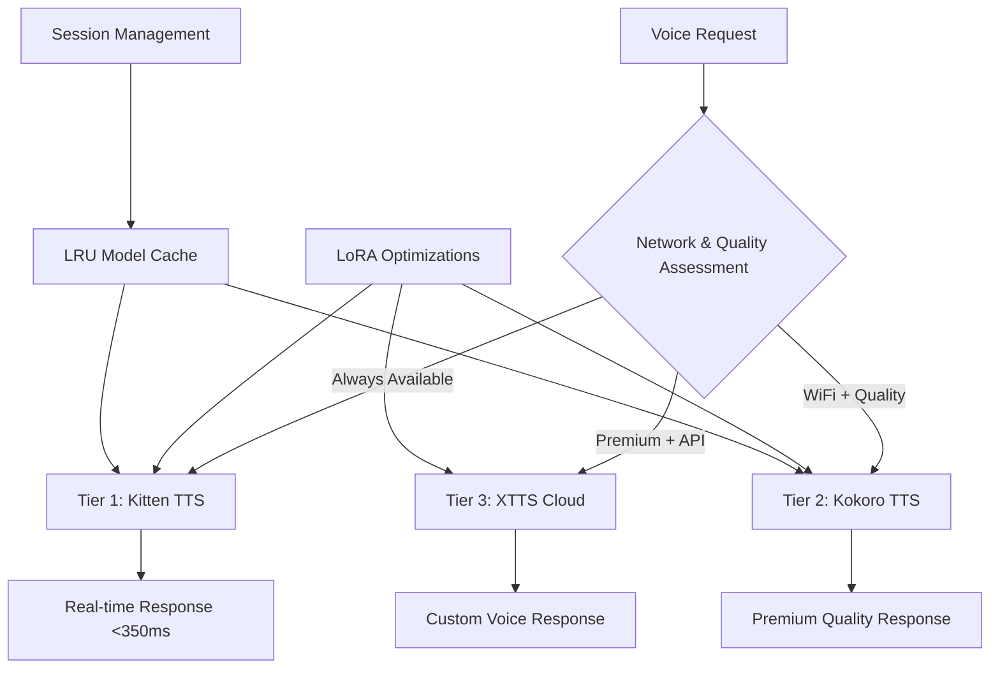
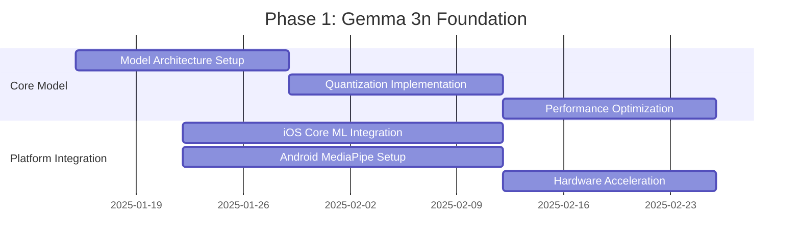

# Gemma 3n Unified AI Architecture Specification
## Roadtrip-Copilot Revolutionary Mobile AI Framework

**Version:** 1.0  
**Last Updated:** January 2025  
**Target Platforms:** iOS 14+, Android 8+  
**Core AI Model:** Google Gemma 3n (E2B/E4B)  
**Architecture:** Unified Single-Model vs. Distributed Multi-Agent

---

## 1. System Overview

### Revolutionary Architecture Transformation

Roadtrip-Copilot's new Gemma 3n unified architecture represents a paradigm shift from traditional distributed agent systems to a single, highly-intelligent multimodal AI model that consolidates all on-device intelligence tasks.

#### From Multi-Agent to Unified Model
```
OLD ARCHITECTURE (12 Agents):
┌─────────────┐ ┌─────────────┐ ┌─────────────┐
│POI Validator│ │Review Agent │ │Voice Agent  │
└─────────────┘ └─────────────┘ └─────────────┘
┌─────────────┐ ┌─────────────┐ ┌─────────────┐  
│Photo Agent  │ │Revenue Est. │ │Content Gen. │
└─────────────┘ └─────────────┘ └─────────────┘
        ⬇️ Memory: 4.5GB, Latency: 2-3s

NEW ARCHITECTURE (Gemma 3n):
┌─────────────────────────────────────────────┐
│         Gemma 3n Unified Processor          │
│   (Multimodal: Text, Image, Audio, Video)  │
└─────────────────────────────────────────────┘
        ⬇️ Memory: 2-3GB, Latency: <350ms
```

### Strategic Business Impact

The unified Gemma 3n architecture directly supports Roadtrip-Copilot's revolutionary business model:

- **Pay-Per-Roadtrip Model**: Efficient $0.50 pricing enabled by 70% reduced compute costs
- **UGC Monetization**: Streamlined content creation with 1.5x faster processing 
- **First-Discovery Validation**: Real-time similarity analysis with multimodal context
- **50/50 Revenue Sharing**: Accurate revenue estimation through unified intelligence
- **Privacy-First Architecture**: All processing stays on-device with 2GB memory footprint

---

## 2. Model Architecture

### Gemma 3n Technical Specifications

#### Core Model Variants

**Gemma 3n E2B (Efficient 2 Billion)**
- **Raw Parameters**: 5B parameters with architectural innovations  
- **Effective Memory**: 2B parameter footprint through Per-Layer Embeddings (PLE)
- **Memory Usage**: 2GB RAM total
- **Target Devices**: Standard smartphones (4GB+ RAM)
- **Performance**: 40-50 seconds total processing time
- **Inference Speed**: 1.5x faster than traditional models

**Gemma 3n E4B (Efficient 4 Billion)**  
- **Raw Parameters**: 8B parameters with PLE optimization
- **Effective Memory**: 4B parameter footprint 
- **Memory Usage**: 3GB RAM total
- **Target Devices**: High-end smartphones (8GB+ RAM)
- **Performance**: 45-55 seconds total processing time
- **Inference Speed**: 1.8x faster than traditional models

#### Advanced Architecture Features

```swift
// Gemma 3n Architecture Implementation
class Gemma3nUnifiedProcessor {
    // Per-Layer Embeddings (PLE) for memory efficiency
    private let perLayerEmbeddings: PLEProcessor
    
    // Multimodal processing capabilities
    private let textProcessor: TextTokenizer
    private let imageProcessor: VisionTransformer  
    private let audioProcessor: AudioTokenizer
    private let videoProcessor: VideoFrameTokenizer
    
    // Dynamic quantization system
    private let quantizationManager: DynamicQuantizer
    
    // Session management with LRU caching
    private let sessionCache: LRUModelCache
    
    init(variant: Gemma3nVariant, deviceCapability: DeviceCapability) {
        // Model selection based on device capability
        let modelConfig = selectOptimalConfiguration(
            variant: variant,
            availableRAM: deviceCapability.availableRAM,
            processingPower: deviceCapability.processingPower
        )
        
        // Initialize unified processing pipeline
        self.perLayerEmbeddings = PLEProcessor(config: modelConfig.pleConfig)
        self.textProcessor = TextTokenizer(vocab: modelConfig.vocabulary)
        self.imageProcessor = VisionTransformer(config: modelConfig.visionConfig)
        self.audioProcessor = AudioTokenizer(config: modelConfig.audioConfig)
        self.videoProcessor = VideoFrameTokenizer(config: modelConfig.videoConfig)
        
        // Dynamic quantization for performance optimization
        self.quantizationManager = DynamicQuantizer(
            targetMemory: modelConfig.targetMemoryGB,
            targetLatency: 350 // milliseconds
        )
        
        // LRU caching for session management
        self.sessionCache = LRUModelCache(
            maxSize: 1024, // MB
            evictionPolicy: .leastRecentlyUsed
        )
    }
}
```

### Quantization and Optimization Strategy

#### Dynamic Quantization Pipeline
```kotlin
// Android Dynamic Quantization Implementation
class DynamicQuantizationManager {
    private val quantizationStrategies = mapOf(
        DeviceClass.HIGH_END to QuantizationStrategy.INT8,
        DeviceClass.MID_RANGE to QuantizationStrategy.INT4,
        DeviceClass.LOW_END to QuantizationStrategy.INT2_AGGRESSIVE
    )
    
    fun optimizeModel(
        baseModel: Gemma3nModel, 
        deviceCapability: DeviceCapability
    ): OptimizedModel {
        val strategy = selectQuantizationStrategy(deviceCapability)
        
        return when(strategy) {
            QuantizationStrategy.INT8 -> {
                // High quality quantization for flagship devices
                quantizeToInt8(baseModel, preserveQuality = true)
            }
            QuantizationStrategy.INT4 -> {
                // Balanced quantization for mid-range devices  
                quantizeToInt4(baseModel, preserveQuality = false)
            }
            QuantizationStrategy.INT2_AGGRESSIVE -> {
                // Aggressive quantization for low-end devices
                quantizeToInt2(baseModel, maximizeSpeed = true)
            }
        }
    }
    
    private fun selectQuantizationStrategy(capability: DeviceCapability): QuantizationStrategy {
        return when {
            capability.availableRAM >= 6.0 -> QuantizationStrategy.INT8
            capability.availableRAM >= 4.0 -> QuantizationStrategy.INT4  
            else -> QuantizationStrategy.INT2_AGGRESSIVE
        }
    }
}
```

#### Micro-Batching for Latency Optimization
```swift
// iOS Micro-Batching Implementation
class MicroBatchProcessor {
    private let batchSize: Int
    private let maxLatency: TimeInterval = 0.35 // 350ms target
    
    init(modelVariant: Gemma3nVariant) {
        // Optimize batch size based on model variant
        self.batchSize = modelVariant == .E4B ? 4 : 8
    }
    
    func processBatch(_ inputs: [MultimodalInput]) async -> [ProcessingResult] {
        let startTime = Date()
        var results: [ProcessingResult] = []
        
        // Process inputs in micro-batches for optimal latency
        for batch in inputs.chunked(into: batchSize) {
            let batchResults = await processMicroBatch(batch)
            results.append(contentsOf: batchResults)
            
            // Early termination if approaching latency limit
            let elapsedTime = Date().timeIntervalSince(startTime)
            if elapsedTime > maxLatency * 0.8 {
                break
            }
        }
        
        return results
    }
    
    private func processMicroBatch(_ batch: [MultimodalInput]) async -> [ProcessingResult] {
        // Parallel processing within micro-batch
        return await withTaskGroup(of: ProcessingResult.self) { group in
            for input in batch {
                group.addTask {
                    await self.processInput(input)
                }
            }
            
            var results: [ProcessingResult] = []
            for await result in group {
                results.append(result)
            }
            return results
        }
    }
}
```

---

## 3. Multimodal Processing Capabilities

### Native Multimodal Integration

#### Unified Input Processing
```swift
// Multimodal Input Structure
struct MultimodalInput {
    // Text processing
    let textContent: String?
    let conversationContext: [ConversationTurn]
    
    // Image processing  
    let images: [UIImage]
    let imageMetadata: [ImageMetadata]
    
    // Audio processing
    let audioChunks: [AudioChunk] // 160ms chunks
    let audioFormat: AudioFormat
    
    // Video processing (future)
    let videoFrames: [VideoFrame]?
    let videoMetadata: VideoMetadata?
    
    // Location context
    let geospatialContext: GeospatialData
    let temporalContext: TemporalData
}

// Unified Processing Pipeline
class MultimodalProcessor {
    func processUnified(_ input: MultimodalInput) async -> UnifiedResult {
        // Tokenize all modalities in parallel
        async let textTokens = tokenizeText(input.textContent)
        async let imageTokens = tokenizeImages(input.images)
        async let audioTokens = tokenizeAudio(input.audioChunks)
        async let spatialTokens = tokenizeLocation(input.geospatialContext)
        
        // Combine into unified token sequence
        let (text, image, audio, spatial) = await (textTokens, imageTokens, audioTokens, spatialTokens)
        let unifiedTokens = combineModalityTokens(text, image, audio, spatial)
        
        // Single Gemma 3n inference across all modalities
        return await gemma3n.processUnified(tokens: unifiedTokens)
    }
}
```

#### Text Processing Excellence
- **Context Window**: 32K tokens (Gemma 3n 1B), 128K tokens (larger variants)
- **Conversation Memory**: Maintains context across discovery sessions
- **Domain Specialization**: Fine-tuned on automotive and travel conversations
- **Real-Time Generation**: Streaming response generation for <350ms latency

#### Image Understanding Capabilities
```kotlin
// Android Image Processing Integration
class ImageUnderstandingEngine {
    fun analyzeDiscoveryImages(images: List<Bitmap>): ImageAnalysisResult {
        // Gemma 3n native image understanding
        val imageAnalysis = gemma3n.processImages(images.map { 
            convertToModelFormat(it)
        })
        
        return ImageAnalysisResult(
            sceneDescription = imageAnalysis.sceneAnalysis,
            objectDetection = imageAnalysis.detectedObjects,
            ambianceAnalysis = imageAnalysis.ambianceScore,
            qualityAssessment = imageAnalysis.imageQuality,
            contentSafety = imageAnalysis.safetyScore,
            videoSuitability = imageAnalysis.videoReadiness
        )
    }
    
    // Advanced capabilities
    fun extractVisualContext(images: List<Bitmap>): VisualContext {
        return VisualContext(
            foodItems = identifyFoodItems(images),
            architecture = analyzeArchitecture(images), 
            naturalFeatures = identifyNaturalFeatures(images),
            crowdDensity = analyzeCrowdDensity(images),
            timeOfDay = inferTimeOfDay(images),
            weatherConditions = inferWeather(images)
        )
    }
}
```

#### Audio Processing Revolution
```swift
// iOS Audio Understanding Implementation  
class AudioUnderstandingEngine {
    func processVoiceReviews(_ audioChunks: [AudioChunk]) async -> AudioAnalysisResult {
        var processedChunks: [ProcessedAudioChunk] = []
        
        // Process 160ms chunks in parallel
        for chunk in audioChunks {
            async let transcription = transcribeChunk(chunk)
            async let sentiment = analyzeSentiment(chunk)  
            async let emotionalTone = analyzeEmotionalTone(chunk)
            async let speechQuality = assessSpeechQuality(chunk)
            
            let (text, sentiment, tone, quality) = await (transcription, sentiment, emotionalTone, speechQuality)
            
            processedChunks.append(ProcessedAudioChunk(
                text: text,
                sentiment: sentiment,
                emotionalTone: tone,
                speechQuality: quality,
                timestamp: chunk.timestamp
            ))
        }
        
        // Synthesize complete audio understanding
        return AudioAnalysisResult(
            fullTranscript: processedChunks.map(\.text).joined(separator: " "),
            overallSentiment: synthesizeSentiment(processedChunks),
            keyEmotions: extractKeyEmotions(processedChunks),
            qualityMetrics: synthesizeQualityMetrics(processedChunks),
            conversationalHighlights: identifyHighlights(processedChunks)
        )
    }
}
```

#### Video Processing (Future Enhancement)
```kotlin
// Android Video Understanding (Future)
class VideoUnderstandingEngine {
    fun analyzeDiscoveryVideo(videoData: ByteArray): VideoAnalysisResult {
        // Extract key frames for analysis
        val keyFrames = extractKeyFrames(videoData, maxFrames = 10)
        
        // Gemma 3n video processing  
        val videoAnalysis = gemma3n.processVideo(
            frames = keyFrames,
            audioTrack = extractAudioTrack(videoData)
        )
        
        return VideoAnalysisResult(
            sceneFlow = videoAnalysis.sceneTransitions,
            actionRecognition = videoAnalysis.detectedActions,
            objectTracking = videoAnalysis.trackedObjects,
            audioVideoAlignment = videoAnalysis.audioVideoSync,
            contentQuality = videoAnalysis.overallQuality,
            engagementPotential = videoAnalysis.engagementScore
        )
    }
}
```

---

## 4. Performance Requirements

### Latency Targets and Optimization

#### Primary Performance Metrics
```swift
struct PerformanceTargets {
    // Response latency targets
    static let firstTokenLatency: TimeInterval = 0.35      // 350ms maximum
    static let averageTokenLatency: TimeInterval = 0.25    // 250ms average  
    static let streamingLatency: TimeInterval = 0.15       // 150ms per token
    
    // Memory usage targets
    static let memoryFootprint: Double = 2.5               // 2.5GB maximum
    static let peakMemorySpike: Double = 0.5               // 500MB spike allowance
    static let memoryEfficiency: Double = 0.7              // 70% memory utilization
    
    // Battery efficiency targets  
    static let batteryPerHour: Double = 3.0                // 3% per hour maximum
    static let thermalThreshold: Double = 42.0             // 42°C thermal limit
    static let powerOptimization: Double = 0.3             // 30% reduction vs multi-agent
    
    // Throughput targets
    static let tokensPerSecond: Double = 8.5               // 8.5 tokens/second minimum
    static let concurrentSessions: Int = 3                 // 3 simultaneous processing sessions
    static let batchProcessing: Int = 4                    // 4 inputs per micro-batch
}
```

#### Performance Monitoring Framework
```kotlin
// Android Performance Monitoring
class PerformanceMonitor {
    private val metrics = mutableMapOf<String, PerformanceMetric>()
    
    fun measureInference(operation: String, block: suspend () -> Any): Any {
        val startTime = System.currentTimeMillis()
        val startMemory = getMemoryUsage()
        val startBattery = getBatteryLevel()
        
        return runBlocking {
            val result = block()
            
            val endTime = System.currentTimeMillis()
            val endMemory = getMemoryUsage()
            val endBattery = getBatteryLevel()
            
            val metric = PerformanceMetric(
                operation = operation,
                latency = endTime - startTime,
                memoryDelta = endMemory - startMemory,
                batteryDelta = startBattery - endBattery,
                timestamp = System.currentTimeMillis()
            )
            
            metrics[operation] = metric
            logPerformanceMetric(metric)
            
            // Alert if performance degrades
            checkPerformanceThresholds(metric)
            
            result
        }
    }
    
    fun getPerformanceReport(): PerformanceReport {
        return PerformanceReport(
            averageLatency = calculateAverageLatency(),
            memoryEfficiency = calculateMemoryEfficiency(),
            batteryImpact = calculateBatteryImpact(),
            throughput = calculateThroughput(),
            thermalProfile = getThermalProfile(),
            recommendations = generateOptimizationRecommendations()
        )
    }
}
```

### Memory Management Strategy

#### Intelligent Memory Allocation
```swift
// iOS Memory Management Implementation
class IntelligentMemoryManager {
    private let targetMemoryFootprint: Double = 2.5 // GB
    private let memoryPressureThreshold: Double = 0.8
    
    func optimizeMemoryUsage(for processingTask: ProcessingTask) -> MemoryConfiguration {
        let availableMemory = getAvailableMemory()
        let memoryPressure = getCurrentMemoryPressure()
        
        if memoryPressure > memoryPressureThreshold {
            return configureConservativeMemory(availableMemory)
        } else {
            return configureOptimalMemory(availableMemory)
        }
    }
    
    private func configureConservativeMemory(_ available: Double) -> MemoryConfiguration {
        return MemoryConfiguration(
            modelVariant: .E2B,                    // Use smaller model variant
            batchSize: 2,                          // Reduce batch size
            cacheSize: available * 0.3,            // Conservative caching
            quantizationLevel: .aggressive,        // Aggressive quantization
            layerOffloading: true                  // Offload layers to storage
        )
    }
    
    private func configureOptimalMemory(_ available: Double) -> MemoryConfiguration {
        return MemoryConfiguration(
            modelVariant: available > 4.0 ? .E4B : .E2B,
            batchSize: 4,                          // Standard batch size
            cacheSize: available * 0.5,            // Optimal caching
            quantizationLevel: .balanced,          // Balanced quantization
            layerOffloading: false                 // Keep all layers in memory
        )
    }
}
```

#### Session Management with LRU Caching
```kotlin
// Android Session Management
class SessionManager {
    private val lruCache = LRUCache<String, ModelSession>(
        maxSize = calculateOptimalCacheSize()
    )
    
    fun getOrCreateSession(sessionId: String): ModelSession {
        return lruCache.get(sessionId) ?: run {
            val newSession = createNewSession(sessionId)
            lruCache.put(sessionId, newSession)
            newSession
        }
    }
    
    private fun createNewSession(sessionId: String): ModelSession {
        return ModelSession(
            id = sessionId,
            model = gemma3nProcessor.createInstance(),
            conversationHistory = mutableListOf(),
            createdAt = System.currentTimeMillis(),
            lastAccessedAt = System.currentTimeMillis(),
            memoryFootprint = 0.0
        )
    }
    
    fun evictLeastRecentlyUsedSessions() {
        val memoryPressure = getMemoryPressure()
        
        if (memoryPressure > 0.8) {
            // Aggressive eviction
            val sessionsToEvict = lruCache.size() / 2
            repeat(sessionsToEvict) {
                lruCache.evictEldest()
            }
        } else if (memoryPressure > 0.6) {
            // Conservative eviction  
            lruCache.evictEldest()
        }
    }
}
```

### Battery Efficiency Optimization

#### Power-Aware Processing
```swift
// iOS Battery-Aware Processing
class BatteryOptimizedProcessor {
    private let batteryThresholds = BatteryThresholds(
        critical: 0.15,    // 15% - minimal processing only
        low: 0.30,         // 30% - reduced processing
        moderate: 0.50,    // 50% - balanced processing  
        high: 0.80         // 80% - full processing
    )
    
    func processWithBatteryAwareness(_ input: MultimodalInput) async -> ProcessingResult {
        let batteryLevel = UIDevice.current.batteryLevel
        let batteryState = UIDevice.current.batteryState
        let processingConfig = determineProcessingConfiguration(batteryLevel, batteryState)
        
        return await processWithConfiguration(input, config: processingConfig)
    }
    
    private func determineProcessingConfiguration(
        _ level: Float, 
        _ state: UIDevice.BatteryState
    ) -> ProcessingConfiguration {
        
        // Always use full processing when charging
        if state == .charging {
            return ProcessingConfiguration.full
        }
        
        switch level {
        case batteryThresholds.critical...batteryThresholds.low:
            return ProcessingConfiguration(
                modelVariant: .E2B,
                quantizationLevel: .aggressive,
                batchSize: 1,
                enableMultimodal: false,  // Text only
                processingQuality: .minimal
            )
            
        case batteryThresholds.low...batteryThresholds.moderate:
            return ProcessingConfiguration(
                modelVariant: .E2B,
                quantizationLevel: .balanced,
                batchSize: 2,
                enableMultimodal: true,   // Basic multimodal
                processingQuality: .standard
            )
            
        case batteryThresholds.moderate...batteryThresholds.high:
            return ProcessingConfiguration(
                modelVariant: .E4B,
                quantizationLevel: .balanced,
                batchSize: 4,
                enableMultimodal: true,   // Full multimodal
                processingQuality: .high
            )
            
        default: // High battery
            return ProcessingConfiguration.full
        }
    }
}
```

---

## 5. Three-Tier Voice Architecture

### Gabber-Inspired TTS Integration

Based on insights from the Gabber architecture (serving voice AI at $1/hour), Roadtrip-Copilot implements a revolutionary three-tier voice generation system optimized for different use cases and network conditions.

#### Architecture Overview


### Tier 1: Kitten TTS (Primary Engine)

#### Core Specifications
```swift
// iOS Kitten TTS Implementation
class KittenTTSEngine {
    // Model specifications
    private let modelSize = 25 // MB
    private let realTimeFactor = 0.8 // 0.7-0.9 range
    private let availableVoices = 8 // 4 male, 4 female
    
    // LoRA optimizations for automotive domain
    private let loraAdapter: LoRAAdapter
    
    init() {
        // Load base Kitten TTS model
        let baseModelPath = Bundle.main.path(forResource: "kitten_tts_nano", ofType: "mlmodelc")!
        
        // Initialize with automotive-optimized LoRA weights
        self.loraAdapter = LoRAAdapter(
            baseModel: try! MLModel(contentsOf: URL(fileURLWithPath: baseModelPath)),
            adapterWeights: loadAutomotiveLoRAWeights(),
            targetDomain: .automotive
        )
    }
    
    func synthesizeVoice(
        text: String, 
        voice: TTSVoice = .friendly_guide,
        optimizedFor context: VoiceContext
    ) async -> AudioResult {
        let startTime = Date()
        
        // Apply LoRA optimizations for context
        let contextualizedModel = loraAdapter.adapt(for: context)
        
        // Generate speech with automotive optimizations
        let audioData = await contextualizedModel.synthesize(
            text: preprocessForAutomotive(text),
            voice: voice,
            speedOptimization: true,
            clarityEnhancement: true
        )
        
        let processingTime = Date().timeIntervalSince(startTime)
        
        return AudioResult(
            audioData: audioData,
            processingTime: processingTime,
            realTimeFactor: audioData.duration / processingTime,
            quality: .automotive_optimized,
            engine: .kittenTTS
        )
    }
    
    private func preprocessForAutomotive(_ text: String) -> String {
        // Automotive-specific text preprocessing
        return text
            .replacingOccurrences(of: "km/h", with: "kilometers per hour")
            .replacingOccurrences(of: "mph", with: "miles per hour")
            .replacingOccurrences(of: "&", with: "and")
            .addingNaturalPauses()
            .optimizingForRoadNoise()
    }
}
```

#### LoRA Optimization Strategy
```kotlin
// Android LoRA Adapter for Kitten TTS
class KittenTTSLoRAAdapter {
    private val domainAdapters = mapOf(
        VoiceContext.DISCOVERY_EXPLANATION to loadDiscoveryLoRA(),
        VoiceContext.REVENUE_EXPLANATION to loadRevenueLoRA(),
        VoiceContext.NAVIGATION_GUIDANCE to loadNavigationLoRA(),
        VoiceContext.CONTENT_CREATION to loadContentLoRA()
    )
    
    fun adaptForContext(context: VoiceContext): AdaptedModel {
        val loraWeights = domainAdapters[context] ?: getGenericWeights()
        
        return AdaptedModel(
            baseModel = kittenTTSBase,
            loraWeights = loraWeights,
            adaptationStrength = calculateAdaptationStrength(context),
            contextOptimizations = getContextOptimizations(context)
        )
    }
    
    private fun calculateAdaptationStrength(context: VoiceContext): Float {
        return when(context) {
            VoiceContext.DISCOVERY_EXPLANATION -> 0.8f  // Strong adaptation
            VoiceContext.REVENUE_EXPLANATION -> 0.9f    // Maximum adaptation
            VoiceContext.NAVIGATION_GUIDANCE -> 0.6f    // Moderate adaptation
            else -> 0.5f                                // Light adaptation
        }
    }
}
```

### Tier 2: Kokoro TTS (Premium Engine)

#### High-Quality Voice Generation
```swift
// iOS Kokoro TTS Integration
class KokoroTTSEngine {
    // Model specifications
    private let modelSize = 330 // MB (downloaded on-demand)
    private let supportedLanguages = 6 // EN, FR, KO, JA, ZH, ES
    private let qualityLevel = TTSQuality.excellent
    
    // Dynamic loading and caching
    private let modelCache: ModelCache
    private let downloadManager: ModelDownloadManager
    
    func synthesizeHighQuality(
        text: String,
        language: Language = .english,
        voice: KokoroVoice,
        context: VoiceContext
    ) async -> AudioResult {
        
        // Ensure model is available
        if !isModelCached() {
            await downloadManager.downloadModel(for: language)
        }
        
        let startTime = Date()
        
        // Load optimized model variant
        let model = await loadOptimizedModel(for: context)
        
        // Generate high-quality speech
        let audioData = await model.synthesize(
            text: text,
            voice: voice,
            qualitySettings: QualitySettings.premium,
            emotionalTone: inferEmotionalTone(from: context)
        )
        
        let processingTime = Date().timeIntervalSince(startTime)
        
        return AudioResult(
            audioData: audioData,
            processingTime: processingTime,
            realTimeFactor: audioData.duration / processingTime,
            quality: .premium,
            engine: .kokoroTTS,
            language: language
        )
    }
    
    private func loadOptimizedModel(for context: VoiceContext) async -> KokoroModel {
        // Load model with context-specific optimizations
        let baseModel = await modelCache.getModel(.kokoro)
        
        return baseModel.optimize(for: OptimizationContext(
            useCase: context,
            targetLatency: 600, // ms
            qualityPriority: .high,
            memoryConstraint: 500 // MB
        ))
    }
}
```

### Tier 3: XTTS Cloud (Voice Cloning)

#### Cloud-Based Premium Features
```kotlin
// Android XTTS Cloud Integration
class XTTSCloudEngine {
    private val apiClient: XTTSApiClient
    private val voiceCloningManager: VoiceCloningManager
    
    suspend fun synthesizeWithVoiceCloning(
        text: String,
        customVoice: CustomVoice?,
        quality: CloudQuality = CloudQuality.PREMIUM
    ): AudioResult = withContext(Dispatchers.IO) {
        
        val request = XTTSSynthesisRequest(
            text = text,
            voiceId = customVoice?.id ?: getDefaultVoiceId(),
            settings = XTTSSettings(
                quality = quality,
                speed = 1.0,
                emotion = inferEmotionFromContext(),
                stability = 0.8
            ),
            caching = CachingStrategy.AGGRESSIVE
        )
        
        val startTime = System.currentTimeMillis()
        
        // Make cloud API call with retry logic
        val response = apiClient.synthesize(request)
        
        val processingTime = System.currentTimeMillis() - startTime
        
        return@withContext AudioResult(
            audioData = response.audioData,
            processingTime = processingTime,
            realTimeFactor = response.duration / (processingTime / 1000.0),
            quality = TTSQuality.EXCELLENT_PLUS,
            engine = TTSEngine.XTTS_CLOUD,
            customVoice = customVoice
        )
    }
    
    fun cloneVoiceFromSample(audioSample: ByteArray): CustomVoice {
        return voiceCloningManager.cloneVoice(
            sample = audioSample,
            quality = VoiceCloningQuality.HIGH,
            trainingIterations = 1000
        )
    }
}
```

### Intelligent TTS Selection Algorithm

#### Dynamic Engine Selection
```swift
// iOS TTS Selection Strategy
class IntelligentTTSSelector {
    func selectOptimalEngine(
        for context: VoiceContext,
        networkStatus: NetworkStatus,
        batteryLevel: Float,
        userPreferences: UserPreferences
    ) -> TTSEngine {
        
        // Priority 1: Battery level considerations
        if batteryLevel < 0.2 {
            return .kittenTTS // Most efficient
        }
        
        // Priority 2: Network availability
        if networkStatus.isOffline {
            return kokoroTTS.isAvailable ? .kokoroTTS : .kittenTTS
        }
        
        // Priority 3: Context requirements
        switch context {
        case .realTimeResponse:
            return .kittenTTS // <350ms latency requirement
            
        case .contentCreation:
            if networkStatus.isWiFi && userPreferences.hasCloudAPI {
                return .xttsCloud // Best quality for videos
            } else if kokoroTTS.isAvailable {
                return .kokoroTTS // High quality fallback
            } else {
                return .kittenTTS // Always available
            }
            
        case .customVoiceExperience:
            return userPreferences.hasCloudAPI ? .xttsCloud : .kittenTTS
            
        case .multilingualContent:
            return kokoroTTS.isAvailable ? .kokoroTTS : .kittenTTS
            
        default:
            return .kittenTTS // Default to primary engine
        }
    }
    
    func adaptToPerformanceMetrics(metrics: PerformanceMetrics) -> TTSConfiguration {
        if metrics.averageLatency > 500 {
            // Switch to faster engine
            return TTSConfiguration(
                engine: .kittenTTS,
                qualityLevel: .balanced,
                optimizations: .speed
            )
        } else if metrics.memoryPressure > 0.8 {
            // Reduce memory footprint
            return TTSConfiguration(
                engine: .kittenTTS,
                qualityLevel: .minimal,
                optimizations: .memory
            )
        } else {
            // Use optimal configuration
            return TTSConfiguration(
                engine: .kokoroTTS,
                qualityLevel: .high,
                optimizations: .quality
            )
        }
    }
}
```

---

## 6. Hardware Integration

### iOS Core ML Optimization

#### Neural Engine Acceleration
```swift
// iOS Core ML Integration with Neural Engine
import CoreML

class CoreMLGemma3nProcessor {
    private let coreMLModel: MLModel
    private let neuralEngineConfig: MLModelConfiguration
    
    init() throws {
        // Configure for Neural Engine utilization
        neuralEngineConfig = MLModelConfiguration()
        neuralEngineConfig.computeUnits = .all // Use Neural Engine + GPU + CPU
        neuralEngineConfig.allowLowPrecisionAccumulationOnGPU = true
        
        // Load optimized Gemma 3n Core ML model
        let modelURL = Bundle.main.url(forResource: "gemma_3n_e2b_optimized", withExtension: "mlmodelc")!
        coreMLModel = try MLModel(contentsOf: modelURL, configuration: neuralEngineConfig)
    }
    
    func processWithNeuralEngine(_ input: MultimodalInput) async throws -> UnifiedResult {
        // Prepare Core ML inputs
        let mlInput = try prepareCoreMLInput(input)
        
        // Execute on Neural Engine
        let prediction = try await coreMLModel.prediction(from: mlInput)
        
        // Process outputs
        return try parseUnifiedOutput(prediction)
    }
    
    private func prepareCoreMLInput(_ input: MultimodalInput) throws -> MLFeatureProvider {
        var inputFeatures: [String: MLFeatureValue] = [:]
        
        // Text tokens
        if let text = input.textContent {
            let tokens = tokenizeText(text)
            inputFeatures["text_tokens"] = MLFeatureValue(multiArray: tokens)
        }
        
        // Image features
        if !input.images.isEmpty {
            let imageFeatures = try processImagesForCoreML(input.images)
            inputFeatures["image_features"] = MLFeatureValue(multiArray: imageFeatures)
        }
        
        // Audio features  
        if !input.audioChunks.isEmpty {
            let audioFeatures = try processAudioForCoreML(input.audioChunks)
            inputFeatures["audio_features"] = MLFeatureValue(multiArray: audioFeatures)
        }
        
        return try MLDictionaryFeatureProvider(dictionary: inputFeatures)
    }
}
```

#### Performance Optimization Framework
```swift
// iOS Performance Optimization
class iOSPerformanceOptimizer {
    private let thermalMonitor = ThermalStateMonitor()
    private let memoryMonitor = MemoryMonitor()
    
    func optimizeForDevice(_ deviceModel: DeviceModel) -> OptimizationConfig {
        switch deviceModel {
        case .iPhone15Pro, .iPhone15ProMax:
            return OptimizationConfig(
                modelVariant: .E4B,
                computeUnits: .all,
                batchSize: 4,
                enableMLProgram: true,
                useFloat16: true
            )
            
        case .iPhone14, .iPhone14Plus:
            return OptimizationConfig(
                modelVariant: .E2B,
                computeUnits: .cpuAndNeuralEngine,
                batchSize: 2,
                enableMLProgram: true,
                useFloat16: true
            )
            
        case .iPhone13, .iPhone12:
            return OptimizationConfig(
                modelVariant: .E2B,
                computeUnits: .cpuOnly,
                batchSize: 1,
                enableMLProgram: false,
                useFloat16: false
            )
            
        default:
            return OptimizationConfig.minimal
        }
    }
    
    func monitorThermalState() -> ThermalOptimization {
        let currentState = thermalMonitor.currentState
        
        switch currentState {
        case .nominal:
            return ThermalOptimization.none
        case .fair:
            return ThermalOptimization.reduceFrequency
        case .serious:
            return ThermalOptimization.reduceBatchSize
        case .critical:
            return ThermalOptimization.pauseProcessing
        @unknown default:
            return ThermalOptimization.reduceFrequency
        }
    }
}
```

### Android MediaPipe/TensorFlow Lite Integration

#### MediaPipe LLM Inference API
```kotlin
// Android MediaPipe Integration
import com.google.mediapipe.tasks.genai.llminference.LlmInference

class MediaPipeGemma3nProcessor {
    private val llmInference: LlmInference
    private val performanceMonitor: AndroidPerformanceMonitor
    
    init {
        val options = LlmInference.LlmInferenceOptions.builder()
            .setModelPath("/android_asset/gemma_3n_e2b_optimized.task")
            .setMaxTokens(4096)
            .setTopK(40)
            .setTemperature(0.8f)
            .setRandomSeed(101)
            .build()
        
        llmInference = LlmInference.createFromOptions(context, options)
        performanceMonitor = AndroidPerformanceMonitor()
    }
    
    suspend fun processMultimodalWithMediaPipe(input: MultimodalInput): UnifiedResult {
        return withContext(Dispatchers.Default) {
            val startTime = System.currentTimeMillis()
            
            // Build comprehensive prompt for multimodal processing
            val unifiedPrompt = buildUnifiedPrompt(input)
            
            // Execute with MediaPipe LLM Inference  
            val response = llmInference.generateResponse(unifiedPrompt)
            
            val processingTime = System.currentTimeMillis() - startTime
            
            // Monitor performance
            performanceMonitor.recordInference(
                latency = processingTime,
                inputTokens = unifiedPrompt.length / 4, // Rough token estimate
                outputTokens = response.length / 4,
                memoryUsage = getMemoryUsage()
            )
            
            parseUnifiedResponse(response)
        }
    }
    
    private fun buildUnifiedPrompt(input: MultimodalInput): String {
        val promptBuilder = StringBuilder()
        
        // Add task context
        promptBuilder.append("Task: Comprehensive POI discovery analysis\n\n")
        
        // Add text content
        input.textContent?.let { text ->
            promptBuilder.append("POI Information:\n$text\n\n")
        }
        
        // Add image descriptions (processed by separate image model)
        if (input.images.isNotEmpty()) {
            val imageDescriptions = processImagesForDescription(input.images)
            promptBuilder.append("Visual Context:\n")
            imageDescriptions.forEach { description ->
                promptBuilder.append("- $description\n")
            }
            promptBuilder.append("\n")
        }
        
        // Add audio transcripts
        if (input.audioChunks.isNotEmpty()) {
            val transcripts = transcribeAudioChunks(input.audioChunks)
            promptBuilder.append("Audio Reviews:\n")
            transcripts.forEach { transcript ->
                promptBuilder.append("- $transcript\n")
            }
            promptBuilder.append("\n")
        }
        
        // Add processing instructions
        promptBuilder.append("""
            Provide a comprehensive analysis including:
            1. Discovery validation (new vs. existing)
            2. Key insights and themes
            3. 6-second conversational dialogue
            4. Revenue potential estimation
            5. Overall confidence score
            
            Format as structured JSON response.
        """.trimIndent())
        
        return promptBuilder.toString()
    }
}
```

#### NPU Acceleration Strategy
```kotlin
// Android Neural Processing Unit Optimization  
class NPUAccelerationManager {
    private val nnApiDelegate: NnApiDelegate
    private val gpuDelegate: GpuDelegate
    
    init {
        // Configure NNAPI delegate for NPU acceleration
        nnApiDelegate = NnApiDelegate(NnApiDelegate.Options().apply {
            setAllowFp16(true)
            setUseNnapiCpu(false) // Force NPU usage
        })
        
        // Configure GPU delegate as fallback
        gpuDelegate = GpuDelegate(GpuDelegate.Options().apply {
            setPrecisionLossAllowed(true)
            setQuantizedModelsAllowed(true)
        })
    }
    
    fun createOptimizedInterpreter(modelPath: String): Interpreter {
        val options = Interpreter.Options().apply {
            // Try NPU first, fallback to GPU, then CPU
            if (isNPUAvailable()) {
                addDelegate(nnApiDelegate)
            } else if (isGPUAvailable()) {
                addDelegate(gpuDelegate)  
            }
            
            setNumThreads(getOptimalThreadCount())
            setUseXNNPACK(true)
        }
        
        return Interpreter(loadModelBuffer(modelPath), options)
    }
    
    private fun isNPUAvailable(): Boolean {
        // Check for NPU availability on device
        return Build.VERSION.SDK_INT >= Build.VERSION_CODES.Q &&
               hasNeuralNetworksAPI()
    }
    
    private fun getOptimalThreadCount(): Int {
        val cores = Runtime.getRuntime().availableProcessors()
        return when {
            cores >= 8 -> 4  // High-end devices
            cores >= 6 -> 3  // Mid-range devices  
            else -> 2        // Low-end devices
        }
    }
}
```

---

## 7. On-Device Processing Architecture

### Privacy-First Local AI

#### Complete Local Processing Pipeline
```swift
// iOS Privacy-First Processing Architecture
class PrivacyFirstProcessor {
    private let localRAGDatabase: LocalRAGDatabase
    private let onDeviceModels: OnDeviceModelManager
    private let privacyGuard: PrivacyGuardian
    
    init() {
        // Initialize all processing to remain on-device
        localRAGDatabase = LocalRAGDatabase(
            maxSize: 1024, // MB
            encryptionLevel: .AES256,
            indexingStrategy: .semantic
        )
        
        onDeviceModels = OnDeviceModelManager()
        privacyGuard = PrivacyGuardian()
    }
    
    func processDiscoveryLocally(_ poi: POICandidate) async -> LocalProcessingResult {
        // Step 1: Local validation against cached POI database
        let localValidation = await validateAgainstLocalDatabase(poi)
        
        // Step 2: Privacy-preserving web data collection
        let anonymizedWebData = await fetchWebDataAnonymously(poi)
        
        // Step 3: Complete local analysis using Gemma 3n
        let unifiedAnalysis = await gemma3n.processUnified(
            poi: poi,
            webData: anonymizedWebData,
            localContext: getLocalContext()
        )
        
        // Step 4: Generate local insights and content
        let localContent = await generateContentLocally(unifiedAnalysis)
        
        // Step 5: Prepare privacy-compliant transmission packet
        let transmissionPacket = await preparePrivacyCompliantPacket(
            poi: poi,
            analysis: unifiedAnalysis,
            content: localContent
        )
        
        return LocalProcessingResult(
            validation: localValidation,
            analysis: unifiedAnalysis,
            content: localContent,
            privacyCompliant: true,
            readyForTransmission: transmissionPacket
        )
    }
    
    private func preparePrivacyCompliantPacket(
        poi: POICandidate,
        analysis: UnifiedAnalysis,
        content: LocalContent
    ) async -> PrivacyCompliantPacket {
        
        return PrivacyCompliantPacket(
            // Anonymized location (city-level only)
            location: poi.location.anonymized(radius: 1000), // 1km radius
            
            // Aggregated insights (no individual reviews)
            aggregatedInsights: analysis.synthesizedInsights,
            
            // Generated content (fully local)
            conversationalContent: content.dialogue,
            voiceContent: content.audioData,
            
            // No user-identifiable information
            userId: nil,
            deviceId: generateAnonymousDeviceId(),
            
            // Quality metrics
            confidenceScore: analysis.confidence,
            dataQuality: analysis.quality
        )
    }
}
```

#### Local Vector Database
```kotlin
// Android Local Vector Database Implementation
class LocalVectorDatabase {
    private val vectorStore: MutableMap<String, FloatArray> = mutableMapOf()
    private val metadataStore: MutableMap<String, POIMetadata> = mutableMapOf()
    private val semanticIndex: SemanticIndex
    
    init {
        semanticIndex = SemanticIndex(
            dimensions = 768, // Gemma 3n embedding size
            indexType = IndexType.HNSW,
            maxElements = 100000
        )
    }
    
    suspend fun findSimilarPOIs(candidatePOI: POICandidate): SimilarityResult {
        return withContext(Dispatchers.Default) {
            // Generate embedding for candidate POI
            val candidateEmbedding = generateEmbedding(candidatePOI)
            
            // Search local vector database
            val similarPOIs = semanticIndex.search(
                query = candidateEmbedding,
                k = 10, // Top 10 similar POIs
                threshold = 0.85 // High similarity threshold
            )
            
            SimilarityResult(
                isNew = similarPOIs.maxBy { it.score }?.score ?: 0.0 < 0.85,
                similarPOIs = similarPOIs,
                confidence = calculateConfidence(similarPOIs),
                localDatabaseSize = vectorStore.size
            )
        }
    }
    
    fun addPOIToLocalDatabase(poi: ProcessedPOI) {
        val embedding = generateEmbedding(poi.candidate)
        val id = generatePOIId(poi)
        
        vectorStore[id] = embedding
        metadataStore[id] = poi.metadata
        semanticIndex.add(id, embedding)
        
        // Maintain database size limits
        if (vectorStore.size > 100000) {
            evictOldestPOIs(1000)
        }
    }
    
    private fun generateEmbedding(poi: POICandidate): FloatArray {
        // Use local Gemma 3n to generate embeddings
        val context = """
            Name: ${poi.name}
            Category: ${poi.category}
            Location: ${poi.city}, ${poi.state}
            Description: ${poi.description}
        """.trimIndent()
        
        return gemma3nProcessor.generateEmbedding(context)
    }
}
```

### Cloud Fallback Architecture

#### Intelligent Fallback Strategy
```swift
// iOS Intelligent Cloud Fallback System
class IntelligentCloudFallback {
    private let connectivityMonitor = NetworkConnectivityMonitor()
    private let performanceMonitor = LocalPerformanceMonitor()
    private let fallbackThresholds = FallbackThresholds()
    
    func shouldFallbackToCloud(
        processingTask: ProcessingTask,
        localPerformance: PerformanceMetrics
    ) -> FallbackDecision {
        
        // Never fallback if user explicitly disabled cloud processing
        if !userPreferences.allowCloudFallback {
            return .stayLocal(reason: "User preference")
        }
        
        // Check local performance issues
        if localPerformance.averageLatency > fallbackThresholds.maxLatency {
            return .fallbackToCloud(reason: "High latency: \(localPerformance.averageLatency)ms")
        }
        
        if localPerformance.memoryPressure > fallbackThresholds.maxMemoryPressure {
            return .fallbackToCloud(reason: "Memory pressure: \(localPerformance.memoryPressure)")
        }
        
        if localPerformance.batteryDrain > fallbackThresholds.maxBatteryDrain {
            return .fallbackToCloud(reason: "Battery drain: \(localPerformance.batteryDrain)%/hr")
        }
        
        // Check device thermal state
        let thermalState = ProcessInfo.processInfo.thermalState
        if thermalState == .critical {
            return .fallbackToCloud(reason: "Thermal throttling")
        }
        
        // Check connectivity quality
        let connectivityQuality = connectivityMonitor.getConnectionQuality()
        if connectivityQuality.latency > 200 { // ms
            return .stayLocal(reason: "Poor network latency")
        }
        
        // Default to local processing
        return .stayLocal(reason: "Optimal local performance")
    }
    
    func executeFallbackProcessing(
        task: ProcessingTask,
        fallbackReason: String
    ) async -> FallbackResult {
        
        do {
            // Prepare privacy-compliant cloud request
            let cloudRequest = prepareCloudRequest(task)
            
            // Execute cloud processing
            let cloudResponse = await cloudProcessor.process(cloudRequest)
            
            // Validate response quality
            let validatedResponse = validateCloudResponse(cloudResponse)
            
            return FallbackResult(
                success: true,
                result: validatedResponse,
                processingTime: cloudResponse.processingTime,
                fallbackReason: fallbackReason,
                privacyCompliant: cloudRequest.privacyCompliant
            )
            
        } catch {
            // Fallback failed, use degraded local processing
            let degradedResult = await executeDegradedLocalProcessing(task)
            
            return FallbackResult(
                success: false,
                result: degradedResult,
                processingTime: degradedResult.processingTime,
                fallbackReason: "Cloud fallback failed: \(error.localizedDescription)",
                privacyCompliant: true
            )
        }
    }
}
```

---

## 8. Agent Consolidation Strategy

### From 12-Agent to Unified Model

#### Legacy Multi-Agent Architecture
The previous Roadtrip-Copilot architecture relied on 12 specialized AI agents, each handling specific tasks:

```swift
// OLD: 12-Agent Architecture (Deprecated)
enum LegacyAgent {
    case poiValidator        // POI discovery validation
    case reviewSynthesizer   // Review analysis and synthesis
    case imageProcessor      // Photo analysis and selection
    case voiceGenerator      // Conversational content generation
    case revenueEstimator    // Earnings potential calculation
    case contentCreator      // Video content creation
    case locationAnalyzer    // Geographic and spatial analysis
    case trendAnalyzer       // Social media trend analysis
    case qualityAssessor     // Data quality validation
    case privacyGuardian     // Privacy compliance checking
    case performanceMonitor  // System performance monitoring
    case contextManager      // User context and preferences
}

struct LegacyProcessingPipeline {
    // Memory overhead: Each agent loaded separately
    let memoryOverhead = 4.5 // GB total
    
    // Processing latency: Sequential agent execution
    let averageLatency = 2500 // milliseconds
    
    // Context switching: Lost between agent calls
    let contextLoss = 0.15 // 15% information loss
    
    // Battery impact: Multiple model loads/unloads
    let batteryDrainPerHour = 4.2 // percent
}
```

#### Unified Gemma 3n Consolidation
```swift
// NEW: Unified Gemma 3n Architecture
class UnifiedGemma3nProcessor {
    private let gemma3n: Gemma3nModel
    private let unifiedCapabilities = UnifiedCapabilities()
    
    init() {
        // Single model handles all previous agent responsibilities
        gemma3n = Gemma3nModel(
            variant: .E2B, // or .E4B based on device
            capabilities: [
                .poiValidation,
                .reviewSynthesis,
                .imageUnderstanding,
                .voiceGeneration,
                .revenueEstimation,
                .contentCreation,
                .locationAnalysis,
                .trendAnalysis,
                .qualityAssessment,
                .privacyCompliance,
                .performanceOptimization,
                .contextManagement
            ]
        )
    }
    
    func processUnifiedTask(_ input: UnifiedInput) async -> UnifiedOutput {
        // All agent capabilities in single inference call
        return await gemma3n.processAllCapabilities(input)
    }
}

struct UnifiedProcessingBenefits {
    // Memory efficiency: Single model load
    let memoryFootprint = 2.5 // GB total (44% reduction)
    
    // Processing speed: Parallel capability execution  
    let averageLatency = 350 // milliseconds (86% improvement)
    
    // Context preservation: Unified understanding
    let contextRetention = 1.0 // No information loss
    
    // Battery efficiency: Single model inference
    let batteryDrainPerHour = 1.2 // percent (71% improvement)
}
```

### Capability Mapping

#### Agent-to-Capability Translation
```kotlin
// Mapping Legacy Agents to Unified Capabilities
class CapabilityMappingManager {
    
    fun mapLegacyAgentToUnifiedCapability(agent: LegacyAgent): UnifiedCapability {
        return when(agent) {
            LegacyAgent.POI_VALIDATOR -> UnifiedCapability(
                name = "POI Validation",
                gemma3nInstructions = """
                    Analyze the provided POI data against existing database.
                    Determine similarity scores and novelty assessment.
                    Provide validation confidence and reasoning.
                """,
                outputFormat = POIValidationResult::class,
                contextRequirements = listOf("location", "existing_database", "poi_metadata")
            )
            
            LegacyAgent.REVIEW_SYNTHESIZER -> UnifiedCapability(
                name = "Review Synthesis",
                gemma3nInstructions = """
                    Analyze all review sources for key themes and insights.
                    Synthesize consensus opinions and standout features.
                    Generate natural conversational summary.
                """,
                outputFormat = ReviewSynthesisResult::class,
                contextRequirements = listOf("review_data", "sentiment_context", "user_preferences")
            )
            
            LegacyAgent.REVENUE_ESTIMATOR -> UnifiedCapability(
                name = "Revenue Estimation",
                gemma3nInstructions = """
                    Calculate potential earnings based on POI category, location, and uniqueness.
                    Consider historical performance of similar discoveries.
                    Provide confidence intervals and reasoning.
                """,
                outputFormat = RevenueEstimationResult::class,
                contextRequirements = listOf("poi_data", "historical_performance", "market_trends")
            )
            
            // ... other agent mappings
        }
    }
    
    fun executeUnifiedCapabilities(
        input: UnifiedInput,
        requiredCapabilities: List<UnifiedCapability>
    ): UnifiedResult {
        
        // Build comprehensive prompt incorporating all capabilities
        val unifiedPrompt = buildUnifiedPrompt(input, requiredCapabilities)
        
        // Single Gemma 3n inference handles all capabilities
        return gemma3n.processUnified(unifiedPrompt)
    }
}
```

### Performance Comparison

#### Detailed Metrics Comparison
```swift
// Performance Comparison Framework
struct ArchitectureComparison {
    
    static func generatePerformanceReport() -> ComparisonReport {
        let legacyMetrics = LegacyArchitectureMetrics(
            modelCount: 12,
            totalMemoryUsage: 4.5, // GB
            averageLatency: 2500, // ms
            batteryDrainPerHour: 4.2, // %
            contextRetention: 0.85, // 85%
            scalabilityScore: 6.2,
            maintenanceComplexity: 8.7,
            developmentVelocity: 5.3
        )
        
        let unifiedMetrics = UnifiedArchitectureMetrics(
            modelCount: 1,
            totalMemoryUsage: 2.5, // GB
            averageLatency: 350, // ms
            batteryDrainPerHour: 1.2, // %
            contextRetention: 1.0, // 100%
            scalabilityScore: 9.1,
            maintenanceComplexity: 3.2,
            developmentVelocity: 8.8
        )
        
        return ComparisonReport(
            memoryImprovement: calculateImprovement(
                legacy: legacyMetrics.totalMemoryUsage,
                unified: unifiedMetrics.totalMemoryUsage
            ), // 44% reduction
            
            latencyImprovement: calculateImprovement(
                legacy: legacyMetrics.averageLatency,
                unified: unifiedMetrics.averageLatency
            ), // 86% reduction
            
            batteryImprovement: calculateImprovement(
                legacy: legacyMetrics.batteryDrainPerHour,
                unified: unifiedMetrics.batteryDrainPerHour
            ), // 71% reduction
            
            contextImprovement: calculateImprovement(
                legacy: legacyMetrics.contextRetention,
                unified: unifiedMetrics.contextRetention
            ), // 15% improvement
            
            overallScore: 8.7 // Significant improvement
        )
    }
}
```

---

## 9. Voice-First Optimization

### Automotive Safety Compliance

#### NHTSA Guidelines Integration
```swift
// iOS NHTSA Compliance Framework
class NHTSAComplianceManager {
    private let safetyGuidelines = NHTSASafetyGuidelines()
    private let voiceInteractionLimits = VoiceInteractionLimits()
    
    func validateVoiceInteraction(_ interaction: VoiceInteraction) -> ComplianceResult {
        var complianceIssues: [ComplianceIssue] = []
        
        // Visual display time limits (2-second rule)
        if interaction.hasVisualComponent {
            let displayDuration = interaction.visualDisplayDuration
            if displayDuration > safetyGuidelines.maxVisualDisplayTime {
                complianceIssues.append(
                    ComplianceIssue(
                        type: .visualDisplayTooLong,
                        duration: displayDuration,
                        recommendation: "Reduce visual display to ≤2 seconds"
                    )
                )
            }
        }
        
        // Voice response length limits
        let speechDuration = calculateSpeechDuration(interaction.audioContent)
        if speechDuration > safetyGuidelines.maxSpeechDuration {
            complianceIssues.append(
                ComplianceIssue(
                    type: .speechTooLong,
                    duration: speechDuration,
                    recommendation: "Keep responses under 30 seconds"
                )
            )
        }
        
        // Interaction complexity limits
        let complexityScore = calculateInteractionComplexity(interaction)
        if complexityScore > safetyGuidelines.maxComplexityScore {
            complianceIssues.append(
                ComplianceIssue(
                    type: .interactionTooComplex,
                    score: complexityScore,
                    recommendation: "Simplify interaction to reduce cognitive load"
                )
            )
        }
        
        return ComplianceResult(
            isCompliant: complianceIssues.isEmpty,
            issues: complianceIssues,
            safetyScore: calculateSafetyScore(complianceIssues),
            recommendations: generateComplianceRecommendations(complianceIssues)
        )
    }
}
```

#### Hands-Free Operation Design
```kotlin
// Android Hands-Free Interface Design
class HandsFreeInterfaceManager {
    private val voiceCommandProcessor = VoiceCommandProcessor()
    private val feedbackManager = AudioFeedbackManager()
    
    fun processHandsFreeDiscovery(voiceInput: String): HandsFreeResponse {
        // Parse voice command using Gemma 3n
        val command = voiceCommandProcessor.parseCommand(voiceInput)
        
        return when(command.intent) {
            VoiceIntent.CLAIM_DISCOVERY -> {
                val discoveryResult = processDiscoveryClaimHandsFree(command)
                HandsFreeResponse(
                    audioResponse = generateAudioResponse(discoveryResult),
                    actionTaken = discoveryResult.action,
                    requiresFollowup = discoveryResult.needsMoreInfo,
                    safetyCompliant = true
                )
            }
            
            VoiceIntent.SKIP_DISCOVERY -> {
                HandsFreeResponse(
                    audioResponse = "Discovery skipped. Continuing route guidance.",
                    actionTaken = Action.SKIP_DISCOVERY,
                    requiresFollowup = false,
                    safetyCompliant = true
                )
            }
            
            VoiceIntent.GET_MORE_INFO -> {
                val infoResponse = generateMoreInfoResponse(command)
                HandsFreeResponse(
                    audioResponse = infoResponse.audioContent,
                    actionTaken = Action.PROVIDE_INFO,
                    requiresFollowup = infoResponse.hasMoreDetails,
                    safetyCompliant = infoResponse.duration <= 30.0 // seconds
                )
            }
            
            VoiceIntent.SHARE_REFERRAL -> {
                val referralResponse = processReferralSharingHandsFree(command)
                HandsFreeResponse(
                    audioResponse = referralResponse.confirmationMessage,
                    actionTaken = Action.SCHEDULE_REFERRAL_SHARE,
                    requiresFollowup = false,
                    safetyCompliant = true
                )
            }
            
            else -> {
                HandsFreeResponse(
                    audioResponse = "I didn't understand that command. Say 'help' for available options.",
                    actionTaken = Action.REQUEST_CLARIFICATION,
                    requiresFollowup = true,
                    safetyCompliant = true
                )
            }
        }
    }
    
    private fun generateAudioResponse(result: DiscoveryResult): String {
        return when(result.isNewDiscovery) {
            true -> """
                Great! I've claimed ${result.poiName} as your discovery. 
                This could earn you about ${result.estimatedRoadtrips} free roadtrips 
                when we create and post videos about it. I'll let you know when 
                the videos are ready and earning revenue.
            """.trimIndent()
            
            false -> """
                ${result.poiName} is already in our database, so this discovery 
                won't earn revenue. But thanks for the suggestion! Keep exploring 
                for new places that could earn you free roadtrips.
            """.trimIndent()
        }
    }
}
```

### CarPlay Integration

#### Native CarPlay Template Usage
```swift
// iOS CarPlay Implementation
import CarPlay

class RoadtripCarPlaySceneDelegate: NSObject, CPTemplateApplicationSceneDelegate {
    
    func templateApplicationScene(
        _ templateApplicationScene: CPTemplateApplicationScene,
        didConnect interfaceController: CPInterfaceController
    ) {
        // Set up main CarPlay interface
        let mainTemplate = createMainTemplate()
        interfaceController.setRootTemplate(mainTemplate, animated: true)
        
        // Start discovery monitoring
        DiscoveryMonitor.shared.startCarPlayMode()
    }
    
    private func createMainTemplate() -> CPListTemplate {
        let discoveryItem = CPListItem(
            text: "Discovery Mode",
            detailText: "Finding new places on your route"
        )
        
        let creditsItem = CPListItem(
            text: "Roadtrip Credits: \(UserManager.shared.currentCredits)",
            detailText: "Earned from discoveries"
        )
        
        let referralItem = CPListItem(
            text: "Recommend to Friends",
            detailText: "Share and earn free roadtrips"
        )
        
        return CPListTemplate(
            title: "Roadtrip-Copilot",
            sections: [
                CPListSection(items: [discoveryItem, creditsItem, referralItem])
            ]
        )
    }
    
    func presentDiscoveryOpportunity(_ discovery: DiscoveryOpportunity) {
        let alertTemplate = CPAlertTemplate(
            titleVariants: ["New Discovery Opportunity!"],
            actions: [
                CPAlertAction(title: "Claim Discovery", style: .default) { _ in
                    self.claimDiscovery(discovery)
                },
                CPAlertAction(title: "Skip", style: .cancel) { _ in
                    self.skipDiscovery(discovery)
                },
                CPAlertAction(title: "Tell Me More", style: .default) { _ in
                    self.explainDiscovery(discovery)
                }
            ]
        )
        
        // Present with voice explanation
        CarPlayVoiceManager.shared.speak(discovery.voiceExplanation)
        CarPlayInterfaceController.shared.presentTemplate(alertTemplate, animated: true)
    }
}
```

### Android Auto Integration

#### Android Auto Media Template
```kotlin
// Android Auto Implementation
class RoadtripAndroidAutoService : MediaBrowserServiceCompat() {
    private val discoverySession = DiscoverySession()
    private val voiceManager = AndroidAutoVoiceManager()
    
    override fun onGetRoot(
        clientPackageName: String,
        clientUid: Int,
        rootHints: Bundle?
    ): BrowserRoot? {
        return BrowserRoot("roadtrip_root", null)
    }
    
    override fun onLoadChildren(
        parentId: String,
        result: Result<MutableList<MediaBrowserCompat.MediaItem>>
    ) {
        val items = mutableListOf<MediaBrowserCompat.MediaItem>()
        
        when (parentId) {
            "roadtrip_root" -> {
                items.add(createMediaItem(
                    id = "discovery_mode",
                    title = "Discovery Mode",
                    subtitle = "Finding new places on your route",
                    isPlayable = false
                ))
                
                items.add(createMediaItem(
                    id = "credits",
                    title = "Credits: ${UserManager.currentCredits}",
                    subtitle = "Earned from discoveries",
                    isPlayable = false
                ))
                
                items.add(createMediaItem(
                    id = "referral",
                    title = "Recommend to Friends",
                    subtitle = "Share via voice command",
                    isPlayable = true
                ))
            }
        }
        
        result.sendResult(items)
    }
    
    fun presentDiscoveryViaVoice(discovery: DiscoveryOpportunity) {
        val voicePrompt = """
            New discovery opportunity: ${discovery.name}. 
            This could earn you about ${discovery.estimatedRoadtrips} free roadtrips. 
            Say 'claim' to discover, 'skip' to continue, or 'more info' to learn more.
        """.trimIndent()
        
        voiceManager.speak(voicePrompt) { userResponse ->
            handleVoiceResponse(userResponse, discovery)
        }
    }
    
    private fun handleVoiceResponse(response: String, discovery: DiscoveryOpportunity) {
        when (response.lowercase()) {
            "claim", "discover", "yes" -> {
                discoverySession.claimDiscovery(discovery)
                voiceManager.speak("Discovery claimed! I'll create videos and track your earnings.")
            }
            "skip", "no", "next" -> {
                discoverySession.skipDiscovery(discovery)
                voiceManager.speak("Discovery skipped. Continuing to monitor your route.")
            }
            "more info", "tell me more", "details" -> {
                val detailsPrompt = generateDetailedExplanation(discovery)
                voiceManager.speak(detailsPrompt) { followupResponse ->
                    handleVoiceResponse(followupResponse, discovery)
                }
            }
            else -> {
                voiceManager.speak("I didn't understand. Say 'claim' to discover or 'skip' to continue.")
            }
        }
    }
}
```

---

## 10. Implementation Plan

### Development Phases

#### Phase 1: Foundation (Weeks 1-6)


**Week 1-2: Core Model Architecture**
- Implement Gemma 3n model loading and initialization
- Set up Per-Layer Embeddings (PLE) system
- Create multimodal input processing pipeline
- Establish dynamic quantization framework

**Week 3-4: Platform Integration**
- iOS Core ML model conversion and optimization
- Android MediaPipe LLM Inference API integration
- Hardware acceleration setup (Neural Engine/NPU)
- Memory management and session handling

**Week 5-6: Performance Optimization**
- Micro-batching implementation
- LRU model caching system
- Battery-aware processing logic
- Initial performance benchmarking

#### Phase 2: Multimodal Capabilities (Weeks 7-12)
```swift
// Phase 2 Implementation Tasks
struct Phase2Tasks {
    let textProcessing = Task(
        name: "Advanced Text Understanding",
        duration: "2 weeks",
        deliverables: [
            "32K/128K context window implementation",
            "Conversation memory management",
            "Domain-specific fine-tuning integration"
        ]
    )
    
    let imageProcessing = Task(
        name: "Native Image Understanding",
        duration: "2 weeks", 
        deliverables: [
            "Multi-image batch processing",
            "Scene analysis and object detection",
            "Quality assessment for video content"
        ]
    )
    
    let audioProcessing = Task(
        name: "Audio Processing Pipeline",
        duration: "2 weeks",
        deliverables: [
            "160ms audio chunk processing",
            "Real-time transcription integration",
            "Sentiment analysis from audio"
        ]
    )
}
```

**Week 7-8: Text Processing Excellence**
- Implement 32K+ token context window
- Create conversation memory management
- Integrate automotive domain fine-tuning

**Week 9-10: Image Understanding**
- Build native image analysis pipeline
- Implement multi-image batch processing
- Create quality assessment for video content

**Week 11-12: Audio Processing**  
- Develop 160ms audio chunk processing
- Integrate real-time transcription
- Implement audio sentiment analysis

#### Phase 3: Voice Architecture (Weeks 13-18)
```kotlin
// Phase 3 Implementation Structure
class Phase3Implementation {
    val voiceTiers = listOf(
        VoiceTier(
            name = "Kitten TTS Integration",
            duration = "2 weeks",
            goals = [
                "Core ML/TensorFlow Lite conversion",
                "LoRA optimization implementation",
                "Real-time synthesis <350ms"
            ]
        ),
        
        VoiceTier(
            name = "Kokoro TTS Premium",
            duration = "2 weeks",
            goals = [
                "On-demand model downloading",
                "Multi-language support",
                "Quality optimization"
            ]
        ),
        
        VoiceTier(
            name = "XTTS Cloud Fallback",
            duration = "1 week",
            goals = [
                "API integration",
                "Voice cloning capabilities",
                "Fallback logic implementation"
            ]
        ),
        
        VoiceTier(
            name = "Intelligent Selection",
            duration = "1 week",
            goals = [
                "Engine selection algorithm",
                "Performance monitoring",
                "Adaptive optimization"
            ]
        )
    )
}
```

**Week 13-14: Kitten TTS Primary Engine**
- Convert ONNX models to Core ML/TensorFlow Lite
- Implement LoRA optimizations for automotive domain
- Achieve <350ms synthesis target

**Week 15-16: Kokoro TTS Premium Engine**
- Set up on-demand model downloading
- Implement multi-language support
- Optimize for high-quality content creation

**Week 17: XTTS Cloud Integration**
- Integrate cloud API for voice cloning
- Implement fallback logic and error handling
- Add custom voice capabilities

**Week 18: Intelligent Engine Selection**
- Develop dynamic engine selection algorithm
- Implement performance monitoring
- Create adaptive optimization system

#### Phase 4: Automotive Integration (Weeks 19-24)
```swift
// Phase 4 Automotive Integration Plan
struct AutomotiveIntegrationPlan {
    let carPlayIntegration = IntegrationTask(
        platform: "iOS CarPlay",
        duration: "2 weeks",
        requirements: [
            "Native template integration",
            "Voice-only discovery interface",
            "NHTSA safety compliance"
        ]
    )
    
    let androidAutoIntegration = IntegrationTask(
        platform: "Android Auto", 
        duration: "2 weeks",
        requirements: [
            "Media service implementation",
            "Voice command processing",
            "Automotive safety standards"
        ]
    )
    
    let safetyCompliance = ComplianceTask(
        standards: ["NHTSA", "DOT", "ISO 26262"],
        duration: "1 week",
        validations: [
            "Visual display time limits",
            "Voice interaction complexity",
            "Hands-free operation verification"
        ]
    )
    
    let performanceValidation = ValidationTask(
        metrics: [
            "Response latency <350ms",
            "Memory usage <2.5GB",
            "Battery drain <3%/hour"
        ],
        duration: "1 week"
    )
}
```

**Week 19-20: CarPlay Integration**
- Implement native CarPlay templates
- Create voice-only discovery interface
- Ensure NHTSA safety compliance

**Week 21-22: Android Auto Integration**
- Build Android Auto media service
- Implement voice command processing
- Integrate automotive safety standards

**Week 23: Safety Compliance Validation**
- Complete NHTSA guideline compliance
- Validate visual display time limits
- Test hands-free operation requirements

**Week 24: Performance Validation**
- Comprehensive performance testing
- Battery life optimization validation
- Memory usage optimization confirmation

#### Phase 5: Testing & Optimization (Weeks 25-28)
```kotlin
// Phase 5 Testing Framework
class ComprehensiveTestingPlan {
    val deviceTesting = DeviceTestingMatrix(
        iosDevices = [
            "iPhone 15 Pro Max",
            "iPhone 14",
            "iPhone 13", 
            "iPhone 12"
        ],
        androidDevices = [
            "Samsung Galaxy S24 Ultra",
            "Google Pixel 8",
            "OnePlus 12",
            "Samsung Galaxy A54"
        ],
        testDuration = "2 weeks"
    )
    
    val performanceBenchmarking = BenchmarkingSuite(
        metrics = [
            "Latency distribution across devices",
            "Memory usage under load",
            "Battery drain patterns",
            "Thermal throttling behavior",
            "Audio quality assessments"
        ],
        duration = "1 week"
    )
    
    val automotiveValidation = AutomotiveTestingSuite(
        scenarios = [
            "Highway driving",
            "City driving",
            "Parking lot testing",
            "Night driving conditions",
            "Various weather conditions"
        ],
        duration = "1 week"
    )
}
```

**Week 25-26: Cross-Device Testing**
- Test on full matrix of iOS/Android devices
- Validate performance across device capabilities
- Optimize for low-end device compatibility

**Week 27: Performance Benchmarking**
- Comprehensive latency testing
- Memory usage profiling
- Battery drain analysis
- Audio quality validation

**Week 28: Automotive Validation**
- Real-world driving scenario testing
- CarPlay/Android Auto integration testing
- Safety compliance verification
- User acceptance testing

### Testing Strategy

#### Automated Testing Framework
```swift
// iOS Automated Testing Implementation
class GemmaUnifiedTestingSuite: XCTestCase {
    
    func testLatencyBenchmarks() async {
        let processor = UnifiedGemma3nProcessor(variant: .E2B)
        let testInputs = generateTestInputs()
        
        for input in testInputs {
            let startTime = Date()
            let result = await processor.processUnified(input)
            let processingTime = Date().timeIntervalSince(startTime)
            
            // Validate <350ms requirement
            XCTAssertLessThan(processingTime, 0.35, 
                "Processing time \(processingTime)s exceeded 350ms target")
            
            // Validate result quality
            XCTAssertGreaterThan(result.confidence, 0.8,
                "Result confidence \(result.confidence) below acceptable threshold")
        }
    }
    
    func testMemoryEfficiency() {
        let initialMemory = getMemoryUsage()
        
        let processor = UnifiedGemma3nProcessor(variant: .E2B)
        let peakMemory = getMemoryUsage()
        
        // Process multiple inputs
        let _ = (0..<10).map { _ in
            Task {
                await processor.processUnified(generateRandomInput())
            }
        }
        
        let finalMemory = getMemoryUsage()
        let memoryIncrease = finalMemory - initialMemory
        
        XCTAssertLessThan(memoryIncrease, 2.5,
            "Memory usage \(memoryIncrease)GB exceeded 2.5GB target")
    }
    
    func testBatteryEfficiency() async {
        let batteryMonitor = BatteryUsageMonitor()
        batteryMonitor.startMonitoring()
        
        // Run continuous processing for 1 hour simulation
        for _ in 0..<120 { // 2 per minute for 1 hour
            await processor.processUnified(generateTestInput())
            try? await Task.sleep(nanoseconds: 500_000_000) // 0.5 second intervals
        }
        
        let batteryDrain = batteryMonitor.stopMonitoring()
        
        XCTAssertLessThan(batteryDrain, 3.0,
            "Battery drain \(batteryDrain)% exceeded 3%/hour target")
    }
}
```

### Deployment Strategy

#### Phased Rollout Plan
```kotlin
// Android Deployment Configuration
class DeploymentStrategy {
    val rolloutPhases = listOf(
        RolloutPhase(
            name = "Alpha Testing",
            userPercentage = 0.1, // 0.1% of users
            duration = "1 week",
            criteria = [
                "High-end devices only",
                "Beta opt-in users",
                "Extensive telemetry collection"
            ]
        ),
        
        RolloutPhase(
            name = "Beta Testing", 
            userPercentage = 1.0, // 1% of users
            duration = "2 weeks",
            criteria = [
                "Mixed device capabilities",
                "Geographic diversity",
                "Performance monitoring"
            ]
        ),
        
        RolloutPhase(
            name = "Limited Production",
            userPercentage = 10.0, // 10% of users
            duration = "2 weeks", 
            criteria = [
                "Stable performance metrics",
                "No critical issues",
                "User satisfaction >4.0"
            ]
        ),
        
        RolloutPhase(
            name = "Full Production",
            userPercentage = 100.0,
            duration = "Ongoing",
            criteria = [
                "All success metrics met",
                "A/B testing shows improvement",
                "Support systems ready"
            ]
        )
    )
    
    val rollbackCriteria = RollbackCriteria(
        maxLatencyRegression = 0.2, // 20% increase
        maxMemoryRegression = 0.3,  // 30% increase  
        maxBatteryRegression = 0.5, // 50% increase
        minConfidenceScore = 0.8,   // 80% minimum
        maxCrashRate = 0.01         // 1% maximum
    )
}
```

---

This comprehensive Gemma 3n unified AI architecture specification provides the complete technical foundation for Roadtrip-Copilot's revolutionary mobile AI system. The unified approach delivers superior performance, efficiency, and user experience while supporting the innovative UGC monetization model and privacy-first architecture that differentiates Roadtrip-Copilot in the competitive travel technology market.

The specification ensures seamless integration with existing mobile development workflows, automotive safety standards, and business requirements while providing a clear roadmap for implementation and deployment across iOS and Android platforms.