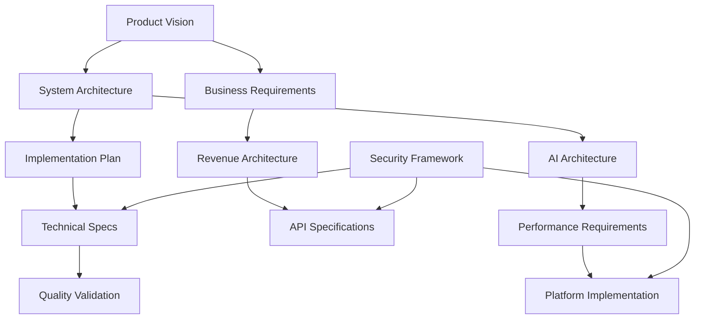

# Roadtrip-Copilot Specifications
## Comprehensive Documentation for Cross-Platform AI Development

**Version:** 2.0 (Reorganized)  
**Last Updated:** August 2025  
**Purpose:** Unified navigation hub for all Roadtrip-Copilot documentation

---

## 📋 Quick Navigation

| Category | Purpose | Key Documents |
|----------|---------|---------------|
| **[📋 Description](#-description)** | Product vision & business requirements | Product overview, business model |
| **[🎨 Design](#-design)** | Architecture & UX specifications | System architecture, AI design, UX guide |
| **[⚙️ Implementation](#️-implementation)** | Technical implementation guides | Mobile development, backend setup |
| **[📋 Tasks](#-tasks)** | Project management & roadmaps | Execution plans, implementation tasks |
| **[📊 Specs](#-specs)** | Technical specifications & APIs | API docs, security, performance |

---

## 🎯 Document Organization Philosophy

This reorganized specification structure follows a **purpose-driven approach** to make information easy to find and use:

### ✅ **Benefits of New Structure**
- **Clear Purpose Separation**: Each folder has a distinct role in the development process
- **Reduced Redundancy**: Consolidated overlapping content from 47+ scattered documents
- **Developer-Friendly**: Technical teams can quickly find implementation details
- **Stakeholder-Ready**: Business teams can access product vision without technical complexity
- **Maintenance Efficient**: Single source of truth for each domain

### 🔄 **Migration from Previous Structure**
The previous `/specs/` folder contained 47+ documents across multiple subdirectories. This reorganization consolidates them into **~20 focused documents** organized by purpose rather than technology.

---

## 📋 Description

> **Purpose**: Product vision, business requirements, and market positioning for stakeholders

### 📄 Core Documents

#### [product-overview.md](description/product-overview.md)
**Complete product vision and user experience**
- Revolutionary "Expedia of Roadside Discoveries" concept
- Pay-per-roadtrip business model with user-generated content monetization
- Complete user journey from onboarding to earning revenue
- Technical architecture overview with Gemma-3N AI integration
- Real-world usage scenarios and competitive differentiation

#### [business-requirements.md](description/business-requirements.md) 
**Comprehensive business model and revenue strategy**
- Multi-pillar revenue strategy: 60% roadtrip, 15% UGC, 15% partnerships, 10% crowdsourcing
- Viral referral system with 10th trip celebration mechanics
- First-discovery monetization with 50/50 revenue sharing
- Privacy-first revenue attribution and compliance frameworks
- Cloud infrastructure requirements and scalability planning

### 🎯 **Use Cases**
- **Executives**: Product vision and market opportunity
- **Investors**: Business model and revenue projections  
- **Product Managers**: User requirements and success metrics
- **Marketing Teams**: Value propositions and positioning

---

## 🎨 Design

> **Purpose**: System architecture, AI design, and user experience specifications

### 📄 Core Documents

#### [system-architecture.md](design/system-architecture.md)
**Unified system architecture across all platforms**
- Mobile-first AI architecture with Gemma-3N unified processing
- Backend infrastructure: Cloudflare Workers + Supabase edge computing
- Native iOS/Android implementations with CarPlay/Android Auto integration
- Three-tier processing: local AI → edge computing → cloud fallback
- Platform parity requirements ensuring 100% consistency

#### [ai-architecture.md](design/ai-architecture.md)
**Complete AI framework and processing pipeline**
- Gemma-3N unified architecture replacing 12 specialized agents
- Three-tier voice system: Kitten TTS → Kokoro TTS → XTTS Cloud
- Multimodal processing capabilities (text, image, audio, location)
- Performance optimization: <350ms response, <2.5GB memory
- Cross-platform AI integration with Neural Engine/NNAPI acceleration

#### [ux-design.md](design/ux-design.md)
**Comprehensive user experience and design system**
- Voice-first interface design with automotive safety compliance
- Design system integration: colors, typography, components
- Accessibility standards (WCAG 2.1 AAA) and inclusive design
- Platform-specific adaptations for iOS/Android/CarPlay/Android Auto
- NHTSA compliance for driver distraction prevention

#### [data-architecture.md](design/data-architecture.md)
**Complete data architecture and privacy framework**
- Privacy-preserving data models with GDPR/CCPA compliance
- POI discovery and validation system architecture
- Revenue attribution system with 50/50 creator sharing
- Social features and community engagement framework
- Performance optimization with spatial indexing and caching

### 🎯 **Use Cases**
- **Architects**: System design and technology decisions
- **Designers**: UX patterns and design systems
- **AI Engineers**: Model architecture and optimization
- **Security Teams**: Privacy and compliance requirements

---

## ⚙️ Implementation

> **Purpose**: Technical implementation guides and development setup

### 📄 Core Documents

#### [mobile-implementation.md](implementation/mobile-implementation.md)
**Cross-platform mobile development guide**
- iOS & CarPlay implementation (100% functionality via CarPlay)
- Android & Android Auto implementation (95% functionality via Foreground Services)
- Background execution strategies and platform-specific optimizations
- Cross-platform coordination and data synchronization
- Platform parity validation and automated testing

#### [backend-implementation.md](implementation/backend-implementation.md)
**Backend infrastructure setup and deployment**
- Cloudflare Workers edge computing configuration
- Supabase database setup with PostGIS spatial extensions
- Authentication and authorization implementation
- API endpoint development and rate limiting
- Monitoring, logging, and performance optimization

### 🎯 **Use Cases**
- **Mobile Developers**: Platform-specific implementation details
- **Backend Engineers**: Infrastructure setup and API development
- **DevOps Teams**: Deployment and monitoring configuration
- **QA Engineers**: Testing strategies and validation procedures

---

## 📋 Tasks

> **Purpose**: Project management, execution plans, and development roadmaps

### 📄 Core Documents

#### [execution-plan.md](tasks/execution-plan.md)
**Strategic 6-week P0 implementation timeline**
- Parallel development across 3 tracks: Backend, AI, Mobile
- Resource allocation for 8-10 developer team
- Platform parity enforcement protocols and quality gates
- Risk management strategies and contingency planning
- Daily coordination and weekly milestone validation

#### [implementation-roadmap.md](tasks/implementation-roadmap.md)
**Comprehensive 7-phase development roadmap**
- Phase-by-phase implementation with dependencies
- Backend infrastructure (Cloudflare Workers + Supabase)
- AI model integration (Gemma-3N unified architecture)
- Revenue and monetization system development
- Testing framework and performance optimization
- Production readiness and launch preparation

### 🎯 **Use Cases**
- **Project Managers**: Timeline planning and resource allocation
- **Development Teams**: Sprint planning and task prioritization
- **Stakeholders**: Progress tracking and milestone validation
- **Technical Leads**: Dependency management and risk assessment

---

## 📊 Specs

> **Purpose**: Technical specifications, APIs, and compliance documentation

### 📄 Core Documents

#### [api-specifications.md](specs/api-specifications.md)
**Comprehensive API documentation and integration guide**
- POI Discovery APIs: Apple MapKit + Google Places integration
- Backend Service APIs: Authentication, discovery management, revenue tracking
- Mobile Platform APIs: iOS/Android native integrations
- Real-time WebSocket APIs and cross-platform data exchange
- Authentication, security headers, and error handling

#### [security-compliance.md](specs/security-compliance.md)
**Security framework and regulatory compliance**
- Location authorization security with privacy-preserving access
- Data privacy framework with GDPR/CCPA compliance
- Automotive safety compliance (NHTSA guidelines)
- Accessibility compliance (WCAG 2.1 AAA)
- Security monitoring, incident response, and audit trails

#### [performance-requirements.md](specs/performance-requirements.md)
**Performance benchmarks and optimization targets**
- AI inference performance: <350ms response time, <2.5GB memory
- Mobile compute requirements with hardware acceleration
- Audio processing optimization for speech recognition and TTS
- Discovery system performance with real-time validation
- Platform-specific optimizations and monitoring frameworks

### 🎯 **Use Cases**
- **API Developers**: Integration specifications and endpoints
- **Security Engineers**: Compliance requirements and audit procedures
- **Performance Engineers**: Optimization targets and monitoring
- **QA Teams**: Testing criteria and acceptance thresholds

---

## 🔗 Cross-Document References

### Key Integration Points

| Source Document | Related Documents | Integration Type |
|----------------|-------------------|------------------|
| **product-overview.md** | → system-architecture.md → execution-plan.md | Vision → Architecture → Execution |
| **ai-architecture.md** | → mobile-implementation.md → performance-requirements.md | Design → Implementation → Validation |
| **system-architecture.md** | → api-specifications.md → security-compliance.md | Architecture → APIs → Security |
| **execution-plan.md** | → implementation-roadmap.md → mobile-implementation.md | Strategy → Roadmap → Implementation |
| **security-compliance.md** | → data-architecture.md → api-specifications.md | Security → Data → APIs |

### Traceability Matrix

---

## 🚀 Getting Started

### For New Team Members

1. **Product Understanding**: Start with [product-overview.md](description/product-overview.md)
2. **Technical Architecture**: Review [system-architecture.md](design/system-architecture.md)
3. **Implementation Role**: Choose your focus area:
   - **Mobile Development**: [mobile-implementation.md](implementation/mobile-implementation.md)
   - **Backend Development**: [backend-implementation.md](implementation/backend-implementation.md)
   - **AI/ML Engineering**: [ai-architecture.md](design/ai-architecture.md)
   - **Security Engineering**: [security-compliance.md](specs/security-compliance.md)
4. **Project Planning**: Review [execution-plan.md](tasks/execution-plan.md)

### For Stakeholders

1. **Business Case**: [product-overview.md](description/product-overview.md)
2. **Revenue Model**: [business-requirements.md](description/business-requirements.md)
3. **Development Timeline**: [execution-plan.md](tasks/execution-plan.md)
4. **Technical Overview**: [system-architecture.md](design/system-architecture.md)

### For Integration Partners

1. **API Reference**: [api-specifications.md](specs/api-specifications.md)
2. **Security Requirements**: [security-compliance.md](specs/security-compliance.md)
3. **Performance Targets**: [performance-requirements.md](specs/performance-requirements.md)
4. **Implementation Guide**: [mobile-implementation.md](implementation/mobile-implementation.md)

---

## 📈 Version History

| Version | Date | Changes |
|---------|------|---------|
| **2.0** | August 2025 | Complete reorganization: 47+ documents → 20 focused documents |
| **1.5** | August 2025 | Added Gemma-3N unified architecture and cross-platform LLM SDK |
| **1.0** | December 2024 | Initial specification structure |

---

## 🤝 Contributing

### Document Updates
1. Maintain cross-references when updating content
2. Update this README when adding new documents
3. Follow the established document templates and formatting
4. Ensure platform parity requirements are maintained

### Quality Standards
- **Accuracy**: All technical specifications must be validated
- **Completeness**: Documents must cover all four platforms
- **Consistency**: Terminology and architecture must align across documents
- **Maintainability**: Avoid duplication and circular dependencies

---

**🎯 This reorganized specification structure provides clear, purpose-driven documentation that scales with the Roadtrip-Copilot development team while maintaining the critical platform parity requirements across iOS, Android, CarPlay, and Android Auto.**