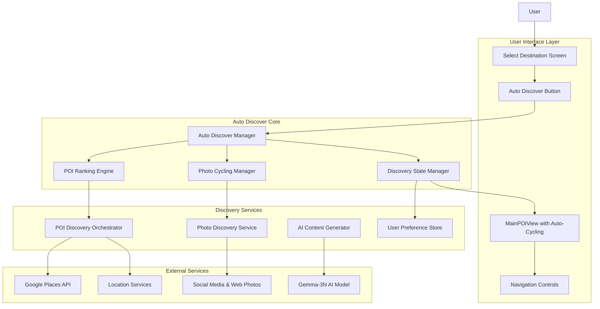
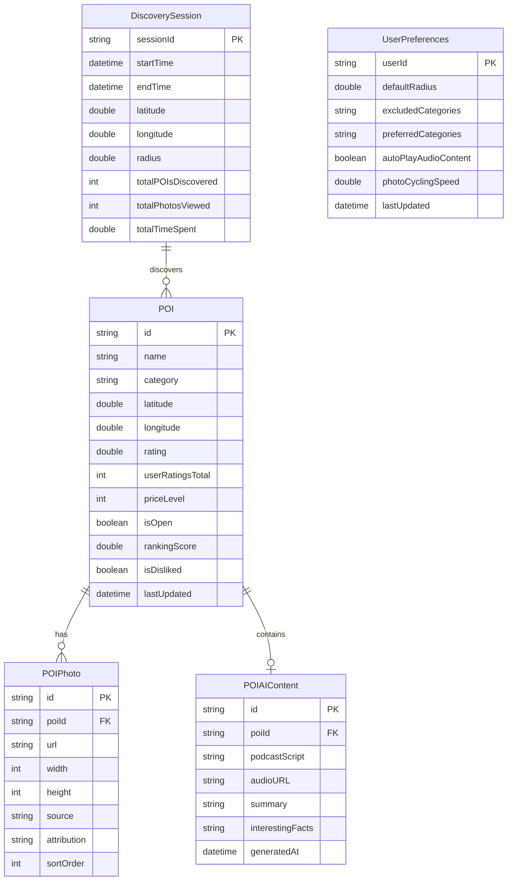
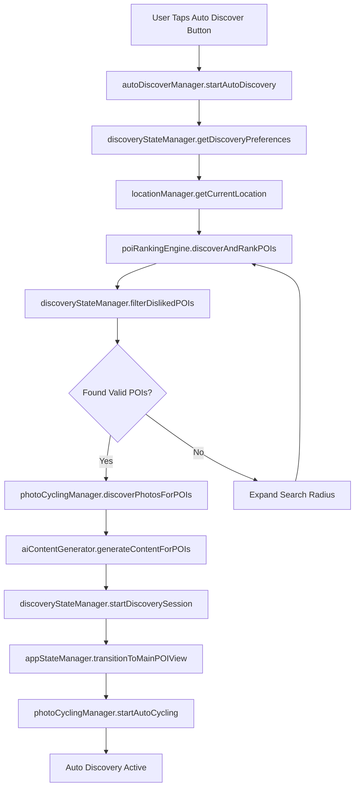
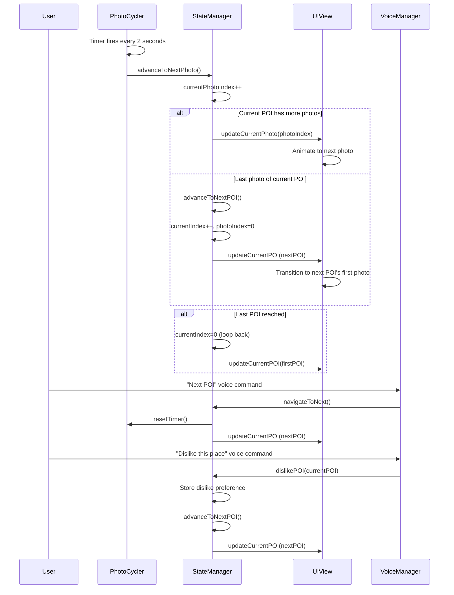

# Auto Discover Feature - Technical Design Document

**Feature Name:** `auto-discover`  
**Version:** 1.0  
**Created:** 2025-08-16  
**Status:** DESIGN COMPLETE

## Overview

The Auto Discover feature introduces an intelligent POI discovery system that automatically finds and presents the top 10 highest-ranking Points of Interest within a user's preset distance. This feature provides a third navigation option alongside manual destination entry and voice-guided search, enabling seamless POI exploration with auto-cycling photo displays, AI-generated content, and persistent user preferences.

### Design Goals

- **Intelligent Discovery**: Automatically rank and present top 10 POIs within user-configured radius
- **Auto-Cycling Experience**: Continuous photo cycling (2s intervals) transitioning between POIs automatically
- **Platform Parity**: 100% identical functionality across iOS, Android, CarPlay, and Android Auto
- **Voice Integration**: Full voice command support for hands-free operation
- **AI-Generated Content**: Contextual podcast content about discovered POIs
- **Persistent Learning**: Remember user dislikes across sessions and devices
- **Performance**: <3s initial discovery, seamless photo transitions, <5% battery impact

## Architecture Design

### System Architecture Diagram



### Data Flow Diagram

```mermaid
graph LR
    A[User Taps Auto Discover] --> B[Get Current Location]
    B --> C[Fetch POIs in Radius]
    C --> D[Apply Ranking Algorithm]
    D --> E[Filter Disliked POIs]
    E --> F[Discover Photos for Top 10]
    F --> G[Generate AI Content]
    G --> H[Transition to MainPOIView]
    H --> I[Start Photo Cycling]
    I --> J[Auto-advance to Next POI]
    J --> K{More POIs?}
    K -->|Yes| I
    K -->|No| L[Loop to First POI]
    L --> I
    
    M[User Voice Command] --> N[Parse Command]
    N --> O{Command Type}
    O -->|Navigation| P[Skip/Previous POI]
    O -->|Dislike| Q[Store Preference]
    O -->|Exit| R[Return to Selection]
    
    P --> I
    Q --> S[Apply Filter]
    S --> I
    R --> A
```



## Component Design

### 2.1 Auto Discover Manager

**Purpose:** Central orchestrator managing the complete auto-discovery workflow and state

**Interface:**
```swift
// iOS Implementation
protocol AutoDiscoverManagerProtocol {
    func startAutoDiscovery(location: CLLocation, radius: Double) async throws -> AutoDiscoveryResult
    func pauseAutoDiscovery()
    func resumeAutoDiscovery()
    func stopAutoDiscovery()
    func navigateToNext()
    func navigateToPrevious()
    func dislikePOI(_ poi: POI)
    var isDiscovering: Bool { get }
    var currentPOI: POI? { get }
}

class AutoDiscoverManager: AutoDiscoverManagerProtocol, ObservableObject {
    @Published var isDiscovering = false
    @Published var currentPOI: POI?
    @Published var discoveredPOIs: [POI] = []
    @Published var currentIndex = 0
    @Published var currentPhotoIndex = 0
    
    private let poiRankingEngine: POIRankingEngine
    private let photoCyclingManager: PhotoCyclingManager
    private let discoveryStateManager: DiscoveryStateManager
    private let aiContentGenerator: AIContentGenerator
    
    func startAutoDiscovery(location: CLLocation, radius: Double) async throws -> AutoDiscoveryResult {
        isDiscovering = true
        
        // Step 1: Discover and rank POIs
        let rankedPOIs = try await poiRankingEngine.discoverAndRankPOIs(
            location: location, 
            radius: radius, 
            maxResults: 10
        )
        
        // Step 2: Filter out disliked POIs
        let filteredPOIs = try await discoveryStateManager.filterDislikedPOIs(rankedPOIs)
        
        // Step 3: Discover photos for each POI
        discoveredPOIs = try await photoCyclingManager.discoverPhotosForPOIs(filteredPOIs)
        
        // Step 4: Generate AI content
        try await aiContentGenerator.generateContentForPOIs(discoveredPOIs)
        
        // Step 5: Set initial state
        currentIndex = 0
        currentPhotoIndex = 0
        currentPOI = discoveredPOIs.first
        
        // Step 6: Start auto-cycling
        photoCyclingManager.startAutoCycling { [weak self] in
            self?.advanceToNextPhoto()
        }
        
        return AutoDiscoveryResult(pois: discoveredPOIs, initialIndex: 0)
    }
}
```

```kotlin
// Android Implementation
interface AutoDiscoverManager {
    suspend fun startAutoDiscovery(location: LatLng, radius: Double): AutoDiscoveryResult
    fun pauseAutoDiscovery()
    fun resumeAutoDiscovery()
    fun stopAutoDiscovery()
    fun navigateToNext()
    fun navigateToPrevious()
    suspend fun dislikePOI(poi: POIData)
    val isDiscovering: StateFlow<Boolean>
    val currentPOI: StateFlow<POIData?>
}

class AutoDiscoverManagerImpl @Inject constructor(
    private val poiRankingEngine: POIRankingEngine,
    private val photoCyclingManager: PhotoCyclingManager,
    private val discoveryStateManager: DiscoveryStateManager,
    private val aiContentGenerator: AIContentGenerator
) : AutoDiscoverManager {
    
    private val _isDiscovering = MutableStateFlow(false)
    override val isDiscovering: StateFlow<Boolean> = _isDiscovering.asStateFlow()
    
    private val _currentPOI = MutableStateFlow<POIData?>(null)
    override val currentPOI: StateFlow<POIData?> = _currentPOI.asStateFlow()
    
    private val _discoveredPOIs = MutableStateFlow<List<POIData>>(emptyList())
    private val _currentIndex = MutableStateFlow(0)
    private val _currentPhotoIndex = MutableStateFlow(0)
    
    override suspend fun startAutoDiscovery(location: LatLng, radius: Double): AutoDiscoveryResult {
        _isDiscovering.value = true
        
        // Discovery workflow matching iOS implementation
        val rankedPOIs = poiRankingEngine.discoverAndRankPOIs(location, radius, 10)
        val filteredPOIs = discoveryStateManager.filterDislikedPOIs(rankedPOIs)
        val poisWithPhotos = photoCyclingManager.discoverPhotosForPOIs(filteredPOIs)
        
        aiContentGenerator.generateContentForPOIs(poisWithPhotos)
        
        _discoveredPOIs.value = poisWithPhotos
        _currentIndex.value = 0
        _currentPhotoIndex.value = 0
        _currentPOI.value = poisWithPhotos.firstOrNull()
        
        photoCyclingManager.startAutoCycling { advanceToNextPhoto() }
        
        return AutoDiscoveryResult(pois = poisWithPhotos, initialIndex = 0)
    }
}
```

### 2.2 POI Ranking Engine

**Purpose:** Discovers, ranks, and selects the top 10 POIs based on multiple criteria

**Ranking Algorithm:**
```swift
// iOS Implementation
class POIRankingEngine {
    struct RankingCriteria {
        let rating: Double        // 30% weight
        let popularity: Double    // 25% weight  
        let proximity: Double     // 20% weight
        let userPreference: Double // 15% weight
        let uniqueness: Double    // 10% weight
    }
    
    func discoverAndRankPOIs(location: CLLocation, radius: Double, maxResults: Int) async throws -> [POI] {
        // Step 1: Discover POIs from multiple sources
        let googlePOIs = try await googlePlacesClient.searchNearby(
            location: location,
            radius: radius,
            types: ["tourist_attraction", "restaurant", "museum", "park", "shopping_mall"]
        )
        
        let osmPOIs = try await osmClient.searchPOIs(location: location, radius: radius)
        let yelpPOIs = try await yelpClient.searchBusinesses(location: location, radius: radius)
        
        // Step 2: Merge and deduplicate POIs
        let allPOIs = mergePOIs([googlePOIs, osmPOIs, yelpPOIs])
        let deduplicatedPOIs = deduplicatePOIs(allPOIs)
        
        // Step 3: Calculate ranking scores
        let rankedPOIs = deduplicatedPOIs.map { poi in
            let score = calculateRankingScore(poi: poi, userLocation: location)
            return (poi: poi, score: score)
        }
        
        // Step 4: Sort by score and return top results
        return rankedPOIs
            .sorted { $0.score > $1.score }
            .prefix(maxResults)
            .map { $0.poi }
    }
    
    private func calculateRankingScore(poi: POI, userLocation: CLLocation) -> Double {
        let criteria = RankingCriteria(
            rating: normalizeRating(poi.rating),
            popularity: normalizePopularity(poi.userRatingsTotal),
            proximity: normalizeDistance(poi.location.distance(from: userLocation)),
            userPreference: calculateUserPreference(poi: poi),
            uniqueness: calculateUniqueness(poi: poi)
        )
        
        return (criteria.rating * 0.30) +
               (criteria.popularity * 0.25) +
               (criteria.proximity * 0.20) +
               (criteria.userPreference * 0.15) +
               (criteria.uniqueness * 0.10)
    }
    
    private func normalizeDistance(_ distance: Double) -> Double {
        // Closer is better - inverse relationship
        let maxDistance = 50000.0 // 50km
        return max(0, (maxDistance - distance) / maxDistance)
    }
}
```

**POI Data Model Enhancement:**
```swift
// iOS Enhanced POI Model
struct POI: Identifiable, Codable {
    let id: String
    let name: String
    let category: String
    let location: CLLocation
    let rating: Double?
    let userRatingsTotal: Int?
    let priceLevel: Int?
    let isOpen: Bool?
    let photos: [POIPhoto]
    let aiContent: POIAIContent?
    let source: DataSource
    let discoveryWeight: Int
    let lastUpdated: Date
    
    // Auto Discover specific properties
    let rankingScore: Double
    let isDisliked: Bool
    let discoveryTimestamp: Date
}

struct POIPhoto: Identifiable, Codable {
    let id: String
    let url: URL
    let width: Int
    let height: Int
    let source: PhotoSource
    let attribution: String?
}

struct POIAIContent: Codable {
    let podcastScript: String
    let audioURL: URL?
    let summary: String
    let interestingFacts: [String]
    let generatedAt: Date
}

enum PhotoSource: String, Codable {
    case googlePlaces = "google_places"
    case instagram = "instagram"
    case flickr = "flickr"
    case unsplash = "unsplash"
    case yelp = "yelp"
    case official = "official"
}
```

### 2.3 Photo Cycling Manager

**Purpose:** Manages automatic photo discovery and cycling behavior

**Implementation:**
```swift
// iOS Implementation
class PhotoCyclingManager: ObservableObject {
    @Published var currentPhotoIndex = 0
    @Published var isAutoCycling = false
    
    private var cyclingTimer: Timer?
    private var advanceCallback: (() -> Void)?
    private let photoInterval: TimeInterval = 2.0 // 2 seconds per photo
    
    func discoverPhotosForPOIs(_ pois: [POI]) async throws -> [POI] {
        var poisWithPhotos: [POI] = []
        
        for poi in pois {
            let photos = try await discoverPhotosForPOI(poi)
            let updatedPOI = poi.withPhotos(photos)
            poisWithPhotos.append(updatedPOI)
        }
        
        return poisWithPhotos
    }
    
    private func discoverPhotosForPOI(_ poi: POI) async throws -> [POIPhoto] {
        var allPhotos: [POIPhoto] = []
        
        // Source 1: Google Places Photos
        if let googlePhotos = try? await googlePlacesClient.getPhotos(for: poi.id) {
            allPhotos.append(contentsOf: googlePhotos.prefix(2)) // Top 2 from Google
        }
        
        // Source 2: Social Media Photos (Instagram, Flickr)
        if let socialPhotos = try? await socialMediaClient.searchPhotos(
            location: poi.location,
            keywords: [poi.name, poi.category]
        ) {
            allPhotos.append(contentsOf: socialPhotos.prefix(2)) // Top 2 from social
        }
        
        // Source 3: Stock Photos (Unsplash)
        if allPhotos.count < 5 {
            if let stockPhotos = try? await unsplashClient.searchPhotos(
                query: "\(poi.name) \(poi.category)",
                count: 5 - allPhotos.count
            ) {
                allPhotos.append(contentsOf: stockPhotos)
            }
        }
        
        // Ensure we have exactly 5 photos, pad with defaults if needed
        while allPhotos.count < 5 {
            allPhotos.append(createDefaultPhoto(for: poi))
        }
        
        return Array(allPhotos.prefix(5))
    }
    
    func startAutoCycling(onAdvance: @escaping () -> Void) {
        advanceCallback = onAdvance
        isAutoCycling = true
        
        cyclingTimer = Timer.scheduledTimer(withTimeInterval: photoInterval, repeats: true) { [weak self] _ in
            DispatchQueue.main.async {
                self?.advancePhoto()
            }
        }
    }
    
    private func advancePhoto() {
        guard let callback = advanceCallback else { return }
        callback()
    }
    
    func stopAutoCycling() {
        cyclingTimer?.invalidate()
        cyclingTimer = nil
        isAutoCycling = false
        advanceCallback = nil
    }
}
```

### 2.4 Discovery State Manager

**Purpose:** Manages user preferences, dislike history, and discovery session state

**Interface:**
```swift
// iOS Implementation
class DiscoveryStateManager: ObservableObject {
    @Published var currentDiscoverySession: DiscoverySession?
    
    private let userDefaults = UserDefaults.standard
    private let dislikedPOIsKey = "auto_discover_disliked_pois"
    private let discoveryPreferencesKey = "auto_discover_preferences"
    
    struct DiscoverySession {
        let id: UUID
        let startTime: Date
        let location: CLLocation
        let radius: Double
        let discoveredPOIs: [POI]
        var currentIndex: Int
        var currentPhotoIndex: Int
        var totalPhotosViewed: Int
        var totalTimeSpent: TimeInterval
    }
    
    struct DiscoveryPreferences: Codable {
        var defaultRadius: Double = 25.0 // 25 miles default
        var excludedCategories: Set<String> = []
        var preferredCategories: Set<String> = []
        var autoPlayAudioContent: Bool = true
        var photoCyclingSpeed: Double = 2.0 // seconds per photo
    }
    
    func startDiscoverySession(location: CLLocation, radius: Double, pois: [POI]) {
        currentDiscoverySession = DiscoverySession(
            id: UUID(),
            startTime: Date(),
            location: location,
            radius: radius,
            discoveredPOIs: pois,
            currentIndex: 0,
            currentPhotoIndex: 0,
            totalPhotosViewed: 0,
            totalTimeSpent: 0
        )
    }
    
    func filterDislikedPOIs(_ pois: [POI]) async -> [POI] {
        let dislikedPOIIds = getDislikedPOIIds()
        return pois.filter { !dislikedPOIIds.contains($0.id) }
    }
    
    func dislikePOI(_ poi: POI) {
        var dislikedPOIs = getDislikedPOIIds()
        dislikedPOIs.insert(poi.id)
        
        let dislikedArray = Array(dislikedPOIs)
        userDefaults.set(dislikedArray, forKey: dislikedPOIsKey)
        
        // Analytics tracking
        trackUserInteraction(.dislike, poi: poi)
    }
    
    private func getDislikedPOIIds() -> Set<String> {
        let dislikedArray = userDefaults.stringArray(forKey: dislikedPOIsKey) ?? []
        return Set(dislikedArray)
    }
    
    func getDiscoveryPreferences() -> DiscoveryPreferences {
        guard let data = userDefaults.data(forKey: discoveryPreferencesKey),
              let preferences = try? JSONDecoder().decode(DiscoveryPreferences.self, from: data) else {
            return DiscoveryPreferences() // Default preferences
        }
        return preferences
    }
    
    func updateDiscoveryPreferences(_ preferences: DiscoveryPreferences) {
        if let data = try? JSONEncoder().encode(preferences) {
            userDefaults.set(data, forKey: discoveryPreferencesKey)
        }
    }
}
```

## Data Models

### Core Data Structure Definitions

**Enhanced POI Data Models:**
```swift
// iOS Core Data Model
import CoreData

@objc(POICacheEntry)
public class POICacheEntry: NSManagedObject {
    @NSManaged public var poiId: String
    @NSManaged public var name: String
    @NSManaged public var category: String
    @NSManaged public var latitude: Double
    @NSManaged public var longitude: Double
    @NSManaged public var rating: Double
    @NSManaged public var photosData: Data?
    @NSManaged public var aiContentData: Data?
    @NSManaged public var rankingScore: Double
    @NSManaged public var isDisliked: Bool
    @NSManaged public var cachedAt: Date
    @NSManaged public var expiresAt: Date
}

// Auto Discover specific models
struct AutoDiscoveryResult {
    let pois: [POI]
    let initialIndex: Int
    let sessionId: UUID
    let location: CLLocation
    let radius: Double
    let timestamp: Date
}

struct AutoDiscoveryConfiguration {
    let maxPOIs: Int = 10
    let photosPerPOI: Int = 5
    let photoCyclingInterval: TimeInterval = 2.0
    let autoAdvanceToNextPOI: Bool = true
    let generateAIContent: Bool = true
    let enableVoiceCommands: Bool = true
}
```

```kotlin
// Android Room Database Models
@Entity(tableName = "poi_cache")
data class POICacheEntity(
    @PrimaryKey val poiId: String,
    val name: String,
    val category: String,
    val latitude: Double,
    val longitude: Double,
    val rating: Double,
    val photosJson: String?,
    val aiContentJson: String?,
    val rankingScore: Double,
    val isDisliked: Boolean,
    val cachedAt: Long,
    val expiresAt: Long
)

@Entity(tableName = "discovery_sessions")
data class DiscoverySessionEntity(
    @PrimaryKey val sessionId: String,
    val startTime: Long,
    val endTime: Long?,
    val latitude: Double,
    val longitude: Double,
    val radius: Double,
    val totalPOIsDiscovered: Int,
    val totalPhotosViewed: Int,
    val totalTimeSpent: Long
)

@Entity(tableName = "user_preferences")
data class UserPreferencesEntity(
    @PrimaryKey val userId: String = "default",
    val defaultRadius: Double,
    val excludedCategories: String, // JSON array
    val preferredCategories: String, // JSON array
    val autoPlayAudioContent: Boolean,
    val photoCyclingSpeed: Double,
    val lastUpdated: Long
)
```

### Data Model Diagrams



## Business Process

### Process 1: Auto Discover Initiation



### Process 2: Photo Cycling and POI Navigation



### Process 3: Voice Command Processing

```mermaid
flowchart TD
    A[Voice Input Detected] --> B[speechManager.processVoiceInput]
    B --> C{Parse Command}
    C -->|"Next POI"| D[autoDiscoverManager.navigateToNext]
    C -->|"Previous POI"| E[autoDiscoverManager.navigateToPrevious]
    C -->|"Dislike"| F[autoDiscoverManager.dislikePOI]
    C -->|"Tell me about this place"| G[aiContentGenerator.playPodcastContent]
    C -->|"Back" or "Exit"| H[autoDiscoverManager.stopAutoDiscovery]
    C -->|"Pause"| I[photoCyclingManager.pauseAutoCycling]
    C -->|"Resume"| J[photoCyclingManager.resumeAutoCycling]
    
    D --> K[Update UI State]
    E --> K
    F --> L[Store User Preference]
    L --> M[Skip to Next POI]
    M --> K
    G --> N[Play Audio Content]
    H --> O[Return to Select Destination]
    I --> P[Pause Cycling Timer]
    J --> Q[Resume Cycling Timer]
    
    K --> R[Continue Auto Discovery]
    N --> R
    P --> R
    Q --> R
```

## UI/UX Design Specifications

### Select Destination Screen Integration

**Auto Discover Button Specification:**
```swift
// iOS Implementation
struct AutoDiscoverButton: View {
    let action: () -> Void
    
    var body: some View {
        Button(action: action) {
            HStack(spacing: 12) {
                Image(systemName: "sparkles.tv")
                    .font(.title2)
                    .foregroundColor(.white)
                
                VStack(alignment: .leading, spacing: 2) {
                    Text("Auto Discover")
                        .font(.headline)
                        .foregroundColor(.white)
                    
                    Text("Find interesting places nearby")
                        .font(.caption)
                        .foregroundColor(.white.opacity(0.8))
                }
                
                Spacer()
                
                Image(systemName: "chevron.right")
                    .font(.title2)
                    .foregroundColor(.white.opacity(0.7))
            }
            .padding(.horizontal, 20)
            .padding(.vertical, 16)
            .background(
                LinearGradient(
                    gradient: Gradient(colors: [
                        Color.purple.opacity(0.8),
                        Color.blue.opacity(0.8)
                    ]),
                    startPoint: .leading,
                    endPoint: .trailing
                )
            )
            .clipShape(RoundedRectangle(cornerRadius: DesignTokens.cornerRadiusLarge))
            .shadow(color: .black.opacity(0.2), radius: 4, x: 0, y: 2)
        }
        .accessibilityLabel("Auto Discover")
        .accessibilityHint("Automatically find and display interesting places nearby")
        .accessibilityIdentifier("autoDiscoverButton")
    }
}
```

### MainPOIView Auto-Cycling Integration

**Heart Icon to Search Icon Transformation:**
```swift
// iOS Implementation - Modified MainPOIView
struct AutoDiscoverMainPOIView: View {
    @StateObject private var autoDiscoverManager = AutoDiscoverManager()
    @State private var isInAutoDiscoverMode = false
    
    var body: some View {
        ZStack {
            // Background Image with Auto-Cycling Photos
            AutoCyclingPhotoBackground(
                photos: autoDiscoverManager.currentPOI?.photos ?? [],
                currentIndex: autoDiscoverManager.currentPhotoIndex
            )
            
            // Content overlay
            VStack(spacing: 0) {
                // Top Status Bar
                HStack {
                    // Back/Search Button (replaces heart icon in auto-discover mode)
                    Button(action: handleBackButtonAction) {
                        HStack(spacing: 4) {
                            Image(systemName: isInAutoDiscoverMode ? "magnifyingglass" : "chevron.left")
                                .font(.title2)
                                .foregroundColor(.white)
                            
                            Text(isInAutoDiscoverMode ? "Search" : "Back")
                                .font(.subheadline)
                                .foregroundColor(.white)
                        }
                        .padding(.horizontal, 8)
                        .padding(.vertical, 4)
                    }
                    .accessibilityLabel(isInAutoDiscoverMode ? "Back to search" : "Back")
                    .accessibilityIdentifier("backSearchButton")
                    
                    Spacer()
                    
                    // Speak/Info Button (new for auto-discover mode)
                    if isInAutoDiscoverMode {
                        Button(action: handleSpeakInfoAction) {
                            HStack(spacing: 4) {
                                Image(systemName: "speaker.wave.2.fill")
                                    .font(.title2)
                                    .foregroundColor(.white)
                                
                                Text("Info")
                                    .font(.subheadline)
                                    .foregroundColor(.white)
                            }
                            .padding(.horizontal, 8)
                            .padding(.vertical, 4)
                        }
                        .accessibilityLabel("Play information about this place")
                        .accessibilityIdentifier("speakInfoButton")
                    }
                }
                .padding(.horizontal, 16)
                .padding(.vertical, 16)
                
                Spacer()
                
                // Auto-Discover Navigation Controls
                if isInAutoDiscoverMode {
                    AutoDiscoverNavigationControls()
                }
            }
        }
        .onAppear {
            isInAutoDiscoverMode = autoDiscoverManager.isDiscovering
        }
    }
    
    private func handleBackButtonAction() {
        if isInAutoDiscoverMode {
            autoDiscoverManager.stopAutoDiscovery()
            appStateManager.returnToDestinationSelection()
        } else {
            appStateManager.returnToDestinationSelection()
        }
    }
    
    private func handleSpeakInfoAction() {
        guard let currentPOI = autoDiscoverManager.currentPOI else { return }
        aiContentGenerator.playPodcastContent(for: currentPOI)
    }
}

struct AutoCyclingPhotoBackground: View {
    let photos: [POIPhoto]
    let currentIndex: Int
    
    var body: some View {
        Group {
            if !photos.isEmpty && currentIndex < photos.count {
                AsyncImage(url: photos[currentIndex].url) { image in
                    image
                        .resizable()
                        .aspectRatio(contentMode: .fill)
                        .transition(.opacity.combined(with: .scale(scale: 1.05)))
                } placeholder: {
                    Rectangle()
                        .fill(Color.gray.opacity(0.3))
                        .overlay(
                            ProgressView()
                                .progressViewStyle(CircularProgressViewStyle(tint: .white))
                        )
                }
            } else {
                // Default background
                Image("MorroRock")
                    .resizable()
                    .aspectRatio(contentMode: .fill)
            }
        }
        .frame(maxWidth: .infinity, maxHeight: .infinity)
        .ignoresSafeArea()
        .animation(.easeInOut(duration: 0.5), value: currentIndex)
    }
}

struct AutoDiscoverNavigationControls: View {
    var body: some View {
        HStack(spacing: 20) {
            // Previous POI Button
            Button(action: { 
                AutoDiscoverManager.shared.navigateToPrevious() 
            }) {
                Image(systemName: "chevron.left.circle.fill")
                    .font(.system(size: 40))
                    .foregroundColor(.white)
                    .shadow(color: .black.opacity(0.3), radius: 2, x: 0, y: 1)
            }
            .accessibilityLabel("Previous POI")
            .accessibilityIdentifier("previousPOIButton")
            
            Spacer()
            
            // POI Information Overlay
            VStack {
                if let currentPOI = AutoDiscoverManager.shared.currentPOI {
                    Text(currentPOI.name)
                        .font(.headline)
                        .foregroundColor(.white)
                        .multilineTextAlignment(.center)
                    
                    Text("\(AutoDiscoverManager.shared.currentIndex + 1) of \(AutoDiscoverManager.shared.discoveredPOIs.count)")
                        .font(.caption)
                        .foregroundColor(.white.opacity(0.8))
                    
                    // Photo indicator dots
                    HStack(spacing: 4) {
                        ForEach(0..<(currentPOI.photos.count), id: \.self) { photoIndex in
                            Circle()
                                .fill(photoIndex == AutoDiscoverManager.shared.currentPhotoIndex ? .white : .white.opacity(0.4))
                                .frame(width: 6, height: 6)
                        }
                    }
                }
            }
            .padding(.horizontal, 16)
            .padding(.vertical, 8)
            .background(Color.black.opacity(0.5))
            .clipShape(RoundedRectangle(cornerRadius: 8))
            
            Spacer()
            
            // Next POI Button
            Button(action: { 
                AutoDiscoverManager.shared.navigateToNext() 
            }) {
                Image(systemName: "chevron.right.circle.fill")
                    .font(.system(size: 40))
                    .foregroundColor(.white)
                    .shadow(color: .black.opacity(0.3), radius: 2, x: 0, y: 1)
            }
            .accessibilityLabel("Next POI")
            .accessibilityIdentifier("nextPOIButton")
        }
        .padding(.horizontal, 20)
        .padding(.bottom, 20)
    }
}
```

## Algorithm Design for POI Ranking and Selection

### Multi-Criteria Ranking Algorithm

**Ranking Score Calculation:**
```swift
// iOS Implementation
struct POIRankingAlgorithm {
    
    static func calculateRankingScore(poi: POI, userLocation: CLLocation, userPreferences: UserPreferences) -> Double {
        let weights = RankingWeights(
            rating: 0.30,
            popularity: 0.25,
            proximity: 0.20,
            userPreference: 0.15,
            uniqueness: 0.10
        )
        
        let ratingScore = normalizeRating(poi.rating)
        let popularityScore = normalizePopularity(poi.userRatingsTotal)
        let proximityScore = normalizeProximity(poi.location.distance(from: userLocation))
        let userPreferenceScore = calculateUserPreferenceScore(poi: poi, preferences: userPreferences)
        let uniquenessScore = calculateUniquenessScore(poi: poi)
        
        return (ratingScore * weights.rating) +
               (popularityScore * weights.popularity) +
               (proximityScore * weights.proximity) +
               (userPreferenceScore * weights.userPreference) +
               (uniquenessScore * weights.uniqueness)
    }
    
    private static func normalizeRating(_ rating: Double?) -> Double {
        guard let rating = rating, rating > 0 else { return 0.5 } // Neutral score for unrated
        return min(rating / 5.0, 1.0) // Normalize to 0-1 scale
    }
    
    private static func normalizePopularity(_ userRatingsTotal: Int?) -> Double {
        guard let total = userRatingsTotal, total > 0 else { return 0.3 } // Low score for no reviews
        
        // Logarithmic scaling for review count
        let logTotal = log10(Double(total))
        let maxLogValue = 4.0 // Assume 10,000 reviews as maximum
        return min(logTotal / maxLogValue, 1.0)
    }
    
    private static func normalizeProximity(_ distance: Double) -> Double {
        let maxDistance = 40233.6 // 25 miles in meters
        let normalizedDistance = min(distance / maxDistance, 1.0)
        return 1.0 - normalizedDistance // Closer is better
    }
    
    private static func calculateUserPreferenceScore(poi: POI, preferences: UserPreferences) -> Double {
        var score = 0.5 // Neutral base score
        
        // Boost score for preferred categories
        if preferences.preferredCategories.contains(poi.category) {
            score += 0.3
        }
        
        // Reduce score for excluded categories
        if preferences.excludedCategories.contains(poi.category) {
            score -= 0.4
        }
        
        // Price level preference
        if let priceLevel = poi.priceLevel {
            let priceDifference = abs(priceLevel - preferences.preferredPriceLevel)
            score -= Double(priceDifference) * 0.1
        }
        
        return max(0.0, min(1.0, score))
    }
    
    private static func calculateUniquenessScore(poi: POI) -> Double {
        // Boost score for unique categories
        let uniqueCategories: Set<String> = [
            "tourist_attraction", "museum", "art_gallery", 
            "historical_landmark", "natural_feature", "viewpoint"
        ]
        
        if uniqueCategories.contains(poi.category) {
            return 0.8
        } else if poi.category == "restaurant" && poi.rating ?? 0 > 4.5 {
            return 0.6 // Highly rated restaurants get uniqueness boost
        } else {
            return 0.4 // Standard uniqueness score
        }
    }
}
```

### POI Deduplication Algorithm

```swift
// iOS Implementation
struct POIDeduplicationEngine {
    
    static func deduplicatePOIs(_ pois: [POI]) -> [POI] {
        var deduplicatedPOIs: [POI] = []
        var processedLocations: Set<String> = []
        
        let sortedPOIs = pois.sorted { poi1, poi2 in
            // Prioritize POIs with more complete data
            let score1 = calculateCompletenessScore(poi1)
            let score2 = calculateCompletenessScore(poi2)
            return score1 > score2
        }
        
        for poi in sortedPOIs {
            let locationKey = generateLocationKey(for: poi)
            let nameKey = generateNameKey(for: poi)
            
            if !isDuplicate(poi: poi, existingPOIs: deduplicatedPOIs) {
                deduplicatedPOIs.append(poi)
                processedLocations.insert(locationKey)
            }
        }
        
        return deduplicatedPOIs
    }
    
    private static func isDuplicate(poi: POI, existingPOIs: [POI]) -> Bool {
        for existingPOI in existingPOIs {
            // Check distance threshold (within 50 meters)
            let distance = poi.location.distance(from: existingPOI.location)
            if distance < 50.0 {
                // Check name similarity
                let nameSimilarity = calculateStringSimilarity(poi.name, existingPOI.name)
                if nameSimilarity > 0.8 {
                    return true
                }
            }
            
            // Check exact name match (different sources for same business)
            if poi.name.lowercased() == existingPOI.name.lowercased() {
                let distance = poi.location.distance(from: existingPOI.location)
                if distance < 200.0 { // Within 200 meters with same name
                    return true
                }
            }
        }
        
        return false
    }
    
    private static func calculateCompletenessScore(_ poi: POI) -> Double {
        var score = 0.0
        
        if poi.rating != nil { score += 0.3 }
        if poi.userRatingsTotal != nil { score += 0.2 }
        if poi.phoneNumber != nil { score += 0.2 }
        if poi.website != nil { score += 0.1 }
        if !poi.photos.isEmpty { score += 0.2 }
        
        return score
    }
    
    private static func calculateStringSimilarity(_ str1: String, _ str2: String) -> Double {
        // Implement Jaro-Winkler similarity or similar algorithm
        let s1 = str1.lowercased()
        let s2 = str2.lowercased()
        
        // Simple implementation using character overlap
        let set1 = Set(s1)
        let set2 = Set(s2)
        let intersection = set1.intersection(set2)
        let union = set1.union(set2)
        
        return Double(intersection.count) / Double(union.count)
    }
}
```

## AI Podcast Generation Architecture

### AI Content Generator

```swift
// iOS Implementation
class AIContentGenerator: ObservableObject {
    private let gemmaProcessor: Gemma3NProcessor
    private let ttsManager: TTSManager
    private let cache: AIContentCache
    
    func generateContentForPOIs(_ pois: [POI]) async throws {
        try await withThrowingTaskGroup(of: Void.self) { group in
            for poi in pois {
                group.addTask {
                    try await self.generateContentForPOI(poi)
                }
            }
            
            try await group.waitForAll()
        }
    }
    
    private func generateContentForPOI(_ poi: POI) async throws {
        // Check cache first
        if let cachedContent = await cache.getContent(for: poi.id) {
            poi.aiContent = cachedContent
            return
        }
        
        // Generate podcast script
        let prompt = buildPodcastPrompt(for: poi)
        let script = try await gemmaProcessor.generateText(prompt: prompt, maxTokens: 300)
        
        // Generate audio
        let audioURL = try await ttsManager.generateAudio(from: script)
        
        // Create AI content
        let aiContent = POIAIContent(
            podcastScript: script,
            audioURL: audioURL,
            summary: extractSummary(from: script),
            interestingFacts: extractFacts(from: script),
            generatedAt: Date()
        )
        
        // Cache the content
        await cache.storeContent(aiContent, for: poi.id)
        poi.aiContent = aiContent
    }
    
    private func buildPodcastPrompt(for poi: POI) -> String {
        return """
        Create a 30-second engaging podcast script about \(poi.name), a \(poi.category) located at \(poi.location).
        
        Include:
        - A brief interesting fact or history
        - What makes this place special
        - Why travelers should visit
        - Keep it conversational and engaging
        - Maximum 100 words for 30-second reading time
        
        POI Details:
        - Name: \(poi.name)
        - Category: \(poi.category)
        - Rating: \(poi.rating ?? 0)/5
        - Reviews: \(poi.userRatingsTotal ?? 0) reviews
        
        Start with: "You're approaching \(poi.name)..."
        """
    }
    
    func playPodcastContent(for poi: POI) {
        guard let aiContent = poi.aiContent,
              let audioURL = aiContent.audioURL else {
            // Fallback to text-to-speech
            fallbackToTTS(for: poi)
            return
        }
        
        AudioPlayer.shared.play(url: audioURL)
    }
    
    private func fallbackToTTS(for poi: POI) {
        let fallbackScript = "You're approaching \(poi.name), a \(poi.category) with a \(poi.rating ?? 0) star rating."
        ttsManager.speak(fallbackScript)
    }
}
```

### TTS Integration for Podcast Content

```swift
// iOS TTS Manager Enhancement
class TTSManager: NSObject, ObservableObject, AVSpeechSynthesizerDelegate {
    private let synthesizer = AVSpeechSynthesizer()
    private let kitten TTS = KittenTTSProcessor()
    
    @Published var isSpeaking = false
    
    func generateAudio(from script: String) async throws -> URL {
        // Use KittenTTS for high-quality audio generation
        let audioData = try await kittenTTS.synthesize(text: script, voice: .naturalFemale)
        
        // Save to temporary file
        let tempURL = FileManager.default.temporaryDirectory
            .appendingPathComponent(UUID().uuidString)
            .appendingPathExtension("wav")
        
        try audioData.write(to: tempURL)
        return tempURL
    }
    
    func speak(_ text: String, priority: TTSPriority = .normal) {
        let utterance = AVSpeechUtterance(string: text)
        utterance.rate = 0.5 // Slightly slower for automotive safety
        utterance.volume = 1.0
        utterance.voice = AVSpeechSynthesisVoice(language: "en-US")
        
        synthesizer.speak(utterance)
        isSpeaking = true
    }
    
    // AVSpeechSynthesizerDelegate
    func speechSynthesizer(_ synthesizer: AVSpeechSynthesizer, didFinish utterance: AVSpeechUtterance) {
        isSpeaking = false
    }
}
```

## Photo Discovery and Caching Strategies

### Photo Discovery Service

```swift
// iOS Implementation
class PhotoDiscoveryService {
    private let googlePlacesClient: GooglePlacesClient
    private let socialMediaClient: SocialMediaClient
    private let unsplashClient: UnsplashClient
    private let photoCache: PhotoCache
    
    func discoverPhotosForPOI(_ poi: POI) async throws -> [POIPhoto] {
        // Check cache first
        if let cachedPhotos = await photoCache.getPhotos(for: poi.id) {
            return cachedPhotos
        }
        
        var allPhotos: [POIPhoto] = []
        
        // Source 1: Google Places Photos (Primary - usually highest quality)
        do {
            let googlePhotos = try await googlePlacesClient.getPhotos(for: poi.id, maxPhotos: 3)
            allPhotos.append(contentsOf: googlePhotos.map { photo in
                POIPhoto(
                    id: photo.id,
                    url: photo.url,
                    width: photo.width,
                    height: photo.height,
                    source: .googlePlaces,
                    attribution: photo.attribution
                )
            })
        } catch {
            print("Google Places photos failed: \(error)")
        }
        
        // Source 2: Social Media Photos (Instagram, Flickr)
        if allPhotos.count < 5 {
            do {
                let socialPhotos = try await socialMediaClient.searchPhotos(
                    location: poi.location,
                    keywords: [poi.name, poi.category],
                    maxPhotos: 5 - allPhotos.count
                )
                allPhotos.append(contentsOf: socialPhotos)
            } catch {
                print("Social media photos failed: \(error)")
            }
        }
        
        // Source 3: Stock Photos (Unsplash) - Fallback
        if allPhotos.count < 5 {
            do {
                let stockPhotos = try await unsplashClient.searchPhotos(
                    query: "\(poi.name) \(poi.category)",
                    maxPhotos: 5 - allPhotos.count
                )
                allPhotos.append(contentsOf: stockPhotos)
            } catch {
                print("Stock photos failed: \(error)")
            }
        }
        
        // Ensure we have exactly 5 photos
        while allPhotos.count < 5 {
            allPhotos.append(createDefaultPhoto(for: poi))
        }
        
        let finalPhotos = Array(allPhotos.prefix(5))
        
        // Cache the photos
        await photoCache.storePhotos(finalPhotos, for: poi.id)
        
        return finalPhotos
    }
    
    private func createDefaultPhoto(for poi: POI) -> POIPhoto {
        // Generate a default photo based on POI category
        let defaultImageURL = generateDefaultImageURL(for: poi.category)
        
        return POIPhoto(
            id: UUID().uuidString,
            url: defaultImageURL,
            width: 800,
            height: 600,
            source: .official,
            attribution: "Default category image"
        )
    }
    
    private func generateDefaultImageURL(for category: String) -> URL {
        // Map categories to stock images or generated placeholders
        let categoryImages: [String: String] = [
            "restaurant": "restaurant-default",
            "attraction": "attraction-default",
            "park": "park-default",
            "museum": "museum-default",
            "shopping": "shopping-default"
        ]
        
        let imageName = categoryImages[category] ?? "poi-default"
        return Bundle.main.url(forResource: imageName, withExtension: "jpg") ?? 
               URL(string: "https://via.placeholder.com/800x600")!
    }
}
```

### Photo Caching Strategy

```swift
// iOS Photo Cache Implementation
class PhotoCache {
    private let cache = NSCache<NSString, CachedPhoto>()
    private let fileManager = FileManager.default
    private let cacheDirectory: URL
    
    init() {
        cacheDirectory = fileManager.urls(for: .cachesDirectory, in: .userDomainMask)[0]
            .appendingPathComponent("auto-discover-photos")
        
        try? fileManager.createDirectory(at: cacheDirectory, withIntermediateDirectories: true)
        
        // Configure cache limits
        cache.countLimit = 500 // Maximum 500 photo sets
        cache.totalCostLimit = 100 * 1024 * 1024 // 100MB memory limit
    }
    
    func getPhotos(for poiId: String) async -> [POIPhoto]? {
        let cacheKey = NSString(string: poiId)
        
        if let cachedPhoto = cache.object(forKey: cacheKey) {
            // Check if cache is still valid (24 hours)
            if cachedPhoto.timestamp.timeIntervalSinceNow > -86400 {
                return cachedPhoto.photos
            } else {
                // Remove expired cache
                cache.removeObject(forKey: cacheKey)
            }
        }
        
        return nil
    }
    
    func storePhotos(_ photos: [POIPhoto], for poiId: String) async {
        let cachedPhoto = CachedPhoto(
            photos: photos,
            timestamp: Date()
        )
        
        let cacheKey = NSString(string: poiId)
        cache.setObject(cachedPhoto, forKey: cacheKey, cost: photos.count * 1024) // Estimate 1KB per photo metadata
        
        // Also persist to disk for offline access
        await persistPhotosToDisk(photos, poiId: poiId)
    }
    
    private func persistPhotosToDisk(_ photos: [POIPhoto], poiId: String) async {
        let photoData = try? JSONEncoder().encode(photos)
        let fileURL = cacheDirectory.appendingPathComponent("\(poiId).json")
        
        try? photoData?.write(to: fileURL)
    }
    
    func clearExpiredCache() {
        // Remove cache files older than 7 days
        let expiration = Date().addingTimeInterval(-7 * 24 * 60 * 60)
        
        do {
            let contents = try fileManager.contentsOfDirectory(at: cacheDirectory, includingPropertiesForKeys: [.creationDateKey])
            
            for fileURL in contents {
                if let creationDate = try? fileURL.resourceValues(forKeys: [.creationDateKey]).creationDate,
                   creationDate < expiration {
                    try fileManager.removeItem(at: fileURL)
                }
            }
        } catch {
            print("Failed to clear expired cache: \(error)")
        }
    }
}

class CachedPhoto {
    let photos: [POIPhoto]
    let timestamp: Date
    
    init(photos: [POIPhoto], timestamp: Date) {
        self.photos = photos
        self.timestamp = timestamp
    }
}
```

## Performance Optimization Approaches

### Memory Management

**iOS Memory Optimization:**
```swift
class AutoDiscoverPerformanceManager {
    private var imageCache = NSCache<NSString, UIImage>()
    private var backgroundTask: UIBackgroundTaskIdentifier = .invalid
    
    init() {
        configureImageCache()
        setupMemoryWarningObserver()
    }
    
    private func configureImageCache() {
        imageCache.countLimit = 50 // Maximum 50 images in memory
        imageCache.totalCostLimit = 50 * 1024 * 1024 // 50MB limit
        
        // Automatically evict images under memory pressure
        imageCache.evictsObjectsWithDiscardedContent = true
    }
    
    private func setupMemoryWarningObserver() {
        NotificationCenter.default.addObserver(
            forName: UIApplication.didReceiveMemoryWarningNotification,
            object: nil,
            queue: .main
        ) { [weak self] _ in
            self?.handleMemoryWarning()
        }
    }
    
    private func handleMemoryWarning() {
        // Clear image cache
        imageCache.removeAllObjects()
        
        // Stop photo preloading
        PhotoPreloader.shared.pausePreloading()
        
        // Reduce photo quality temporarily
        PhotoQualityManager.shared.reducedQualityMode = true
        
        print("Memory warning handled - reduced photo cache and quality")
    }
    
    func preloadImagesForPOIs(_ pois: [POI]) async {
        await withTaskGroup(of: Void.self) { group in
            for poi in pois.prefix(3) { // Only preload first 3 POIs
                group.addTask {
                    await self.preloadImagesForPOI(poi)
                }
            }
        }
    }
    
    private func preloadImagesForPOI(_ poi: POI) async {
        for photo in poi.photos.prefix(2) { // Only preload first 2 photos per POI
            let cacheKey = NSString(string: photo.url.absoluteString)
            
            if imageCache.object(forKey: cacheKey) == nil {
                do {
                    let (data, _) = try await URLSession.shared.data(from: photo.url)
                    if let image = UIImage(data: data) {
                        let cost = data.count
                        imageCache.setObject(image, forKey: cacheKey, cost: cost)
                    }
                } catch {
                    print("Failed to preload image: \(error)")
                }
            }
        }
    }
}
```

### Battery Optimization

**iOS Battery Management:**
```swift
class BatteryOptimizationManager: ObservableObject {
    @Published var isLowPowerModeEnabled = false
    @Published var batteryLevel: Float = 1.0
    
    private var batteryMonitor: Timer?
    
    init() {
        setupBatteryMonitoring()
        setupLowPowerModeObserver()
    }
    
    private func setupBatteryMonitoring() {
        UIDevice.current.isBatteryMonitoringEnabled = true
        batteryLevel = UIDevice.current.batteryLevel
        
        batteryMonitor = Timer.scheduledTimer(withTimeInterval: 30, repeats: true) { [weak self] _ in
            self?.updateBatteryStatus()
        }
    }
    
    private func updateBatteryStatus() {
        batteryLevel = UIDevice.current.batteryLevel
        
        // Implement power-saving measures when battery is low
        if batteryLevel < 0.2 { // Below 20%
            enablePowerSavingMode()
        } else if batteryLevel > 0.3 && isLowPowerModeEnabled {
            disablePowerSavingMode()
        }
    }
    
    private func enablePowerSavingMode() {
        isLowPowerModeEnabled = true
        
        // Reduce photo cycling speed
        PhotoCyclingManager.shared.setInterval(4.0) // Slower cycling
        
        // Reduce photo quality
        PhotoQualityManager.shared.reducedQualityMode = true
        
        // Disable background photo preloading
        PhotoPreloader.shared.pausePreloading()
        
        // Reduce AI content generation frequency
        AIContentGenerator.shared.lowPowerMode = true
        
        print("Power saving mode enabled")
    }
    
    private func disablePowerSavingMode() {
        isLowPowerModeEnabled = false
        
        // Restore normal photo cycling speed
        PhotoCyclingManager.shared.setInterval(2.0)
        
        // Restore photo quality
        PhotoQualityManager.shared.reducedQualityMode = false
        
        // Resume background photo preloading
        PhotoPreloader.shared.resumePreloading()
        
        // Restore normal AI content generation
        AIContentGenerator.shared.lowPowerMode = false
        
        print("Power saving mode disabled")
    }
    
    private func setupLowPowerModeObserver() {
        NotificationCenter.default.addObserver(
            forName: .NSProcessInfoPowerStateDidChange,
            object: nil,
            queue: .main
        ) { [weak self] _ in
            if ProcessInfo.processInfo.isLowPowerModeEnabled {
                self?.enablePowerSavingMode()
            }
        }
    }
}
```

### Network Optimization

```swift
class NetworkOptimizationManager {
    private let reachability = NetworkReachability()
    private var networkType: NetworkType = .wifi
    
    enum NetworkType {
        case wifi
        case cellular
        case offline
    }
    
    func optimizeForNetworkConditions() {
        switch networkType {
        case .wifi:
            // High quality photos, full AI content generation
            PhotoQualityManager.shared.setQuality(.high)
            AIContentGenerator.shared.enableFullGeneration()
            
        case .cellular:
            // Reduced quality photos, cached AI content preferred
            PhotoQualityManager.shared.setQuality(.medium)
            AIContentGenerator.shared.preferCachedContent()
            
        case .offline:
            // Cached content only
            PhotoManager.shared.offlineMode = true
            AIContentGenerator.shared.offlineMode = true
        }
    }
    
    func batchNetworkRequests() async {
        // Batch multiple POI requests together to reduce radio usage
        let pendingRequests = NetworkRequestQueue.shared.getPendingRequests()
        
        if pendingRequests.count >= 3 || networkType == .cellular {
            await NetworkRequestQueue.shared.executeBatch()
        }
    }
}
```

## Security and Privacy Considerations

### Data Protection

**iOS Privacy Implementation:**
```swift
class PrivacyManager {
    static let shared = PrivacyManager()
    
    func sanitizeLocationData(_ location: CLLocation) -> CLLocation {
        // Reduce location precision for privacy
        let latitude = location.coordinate.latitude
        let longitude = location.coordinate.longitude
        
        // Round to ~100m precision (3 decimal places)
        let roundedLatitude = (latitude * 1000).rounded() / 1000
        let roundedLongitude = (longitude * 1000).rounded() / 1000
        
        return CLLocation(latitude: roundedLatitude, longitude: roundedLongitude)
    }
    
    func encryptSensitiveData(_ data: Data) throws -> Data {
        // Use iOS built-in encryption for sensitive data
        let key = try generateEncryptionKey()
        return try CryptoKit.AES.GCM.seal(data, using: key).combined!
    }
    
    private func generateEncryptionKey() throws -> SymmetricKey {
        // Generate or retrieve encryption key from Keychain
        if let existingKey = KeychainHelper.retrieveKey(forAccount: "auto-discover-encryption") {
            return SymmetricKey(data: existingKey)
        } else {
            let newKey = SymmetricKey(size: .bits256)
            KeychainHelper.storeKey(newKey.withUnsafeBytes { Data($0) }, forAccount: "auto-discover-encryption")
            return newKey
        }
    }
    
    func anonymizeUserData() {
        // Remove personally identifiable information from analytics
        AnalyticsManager.shared.setUserPropertyToNil("user_id")
        AnalyticsManager.shared.setUserPropertyToNil("email")
        
        // Use hashed device identifier for tracking
        let deviceId = UIDevice.current.identifierForVendor?.uuidString ?? "unknown"
        let hashedDeviceId = deviceId.sha256Hash
        AnalyticsManager.shared.setUserProperty(hashedDeviceId, forName: "hashed_device_id")
    }
}

class KeychainHelper {
    static func storeKey(_ key: Data, forAccount account: String) {
        let query: [String: Any] = [
            kSecClass as String: kSecClassGenericPassword,
            kSecAttrAccount as String: account,
            kSecValueData as String: key,
            kSecAttrAccessible as String: kSecAttrAccessibleWhenUnlockedThisDeviceOnly
        ]
        
        SecItemDelete(query as CFDictionary)
        SecItemAdd(query as CFDictionary, nil)
    }
    
    static func retrieveKey(forAccount account: String) -> Data? {
        let query: [String: Any] = [
            kSecClass as String: kSecClassGenericPassword,
            kSecAttrAccount as String: account,
            kSecReturnData as String: true,
            kSecMatchLimit as String: kSecMatchLimitOne
        ]
        
        var result: AnyObject?
        let status = SecItemCopyMatching(query as CFDictionary, &result)
        
        return status == errSecSuccess ? result as? Data : nil
    }
}
```

### GDPR Compliance

```swift
class GDPRComplianceManager {
    static let shared = GDPRComplianceManager()
    
    func requestUserConsent() async -> Bool {
        // Present GDPR consent dialog for auto-discover feature
        let consentRequest = ConsentRequest(
            title: "Auto Discover Location Data",
            message: "We'll use your location to find interesting places nearby. Your location data is processed locally on your device and not stored on our servers.",
            dataTypes: [.location, .preferences],
            retentionPeriod: "30 days locally, immediately deleted",
            rightsInfo: "You can disable this feature anytime in Settings."
        )
        
        return await ConsentManager.shared.requestConsent(consentRequest)
    }
    
    func handleDataDeletionRequest() {
        // Delete all auto-discover related data
        DiscoveryStateManager.shared.clearAllData()
        PhotoCache.shared.clearAllCache()
        AIContentCache.shared.clearAllCache()
        UserPreferences.shared.resetAutoDiscoverPreferences()
        
        print("All auto-discover data deleted per user request")
    }
    
    func exportUserData() -> GDPRDataExport {
        return GDPRDataExport(
            discoveryHistory: DiscoveryStateManager.shared.getDiscoveryHistory(),
            userPreferences: UserPreferences.shared.getAutoDiscoverPreferences(),
            dislikedPOIs: DiscoveryStateManager.shared.getDislikedPOIs(),
            cachedContent: [] // Don't export cached external content
        )
    }
}
```

## Error Handling Strategy

### Comprehensive Error Handling

```swift
// iOS Error Handling
enum AutoDiscoverError: LocalizedError {
    case locationPermissionDenied
    case noInternetConnection
    case noPOIsFound(radius: Double)
    case apiQuotaExceeded
    case photoDiscoveryFailed
    case aiContentGenerationFailed
    case cacheCorrupted
    
    var errorDescription: String? {
        switch self {
        case .locationPermissionDenied:
            return "Location permission required for Auto Discover"
        case .noInternetConnection:
            return "Internet connection required for discovering new places"
        case .noPOIsFound(let radius):
            return "No interesting places found within \(Int(radius)) miles"
        case .apiQuotaExceeded:
            return "Discovery limit reached. Please try again later."
        case .photoDiscoveryFailed:
            return "Unable to load photos for some locations"
        case .aiContentGenerationFailed:
            return "AI content temporarily unavailable"
        case .cacheCorrupted:
            return "Resetting discovery cache..."
        }
    }
    
    var recoverySuggestion: String? {
        switch self {
        case .locationPermissionDenied:
            return "Enable location access in Settings > Privacy & Security > Location Services"
        case .noInternetConnection:
            return "Check your internet connection and try again"
        case .noPOIsFound:
            return "Try increasing your search radius or choosing a different area"
        case .apiQuotaExceeded:
            return "Discovery will be available again in a few hours"
        case .photoDiscoveryFailed:
            return "Photos will load automatically when connection improves"
        case .aiContentGenerationFailed:
            return "Content will be generated when possible"
        case .cacheCorrupted:
            return "Cache will be rebuilt automatically"
        }
    }
}

class ErrorHandlingManager: ObservableObject {
    @Published var currentError: AutoDiscoverError?
    @Published var isShowingError = false
    
    func handleError(_ error: AutoDiscoverError) {
        currentError = error
        isShowingError = true
        
        // Log error for debugging
        print("Auto Discover Error: \(error)")
        
        // Attempt automatic recovery
        attemptRecovery(for: error)
        
        // Track error in analytics (anonymized)
        AnalyticsManager.shared.trackError(error.localizedDescription)
    }
    
    private func attemptRecovery(for error: AutoDiscoverError) {
        switch error {
        case .noPOIsFound(let radius):
            // Automatically expand search radius
            Task {
                await expandSearchRadius(from: radius)
            }
            
        case .photoDiscoveryFailed:
            // Use cached photos or defaults
            PhotoManager.shared.fallbackToDefaults()
            
        case .aiContentGenerationFailed:
            // Use basic TTS fallback
            AIContentGenerator.shared.enableFallbackMode()
            
        case .cacheCorrupted:
            // Clear and rebuild cache
            CacheManager.shared.clearCorruptedCache()
            
        default:
            break
        }
    }
    
    private func expandSearchRadius(from currentRadius: Double) async {
        let expandedRadius = min(currentRadius * 1.5, 100.0) // Max 100 miles
        
        do {
            let location = LocationManager.shared.currentLocation
            let result = try await AutoDiscoverManager.shared.startAutoDiscovery(
                location: location,
                radius: expandedRadius
            )
            
            if !result.pois.isEmpty {
                dismissError()
            }
        } catch {
            // If expanded search also fails, show appropriate error
            handleError(.noPOIsFound(radius: expandedRadius))
        }
    }
    
    func dismissError() {
        currentError = nil
        isShowingError = false
    }
}
```

## Testing Strategy

### Unit Testing

**Auto Discover Manager Tests:**
```swift
// iOS Unit Tests
import XCTest
@testable import RoadtripCopilot

class AutoDiscoverManagerTests: XCTestCase {
    var autoDiscoverManager: AutoDiscoverManager!
    var mockLocationManager: MockLocationManager!
    var mockPOIRankingEngine: MockPOIRankingEngine!
    
    override func setUpWithError() throws {
        mockLocationManager = MockLocationManager()
        mockPOIRankingEngine = MockPOIRankingEngine()
        autoDiscoverManager = AutoDiscoverManager(
            poiRankingEngine: mockPOIRankingEngine,
            photoCyclingManager: MockPhotoCyclingManager(),
            discoveryStateManager: MockDiscoveryStateManager(),
            aiContentGenerator: MockAIContentGenerator()
        )
    }
    
    func testAutoDiscoveryStartup() async throws {
        // Given
        let testLocation = CLLocation(latitude: 37.7749, longitude: -122.4194)
        let expectedPOIs = createMockPOIs(count: 10)
        mockPOIRankingEngine.mockPOIs = expectedPOIs
        
        // When
        let result = try await autoDiscoverManager.startAutoDiscovery(
            location: testLocation,
            radius: 25.0
        )
        
        // Then
        XCTAssertEqual(result.pois.count, 10)
        XCTAssertTrue(autoDiscoverManager.isDiscovering)
        XCTAssertNotNil(autoDiscoverManager.currentPOI)
        XCTAssertEqual(autoDiscoverManager.currentIndex, 0)
    }
    
    func testPOINavigation() async throws {
        // Given
        await setupAutoDiscoveryWithPOIs()
        
        // When
        autoDiscoverManager.navigateToNext()
        
        // Then
        XCTAssertEqual(autoDiscoverManager.currentIndex, 1)
        XCTAssertEqual(autoDiscoverManager.currentPOI?.id, expectedPOIs[1].id)
    }
    
    func testPOIDislike() async throws {
        // Given
        await setupAutoDiscoveryWithPOIs()
        let currentPOI = autoDiscoverManager.currentPOI!
        
        // When
        autoDiscoverManager.dislikePOI(currentPOI)
        
        // Then
        XCTAssertEqual(autoDiscoverManager.currentIndex, 1) // Should advance to next
        XCTAssertTrue(mockDiscoveryStateManager.dislikedPOIs.contains(currentPOI.id))
    }
    
    func testPhotoCyclingPerformance() async throws {
        // Performance test for photo cycling
        let expectation = XCTestExpectation(description: "Photo cycling performance")
        
        measure {
            autoDiscoverManager.photoCyclingManager.startAutoCycling {
                // Simulate photo cycling
                expectation.fulfill()
            }
        }
        
        await fulfillment(of: [expectation], timeout: 5.0)
    }
}
```

### Integration Testing

**End-to-End Auto Discover Flow:**
```swift
class AutoDiscoverE2ETests: XCTestCase {
    var app: XCUIApplication!
    
    override func setUpWithError() throws {
        app = XCUIApplication()
        app.launchArguments = ["--ui-testing", "--auto-discover-mock-data"]
        app.launch()
    }
    
    func testCompleteAutoDiscoverFlow() throws {
        // Navigate to Select Destination screen
        app.buttons["Select Destination"].tap()
        
        // Tap Auto Discover button
        let autoDiscoverButton = app.buttons["autoDiscoverButton"]
        XCTAssertTrue(autoDiscoverButton.exists)
        autoDiscoverButton.tap()
        
        // Wait for transition to MainPOIView
        let mainPOIView = app.otherElements["mainPOIView"]
        XCTAssertTrue(mainPOIView.waitForExistence(timeout: 5.0))
        
        // Verify search icon replaces heart icon
        let searchButton = app.buttons["backSearchButton"]
        XCTAssertTrue(searchButton.exists)
        XCTAssertEqual(searchButton.label, "Search")
        
        // Verify speak/info button exists
        let speakInfoButton = app.buttons["speakInfoButton"]
        XCTAssertTrue(speakInfoButton.exists)
        
        // Test photo cycling (wait for automatic advance)
        sleep(3) // Wait for photo cycling
        
        // Test POI navigation
        let nextPOIButton = app.buttons["nextPOIButton"]
        XCTAssertTrue(nextPOIButton.exists)
        nextPOIButton.tap()
        
        // Verify POI changed
        let poiNameLabel = app.staticTexts["currentPOIName"]
        XCTAssertTrue(poiNameLabel.exists)
        
        // Test voice commands
        app.buttons["microphoneButton"].tap()
        // Note: Voice testing requires physical device or simulator with microphone
        
        // Test back navigation
        searchButton.tap()
        
        // Verify return to Select Destination screen
        XCTAssertTrue(app.buttons["autoDiscoverButton"].waitForExistence(timeout: 3.0))
    }
    
    func testAutoDiscoverVoiceCommands() throws {
        // Start auto discover
        app.buttons["Select Destination"].tap()
        app.buttons["autoDiscoverButton"].tap()
        
        // Wait for MainPOIView
        XCTAssertTrue(app.otherElements["mainPOIView"].waitForExistence(timeout: 5.0))
        
        // Test voice command for next POI
        simulateVoiceCommand("next poi")
        
        // Verify POI advanced
        // Note: This would require mock voice recognition in test environment
        
        // Test dislike voice command
        simulateVoiceCommand("dislike this place")
        
        // Verify POI was skipped and preference stored
    }
    
    private func simulateVoiceCommand(_ command: String) {
        // In real testing, this would trigger the voice recognition system
        // For UI tests, we can simulate by directly calling the voice command handler
        app.buttons["simulateVoiceCommand"].tap()
        app.textFields["voiceCommandInput"].typeText(command)
        app.buttons["executeVoiceCommand"].tap()
    }
}
```

### Performance Testing

```swift
class AutoDiscoverPerformanceTests: XCTestCase {
    
    func testDiscoveryStartupTime() throws {
        let autoDiscoverManager = AutoDiscoverManager()
        let testLocation = CLLocation(latitude: 37.7749, longitude: -122.4194)
        
        measure {
            let expectation = XCTestExpectation(description: "Discovery startup")
            
            Task {
                do {
                    _ = try await autoDiscoverManager.startAutoDiscovery(
                        location: testLocation,
                        radius: 25.0
                    )
                    expectation.fulfill()
                } catch {
                    XCTFail("Discovery startup failed: \(error)")
                }
            }
            
            wait(for: [expectation], timeout: 5.0)
        }
    }
    
    func testPhotoCyclingPerformance() throws {
        measure {
            let photoCyclingManager = PhotoCyclingManager()
            let mockPOIs = createMockPOIsWithPhotos(count: 10)
            
            let expectation = XCTestExpectation(description: "Photo cycling")
            
            Task {
                _ = try await photoCyclingManager.discoverPhotosForPOIs(mockPOIs)
                expectation.fulfill()
            }
            
            wait(for: [expectation], timeout: 10.0)
        }
    }
    
    func testMemoryUsageDuringAutoCycling() throws {
        let autoDiscoverManager = AutoDiscoverManager()
        let initialMemory = getMemoryUsage()
        
        // Run auto discover for 60 seconds
        let expectation = XCTestExpectation(description: "Memory test")
        
        DispatchQueue.main.asyncAfter(deadline: .now() + 60) {
            let finalMemory = self.getMemoryUsage()
            let memoryIncrease = finalMemory - initialMemory
            
            // Memory increase should be less than 50MB during auto cycling
            XCTAssertLessThan(memoryIncrease, 50 * 1024 * 1024, "Memory increase too high")
            expectation.fulfill()
        }
        
        wait(for: [expectation], timeout: 65.0)
    }
    
    private func getMemoryUsage() -> Int64 {
        var info = mach_task_basic_info()
        var count = mach_msg_type_number_t(MemoryLayout<mach_task_basic_info>.size)/4
        
        let kerr: kern_return_t = withUnsafeMutablePointer(to: &info) {
            $0.withMemoryRebound(to: integer_t.self, capacity: 1) {
                task_info(mach_task_self_,
                         task_flavor_t(MACH_TASK_BASIC_INFO),
                         $0,
                         &count)
            }
        }
        
        return kerr == KERN_SUCCESS ? Int64(info.resident_size) : 0
    }
}
```

---

**Document Status:** DESIGN COMPLETE  
**Next Phase:** Implementation Task Planning  
**Estimated Implementation Time:** 6 weeks  
**Platform Parity Validation Required:** iOS, Android, CarPlay, Android Auto

This comprehensive technical design provides the foundation for implementing the Auto Discover feature with full platform parity, intelligent POI ranking, auto-cycling photo displays, AI-generated content, and robust error handling across all supported platforms.