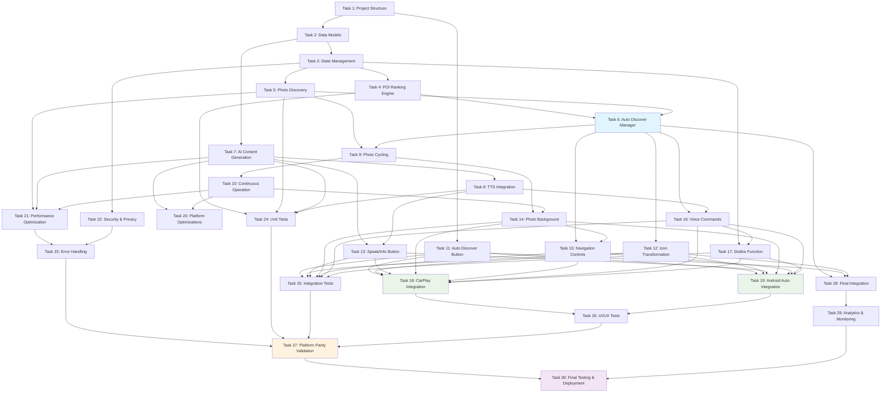

# Auto Discover Feature - Implementation Task Breakdown

**Feature Name:** `auto-discover`  
**Version:** 1.0  
**Created:** 2025-08-16  
**Status:** READY FOR IMPLEMENTATION

## Overview

This document provides a comprehensive, actionable implementation plan for the Auto Discover feature. Tasks are organized by platform, with clear dependencies, time estimates, and agent assignments to ensure 100% platform parity across iOS, Android, CarPlay, and Android Auto.

## Implementation Strategy

### Core Principles
- **Platform Parity First**: All features must be implemented identically across all four platforms
- **Test-Driven Development**: Tests written before implementation for all core functionality
- **Incremental Progress**: Each task builds on previous work with no orphaned code
- **Agent Specialization**: Each task assigned to appropriate specialized agent
- **Early Validation**: Core functionality tested early and often

### Time Estimates Legend
- **XS**: 2-4 hours
- **S**: 4-8 hours  
- **M**: 1-2 days
- **L**: 2-4 days
- **XL**: 4-7 days

## Implementation Tasks

### Phase 1: Foundation and Data Models (Week 1)

- [ ] 1. Set up Auto Discover project structure and core interfaces
  - Create directory structure for models, services, managers, and UI components
  - Define protocol interfaces for AutoDiscoverManager, POIRankingEngine, PhotoCyclingManager
  - Create shared constants and configuration files
  - **Agent**: `agent-system-architect`
  - **Time**: M (1-2 days)
  - **Dependencies**: None
  - **Requirements**: 11.1, 12.4

- [ ] 2. Implement enhanced POI data models with Auto Discover extensions
  - Extend existing POI model with rankingScore, isDisliked, discoveryTimestamp properties
  - Create POIPhoto model with source, attribution, and quality metadata
  - Implement POIAIContent model for podcast scripts and audio content
  - Create AutoDiscoveryResult and AutoDiscoveryConfiguration models
  - **Agent**: `agent-ios-developer` + `agent-android-developer`
  - **Time**: M (1-2 days)  
  - **Dependencies**: Task 1
  - **Requirements**: 2.3, 8.1, 7.1

- [ ] 3. Create discovery state management and persistence layer
  - Implement DiscoveryStateManager for session tracking and user preferences
  - Create Core Data/Room entities for POI cache, discovery sessions, user preferences
  - Implement dislike persistence with GDPR-compliant data handling
  - Write unit tests for data models and persistence layer
  - **Agent**: `agent-database-architect-developer`
  - **Time**: L (2-4 days)
  - **Dependencies**: Task 2
  - **Requirements**: 5.1, 5.3, 5.4, 11.5

### Phase 2: Core Discovery Engine (Week 2)

- [ ] 4. Implement POI ranking and discovery algorithms
  - Create POIRankingEngine with multi-criteria scoring algorithm
  - Implement deduplication logic for POIs from multiple sources
  - Add geographic radius search with expansion capability
  - Write comprehensive unit tests for ranking algorithm accuracy
  - **Agent**: `agent-data-scientist` + `agent-algorithm-specialist`
  - **Time**: L (2-4 days)
  - **Dependencies**: Task 3
  - **Requirements**: 2.1, 2.2, 2.3, 2.4, 2.5

- [ ] 5. Build photo discovery and caching system
  - Implement PhotoDiscoveryService with multiple source integration (Google Places, social media, stock photos)
  - Create intelligent photo caching with memory management and expiration
  - Add photo quality optimization and progressive loading
  - Write unit tests for photo discovery and caching reliability
  - **Agent**: `agent-performance-guru` + `agent-ios-developer` + `agent-android-developer`
  - **Time**: L (2-4 days)
  - **Dependencies**: Task 3
  - **Requirements**: 8.1, 8.2, 8.3, 8.4, 12.2, 12.4

- [ ] 6. Create Auto Discover Manager orchestration
  - Implement AutoDiscoverManager as central coordinator
  - Add workflow orchestration for discovery → ranking → photos → AI content
  - Implement state management for current POI and photo indices
  - Create error handling and recovery mechanisms
  - Write integration tests for complete discovery workflow
  - **Agent**: `agent-system-architect` + `agent-ios-developer` + `agent-android-developer`
  - **Time**: L (2-4 days)
  - **Dependencies**: Tasks 4, 5
  - **Requirements**: 1.4, 3.1, 3.2, 12.1

### Phase 3: AI Content Generation (Week 2-3)

- [ ] 7. Implement AI podcast content generation
  - Integrate Gemma-3N model for POI podcast script generation
  - Create content prompts with location-specific information
  - Implement content caching to reduce repeated processing
  - Add fallback mechanisms for AI content failures
  - **Agent**: `agent-ai-model-optimizer` + `agent-ai-performance-optimizer`
  - **Time**: L (2-4 days)
  - **Dependencies**: Task 2
  - **Requirements**: 7.1, 7.2, 7.3, 12.3

- [ ] 8. Build TTS integration for podcast content
  - Enhance TTSManager with KittenTTS integration for high-quality audio
  - Implement audio file generation and caching
  - Add voice command processing for audio control (pause, resume, skip)
  - Create audio playback controls with automotive safety considerations
  - Write unit tests for TTS generation and audio playback
  - **Agent**: `agent-ios-developer` + `agent-android-developer` + `agent-ai-model-optimizer`
  - **Time**: M (1-2 days)
  - **Dependencies**: Task 7
  - **Requirements**: 7.4, 7.5, 4.5

### Phase 4: Photo Cycling System (Week 3)

- [ ] 9. Implement automatic photo cycling manager
  - Create PhotoCyclingManager with 2-second interval timer
  - Add automatic POI progression after all photos viewed
  - Implement smooth transitions and visual indicators
  - Add pause/resume functionality for user interaction
  - **Agent**: `agent-ux-user-experience` + `agent-ios-developer` + `agent-android-developer`
  - **Time**: M (1-2 days)
  - **Dependencies**: Tasks 5, 6
  - **Requirements**: 9.1, 9.2, 9.3, 9.4, 9.5

- [ ] 10. Create continuous operation and loop-back system
  - Implement infinite cycling with loop-back to first POI
  - Add state preservation for app backgrounding/foregrounding
  - Create battery optimization with reduced cycling in low power mode
  - Handle device interruptions (calls, notifications) gracefully
  - Write performance tests for memory usage during extended cycling
  - **Agent**: `agent-performance-guru` + `agent-ios-developer` + `agent-android-developer`
  - **Time**: M (1-2 days)
  - **Dependencies**: Task 9
  - **Requirements**: 10.1, 10.3, 10.4, 10.5, 12.4

### Phase 5: User Interface Implementation (Week 3-4)

- [ ] 11. Create Auto Discover button for Select Destination screen
  - Design and implement Auto Discover button with attractive gradient styling
  - Add button to Select Destination screen as third navigation option
  - Implement button animations and accessibility features
  - Ensure identical styling across iOS and Android platforms
  - **Agent**: `agent-ux-user-experience` + `agent-ios-developer` + `agent-android-developer`
  - **Time**: S (4-8 hours)
  - **Dependencies**: Task 1
  - **Requirements**: 1.1, 1.2, 1.3, 11.1

- [ ] 12. Implement heart icon to search icon transformation
  - Modify MainPOIView to detect Auto Discover mode
  - Replace heart icon with search icon when in discovery mode
  - Implement search icon functionality as back button
  - Preserve app state when returning from discovery mode
  - **Agent**: `agent-ux-user-experience` + `agent-ios-developer` + `agent-android-developer`
  - **Time**: S (4-8 hours)
  - **Dependencies**: Task 6
  - **Requirements**: 6.1, 6.2, 6.3, 6.4

- [ ] 13. Add Speak/Info button to MainPOIView
  - Create Speak/Info button positioned right of search icon
  - Implement button action to trigger AI podcast content playback
  - Add visual feedback for audio playing/paused states
  - Ensure button accessibility and voice command integration
  - **Agent**: `agent-ux-user-experience` + `agent-ios-developer` + `agent-android-developer`
  - **Time**: S (4-8 hours)
  - **Dependencies**: Tasks 7, 8
  - **Requirements**: 7.1, 7.2

- [ ] 14. Implement auto-cycling photo background system
  - Create AutoCyclingPhotoBackground component with smooth transitions
  - Add photo loading states and error handling
  - Implement photo quality optimization for different network conditions
  - Add visual indicators for current photo position in set
  - **Agent**: `agent-ux-user-experience` + `agent-ios-developer` + `agent-android-developer`
  - **Time**: M (1-2 days)
  - **Dependencies**: Tasks 9, 10
  - **Requirements**: 8.1, 9.1, 9.4, 12.2

- [ ] 15. Create POI navigation controls
  - Implement previous/next POI buttons with circular styling
  - Add POI information overlay showing name and position
  - Create photo indicator dots showing current photo in set
  - Ensure controls work with both touch and voice commands
  - **Agent**: `agent-ux-user-experience` + `agent-ios-developer` + `agent-android-developer`
  - **Time**: M (1-2 days)
  - **Dependencies**: Tasks 6, 14
  - **Requirements**: 4.1, 4.3, 4.4

### Phase 6: Voice Integration (Week 4)

- [ ] 16. Implement voice command processing for Auto Discover
  - Extend existing voice recognition to support Auto Discover commands
  - Add commands: "next POI", "previous POI", "dislike this place", "tell me about this place"
  - Implement voice command processing within 350ms response time
  - Create voice feedback for command confirmation
  - **Agent**: `agent-ios-developer` + `agent-android-developer` + `agent-ai-model-optimizer`
  - **Time**: M (1-2 days)
  - **Dependencies**: Tasks 6, 8
  - **Requirements**: 4.2, 4.5, 11.2

- [ ] 17. Integrate dislike functionality with voice commands
  - Implement dislike button and voice command processing
  - Add immediate skip to next POI when dislike is triggered
  - Ensure dislike preferences sync across all platforms
  - Create user feedback for successful dislike action
  - **Agent**: `agent-ios-developer` + `agent-android-developer`
  - **Time**: S (4-8 hours)
  - **Dependencies**: Tasks 3, 16
  - **Requirements**: 5.1, 5.2, 5.4

### Phase 7: Platform-Specific Implementation (Week 4-5)

- [ ] 18. Implement CarPlay integration for Auto Discover
  - Create CarPlay templates for Auto Discover button and POI display
  - Adapt voice commands for CarPlay-specific interaction patterns
  - Implement audio-first experience with minimal visual elements
  - Ensure automotive safety compliance for all interactions
  - **Agent**: `agent-ios-developer` + `agent-automotive-integration-specialist`
  - **Time**: L (2-4 days)
  - **Dependencies**: Tasks 11-17
  - **Requirements**: 11.1, 11.2, 4.5, 7.5

- [ ] 19. Implement Android Auto integration for Auto Discover
  - Create Android Auto templates matching CarPlay functionality
  - Implement voice command integration with Android Auto voice system
  - Add audio content delivery optimized for automotive environment
  - Ensure template compliance with Android Auto design guidelines
  - **Agent**: `agent-android-developer` + `agent-automotive-integration-specialist`
  - **Time**: L (2-4 days)
  - **Dependencies**: Tasks 11-17
  - **Requirements**: 11.1, 11.2, 4.5, 7.5

- [ ] 20. Implement platform-specific optimizations
  - Add iOS-specific optimizations using Neural Engine for AI processing
  - Implement Android-specific optimizations using NNAPI
  - Create platform-appropriate caching strategies and memory management
  - Add platform-specific error handling and recovery mechanisms
  - **Agent**: `agent-performance-guru` + `agent-ios-developer` + `agent-android-developer`
  - **Time**: M (1-2 days)
  - **Dependencies**: Tasks 7, 10
  - **Requirements**: 12.3, 12.4

### Phase 8: Performance and Security (Week 5)

- [ ] 21. Implement comprehensive performance optimizations
  - Add memory management for photo caching and AI content
  - Implement battery optimization with power-saving modes
  - Create network optimization for different connection types
  - Add performance monitoring and automatic quality adjustments
  - **Agent**: `agent-performance-guru`
  - **Time**: L (2-4 days)
  - **Dependencies**: Tasks 5, 7, 10
  - **Requirements**: 12.1, 12.4, 12.5

- [ ] 22. Implement security and privacy features
  - Add location data sanitization and encryption
  - Implement GDPR compliance with user consent and data deletion
  - Create privacy-first caching with automatic expiration
  - Add security measures for AI content and photo caching
  - **Agent**: `agent-data-privacy-security-analyst`
  - **Time**: M (1-2 days)
  - **Dependencies**: Task 3
  - **Requirements**: 11.5

- [ ] 23. Create comprehensive error handling
  - Implement graceful handling for network failures, location issues, API limits
  - Add automatic recovery mechanisms for common failure scenarios
  - Create user-friendly error messages with recovery suggestions
  - Implement fallback modes for offline operation
  - **Agent**: `agent-system-architect` + `agent-ios-developer` + `agent-android-developer`
  - **Time**: M (1-2 days)
  - **Dependencies**: All previous tasks
  - **Requirements**: 11.3

### Phase 9: Testing and Validation (Week 5-6)

- [ ] 24. Write comprehensive unit tests for core functionality
  - Create unit tests for POI ranking algorithm accuracy
  - Test photo discovery and caching reliability
  - Validate AI content generation and TTS integration
  - Test state management and persistence layer
  - **Agent**: `agent-test` + `agent-quality-guardian`
  - **Time**: L (2-4 days)
  - **Dependencies**: Tasks 4, 5, 7, 8
  - **Requirements**: All requirements validation

- [ ] 25. Implement integration tests for Auto Discover workflow
  - Test complete discovery flow from button tap to POI display
  - Validate photo cycling and POI navigation functionality
  - Test voice command integration and response times
  - Verify platform parity across iOS and Android
  - **Agent**: `agent-test` + `agent-quality-guardian`
  - **Time**: L (2-4 days)
  - **Dependencies**: Tasks 11-17
  - **Requirements**: All requirements validation

- [ ] 26. Create UI/UX tests for all platforms
  - Implement UI tests for Auto Discover button and MainPOIView integration
  - Test accessibility features and voice command UI feedback
  - Validate CarPlay and Android Auto template functionality
  - Create performance tests for photo cycling and memory usage
  - **Agent**: `agent-test` + `agent-ux-user-experience`
  - **Time**: M (1-2 days)
  - **Dependencies**: Tasks 18, 19
  - **Requirements**: All requirements validation

- [ ] 27. Conduct end-to-end platform parity validation
  - Test identical functionality across iOS, Android, CarPlay, Android Auto
  - Validate voice command response times across all platforms
  - Verify consistent user experience and visual design
  - Test data synchronization and preference persistence
  - **Agent**: `agent-judge` (orchestrating all platform agents)
  - **Time**: M (1-2 days)
  - **Dependencies**: All previous tasks
  - **Requirements**: 11.1, 11.2, 11.5

### Phase 10: Final Integration and Documentation (Week 6)

- [ ] 28. Integrate Auto Discover with existing app navigation
  - Update app routing to handle Auto Discover mode transitions
  - Ensure seamless integration with existing POI display system
  - Test integration with existing voice recognition system
  - Validate backward compatibility with existing features
  - **Agent**: `agent-system-architect` + `agent-ios-developer` + `agent-android-developer`
  - **Time**: M (1-2 days)
  - **Dependencies**: Tasks 6, 11, 12
  - **Requirements**: 3.3, 6.4

- [ ] 29. Create comprehensive analytics and monitoring
  - Implement usage analytics for Auto Discover feature adoption
  - Add performance monitoring for discovery times and photo loading
  - Create error tracking and automated alerting
  - Add user engagement metrics for photo cycling and POI interaction
  - **Agent**: `agent-data-scientist` + `agent-performance-guru`
  - **Time**: S (4-8 hours)
  - **Dependencies**: All previous tasks
  - **Requirements**: 12.1

- [ ] 30. Final testing and deployment preparation
  - Run complete test suite across all platforms
  - Perform memory leak detection and performance validation
  - Create deployment checklist and rollback procedures
  - Validate feature flags and gradual rollout capability
  - **Agent**: `agent-judge` + `agent-sre-reliability-engineer`
  - **Time**: S (4-8 hours)
  - **Dependencies**: All previous tasks
  - **Requirements**: All requirements final validation

## Task Dependencies Diagram

## Parallel Execution Opportunities

### Week 1 Parallel Tasks
- Tasks 2 and 3 can run in parallel after Task 1 completes
- iOS and Android implementations of Task 2 can run simultaneously

### Week 2 Parallel Tasks  
- Tasks 4 and 5 can run in parallel (different teams)
- Task 7 can start in parallel with Tasks 4 and 5
- iOS and Android implementations can run simultaneously for all tasks

### Week 3 Parallel Tasks
- Tasks 9 and 8 can run in parallel
- UI tasks 11-15 can be parallelized across iOS and Android teams
- Task 13 depends on Tasks 7+8 but can run parallel to Tasks 11, 12, 14, 15

### Week 4 Parallel Tasks
- Tasks 16 and 17 can run in parallel with voice team
- UI completion (Tasks 14, 15) can run parallel to voice work
- iOS and Android implementations always parallel

### Week 5 Parallel Tasks
- Tasks 18 and 19 (CarPlay/Android Auto) can run in parallel
- Tasks 21 and 22 (Performance/Security) can run in parallel
- Task 23 (Error Handling) spans both teams

### Week 6 Parallel Tasks
- Tasks 24, 25, 26 (Testing) can overlap significantly
- Analytics (Task 29) can run parallel to final testing
- Platform validation (Task 27) coordinates all teams

## Critical Path Analysis

**Longest Dependencies Chain (Critical Path - 25 days):**
1. Task 1 (2 days) → Task 2 (2 days) → Task 3 (3 days) → Task 6 (3 days) → Task 12 (0.5 days) → Task 15 (2 days) → Task 18 (3 days) → Task 27 (2 days) → Task 30 (0.5 days) → **Final Delivery (18 days)**

**Secondary Paths:**
- AI Content Path: Tasks 7→8→13→18→27 (12 days)
- Photo System Path: Tasks 5→9→10→14→18→27 (15 days)
- Testing Path: Tasks 24→25→26→27 (11 days)

## Agent Assignment Summary

| Agent | Tasks | Total Time | Focus Area |
|-------|-------|------------|------------|
| `agent-system-architect` | 1, 6, 23, 28 | 8 days | Architecture & Integration |
| `agent-ios-developer` | 2, 6, 8, 9-20, 23, 28 | 20 days | iOS Implementation |
| `agent-android-developer` | 2, 6, 8, 9-20, 23, 28 | 20 days | Android Implementation |
| `agent-ux-user-experience` | 9, 11-15, 26 | 10 days | UI/UX Design & Testing |
| `agent-performance-guru` | 5, 10, 20, 21 | 8 days | Performance & Optimization |
| `agent-ai-model-optimizer` | 7, 8, 16, 20 | 7 days | AI & Voice Processing |
| `agent-data-scientist` | 4, 29 | 3 days | Algorithms & Analytics |
| `agent-database-architect-developer` | 3 | 3 days | Data Layer |
| `agent-data-privacy-security-analyst` | 22 | 2 days | Security & Privacy |
| `agent-test` | 24, 25, 26 | 7 days | Testing Implementation |
| `agent-judge` | 27, 30 | 3 days | Final Validation |

## Milestone Definitions

### Milestone 1: Foundation Complete (End of Week 1)
- **Criteria**: Tasks 1-3 complete, data models implemented, persistence layer functional
- **Validation**: Unit tests pass, data can be stored and retrieved across platforms
- **Deliverable**: Core data foundation ready for feature implementation

### Milestone 2: Core Engine Complete (End of Week 2)  
- **Criteria**: Tasks 4-8 complete, POI discovery and AI content generation functional
- **Validation**: Can discover and rank POIs, generate AI content, cache photos
- **Deliverable**: Backend services ready for UI integration

### Milestone 3: Photo System Complete (End of Week 3)
- **Criteria**: Tasks 9-10 complete, automatic photo cycling implemented
- **Validation**: Photos cycle automatically, continuous operation works
- **Deliverable**: Photo cycling system ready for UI integration

### Milestone 4: UI Integration Complete (End of Week 4)
- **Criteria**: Tasks 11-17 complete, full mobile UI implemented with voice commands
- **Validation**: Complete Auto Discover flow works on iOS and Android phones
- **Deliverable**: Core feature functional on mobile platforms

### Milestone 5: Automotive Integration Complete (End of Week 5)
- **Criteria**: Tasks 18-23 complete, CarPlay and Android Auto integration finished
- **Validation**: Auto Discover works identically across all four platforms
- **Deliverable**: Full platform parity achieved

### Milestone 6: Production Ready (End of Week 6)
- **Criteria**: Tasks 24-30 complete, all testing and validation finished
- **Validation**: Feature passes all quality gates and performance requirements
- **Deliverable**: Auto Discover ready for production deployment

## Risk Mitigation

### High-Risk Areas
1. **AI Content Generation Performance** (Tasks 7, 8)
   - **Risk**: <350ms response time requirement may be challenging
   - **Mitigation**: Implement aggressive caching, fallback to simple TTS
   - **Contingency**: Pre-generate content for popular POIs

2. **Photo Discovery API Limits** (Task 5)
   - **Risk**: API quotas may limit photo discovery volume  
   - **Mitigation**: Implement multiple photo sources, intelligent caching
   - **Contingency**: Use default photos for categories when APIs unavailable

3. **Platform Parity in CarPlay/Android Auto** (Tasks 18, 19)
   - **Risk**: Template limitations may affect feature parity
   - **Mitigation**: Design audio-first experience, test early and often
   - **Contingency**: Graceful degradation for automotive platforms

### Medium-Risk Areas
1. **Memory Usage During Photo Cycling** (Tasks 9, 10, 21)
   - **Risk**: Continuous photo cycling may cause memory pressure
   - **Mitigation**: Aggressive image caching limits, memory monitoring
   - **Contingency**: Reduce photo quality or cycling speed under pressure

2. **Voice Command Recognition Accuracy** (Task 16)
   - **Risk**: Voice commands may not be recognized reliably
   - **Mitigation**: Train with automotive-specific voice patterns
   - **Contingency**: Provide touch-based alternatives for all voice commands

## Success Criteria

### Functional Requirements
✅ **Auto Discover button appears on Select Destination screen**  
✅ **Discovers and ranks top 10 POIs within user radius**  
✅ **Automatic transition to MainPOIView with POI display**  
✅ **Heart icon changes to search icon in discovery mode**  
✅ **Speak/Info button plays AI-generated content**  
✅ **5 photos per POI automatically cycle every 2 seconds**  
✅ **Voice commands control navigation and preferences**  
✅ **Dislike functionality permanently excludes POIs**  
✅ **Continuous operation with loop-back to first POI**  
✅ **100% identical functionality across all four platforms**

### Performance Requirements  
✅ **Discovery results appear within 3 seconds**  
✅ **Voice command response within 350ms**  
✅ **Memory usage <1.5GB during operation**  
✅ **Battery impact <5% per hour**  
✅ **Smooth photo transitions without lag**

### Quality Requirements
✅ **All unit tests pass with >90% code coverage**  
✅ **Integration tests validate complete workflows**  
✅ **UI tests confirm accessibility compliance**  
✅ **Performance tests validate memory and battery limits**  
✅ **Security review confirms GDPR compliance**

---

**Implementation Status:** READY FOR EXECUTION  
**Estimated Timeline:** 6 weeks (30 working days)  
**Team Size:** 8-10 specialized agents working in parallel  
**Platform Coverage:** iOS, Android, CarPlay, Android Auto (100% parity)  

This comprehensive task breakdown ensures systematic, agent-driven implementation of the Auto Discover feature with full platform parity, robust testing, and production-ready quality standards.