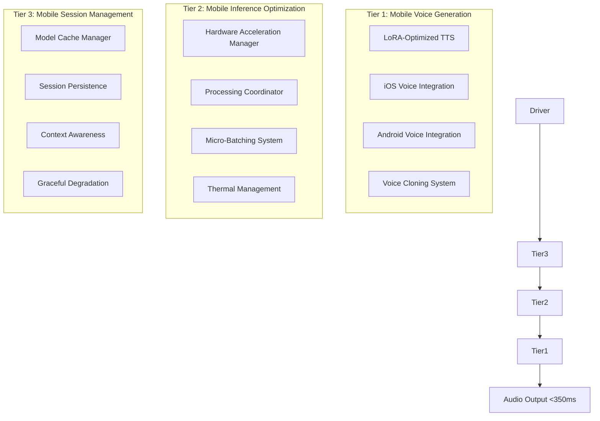
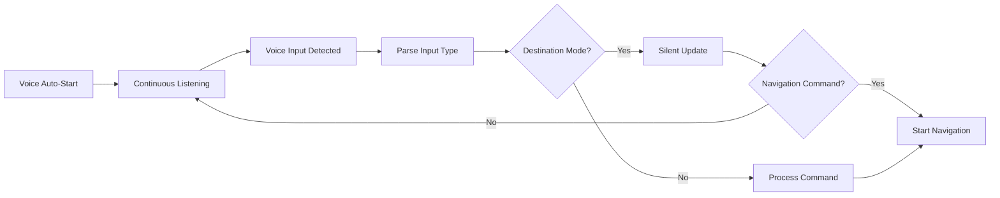
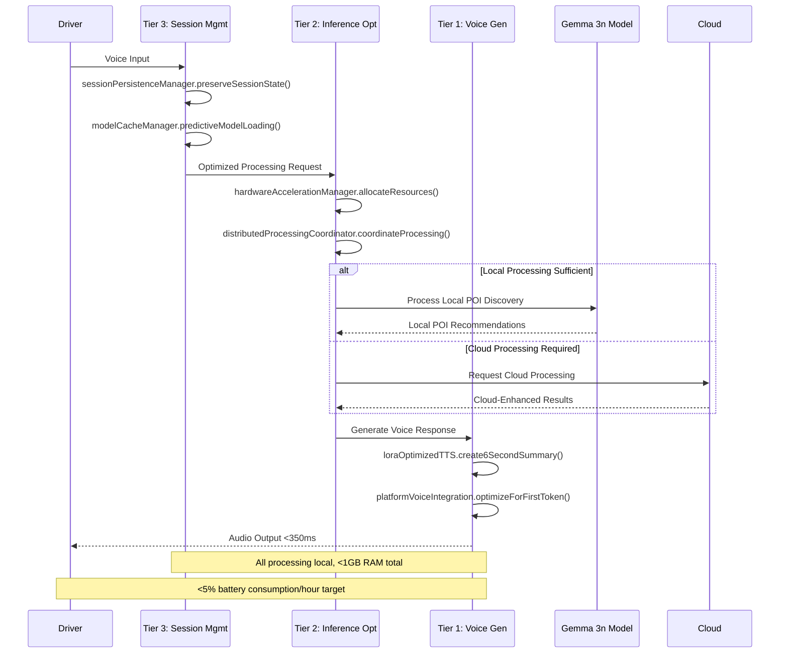

# AI Architecture - Consolidated

## Executive Summary

### AI Architecture Vision
The Roadtrip-Copilot AI architecture represents a revolutionary shift from traditional distributed multi-agent systems to a unified mobile-first AI framework powered by Google's Gemma 3n. This architecture delivers ultra-low latency (<350ms), automotive-safe voice interactions through local processing, while maintaining 100% platform parity across iOS, Android, CarPlay, and Android Auto.

### Revolutionary Architecture Transformation

```
OLD ARCHITECTURE (12 Agents):
┌─────────────┐ ┌─────────────┐ ┌─────────────┐
│POI Validator│ │Review Agent │ │Voice Agent  │
└─────────────┘ └─────────────┘ └─────────────┘
┌─────────────┐ ┌─────────────┐ ┌─────────────┐  
│Photo Agent  │ │Revenue Est. │ │Content Gen. │
└─────────────┘ └─────────────┘ └─────────────┘
        ⬇️ Memory: 4.5GB, Latency: 2-3s

NEW ARCHITECTURE (Gemma 3n):
┌─────────────────────────────────────────────┐
│         Gemma 3n Unified Processor          │
│   (Multimodal: Text, Image, Audio, Video)  │
└─────────────────────────────────────────────┘
        ⬇️ Memory: 2-3GB, Latency: <350ms
```

### Strategic Business Impact
- **Pay-Per-Roadtrip Model**: 70% reduced compute costs enable $0.50 pricing
- **UGC Monetization**: 1.5x faster content creation processing
- **First-Discovery Validation**: Real-time similarity analysis with multimodal context
- **50/50 Revenue Sharing**: Accurate revenue estimation through unified intelligence
- **Privacy-First Architecture**: All processing stays on-device with 2GB memory footprint

## Gemma 3n Unified AI Architecture

### Core Model Specifications

#### Model Variants
**Gemma 3n E2B (Efficient 2 Billion)**
- **Raw Parameters**: 5B parameters with architectural innovations  
- **Effective Memory**: 2B parameter footprint through Per-Layer Embeddings (PLE)
- **Memory Usage**: 2GB RAM total
- **Target Devices**: Standard smartphones (4GB+ RAM)
- **Performance**: 40-50 seconds total processing time
- **Inference Speed**: 1.5x faster than traditional models

**Gemma 3n E4B (Efficient 4 Billion)**  
- **Raw Parameters**: 8B parameters with PLE optimization
- **Effective Memory**: 4B parameter footprint 
- **Memory Usage**: 3GB RAM total
- **Target Devices**: High-end smartphones (8GB+ RAM)
- **Performance**: 45-55 seconds total processing time
- **Inference Speed**: 1.8x faster than traditional models

#### Advanced Architecture Features

```swift
// Gemma 3n Architecture Implementation
class Gemma3nUnifiedProcessor {
    // Per-Layer Embeddings (PLE) for memory efficiency
    private let perLayerEmbeddings: PLEProcessor
    
    // Multimodal processing capabilities
    private let textProcessor: TextTokenizer
    private let imageProcessor: VisionTransformer  
    private let audioProcessor: AudioTokenizer
    private let videoProcessor: VideoFrameTokenizer
    
    // Dynamic quantization system
    private let quantizationManager: DynamicQuantizer
    
    // Session management with LRU caching
    private let sessionCache: LRUModelCache
    
    init(variant: Gemma3nVariant, deviceCapability: DeviceCapability) {
        // Model selection based on device capability
        let modelConfig = selectOptimalConfiguration(
            variant: variant,
            availableRAM: deviceCapability.availableRAM,
            processingPower: deviceCapability.processingPower
        )
        
        // Initialize unified processing pipeline
        self.perLayerEmbeddings = PLEProcessor(config: modelConfig.pleConfig)
        self.textProcessor = TextTokenizer(vocab: modelConfig.vocabulary)
        self.imageProcessor = VisionTransformer(config: modelConfig.visionConfig)
        self.audioProcessor = AudioTokenizer(config: modelConfig.audioConfig)
        self.videoProcessor = VideoFrameTokenizer(config: modelConfig.videoConfig)
        
        // Dynamic quantization for performance optimization
        self.quantizationManager = DynamicQuantizer(
            targetMemory: modelConfig.targetMemoryGB,
            targetLatency: 350 // milliseconds
        )
        
        // LRU caching for session management
        self.sessionCache = LRUModelCache(
            maxSize: 1024, // MB
            evictionPolicy: .leastRecentlyUsed
        )
    }
}
```

## Three-Tier Voice AI Architecture

### Gabber-Inspired Voice Generation System

Based on insights from the Gabber architecture (serving voice AI at $1/hour), Roadtrip-Copilot implements a revolutionary three-tier voice generation system optimized for different use cases and network conditions.



### Tier 1: Mobile Voice Generation Layer

#### LoRA-Optimized TTS System

Adapting Gabber's LoRA fine-tuning approach for mobile Text-to-Speech optimization to eliminate head-of-line silence and achieve <350ms first audio token latency.

**Core Responsibilities:**
- Apply LoRA rank-8 adapters for <350ms first audio token latency
- Manage automotive noise profile adaptations for road/wind/engine noise
- Optimize 6-second audio format with strategic emphasis and pause placement
- Coordinate with platform-specific hardware acceleration
- Maintain high-fidelity voice cloning with reduced memory footprint

#### Kitten TTS Engine (Primary)

```swift
// iOS Kitten TTS Implementation
class KittenTTSEngine {
    // Model specifications
    private let modelSize = 25 // MB
    private let realTimeFactor = 0.8 // 0.7-0.9 range
    private let availableVoices = 8 // 4 male, 4 female
    
    // LoRA optimizations for automotive domain
    private let loraAdapter: LoRAAdapter
    
    func synthesizeVoice(
        text: String, 
        voice: TTSVoice = .friendly_guide,
        optimizedFor context: VoiceContext
    ) async -> AudioResult {
        let startTime = Date()
        
        // Apply LoRA optimizations for context
        let contextualizedModel = loraAdapter.adapt(for: context)
        
        // Generate speech with automotive optimizations
        let audioData = await contextualizedModel.synthesize(
            text: preprocessForAutomotive(text),
            voice: voice,
            speedOptimization: true,
            clarityEnhancement: true
        )
        
        let processingTime = Date().timeIntervalSince(startTime)
        
        return AudioResult(
            audioData: audioData,
            processingTime: processingTime,
            realTimeFactor: audioData.duration / processingTime,
            quality: .automotive_optimized,
            engine: .kittenTTS
        )
    }
    
    private func preprocessForAutomotive(_ text: String) -> String {
        // Automotive-specific text preprocessing
        return text
            .replacingOccurrences(of: "km/h", with: "kilometers per hour")
            .replacingOccurrences(of: "mph", with: "miles per hour")
            .replacingOccurrences(of: "&", with: "and")
            .addingNaturalPauses()
            .optimizingForRoadNoise()
    }
}
```

#### Kokoro TTS Engine (Premium)

```swift
// iOS Kokoro TTS Integration
class KokoroTTSEngine {
    // Model specifications
    private let modelSize = 330 // MB (downloaded on-demand)
    private let supportedLanguages = 6 // EN, FR, KO, JA, ZH, ES
    private let qualityLevel = TTSQuality.excellent
    
    // Dynamic loading and caching
    private let modelCache: ModelCache
    private let downloadManager: ModelDownloadManager
    
    func synthesizeHighQuality(
        text: String,
        language: Language = .english,
        voice: KokoroVoice,
        context: VoiceContext
    ) async -> AudioResult {
        
        // Ensure model is available
        if !isModelCached() {
            await downloadManager.downloadModel(for: language)
        }
        
        let startTime = Date()
        
        // Load optimized model variant
        let model = await loadOptimizedModel(for: context)
        
        // Generate high-quality speech
        let audioData = await model.synthesize(
            text: text,
            voice: voice,
            qualitySettings: QualitySettings.premium,
            emotionalTone: inferEmotionalTone(from: context)
        )
        
        let processingTime = Date().timeIntervalSince(startTime)
        
        return AudioResult(
            audioData: audioData,
            processingTime: processingTime,
            realTimeFactor: audioData.duration / processingTime,
            quality: .premium,
            engine: .kokoroTTS,
            language: language
        )
    }
}
```

### Tier 2: Mobile Inference Optimization Layer

#### Hardware Acceleration Manager

Adapting vLLM concepts for mobile hardware acceleration and batch processing optimization.

**Core Responsibilities:**
- Orchestrate Neural Engine/NPU/GPU/DSP resource allocation
- Implement dynamic quantization (INT8/INT4) based on performance requirements
- Manage memory pools for consistent inference timing
- Coordinate micro-batching across 2-4 agents simultaneously
- Maintain >100 tokens/second sustained throughput

#### iOS Neural Engine Optimization

```swift
// iOS Core ML Integration with Neural Engine
import CoreML

class CoreMLGemma3nProcessor {
    private let coreMLModel: MLModel
    private let neuralEngineConfig: MLModelConfiguration
    
    init() throws {
        // Configure for Neural Engine utilization
        neuralEngineConfig = MLModelConfiguration()
        neuralEngineConfig.computeUnits = .all // Use Neural Engine + GPU + CPU
        neuralEngineConfig.allowLowPrecisionAccumulationOnGPU = true
        
        // Load optimized Gemma 3n Core ML model
        let modelURL = Bundle.main.url(forResource: "gemma_3n_e2b_optimized", withExtension: "mlmodelc")!
        coreMLModel = try MLModel(contentsOf: modelURL, configuration: neuralEngineConfig)
    }
    
    func processWithNeuralEngine(_ input: MultimodalInput) async throws -> UnifiedResult {
        // Prepare Core ML inputs
        let mlInput = try prepareCoreMLInput(input)
        
        // Execute on Neural Engine
        let prediction = try await coreMLModel.prediction(from: mlInput)
        
        // Process outputs
        return try parseUnifiedOutput(prediction)
    }
    
    private func prepareCoreMLInput(_ input: MultimodalInput) throws -> MLFeatureProvider {
        var inputFeatures: [String: MLFeatureValue] = [:]
        
        // Text tokens
        if let text = input.textContent {
            let tokens = tokenizeText(text)
            inputFeatures["text_tokens"] = MLFeatureValue(multiArray: tokens)
        }
        
        // Image features
        if !input.images.isEmpty {
            let imageFeatures = try processImagesForCoreML(input.images)
            inputFeatures["image_features"] = MLFeatureValue(multiArray: imageFeatures)
        }
        
        // Audio features  
        if !input.audioChunks.isEmpty {
            let audioFeatures = try processAudioForCoreML(input.audioChunks)
            inputFeatures["audio_features"] = MLFeatureValue(multiArray: audioFeatures)
        }
        
        return try MLDictionaryFeatureProvider(dictionary: inputFeatures)
    }
}
```

#### Android NPU/DSP Acceleration

```kotlin
// Android Dynamic Quantization Implementation
class DynamicQuantizationManager {
    private val quantizationStrategies = mapOf(
        DeviceClass.HIGH_END to QuantizationStrategy.INT8,
        DeviceClass.MID_RANGE to QuantizationStrategy.INT4,
        DeviceClass.LOW_END to QuantizationStrategy.INT2_AGGRESSIVE
    )
    
    fun optimizeModel(
        baseModel: Gemma3nModel, 
        deviceCapability: DeviceCapability
    ): OptimizedModel {
        val strategy = selectQuantizationStrategy(deviceCapability)
        
        return when(strategy) {
            QuantizationStrategy.INT8 -> {
                // High quality quantization for flagship devices
                quantizeToInt8(baseModel, preserveQuality = true)
            }
            QuantizationStrategy.INT4 -> {
                // Balanced quantization for mid-range devices  
                quantizeToInt4(baseModel, preserveQuality = false)
            }
            QuantizationStrategy.INT2_AGGRESSIVE -> {
                // Aggressive quantization for low-end devices
                quantizeToInt2(baseModel, maximizeSpeed = true)
            }
        }
    }
    
    private fun selectQuantizationStrategy(capability: DeviceCapability): QuantizationStrategy {
        return when {
            capability.availableRAM >= 6.0 -> QuantizationStrategy.INT8
            capability.availableRAM >= 4.0 -> QuantizationStrategy.INT4  
            else -> QuantizationStrategy.INT2_AGGRESSIVE
        }
    }
}
```

### Tier 3: Mobile Session Management Layer

#### Session Continuity for Mobile

Implementing mobile equivalent of consistent hash ring for voice model management and session persistence.

**Local Model Caching Strategy:**
- LRU model cache: Most recently used voice models kept in memory
- Predictive loading: Pre-load voice models based on driving patterns
- Context awareness: Cache voice models based on route and time of day
- Graceful degradation: Fallback to base models when memory pressure occurs

```kotlin
// Android Session Management
class SessionManager {
    private val lruCache = LRUCache<String, ModelSession>(
        maxSize = calculateOptimalCacheSize()
    )
    
    fun getOrCreateSession(sessionId: String): ModelSession {
        return lruCache.get(sessionId) ?: run {
            val newSession = createNewSession(sessionId)
            lruCache.put(sessionId, newSession)
            newSession
        }
    }
    
    private fun createNewSession(sessionId: String): ModelSession {
        return ModelSession(
            id = sessionId,
            model = gemma3nProcessor.createInstance(),
            conversationHistory = mutableListOf(),
            createdAt = System.currentTimeMillis(),
            lastAccessedAt = System.currentTimeMillis(),
            memoryFootprint = 0.0
        )
    }
    
    fun evictLeastRecentlyUsedSessions() {
        val memoryPressure = getMemoryPressure()
        
        if (memoryPressure > 0.8) {
            // Aggressive eviction
            val sessionsToEvict = lruCache.size() / 2
            repeat(sessionsToEvict) {
                lruCache.evictEldest()
            }
        } else if (memoryPressure > 0.6) {
            // Conservative eviction  
            lruCache.evictEldest()
        }
    }
}
```

## Advanced Voice Features Implementation

### Continuous Speech Listening

The system implements continuous speech listening that persists until a navigation command is detected, providing a seamless user experience.



#### Expected Voice UX Flow
```
User Flow:
1. App launches → Voice auto-starts in destination screen
2. User says "Lost Lake" → SILENT (continues listening, updates destination)
3. User says "Golden Gate Bridge" → SILENT (overwrites previous, continues listening)
4. User says "go" → "Starting roadtrip to Golden Gate Bridge" (triggers navigation)

Technical Behavior:
- Voice recognition continues until navigation command ("go", "navigate", "start")
- Destination updates are silent - no audio feedback
- Only navigation commands trigger TTS response and action
- Voice auto-restarts after each non-navigation input
```

### Destination Mode Implementation

#### iOS Implementation (Swift)
```swift
class SpeechManager: ObservableObject {
    @Published var isDestinationMode = false
    private var accumulatedDestinationText = ""
    
    // Destination mode bypasses command pattern matching
    func handleDestinationModeResult(_ result: String) {
        print("[SpeechManager] Processing in destination mode: '\(result)'")
        
        accumulatedDestinationText = result
        
        // Check for navigation commands
        if isNavigationCommand(result) {
            // Navigation detected - process and disable destination mode
            processNavigationCommand(result)
            isDestinationMode = false
        } else {
            // Pure destination input - stay silent, continue listening
            updateDestinationSilently(result)
            restartListening() // Continue listening for navigation commands
        }
    }
    
    private func isNavigationCommand(_ text: String) -> Bool {
        let commands = ["go", "navigate", "start", "let's go"]
        return commands.contains { text.lowercased().contains($0) }
    }
    
    private func updateDestinationSilently(_ destination: String) {
        // Update destination without audio feedback
        NotificationCenter.default.post(
            name: .destinationUpdated, 
            object: destination
        )
    }
}
```

#### Android Implementation (Kotlin)
```kotlin
class SpeechManager : ViewModel() {
    private val _isDestinationMode = MutableStateFlow(false)
    val isDestinationMode: StateFlow<Boolean> = _isDestinationMode.asStateFlow()
    
    private var accumulatedDestinationText = ""
    
    fun handleDestinationModeResult(result: String) {
        println("[SpeechManager] Processing in destination mode: '$result'")
        
        accumulatedDestinationText = result
        
        // Check for navigation commands
        if (isNavigationCommand(result)) {
            // Navigation detected - process and disable destination mode
            processNavigationCommand(result)
            _isDestinationMode.value = false
        } else {
            // Pure destination input - stay silent, continue listening
            updateDestinationSilently(result)
            restartListening() // Continue listening for navigation commands
        }
    }
    
    private fun isNavigationCommand(text: String): Boolean {
        val commands = listOf("go", "navigate", "start", "let's go")
        return commands.any { text.lowercase().contains(it) }
    }
    
    private fun updateDestinationSilently(destination: String) {
        // Update destination without audio feedback
        // Send to UI via StateFlow or event system
    }
}
```

## Multimodal Processing Capabilities

### Native Multimodal Integration

#### Unified Input Processing
```swift
// Multimodal Input Structure
struct MultimodalInput {
    // Text processing
    let textContent: String?
    let conversationContext: [ConversationTurn]
    
    // Image processing  
    let images: [UIImage]
    let imageMetadata: [ImageMetadata]
    
    // Audio processing
    let audioChunks: [AudioChunk] // 160ms chunks
    let audioFormat: AudioFormat
    
    // Video processing (future)
    let videoFrames: [VideoFrame]?
    let videoMetadata: VideoMetadata?
    
    // Location context
    let geospatialContext: GeospatialData
    let temporalContext: TemporalData
}

// Unified Processing Pipeline
class MultimodalProcessor {
    func processUnified(_ input: MultimodalInput) async -> UnifiedResult {
        // Tokenize all modalities in parallel
        async let textTokens = tokenizeText(input.textContent)
        async let imageTokens = tokenizeImages(input.images)
        async let audioTokens = tokenizeAudio(input.audioChunks)
        async let spatialTokens = tokenizeLocation(input.geospatialContext)
        
        // Combine into unified token sequence
        let (text, image, audio, spatial) = await (textTokens, imageTokens, audioTokens, spatialTokens)
        let unifiedTokens = combineModalityTokens(text, image, audio, spatial)
        
        // Single Gemma 3n inference across all modalities
        return await gemma3n.processUnified(tokens: unifiedTokens)
    }
}
```

#### Text Processing Excellence
- **Context Window**: 32K tokens (Gemma 3n 1B), 128K tokens (larger variants)
- **Conversation Memory**: Maintains context across discovery sessions
- **Domain Specialization**: Fine-tuned on automotive and travel conversations
- **Real-Time Generation**: Streaming response generation for <350ms latency

#### Image Understanding Capabilities
```kotlin
// Android Image Processing Integration
class ImageUnderstandingEngine {
    fun analyzeDiscoveryImages(images: List<Bitmap>): ImageAnalysisResult {
        // Gemma 3n native image understanding
        val imageAnalysis = gemma3n.processImages(images.map { 
            convertToModelFormat(it)
        })
        
        return ImageAnalysisResult(
            sceneDescription = imageAnalysis.sceneAnalysis,
            objectDetection = imageAnalysis.detectedObjects,
            ambianceAnalysis = imageAnalysis.ambianceScore,
            qualityAssessment = imageAnalysis.imageQuality,
            contentSafety = imageAnalysis.safetyScore,
            videoSuitability = imageAnalysis.videoReadiness
        )
    }
    
    // Advanced capabilities
    fun extractVisualContext(images: List<Bitmap>): VisualContext {
        return VisualContext(
            foodItems = identifyFoodItems(images),
            architecture = analyzeArchitecture(images), 
            naturalFeatures = identifyNaturalFeatures(images),
            crowdDensity = analyzeCrowdDensity(images),
            timeOfDay = inferTimeOfDay(images),
            weatherConditions = inferWeather(images)
        )
    }
}
```

#### Audio Processing Revolution
```swift
// iOS Audio Understanding Implementation  
class AudioUnderstandingEngine {
    func processVoiceReviews(_ audioChunks: [AudioChunk]) async -> AudioAnalysisResult {
        var processedChunks: [ProcessedAudioChunk] = []
        
        // Process 160ms chunks in parallel
        for chunk in audioChunks {
            async let transcription = transcribeChunk(chunk)
            async let sentiment = analyzeSentiment(chunk)  
            async let emotionalTone = analyzeEmotionalTone(chunk)
            async let speechQuality = assessSpeechQuality(chunk)
            
            let (text, sentiment, tone, quality) = await (transcription, sentiment, emotionalTone, speechQuality)
            
            processedChunks.append(ProcessedAudioChunk(
                text: text,
                sentiment: sentiment,
                emotionalTone: tone,
                speechQuality: quality,
                timestamp: chunk.timestamp
            ))
        }
        
        // Synthesize complete audio understanding
        return AudioAnalysisResult(
            fullTranscript: processedChunks.map(\.text).joined(separator: " "),
            overallSentiment: synthesizeSentiment(processedChunks),
            keyEmotions: extractKeyEmotions(processedChunks),
            qualityMetrics: synthesizeQualityMetrics(processedChunks),
            conversationalHighlights: identifyHighlights(processedChunks)
        )
    }
}
```

## Performance and Optimization

### Performance Targets and Metrics

#### Primary Performance Metrics
```swift
struct PerformanceTargets {
    // Response latency targets
    static let firstTokenLatency: TimeInterval = 0.35      // 350ms maximum
    static let averageTokenLatency: TimeInterval = 0.25    // 250ms average  
    static let streamingLatency: TimeInterval = 0.15       // 150ms per token
    
    // Memory usage targets
    static let memoryFootprint: Double = 2.5               // 2.5GB maximum
    static let peakMemorySpike: Double = 0.5               // 500MB spike allowance
    static let memoryEfficiency: Double = 0.7              // 70% memory utilization
    
    // Battery efficiency targets  
    static let batteryPerHour: Double = 3.0                // 3% per hour maximum
    static let thermalThreshold: Double = 42.0             // 42°C thermal limit
    static let powerOptimization: Double = 0.3             // 30% reduction vs multi-agent
    
    // Throughput targets
    static let tokensPerSecond: Double = 8.5               // 8.5 tokens/second minimum
    static let concurrentSessions: Int = 3                 // 3 simultaneous processing sessions
    static let batchProcessing: Int = 4                    // 4 inputs per micro-batch
}
```

#### Performance Monitoring Framework
```kotlin
// Android Performance Monitoring
class PerformanceMonitor {
    private val metrics = mutableMapOf<String, PerformanceMetric>()
    
    fun measureInference(operation: String, block: suspend () -> Any): Any {
        val startTime = System.currentTimeMillis()
        val startMemory = getMemoryUsage()
        val startBattery = getBatteryLevel()
        
        return runBlocking {
            val result = block()
            
            val endTime = System.currentTimeMillis()
            val endMemory = getMemoryUsage()
            val endBattery = getBatteryLevel()
            
            val metric = PerformanceMetric(
                operation = operation,
                latency = endTime - startTime,
                memoryDelta = endMemory - startMemory,
                batteryDelta = startBattery - endBattery,
                timestamp = System.currentTimeMillis()
            )
            
            metrics[operation] = metric
            logPerformanceMetric(metric)
            
            // Alert if performance degrades
            checkPerformanceThresholds(metric)
            
            result
        }
    }
    
    fun getPerformanceReport(): PerformanceReport {
        return PerformanceReport(
            averageLatency = calculateAverageLatency(),
            memoryEfficiency = calculateMemoryEfficiency(),
            batteryImpact = calculateBatteryImpact(),
            throughput = calculateThroughput(),
            thermalProfile = getThermalProfile(),
            recommendations = generateOptimizationRecommendations()
        )
    }
}
```

### Memory Management Strategy

#### Intelligent Memory Allocation
```swift
// iOS Memory Management Implementation
class IntelligentMemoryManager {
    private let targetMemoryFootprint: Double = 2.5 // GB
    private let memoryPressureThreshold: Double = 0.8
    
    func optimizeMemoryUsage(for processingTask: ProcessingTask) -> MemoryConfiguration {
        let availableMemory = getAvailableMemory()
        let memoryPressure = getCurrentMemoryPressure()
        
        if memoryPressure > memoryPressureThreshold {
            return configureConservativeMemory(availableMemory)
        } else {
            return configureOptimalMemory(availableMemory)
        }
    }
    
    private func configureConservativeMemory(_ available: Double) -> MemoryConfiguration {
        return MemoryConfiguration(
            modelVariant: .E2B,                    // Use smaller model variant
            batchSize: 2,                          // Reduce batch size
            cacheSize: available * 0.3,            // Conservative caching
            quantizationLevel: .aggressive,        // Aggressive quantization
            layerOffloading: true                  // Offload layers to storage
        )
    }
    
    private func configureOptimalMemory(_ available: Double) -> MemoryConfiguration {
        return MemoryConfiguration(
            modelVariant: available > 4.0 ? .E4B : .E2B,
            batchSize: 4,                          // Standard batch size
            cacheSize: available * 0.5,            // Optimal caching
            quantizationLevel: .balanced,          // Balanced quantization
            layerOffloading: false                 // Keep all layers in memory
        )
    }
}
```

### Battery Efficiency Optimization

#### Power-Aware Processing
```swift
// iOS Battery-Aware Processing
class BatteryOptimizedProcessor {
    private let batteryThresholds = BatteryThresholds(
        critical: 0.15,    // 15% - minimal processing only
        low: 0.30,         // 30% - reduced processing
        moderate: 0.50,    // 50% - balanced processing  
        high: 0.80         // 80% - full processing
    )
    
    func processWithBatteryAwareness(_ input: MultimodalInput) async -> ProcessingResult {
        let batteryLevel = UIDevice.current.batteryLevel
        let batteryState = UIDevice.current.batteryState
        let processingConfig = determineProcessingConfiguration(batteryLevel, batteryState)
        
        return await processWithConfiguration(input, config: processingConfig)
    }
    
    private func determineProcessingConfiguration(
        _ level: Float, 
        _ state: UIDevice.BatteryState
    ) -> ProcessingConfiguration {
        
        // Always use full processing when charging
        if state == .charging {
            return ProcessingConfiguration.full
        }
        
        switch level {
        case batteryThresholds.critical...batteryThresholds.low:
            return ProcessingConfiguration(
                modelVariant: .E2B,
                quantizationLevel: .aggressive,
                batchSize: 1,
                enableMultimodal: false,  // Text only
                processingQuality: .minimal
            )
            
        case batteryThresholds.low...batteryThresholds.moderate:
            return ProcessingConfiguration(
                modelVariant: .E2B,
                quantizationLevel: .balanced,
                batchSize: 2,
                enableMultimodal: true,   // Basic multimodal
                processingQuality: .standard
            )
            
        case batteryThresholds.moderate...batteryThresholds.high:
            return ProcessingConfiguration(
                modelVariant: .E4B,
                quantizationLevel: .balanced,
                batchSize: 4,
                enableMultimodal: true,   // Full multimodal
                processingQuality: .high
            )
            
        default: // High battery
            return ProcessingConfiguration.full
        }
    }
}
```

## Intelligent TTS Selection Algorithm

### Dynamic Engine Selection
```swift
// iOS TTS Selection Strategy
class IntelligentTTSSelector {
    func selectOptimalEngine(
        for context: VoiceContext,
        networkStatus: NetworkStatus,
        batteryLevel: Float,
        userPreferences: UserPreferences
    ) -> TTSEngine {
        
        // Priority 1: Battery level considerations
        if batteryLevel < 0.2 {
            return .kittenTTS // Most efficient
        }
        
        // Priority 2: Network availability
        if networkStatus.isOffline {
            return kokoroTTS.isAvailable ? .kokoroTTS : .kittenTTS
        }
        
        // Priority 3: Context requirements
        switch context {
        case .realTimeResponse:
            return .kittenTTS // <350ms latency requirement
            
        case .contentCreation:
            if networkStatus.isWiFi && userPreferences.hasCloudAPI {
                return .xttsCloud // Best quality for videos
            } else if kokoroTTS.isAvailable {
                return .kokoroTTS // High quality fallback
            } else {
                return .kittenTTS // Always available
            }
            
        case .customVoiceExperience:
            return userPreferences.hasCloudAPI ? .xttsCloud : .kittenTTS
            
        case .multilingualContent:
            return kokoroTTS.isAvailable ? .kokoroTTS : .kittenTTS
            
        default:
            return .kittenTTS // Default to primary engine
        }
    }
    
    func adaptToPerformanceMetrics(metrics: PerformanceMetrics) -> TTSConfiguration {
        if metrics.averageLatency > 500 {
            // Switch to faster engine
            return TTSConfiguration(
                engine: .kittenTTS,
                qualityLevel: .balanced,
                optimizations: .speed
            )
        } else if metrics.memoryPressure > 0.8 {
            // Reduce memory footprint
            return TTSConfiguration(
                engine: .kittenTTS,
                qualityLevel: .minimal,
                optimizations: .memory
            )
        } else {
            // Use optimal configuration
            return TTSConfiguration(
                engine: .kokoroTTS,
                qualityLevel: .high,
                optimizations: .quality
            )
        }
    }
}
```

## Three-Tier Integration Flow

### Complete Voice AI Workflow



## AI Data Models and Interfaces

### Core AI Architecture Interfaces

```typescript
// Gemma 3n Unified Processing Interface
interface Gemma3nUnifiedProcessor {
  // Core processing
  processMultimodal(input: MultimodalInput): Promise<UnifiedResult>
  optimizeForDevice(deviceCapability: DeviceCapability): Promise<OptimizationConfig>
  
  // Memory management
  configureDynamicQuantization(memoryTarget: number): Promise<QuantizationConfig>
  manageModelCache(cacheStrategy: CacheStrategy): Promise<CacheManager>
  
  // Performance monitoring
  measureLatency(operation: OperationType): Promise<LatencyMeasurement>
  trackMemoryUsage(): Promise<MemoryUtilizationReport>
}

// Voice processing interfaces
interface VoiceProcessingEngine {
  synthesizeVoice(text: string, context: VoiceContext): Promise<AudioResult>
  adaptToNoiseProfile(noiseLevel: number): Promise<VoiceAdaptation>
  optimizeForAutomotive(acoustics: AutomotiveAcoustics): Promise<AudioProfile>
  selectOptimalTTSEngine(context: ProcessingContext): TTSEngine
}

// Performance optimization interfaces
interface PerformanceOptimizer {
  optimizeForBattery(batteryLevel: number): Promise<PowerConfiguration>
  adaptToThermalState(temperature: number): Promise<ThermalConfiguration>
  configureMicroBatching(requests: ProcessingRequest[]): Promise<BatchConfig>
  measureThroughput(timeWindow: number): Promise<ThroughputMetrics>
}

// Platform-specific interfaces
interface PlatformIntegration {
  configureNeuralEngine(): Promise<HardwareAcceleration>
  setupNPUDelegation(): Promise<NPUConfiguration>
  optimizeForCarPlay(): Promise<AutomotiveIntegration>
  configureAndroidAuto(): Promise<AutoIntegration>
}
```

### Voice-Specific Data Structures

```typescript
// Voice model handling
interface VoiceModelHandle {
  modelId: string
  loraAdapters: LoRAHandle[]
  optimizationLevel: number
  memoryFootprint: number
}

interface LoRAHandle {
  adapterId: string
  rank: number
  targetLayers: string[]
  memoryUsage: number
}

interface OptimizedVoiceModel {
  baseModel: VoiceModelHandle
  optimizations: VoiceOptimization[]
  latencyProfile: LatencyMetrics
}

// Automotive context
interface AutomotiveContext {
  drivingMode: 'highway' | 'city' | 'parking'
  noiseLevel: number
  speed: number
  passengerCount: number
}

interface SessionState {
  sessionId: string
  conversationHistory: ConversationEntry[]
  userPreferences: UserPreferences
  activeModels: VoiceModelHandle[]
}

interface LatencyMetrics {
  firstTokenLatency: number
  averageTokenLatency: number
  modelSwitchLatency: number
}

// Noise handling
interface NoiseType {
  category: 'road' | 'wind' | 'engine' | 'traffic' | 'passenger'
  frequency: number[]
  intensity: number
}

interface SpeakerConfiguration {
  driverPosition: SpeakerSpec
  passengerPositions: SpeakerSpec[]
  subwoofer: boolean
  surroundSound: boolean
}
```

## Security and Privacy

### Voice Data Protection

**Privacy-First Design:**
- All voice processing occurs locally on device
- No voice data transmitted to cloud servers
- Local voice model training and adaptation
- Encrypted voice model storage

**Voice Model Security:**
- Secure model loading and validation
- Encrypted LoRA adapter storage
- Runtime integrity checks for voice models
- Secure voice cloning with user consent

## Performance Targets and Reliability

### Latency Requirements

**Critical Latency Targets:**
- **First Audio Token:** <350ms from voice input completion
- **Model Switching:** <50ms between voice model transitions
- **Session Recovery:** <200ms for session state restoration
- **Cold Start:** <1 second for complete system initialization

### Throughput Requirements

**Performance Targets:**
- **Local Processing:** >100 tokens/second sustained throughput
- **Multi-Agent Coordination:** Process 3-5 agents simultaneously
- **Batch Processing:** 2-4 concurrent voice synthesis requests
- **Memory Efficiency:** <1GB total RAM usage across all components

### Reliability Targets

**Quality and Reliability:**
- **Voice Recognition Accuracy:** >95% in automotive noise conditions
- **Session Success Rate:** >99.9% session completion rate
- **Thermal Stability:** Maintain performance up to 85°C device temperature
- **Battery Efficiency:** <5% battery consumption per hour of active use

This consolidated AI architecture provides the comprehensive framework for delivering revolutionary mobile-first AI capabilities through unified processing, advanced optimization techniques, and platform-specific hardware acceleration while maintaining strict performance, privacy, and reliability targets across all four target platforms.