# Data Architecture - Consolidated

## Executive Summary

### Data Architecture Vision
The Roadtrip-Copilot data architecture is designed to support a comprehensive Point of Interest discovery system with real-time processing, social features, privacy-preserving revenue management, and automotive integration. The architecture emphasizes performance optimization, local-first processing, and efficient data synchronization between mobile devices and edge cloud services.

### Key Architecture Principles
- **Privacy-First Design**: All sensitive data processing occurs locally with encrypted synchronization
- **Real-Time Performance**: <350ms response times through intelligent caching and edge computing
- **Revenue Transparency**: Cryptographic attribution system for tamper-proof 50/50 revenue sharing
- **Automotive Safety**: Safety-optimized data formats for hands-free operation
- **Social Intelligence**: User-powered distributed processing network with incentive alignment
- **Multi-Platform Consistency**: Unified data models across iOS, Android, CarPlay, and Android Auto

### Core Data Strategy
```
LOCAL-FIRST ARCHITECTURE:
┌─────────────────┐ ┌─────────────────┐ ┌─────────────────┐
│   iOS Device    │ │  Android Device │ │  Edge Workers   │
│ ┌─────────────┐ │ │ ┌─────────────┐ │ │ ┌─────────────┐ │
│ │Local DB+AI  │ │ │ │Local DB+AI  │ │ │ │Cloudflare KV│ │
│ └─────────────┘ │ │ └─────────────┘ │ │ └─────────────┘ │
└─────────────────┘ └─────────────────┘ └─────────────────┘
        │                     │                     │
        └─────────────────────┼─────────────────────┘
                              │
                    ┌─────────────────┐
                    │  Supabase Core  │
                    │ ┌─────────────┐ │
                    │ │PostgreSQL+  │ │
                    │ │PostGIS      │ │
                    │ └─────────────┘ │
                    └─────────────────┘
```

## Core Data Structures

### Point of Interest (POI) Core Model

The fundamental data structure representing locations and businesses with automotive-optimized metadata:

```typescript
// Point of Interest core data model
interface POI {
  id: string                          // Unique identifier
  name: string                        // Display name
  location: GeoCoordinate            // Precise geographic position
  category: POICategory              // Categorized type
  rating: NormalizedRating           // Aggregated rating system
  reviews: ReviewSummary[]           // AI-distilled review summaries
  operationalStatus: OperationalStatus // Real-time open/closed status
  businessHours: BusinessHours       // Operating schedule
  contactInfo: ContactInformation    // Phone, website, social media
  amenities: Amenity[]              // Available services/features
  accessibility: AccessibilityFeatures // Disability access information
  lastUpdated: timestamp            // Data freshness indicator
  confidenceScore: number           // Data reliability (0-1)
  discoveryMetadata?: DiscoveryMetadata // First-discovery attribution
}

// Geographic coordinate system with precision tracking
interface GeoCoordinate {
  latitude: number                   // WGS84 latitude
  longitude: number                  // WGS84 longitude
  accuracy: number                   // GPS accuracy in meters
  altitude?: number                  // Elevation data when available
  source: LocationSource             // GPS, Network, Manual, etc.
}

// Normalized rating across all sources for consistency
interface NormalizedRating {
  overallRating: number             // Standardized 0-5 scale
  ratingCount: number               // Total number of reviews
  sourceBreakdown: SourceRating[]   // Per-platform ratings
  confidenceIndicator: number       // Rating reliability (0-1)
  lastUpdated: timestamp            // Rating freshness
}

// Review summary optimized for 6-second audio format
interface ReviewSummary {
  keyPoints: string[]               // Maximum 3 key insights
  sentiment: SentimentScore         // Emotional analysis
  safetyRelevantInfo: SafetyInfo   // Automotive safety considerations
  audioSummary: AudioSummaryData    // Pre-generated 6-second audio
  distillationTimestamp: timestamp  // AI processing timestamp
  language: string                  // Content language
}

// Discovery attribution for revenue sharing
interface DiscoveryMetadata {
  discoveredBy: string              // User ID of discoverer
  discoveredAt: timestamp           // Discovery timestamp
  validationStatus: ValidationStatus // Manual/AI validation state
  revenueEligible: boolean          // Revenue sharing eligibility
  attributionHash: string           // Cryptographic proof
  socialMetrics?: SocialMetrics     // Sharing and engagement data
}
```

### Enhanced POI Models for Social and Monetization

Extended POI structures supporting social features and revenue optimization:

```typescript
// Social POI enhancement layer
interface SocialPOIData {
  socialScore: number               // Community engagement score
  communityRating: number           // User-generated rating
  userGeneratedContent: UserContent[] // Photos, videos, reviews
  socialRecommendations: SocialRecommendation[] // Friend suggestions
  trendingStatus: TrendingStatus    // Viral/trending indicators
  socialProof: SocialProof          // "10 friends visited here"
}

// Monetized POI for business features
interface MonetizedPOI extends POI {
  ownershipStatus: 'claimed' | 'unclaimed' | 'verified'
  promotionalContent: PromotionalContent[] // Sponsored content
  businessOwner?: BusinessOwnerProfile      // Verified business info
  revenueMetrics?: POIRevenueMetrics       // Performance analytics
  subscriptionTier: 'basic' | 'premium' | 'enterprise'
  lastBusinessUpdate: timestamp             // Business data freshness
}

// Enhanced business analytics for revenue optimization
interface POIRevenueMetrics {
  monthlyViews: number              // Discovery views per month
  conversionRate: number            // View-to-visit conversion
  averageEngagementTime: number     // Seconds spent viewing
  socialShares: number              // Times shared socially
  revenueAttribution: number        // Dollars attributed to POI
  demographicBreakdown: DemographicData // Visitor demographics
}
```

## User and Personalization Models

### User Preferences and Configuration

Privacy-preserving user personalization system:

```typescript
// User preferences for AI personalization
interface UserPreferences {
  preferredCategories: POICategory[] // Interest-based filtering
  dietaryRestrictions: string[]      // Food-related constraints
  accessibilityNeeds: AccessibilityRequirement[] // Disability requirements
  languagePreference: string         // UI and voice language
  voiceSettings: VoiceConfiguration  // TTS personalization
  privacySettings: PrivacyConfiguration // Data control settings
  vehicleProfile?: VehicleProfile    // Car-specific preferences
  budgetPreferences: BudgetRange     // Price-conscious filtering
}

// Device optimization for performance tuning
interface DeviceCapabilities {
  platform: 'iOS' | 'Android'       // Operating system
  chipset: string                    // Processor identification
  availableRAM: number              // Memory in GB
  neuralProcessingUnit: boolean      // Hardware AI acceleration
  batteryLevel: number              // Current charge percentage
  thermalState: ThermalState        // Device temperature status
  networkType: 'wifi' | 'cellular' | 'offline' // Connectivity
  carPlaySupport?: boolean          // Automotive integration
  androidAutoSupport?: boolean      // Automotive integration
}

// Vehicle-specific personalization
interface VehicleProfile {
  vehicleType: 'car' | 'motorcycle' | 'rv' | 'truck' | 'electric'
  fuelType: 'gasoline' | 'diesel' | 'electric' | 'hybrid'
  height?: number                   // Vehicle height in inches
  accessibilityFeatures: AccessibilityFeature[] // Mobility considerations
  chargingCompatibility?: ChargingPortType[] // EV charging ports
  preferredAmenities: string[]      // Rest stop preferences
}
```

### Social and Community Models

Privacy-preserving social features with encrypted connections:

```typescript
// Local social graph with privacy preservation
interface LocalSocialGraph {
  encryptedConnections: EncryptedConnection[] // Zero-knowledge friendships
  sharedInterests: POICategory[]              // Common preferences
  privacyLevel: PrivacyLevel                  // Sharing permissions
  lastSyncTimestamp: timestamp                // Social data freshness
  mutualDiscoveries: number                   // Shared discoveries count
}

// User-generated content with moderation
interface UserContent {
  contentType: 'photo' | 'video' | 'voice_review' | 'text_review'
  mediaData: MediaContent            // Encrypted content blob
  poiReference: string              // Associated POI ID
  timestamp: timestamp              // Creation time
  moderationStatus: ModerationStatus // Content review state
  socialMetrics: ContentMetrics     // Engagement statistics
  privacyLevel: PrivacyLevel       // Sharing permissions
}

// Gamification through achievements
interface Achievement {
  badgeId: string                   // Unique badge identifier
  earnedDate: timestamp            // Achievement unlock date
  category: 'discovery' | 'social' | 'contribution' | 'milestone'
  points: number                   // Point value
  description: string              // User-friendly description
  rarity: 'common' | 'rare' | 'epic' | 'legendary'
  socialVisibility: boolean        // Public achievement display
}
```

## AI and Voice Processing Models

### Gemma 3n Unified AI Architecture

Data models supporting the unified AI processing system:

```typescript
// Gemma 3n model management
interface Gemma3nModelHandle {
  modelId: string                   // Unique model identifier
  variant: 'E2B' | 'E4B'           // Model size variant
  quantizationLevel: QuantizationLevel // Performance optimization
  memoryFootprint: number          // RAM usage in MB
  loraAdapters: LoRAHandle[]       // Fine-tuning adaptations
  lastOptimized: timestamp         // Optimization timestamp
}

// LoRA fine-tuning for specialized tasks
interface LoRAHandle {
  adapterId: string                // Unique adapter identifier
  rank: number                     // LoRA rank (typically 8-16)
  targetLayers: string[]           // Model layers to adapt
  memoryUsage: number             // Additional memory cost
  specialization: 'automotive' | 'social' | 'revenue' | 'safety'
  trainingDataHash: string        // Data integrity verification
}

// Optimized voice model configuration
interface OptimizedVoiceModel {
  baseModel: Gemma3nModelHandle    // Foundation model
  optimizations: VoiceOptimization[] // Applied optimizations
  latencyProfile: LatencyMetrics   // Performance characteristics
  batteryProfile: BatteryMetrics  // Power consumption data
  contextAdaptations: ContextAdaptation[] // Situational tuning
}

// Automotive context for AI adaptation
interface AutomotiveContext {
  drivingMode: 'highway' | 'city' | 'parking' | 'stopped'
  noiseLevel: number              // Ambient noise in decibels
  speed: number                   // Vehicle speed in mph/kmh
  passengerCount: number          // Occupancy for social features
  timeOfDay: 'morning' | 'afternoon' | 'evening' | 'night'
  weatherConditions?: WeatherContext // Environmental factors
}

// AI session state management
interface SessionState {
  sessionId: string               // Unique session identifier
  conversationHistory: ConversationEntry[] // Context preservation
  userPreferences: UserPreferences // Personalization data
  activeModels: Gemma3nModelHandle[] // Currently loaded models
  memoryUsage: MemoryUtilization  // Current resource consumption
  lastInteraction: timestamp      // Session activity tracking
}

// Performance measurement for optimization
interface LatencyMetrics {
  firstTokenLatency: number       // Time to first AI response (ms)
  averageTokenLatency: number     // Average response time (ms)
  modelSwitchLatency: number      // Context switching time (ms)
  endToEndLatency: number         // Complete request cycle (ms)
}
```

### Three-Tier Voice Architecture Data Models

Supporting the Gabber-inspired voice generation system:

```typescript
// Voice processing tier configuration
interface VoiceTierConfiguration {
  tier: 'kitten' | 'kokoro' | 'xtts'  // Voice engine tier
  modelSize: number                    // Model size in MB
  qualityLevel: VoiceQuality          // Audio quality setting
  latencyTarget: number               // Target response time (ms)
  networkRequirement: NetworkLevel    // Required connectivity
  batteryImpact: BatteryImpact       // Power consumption level
}

// Automotive noise adaptation
interface NoiseAdaptation {
  noiseType: 'road' | 'wind' | 'engine' | 'traffic' | 'passenger'
  frequency: number[]                  // Noise frequency spectrum
  intensity: number                    // Noise level (0-1)
  adaptationStrategy: AdaptationStrategy // Compensation approach
  effectivenessScore: number          // Adaptation quality (0-1)
}

// Speaker system optimization
interface SpeakerConfiguration {
  driverPosition: SpeakerSpec         // Primary listening position
  passengerPositions: SpeakerSpec[]   // Additional positions
  subwoofer: boolean                  // Low-frequency support
  surroundSound: boolean              // Multi-channel audio
  acousticProfile: AcousticProfile    // Vehicle interior characteristics
}

// Information prioritization for safety
interface InformationPriority {
  safety: number                      // Safety-critical information weight
  navigation: number                  // Route-related information weight
  entertainment: number               // Leisure content weight
  preference: number                  // User interest weight
  urgency: number                     // Time-sensitive information weight
}
```

## Revenue and Monetization Models

### Privacy-Preserving Revenue Attribution

Cryptographic revenue tracking system ensuring transparency and user privacy:

```typescript
// Subscription management with privacy protection
interface SubscriptionStatus {
  tier: 'Basic' | 'Premium' | 'Pro'   // Service level
  isActive: boolean                    // Current status
  expirationDate: timestamp            // Renewal deadline
  platform: 'iOS' | 'Android' | 'Web' // Purchase platform
  features: FeatureAccess[]           // Available capabilities
  revenueSharing: RevenueSharing      // Creator economy participation
  encryptedPaymentData: string        // PCI DSS compliant storage
}

// Revenue sharing with cryptographic proofs
interface RevenueSharing {
  participationLevel: 'discoverer' | 'contributor' | 'validator'
  monthlyEarnings: EncryptedAmount    // Privacy-preserved earnings
  totalEarnings: EncryptedAmount      // Lifetime revenue share
  paymentSchedule: PaymentSchedule    // Distribution timing
  taxDocuments: TaxDocumentReference[] // IRS/tax authority integration
  withdrawalMethods: PaymentMethod[]   // Supported payment options
}

// Cryptographic attribution for tamper-proof tracking
interface RevenueAttribution {
  attributionId: string               // Unique tracking ID
  discoveryHash: string              // Cryptographic discovery proof
  revenueAmount: number              // Attributed revenue in USD
  splitPercentage: number            // User's share (typically 50%)
  blockchainProof?: string           // Optional blockchain verification
  auditTrail: AttributionAudit[]     // Transparency log
  paymentStatus: 'pending' | 'paid' | 'disputed'
}

// Business analytics for POI owners
interface BusinessAnalytics {
  discoveryCount: number             // Times POI was discovered
  reviewEngagement: number           // User interaction rate
  conversionRate: number             // Discovery-to-visit rate
  popularTimes: TimeSlot[]          // Peak activity periods
  demographicBreakdown: DemographicData // Visitor analytics
  revenueImpact: RevenueImpact      // Business value metrics
  competitorAnalysis: CompetitorData // Market positioning
}
```

## Native POI API Integration Models

### Apple MapKit Integration

iOS-native POI discovery with privacy preservation:

```typescript
// Apple MapKit POI representation
interface AppleMapsPOI {
  mapItem: MKMapItemReference        // Native MapKit reference
  category: MKPointOfInterestCategory // Apple's categorization
  coordinate: CLLocationCoordinate2D  // Native coordinate system
  placemark: CLPlacemarkData         // Address and metadata
  region: MKCoordinateRegion         // Geographic search area
  lastFetched: timestamp             // Data freshness
  privacyCompliant: boolean          // Local processing only
}

// Background fetching configuration for iOS
interface BackgroundFetchConfiguration {
  identifier: string                 // Background task ID
  minimumInterval: number           // Fetch frequency (seconds)
  locationThreshold: number         // Movement trigger (meters)
  batteryThreshold: number          // Minimum battery level
  categories: MKPointOfInterestCategory[] // POI types to fetch
  radiusMeters: number              // Search radius
  maxResults: number                // Result limit per category
}

// iOS-specific location services
interface LocationServices {
  authorizationStatus: CLAuthorizationStatus
  accuracyAuthorization: CLAccuracyAuthorization
  backgroundLocationEnabled: boolean
  significantLocationChangeMonitoring: boolean
  regionMonitoring: boolean
  visitMonitoring: boolean
}
```

### Google Places API Integration

Android-native POI discovery with rich metadata:

```typescript
// Google Places POI with comprehensive data
interface GooglePlacesPOI {
  placeId: string                    // Google's unique identifier
  name: string                       // Business name
  coordinate: LatLng                 // Google Maps coordinate
  address: string                    // Formatted address
  phoneNumber?: string               // Contact number
  websiteUri?: Uri                   // Official website
  rating?: number                    // User rating (1-5)
  userRatingsTotal?: number          // Total review count
  priceLevel?: number                // Cost indicator (0-4)
  openingHours?: OpeningHours        // Operating schedule
  businessStatus?: BusinessStatus    // Operational state
  types: PlaceType[]                 // Google's categorization
  photoMetadatas: PhotoMetadata[]    // Available images
  plusCode?: PlusCode                // Open Location Code
  utcOffset?: number                 // Timezone information
}

// Android background processing for Places API
interface PlacesBackgroundService {
  serviceIntent: Intent              // Android service configuration
  locationRequest: LocationRequest   // FusedLocationProvider setup
  searchRadius: number              // Query radius in meters
  updateInterval: number            // Polling frequency
  placeFields: PlaceField[]         // Requested data fields
  rateLimitConfig: RateLimitConfig  // API quota management
  cacheStrategy: CacheStrategy      // Local storage optimization
}
```

## Viral Growth and Incentive Data Models

### Social Sharing and Referral System

User-powered growth through intelligent sharing recommendations:

```typescript
// Delight moment detection for viral sharing
interface DelightMoment {
  momentType: 'great_discovery' | 'usage_milestone' | 'trip_completion' | 'achievement_unlock'
  timestamp: timestamp
  context: DelightContext            // Situational data
  viralPotential: number            // Sharing likelihood (0-1)
  sharingRecommendation: SharingRecommendation
  userEmotionalState: EmotionalState // Detected user sentiment
}

// Intelligent sharing recommendation system
interface SharingRecommendation {
  priority: 'high' | 'medium' | 'low'
  suggestedChannels: SharingChannel[] // Optimal platforms
  contentTemplate: string            // Pre-generated content
  personalizedMessage: string        // Customized messaging
  optimalTiming: TimingRecommendation // Best time to share
  audienceSegmentation: AudienceProfile[] // Target demographics
}

// Auto-generated discovery cards for sharing
interface DiscoveryCard {
  cardId: string                     // Unique card identifier
  poiId: string                      // Associated POI
  userInsights: string[]             // Personalized insights
  photos: MediaReference[]           // Visual content
  rating: number                     // User's rating
  quickInsights: string              // 6-second audio summary
  socialProof: string                // "10 friends discovered this"
  style: CardStyle                   // Visual design template
  shareableUrl: string               // Tracking-enabled link
  expirationDate: timestamp          // Content freshness limit
}

// Comprehensive trip sharing
interface TripSummary {
  tripId: string                     // Unique trip identifier
  startDate: timestamp               // Journey start
  endDate: timestamp                 // Journey completion
  discoveries: POIDiscovery[]        // Found locations
  highlights: TripHighlight[]        // Memorable moments
  totalDistance: number              // Miles/kilometers traveled
  coverPhoto: MediaReference         // Hero image
  shareableContent: ShareableContent // Multi-platform content
  privacyLevel: PrivacyLevel        // Sharing permissions
  stats: TripStatistics             // Journey analytics
}

// Multi-platform content optimization
interface ShareableContent {
  contentId: string                  // Unique content ID
  contentType: 'discovery_card' | 'trip_summary' | 'achievement_share'
  platforms: PlatformContent[]       // Platform-specific versions
  baseContent: BaseContent          // Common elements
  trackingData: TrackingData        // Analytics and attribution
  a11yData: AccessibilityData       // Screen reader support
}

// Platform-specific content adaptation
interface PlatformContent {
  platform: SocialPlatform          // Target social network
  optimizedContent: OptimizedContent // Platform requirements
  platformSpecificData: PlatformData // Native features
  performancePrediction: EngagementPrediction // Expected performance
}
```

### Processing Contribution and Rewards

User-powered distributed processing with transparent incentives:

```typescript
// User processing contribution tracking
interface ProcessingContribution {
  contributionId: string             // Unique contribution ID
  userId: string                     // Contributing user
  sessionId: string                  // Processing session
  processingType: 'poi_discovery' | 'review_processing' | 'data_validation' | 'social_analysis'
  startTime: timestamp               // Contribution start
  duration: number                   // Processing time (minutes)
  qualityScore: number              // Contribution quality (0-1)
  deviceMetrics: ContributionDeviceMetrics // Hardware utilization
  dataProcessed: ProcessedDataMetrics // Work completed
  rewardValue: number               // Earned compensation
  verificationHash: string          // Cryptographic proof
}

// Device contribution metrics
interface ContributionDeviceMetrics {
  batteryLevelStart: number         // Starting battery level
  batteryLevelEnd: number           // Ending battery level
  networkType: 'wifi' | 'cellular' | 'offline'
  thermalState: ThermalState        // Device temperature
  cpuUsage: number                  // Processor utilization
  memoryUsage: number               // RAM consumption
  processingEfficiency: number      // Work per resource unit
  hardwareOptimization: OptimizationLevel // Device utilization quality
}

// User tier system for sustained contributors
interface UserTier {
  tierId: string                     // Unique tier identifier
  userId: string                     // User reference
  tierLevel: 'casual_contributor' | 'active_processor' | 'power_processor'
  monthlyProcessingHours: number     // Contribution time
  totalContributionScore: number     // Cumulative quality score
  benefits: TierBenefit[]           // Unlocked features
  achievedTimestamp: timestamp       // Tier unlock date
  maintenanceRequirement: number     // Monthly minimum for retention
}

// Tier benefits for contributor retention
interface TierBenefit {
  benefitType: 'discovery_radius_multiplier' | 'premium_features' | 'priority_support' | 'early_access' | 'social_recognition'
  value: string | number            // Benefit magnitude
  description: string               // User-friendly explanation
  isActive: boolean                 // Current availability
  expirationDate?: timestamp        // Temporary benefit end
}

// Processing streak gamification
interface ProcessingStreak {
  streakId: string                   // Unique streak identifier
  userId: string                     // User reference
  currentStreak: number              // Consecutive days
  longestStreak: number             // Personal record
  lastContributionDate: timestamp    // Most recent activity
  streakMultiplier: number          // Reward multiplier
  streakType: 'daily' | 'weekly' | 'monthly' // Frequency requirement
  milestoneRewards: StreakReward[]  // Unlockable bonuses
}
```

## Entity Relationship Architecture

### Core Data Relationships

```mermaid
erDiagram
    POI ||--o{ ReviewSummary : contains
    POI ||--|| GeoCoordinate : located_at
    POI ||--|| NormalizedRating : has_rating
    POI ||--o{ Amenity : offers
    POI ||--o{ SocialPOIData : enhanced_with
    POI ||--o{ DiscoveryMetadata : attributed_to
    
    MonetizedPOI ||--|| POI : extends
    MonetizedPOI ||--o{ PromotionalContent : displays
    MonetizedPOI ||--o{ BusinessOwnerProfile : owned_by
    MonetizedPOI ||--o{ POIRevenueMetrics : analyzed_by
    
    ReviewSummary ||--|| SentimentScore : analyzed_by
    ReviewSummary ||--|| AudioSummaryData : synthesized_to
    ReviewSummary ||--|| SafetyInfo : includes
    
    User ||--|| UserPreferences : configured_with
    User ||--o{ POI : discovers
    User ||--|| SubscriptionStatus : has_subscription
    User ||--|| LocalSocialGraph : participates_in
    User ||--o{ UserContent : creates
    User ||--o{ Achievement : earns
    User ||--o{ ProcessingContribution : contributes
    User ||--|| UserTier : belongs_to
    
    Device ||--|| DeviceCapabilities : specified_by
    Device ||--|| Gemma3nModelHandle : runs
    Device ||--o{ SessionState : manages
    
    Gemma3nModelHandle ||--o{ LoRAHandle : adapted_with
    Gemma3nModelHandle ||--|| LatencyMetrics : measured_by
    
    ChargingStation ||--|| GeoCoordinate : located_at
    ChargingStation ||--o{ ChargingPort : provides
    ChargingStation ||--|| POI : specializes
    
    TripSummary ||--o{ POIDiscovery : includes
    TripSummary ||--|| ShareableContent : generates
    
    LocalSocialGraph ||--o{ EncryptedConnection : contains
    UserContent ||--|| ModerationStatus : has_status
    UserContent ||--|| ContentMetrics : tracked_by
    
    RevenueAttribution ||--|| POI : attributes_to
    RevenueAttribution ||--|| User : credits_to
    RevenueAttribution ||--o{ AttributionAudit : verified_by
    
    ProcessingContribution ||--|| User : performed_by
    ProcessingContribution ||--|| ContributionDeviceMetrics : measured_by
    ProcessingContribution ||--|| ProcessedDataMetrics : quantified_by
```



## Supporting Data Types and Enumerations

### Core Enumerated Types

```typescript
// POI categorization system
enum POICategory {
  RESTAURANT = 'restaurant',
  FAST_FOOD = 'fast_food',
  CAFE = 'cafe',
  BAR = 'bar',
  GAS_STATION = 'gas_station',
  EV_CHARGING = 'ev_charging',
  HOTEL = 'hotel',
  MOTEL = 'motel',
  CAMPGROUND = 'campground',
  ATTRACTION = 'attraction',
  MUSEUM = 'museum',
  PARK = 'park',
  BEACH = 'beach',
  SHOPPING_CENTER = 'shopping_center',
  STORE = 'store',
  MEDICAL = 'medical',
  PHARMACY = 'pharmacy',
  BANK = 'bank',
  ATM = 'atm',
  AUTOMOTIVE = 'automotive',
  ENTERTAINMENT = 'entertainment',
  SERVICES = 'services',
  EMERGENCY = 'emergency',
  REST_AREA = 'rest_area',
  SCENIC_OVERLOOK = 'scenic_overlook'
}

// AI processing agent types
enum AgentType {
  UNIFIED_GEMMA3N = 'unified_gemma3n',        // Primary unified processor
  POI_DISCOVERY = 'poi_discovery',             // Location discovery
  REVIEW_SYNTHESIS = 'review_synthesis',       // Content distillation
  SOCIAL_ANALYSIS = 'social_analysis',         // Community insights
  CONTENT_GENERATION = 'content_generation',   // Creative content
  VOICE_PROCESSING = 'voice_processing',       // Audio generation
  REVENUE_ATTRIBUTION = 'revenue_attribution', // Financial tracking
  SAFETY_ANALYSIS = 'safety_analysis',         // Automotive safety
  PERSONALIZATION = 'personalization',        // User adaptation
  PERFORMANCE_OPTIMIZATION = 'performance_optimization' // System tuning
}

// Device thermal management
enum ThermalState {
  NOMINAL = 'nominal',      // Normal operating temperature
  FAIR = 'fair',           // Slightly elevated temperature
  SERIOUS = 'serious',     // High temperature requiring throttling
  CRITICAL = 'critical'    // Emergency thermal management required
}

// Privacy and sharing controls
enum PrivacyLevel {
  PRIVATE = 'private',           // User only
  FRIENDS_ONLY = 'friends_only', // Trusted connections
  COMMUNITY = 'community',       // Local community
  PUBLIC = 'public'             // Fully public
}

// Content moderation workflow
enum ModerationStatus {
  PENDING = 'pending',     // Awaiting review
  APPROVED = 'approved',   // Content approved
  REJECTED = 'rejected',   // Content rejected
  FLAGGED = 'flagged',     // Requires human review
  AUTOMATED_APPROVED = 'automated_approved' // AI-approved content
}

// Social sharing platforms
enum SharingChannel {
  SMS = 'sms',
  EMAIL = 'email',
  WHATSAPP = 'whatsapp',
  INSTAGRAM_STORIES = 'instagram_stories',
  INSTAGRAM_POST = 'instagram_post',
  TIKTOK = 'tiktok',
  FACEBOOK = 'facebook',
  TWITTER = 'twitter',
  LINKEDIN = 'linkedin',
  QR_CODE = 'qr_code',
  VOICE_SHARE = 'voice_share',
  NATIVE_SHARE = 'native_share'
}
```

### Complex Supporting Data Types

```typescript
// Source-specific rating breakdown
interface SourceRating {
  source: 'yelp' | 'google' | 'tripadvisor' | 'foursquare' | 'internal'
  rating: number                    // Platform-specific rating
  reviewCount: number               // Number of reviews
  lastUpdated: timestamp            // Data freshness
  reliability: number               // Source trustworthiness (0-1)
}

// Multi-dimensional sentiment analysis
interface SentimentScore {
  overall: number                   // Overall sentiment (-1 to 1)
  aspects: AspectSentiments        // Aspect-specific sentiment
  confidence: number               // Analysis confidence (0-1)
  emotionalTone: EmotionalTone     // Detected emotional state
}

interface AspectSentiments {
  food?: number                    // Food quality sentiment
  service?: number                 // Service quality sentiment
  atmosphere?: number              // Ambiance sentiment
  value?: number                   // Value for money sentiment
  cleanliness?: number            // Hygiene sentiment
  location?: number               // Location convenience sentiment
}

// Safety information for automotive use
interface SafetyInfo {
  accessibilityIssues: string[]   // Physical access concerns
  healthWarnings: string[]        // Health and safety alerts
  securityConcerns: string[]      // Personal safety issues
  emergencyRelevant: boolean      // Emergency service proximity
  automotiveSafety: AutomotiveSafety // Vehicle-specific safety
}

interface AutomotiveSafety {
  parkingAvailability: ParkingInfo // Parking situation
  driveThruAvailable: boolean     // Drive-through access
  chargingWhileParked: boolean    // EV charging during visit
  wheelchairAccessible: boolean   // Mobility access
  familyFriendly: boolean        // Child-appropriate
}

// 6-second audio optimization
interface AudioSummaryData {
  audioUrl: string                 // Cloud storage URL
  duration: number                 // Actual duration in seconds
  transcript: string               // Text transcript
  voiceModelUsed: string          // TTS engine identifier
  generationTimestamp: timestamp   // Creation time
  compressionLevel: CompressionLevel // Audio quality/size balance
  adaptiveQuality: boolean        // Dynamic quality adjustment
}

// Business operational status
interface OperationalStatus {
  isOpen: boolean                  // Currently open flag
  currentStatus: 'open' | 'closed' | 'unknown' | 'temporarily_closed'
  nextStatusChange?: timestamp     // Next open/close time
  specialHours?: string           // Holiday or event hours
  temporaryClosure?: TemporaryClosure // Planned closures
  covidRestrictions?: CovidRestrictions // Pandemic adaptations
}

// Comprehensive business hours
interface BusinessHours {
  monday: DayHours
  tuesday: DayHours
  wednesday: DayHours
  thursday: DayHours
  friday: DayHours
  saturday: DayHours
  sunday: DayHours
  holidays?: HolidayHours[]        // Special occasion hours
  timezone: string                 // Local timezone
}

// Resource utilization tracking
interface ResourceMetrics {
  cpuUsage: number                 // CPU utilization percentage
  memoryUsage: number             // Memory consumption in MB
  batteryImpact: number           // Battery drain percentage
  thermalImpact: number           // Heat generation (0-1)
  networkUsage: number            // Data transfer in bytes
  processingTime: number          // Computation time in ms
  efficiency: number              // Work per resource unit
}
```

## Data Validation and Quality Assurance

### Validation Framework

Comprehensive data integrity and quality assurance system:

```typescript
// Data validation interface
interface DataValidation {
  validatePOI(poi: POI): ValidationResult
  validateGeoCoordinate(coord: GeoCoordinate): ValidationResult  
  validateUserPreferences(prefs: UserPreferences): ValidationResult
  validateSubscriptionStatus(status: SubscriptionStatus): ValidationResult
  validateRevenueAttribution(attribution: RevenueAttribution): ValidationResult
  validateAIModelConfiguration(config: Gemma3nModelHandle): ValidationResult
}

// Validation result with detailed feedback
interface ValidationResult {
  isValid: boolean
  errors: ValidationError[]        // Critical issues
  warnings: ValidationWarning[]    // Non-critical concerns
  suggestions: ValidationSuggestion[] // Optimization recommendations
  confidenceScore: number         // Data quality score (0-1)
}

// Structured validation error reporting
interface ValidationError {
  field: string                    // Problematic data field
  errorType: ValidationErrorType   // Error classification
  message: string                  // Human-readable description
  severity: 'critical' | 'error' | 'warning'
  suggestedFix?: string           // Recommended solution
  validationRule: string          // Failed validation rule
}

// Data quality constraints
const DATA_CONSTRAINTS = {
  POI: {
    name: { minLength: 1, maxLength: 200, required: true },
    rating: { min: 0, max: 5, precision: 1 },
    confidenceScore: { min: 0, max: 1, precision: 3 },
    lastUpdated: { maxAge: 86400000 } // 24 hours in milliseconds
  },
  GeoCoordinate: {
    latitude: { min: -90, max: 90, precision: 7 },
    longitude: { min: -180, max: 180, precision: 7 },
    accuracy: { min: 0, max: 10000 }
  },
  ReviewSummary: {
    keyPoints: { maxItems: 3, maxLengthPerItem: 100 },
    audioSummary: { maxDuration: 6.5, minDuration: 4.0 } // seconds
  },
  VoiceConfiguration: {
    speed: { min: 0.5, max: 2.0, step: 0.1 },
    pitch: { min: 0.5, max: 2.0, step: 0.1 },
    volume: { min: 0.0, max: 1.0, step: 0.05 }
  },
  RevenueAttribution: {
    splitPercentage: { min: 0, max: 100, precision: 2 },
    revenueAmount: { min: 0, precision: 2 }
  }
}
```

## Performance and Optimization

### Caching Strategy

Multi-tier caching system for optimal performance:

```typescript
// Intelligent caching configuration
interface CacheConfiguration {
  localCache: LocalCacheConfig      // On-device storage
  edgeCache: EdgeCacheConfig        // Cloudflare Workers KV
  databaseCache: DatabaseCacheConfig // Supabase caching
  aiModelCache: AIModelCacheConfig  // Model-specific caching
}

// Local device caching strategy
interface LocalCacheConfig {
  poiCache: {
    maxEntries: 10000              // Maximum cached POIs
    ttl: 3600                      // Time-to-live in seconds
    storageLimit: 100              // Storage limit in MB
  }
  audioCache: {
    maxEntries: 1000               // Maximum audio summaries
    ttl: 86400                     // 24-hour cache
    compressionLevel: 'adaptive'    // Dynamic compression
  }
  imageCache: {
    maxEntries: 5000               // Maximum cached images
    ttl: 604800                    // 1-week cache
    qualityAdaptation: boolean     // Dynamic quality adjustment
  }
  modelCache: {
    activeModels: 3                // Concurrent loaded models
    swapThreshold: 0.8             // Memory pressure threshold
    persistentCache: boolean       // Survive app restarts
  }
}

// Performance optimization targets
interface PerformanceTargets {
  apiResponseTime: 200             // Target API response (ms)
  aiProcessingTime: 350            // Target AI response (ms)
  uiInteractionTime: 100          // Target UI response (ms)
  batteryEfficiency: 3.0          // Maximum battery usage %/hour
  memoryFootprint: 1500           // Maximum memory usage (MB)
  networkEfficiency: 95           // Cache hit rate percentage
}
```

## Security and Privacy

### Privacy-Preserving Data Architecture

Comprehensive privacy protection with user control:

```typescript
// Privacy-preserving data handling
interface PrivacyPreservingData {
  encryptionConfig: EncryptionConfiguration
  anonymizationRules: AnonymizationRule[]
  dataMinimization: DataMinimizationPolicy
  userConsent: ConsentManagement
  auditLog: PrivacyAuditLog
}

// Encryption configuration for sensitive data
interface EncryptionConfiguration {
  personalData: 'AES-256-GCM'      // Personal information encryption
  locationData: 'ChaCha20-Poly1305' // Location data encryption
  socialConnections: 'Curve25519'   // Social graph encryption
  paymentData: 'RSA-4096'          // Financial data encryption
  keyRotation: KeyRotationPolicy    // Automatic key management
}

// Data minimization and retention policies
interface DataMinimizationPolicy {
  locationDataRetention: 30         // Days to retain location data
  voiceDataRetention: 0            // No persistent voice storage
  analyticsDataRetention: 90       // Days for usage analytics
  socialDataRetention: 365         // Social data retention
  automaticDeletion: boolean       // Automated cleanup
  userControlledDeletion: boolean  // User-initiated deletion
}
```

This consolidated data architecture provides the comprehensive foundation for Roadtrip-Copilot's privacy-first, performance-optimized, and revenue-sharing POI discovery platform, supporting all four target platforms with consistent data models and intelligent optimization strategies.