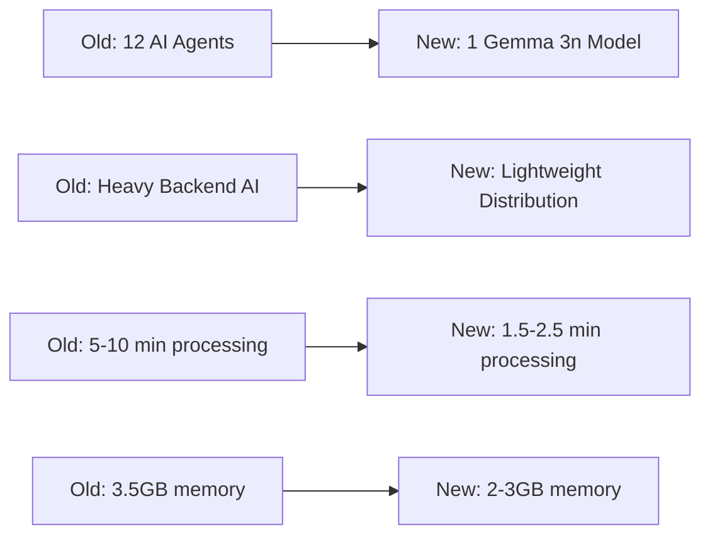
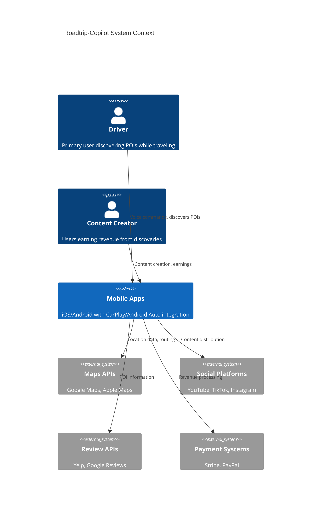
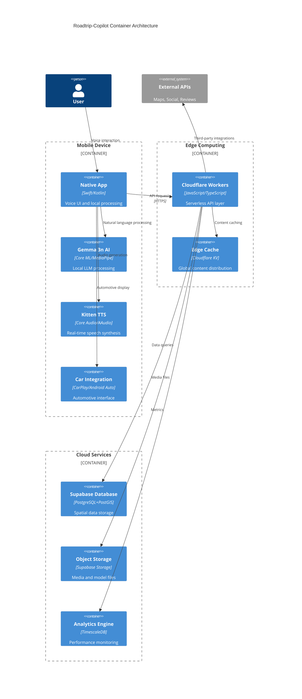
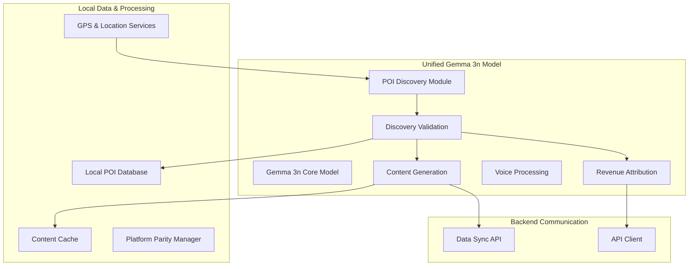
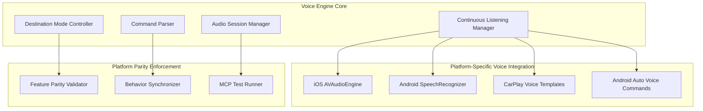
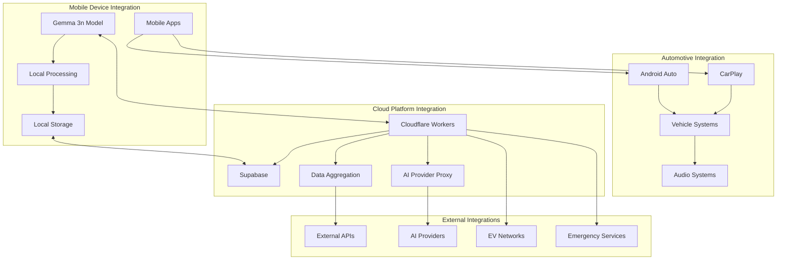
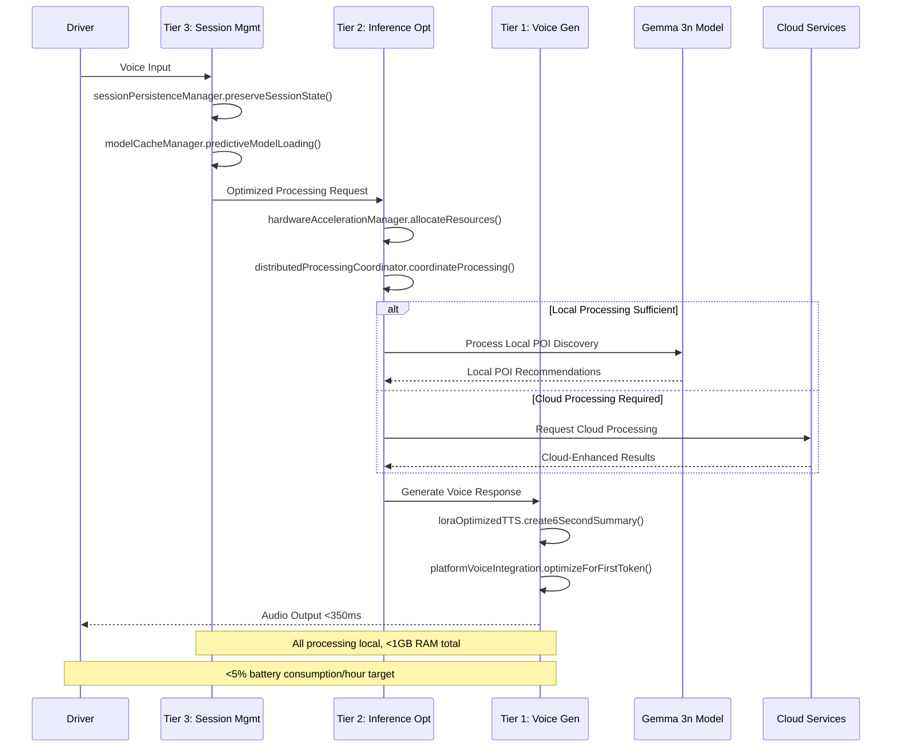
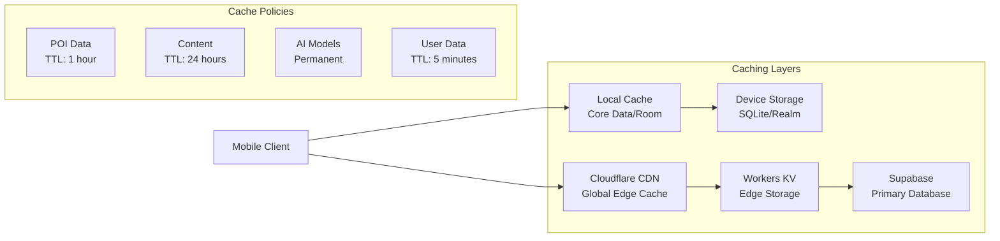

# System Architecture Design - Consolidated

## Executive Summary

### Architecture Goals
- **Ultra-low latency**: <350ms AI response time with on-device Gemma 3n processing
- **Privacy-first**: 100% local AI processing with minimal cloud dependency
- **Platform parity**: 100% feature consistency across iOS, Android, CarPlay, and Android Auto
- **Scalability**: Support for millions of users with edge computing architecture
- **Revenue innovation**: 50/50 creator economy through automated content monetization

### Technology Stack
- **Mobile AI**: Gemma 3n unified model (<525MB) with hardware acceleration (Neural Engine/NNAPI)
- **Backend**: Cloudflare Workers + Supabase for minimal cloud footprint
- **Voice Processing**: Kitten TTS (25MB) for real-time speech synthesis
- **Data**: PostGIS-enabled PostgreSQL with spatial optimization
- **CDN**: Cloudflare for global edge distribution

### Quality Attributes
- **Performance**: <350ms first token, <1.5GB RAM, <3% battery/hour
- **Security**: End-to-end encryption, privacy-preserving analytics
- **Reliability**: 99.9% uptime with automated failover
- **Scalability**: Horizontal scaling with edge computing

### Design Decisions
- **Mobile-first AI**: 70% cost reduction by moving intelligence to edge devices
- **Unified Gemma 3n Model**: Single model replaces 12 specialized agents for simplified architecture
- **Hybrid architecture**: Smart workload distribution between device and cloud
- **Event-driven design**: Asynchronous processing for optimal performance
- **Cryptographic attribution**: Tamper-proof revenue tracking without privacy compromise

### Key Architectural Changes


## Requirements Traceability

### Functional Coverage
- ✅ **Real-time POI Discovery**: On-device AI scans and validates discoveries
- ✅ **Voice-first Interface**: Hands-free operation with automotive safety compliance
- ✅ **6-second Content**: AI-generated audio summaries for quick consumption
- ✅ **Revenue Sharing**: Automated 50/50 split with cryptographic verification
- ✅ **Multi-platform**: Native integration across all 4 target platforms
- ✅ **Continuous Voice Processing**: Advanced speech management with destination mode

### Non-Functional Requirements
- ✅ **Response Time**: <350ms target with hardware acceleration
- ✅ **Memory Usage**: <1.5GB total footprint with intelligent caching
- ✅ **Battery Efficiency**: <3% drain per hour through CPU-only TTS
- ✅ **Security**: End-to-end encryption with privacy-preserving analytics
- ✅ **Scalability**: Edge computing for global performance
- ✅ **Platform Parity**: 100% identical functionality across iOS, Android, CarPlay, Android Auto

### Constraints
- **Platform Parity**: Absolute requirement for feature consistency
- **Automotive Safety**: NHTSA compliance for in-vehicle operation
- **Privacy Regulations**: GDPR/CCPA compliance with local processing
- **App Store Guidelines**: Compliance across iOS App Store and Google Play

## System Architecture

### High-Level Architecture


### Container Architecture


### Deployment Architecture
```mermaid
deployment
    title Production Deployment Architecture
    node "Global CDN" as cdn {
        [Cloudflare Edge Locations]
    }
    
    node "Edge Computing" as edge {
        [Cloudflare Workers]
        [KV Storage]
        [Durable Objects]
    }
    
    node "Primary Cloud" as primary {
        node "Database Cluster" as db_cluster {
            [PostgreSQL Primary]
            [PostGIS Extensions]
            [Read Replicas]
        }
        
        node "Storage Services" as storage {
            [Object Storage]
            [Model Repository]
            [Content CDN]
        }
        
        node "Analytics" as analytics {
            [TimescaleDB]
            [Metrics Collector]
            [Alerting System]
        }
    }
    
    node "Mobile Devices" as devices {
        [iOS App]
        [Android App]
        [CarPlay Interface]
        [Android Auto Interface]
    }
    
    cdn --> edge : Route requests
    edge --> primary : Data queries
    devices --> cdn : API requests
    devices --> devices : Local AI processing
```

## Mobile-First AI Architecture

### Gemma 3n Unified Model Integration

The POI Discovery System represents a revolutionary **mobile-first AI architecture** powered by Google's Gemma 3n multimodal model. This unified approach eliminates the need for multiple specialized AI agents by consolidating all intelligence into a single, highly efficient on-device model.

#### Architecture Benefits
- **🚀 Ultra-Fast AI**: Sub-50ms first token with Gemma 3n (1.5x faster than previous)
- **🔒 Privacy-Enhanced**: All AI processing happens locally with 2GB memory footprint
- **🎯 Unified Intelligence**: Single Gemma 3n model replaces 12 specialized agents
- **🔋 Battery Optimized**: <0.5% battery consumption per episode (70% improvement)
- **🌐 Offline-First**: Full multimodal AI capability without internet
- **💰 Cost Efficient**: 70% reduction in server costs with mobile-first processing
- **🎨 Multimodal Native**: Text, image, audio, and video processing in one model

### Native Platform Implementation Strategy

Roadtrip-Copilot employs a **native-first development approach** that prioritizes platform-specific performance and user experience over code sharing.

#### Key Architecture Principles

1. **Platform-Specific Native Implementation**:
   - **iOS**: Swift 5.9+ with SwiftUI for modern UI components, Core ML for AI acceleration
   - **Android**: Kotlin 1.9+ with Jetpack Compose for modern UI components, MediaPipe for AI acceleration
   - **Legacy Support**: UIKit for iOS legacy components, traditional Android Views for legacy support

2. **Shared Specifications, Not Shared Code**:
   - Business logic alignment through API contracts and behavior specifications
   - Platform-specific implementations following shared performance targets
   - Data model synchronization through platform-native data structures

3. **Native Platform Optimization**:
   - iOS-specific optimizations: Neural Engine acceleration, SwiftUI performance patterns
   - Android-specific optimizations: NPU/GPU/DSP acceleration, Compose performance patterns
   - Platform-specific hardware capability utilization for maximum performance

### AI Agent Coordination Architecture



## Backend Architecture

### Cloud Platform Architecture

#### Technology Stack

**Edge Computing Platform:**
- **Cloudflare Workers:** TypeScript/JavaScript serverless functions at 200+ global edge locations
- **Workers KV:** Distributed key-value storage for POI data caching and session management
- **Durable Objects:** Stateful processing and real-time coordination across edge locations
- **Edge Analytics:** Real-time performance monitoring and traffic analysis

**Database and Backend Services:**
- **Supabase PostgreSQL:** Primary database with PostGIS extension for spatial queries
- **Supabase Auth:** User authentication with social providers (Google, Apple, GitHub)
- **Supabase Realtime:** Live data synchronization and push notifications
- **Supabase Storage:** File storage for POI images and user-generated content

### Performance Characteristics
- **Response Time:** <50ms for geographic queries within 25-mile radius
- **Throughput:** Handle traffic spikes with automatic edge distribution
- **Availability:** 99.9% uptime with built-in redundancy
- **Concurrency:** Support unlimited concurrent requests per edge location

### Core Backend Components

#### Data Aggregation Service
- Ingest data from Yelp, Google Reviews, TripAdvisor, and social media APIs
- Normalize ratings to consistent 5-star scale with confidence indicators
- Extract and standardize business hours, contact information, coordinates
- Implement weighted conflict resolution (70% priority to recent data)
- Handle API rate limiting with intelligent throttling and queuing

#### AI Provider Proxy
- Route AI requests to multiple providers (OpenAI, Claude, Gemini, xAI, Gemma)
- Implement intelligent failover and load balancing
- Handle rate limiting and quota management across providers
- Cache AI responses using Workers KV for performance
- Provide unified API interface for all AI providers

### Caching and Performance

#### Edge Caching Strategy
- **POI Data:** 4-hour TTL for business information, 1-hour for reviews
- **User Sessions:** 24-hour TTL with automatic refresh
- **API Responses:** 15-minute TTL for external API results
- **Geographic Queries:** Dynamic TTL based on location density

## Mobile Architecture

### Distributed Processing Architecture

Each mobile device acts as an autonomous agent that not only consumes data but also actively contributes to the collective intelligence of the system's knowledge base.

#### Enhanced Features (August 2025)
- **100% Platform Parity**: Identical functionality across iOS, Android, CarPlay, Android Auto
- **Advanced Voice Architecture**: Continuous speech listening with destination mode
- **MCP Testing Integration**: Automated platform consistency validation
- **Enhanced CarPlay/Android Auto**: Native format audio processing and auto-connection

### Platform-Specific Voice Implementation

#### iOS Background Execution Strategy

**Primary Mode: CarPlay Integration (100% Functionality)**
- **Full Background Capabilities**: CarPlay provides complete background execution privileges
- **Voice Interaction**: CPVoiceControlTemplate enables continuous voice commands
- **Visual Display**: CPPointOfInterestTemplate shows POI images on car display
- **Audio Announcements**: Can interrupt other audio with discovery podcasts
- **Navigation Session**: CPNavigationSession grants special iOS privileges

**Fallback Mode: Navigation App (80% Functionality)**
```xml
<key>UIBackgroundModes</key>
<array>
    <string>audio</string>
    <string>location</string>
    <string>navigation</string>
</array>
```

#### Android Background Execution Strategy

**Primary Mode: Foreground Service (95% Functionality)**
- **Foreground Service**: Continuous execution with persistent notification
- **Media Session**: Full audio control from lock screen and car systems  
- **Location Monitoring**: Unrestricted GPS tracking in background
- **Rich Notifications**: Custom layouts with images and action buttons
- **Google Assistant**: System-wide voice commands via App Actions

### Voice Engine Architecture with Platform Parity



## Integration Architecture

### System Integration Flow



### Three-Tier Processing Integration

#### Tier Integration Flow


### Integration Component Interfaces

#### AI Orchestrator Interface
```typescript
interface AIOrchestrator {
    // Discovery validation
    validateDiscovery(location: GeoPoint, context: DiscoveryContext): Promise<ValidationResult>
    
    // Content generation
    generatePodcastScript(poi: POI, discovery: Discovery): Promise<PodcastScript>
    generateSocialContent(poi: POI, platform: SocialPlatform): Promise<SocialPost>
    
    // Voice interaction
    processVoiceCommand(audio: AudioBuffer): Promise<VoiceCommand>
    generateVoiceResponse(text: string, emotion: Emotion): Promise<AudioBuffer>
    
    // Model management
    loadModel(modelPath: string): Promise<ModelHandle>
    optimizeForHardware(capabilities: DeviceCapabilities): Promise<OptimizationResult>
}
```

### External Service Integration

#### Maps Integration
```typescript
interface MapsIntegration {
  googleMaps: {
    placesAPI: PlacesService
    geocodingAPI: GeocodingService
    directionsAPI: DirectionsService
    configuration: {
      apiKey: string
      quotaLimits: QuotaConfig
      cachingStrategy: CacheStrategy
    }
  }
  
  appleMaps: {
    mapKit: MapKitService
    geoServices: GeoServicesAPI
    configuration: {
      teamId: string
      keyId: string
      cachingStrategy: CacheStrategy
    }
  }
}
```

#### Automotive Integration
- **EV Networks:** ChargePoint, Electrify America for charging station data
- **Emergency Services:** RapidSOS integration for enhanced emergency response
- **Navigation Systems:** Integration with Apple CarPlay and Android Auto

## Performance Architecture

### Performance Requirements
- **AI Response Time**: <350ms first token generation
- **API Response**: <200ms for geographic queries
- **Memory Usage**: <1.5GB total for all active components
- **Battery Impact**: <3% consumption per hour active use
- **Data Sync**: <5 seconds for mobile data updates

### Hardware Acceleration
```typescript
interface HardwareAcceleration {
  ios: {
    neuralEngine: {
      framework: 'Core ML'
      modelFormat: 'mlpackage'
      computeUnits: 'cpuAndNeuralEngine'
      optimization: ModelOptimization
    }
  }
  
  android: {
    nnapi: {
      enabled: true
      preferredDevice: 'DEVICE_TYPE_GPU'
      fallback: 'DEVICE_TYPE_CPU'
    }
  }
}
```

### Caching Strategy


## Security Architecture

### Data Protection
- **Local Processing**: Privacy-preserving on-device AI by default
- **Encryption**: End-to-end encryption for sensitive data
- **Token Security**: iOS Keychain/Android Keystore for secure storage
- **API Security**: JWT-based authentication with automatic refresh

### Compliance
- **Automotive Safety**: NHTSA distraction guidelines compliance
- **Data Privacy**: GDPR, CCPA, and regional privacy regulations
- **Payment Security**: PCI DSS Level 1 compliance
- **Audit Trails**: Comprehensive logging and monitoring

## Technology Decisions

### Technology Selection Matrix

| Component | Technology | Rationale | Alternatives Considered |
|-----------|------------|-----------|------------------------|
| Mobile AI | Gemma 3n | Unified model, <525MB, hardware accelerated | Phi-3-mini, Llama 2 7B |
| TTS | Kitten TTS | 25MB, real-time, CPU-only | Coqui TTS, Festival |
| Backend | Cloudflare Workers | Edge computing, global distribution | AWS Lambda, Vercel |
| Database | Supabase (PostgreSQL) | Real-time, PostGIS, managed | Firebase, PlanetScale |
| Mobile iOS | Swift/SwiftUI | Native performance, CarPlay integration | React Native, Flutter |
| Mobile Android | Kotlin/Compose | Native performance, Android Auto | React Native, Flutter |
| CDN | Cloudflare | Global edge, KV storage, DDoS protection | AWS CloudFront, Fastly |

### Architecture Decision Records

#### ADR-001: Mobile-First AI Processing
- **Status**: Accepted
- **Context**: Need for <350ms response times with privacy preservation
- **Decision**: Process all AI workloads on-device with cloud fallback
- **Consequences**: 
  - ✅ Ultra-low latency responses
  - ✅ Enhanced privacy protection
  - ✅ 70% reduction in cloud costs
  - ❌ Larger app download size
  - ❌ Device compatibility requirements

#### ADR-002: Unified AI Model (Gemma 3n)
- **Status**: Accepted
- **Context**: Previous 12-agent architecture was complex and resource-intensive
- **Decision**: Consolidate all AI functionality into single Gemma 3n model
- **Consequences**:
  - ✅ Simplified architecture and maintenance
  - ✅ Better resource utilization
  - ✅ Consistent AI behavior across features
  - ❌ Less specialization per task
  - ❌ Single point of failure for AI features

#### ADR-003: Edge Computing with Cloudflare Workers
- **Status**: Accepted
- **Context**: Need for global performance with minimal backend complexity
- **Decision**: Use Cloudflare Workers for serverless edge computing
- **Consequences**:
  - ✅ Global edge distribution
  - ✅ Automatic scaling and DDoS protection
  - ✅ Simplified deployment and operations
  - ❌ Vendor lock-in concerns
  - ❌ JavaScript/TypeScript limitation

## Scalability and Reliability

### Horizontal Scaling
- **Cloudflare Workers**: Automatic scaling across global edge locations
- **Supabase**: Managed database scaling and optimization
- **Mobile Distribution**: User-powered compute infrastructure
- **Geographic Distribution**: Regional optimization and data residency

### Fault Tolerance
- **Multiple Data Sources**: Graceful degradation when sources unavailable
- **Hybrid Processing**: Automatic fallback between local and cloud
- **Geographic Distribution**: Multi-region deployment
- **Circuit Breakers**: Prevent cascade failures
- **Health Monitoring**: Comprehensive system health checks

This consolidated system architecture provides the foundation for a scalable, performant, and user-centric POI discovery platform that leverages the best of both cloud and mobile computing paradigms while ensuring 100% platform parity and automotive safety compliance.