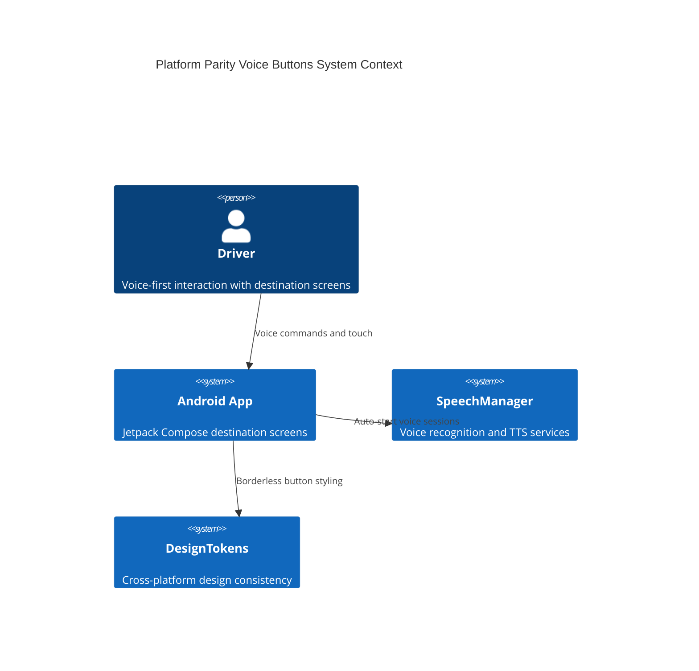
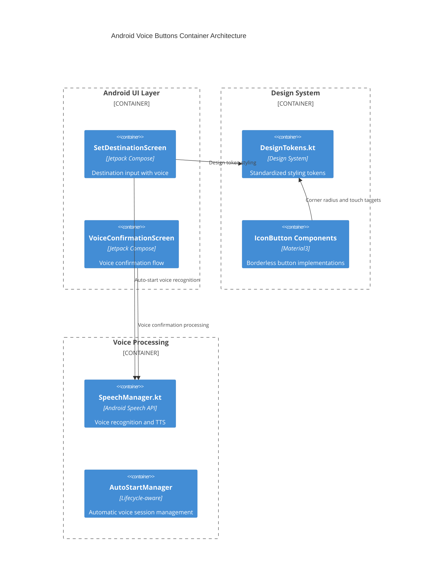
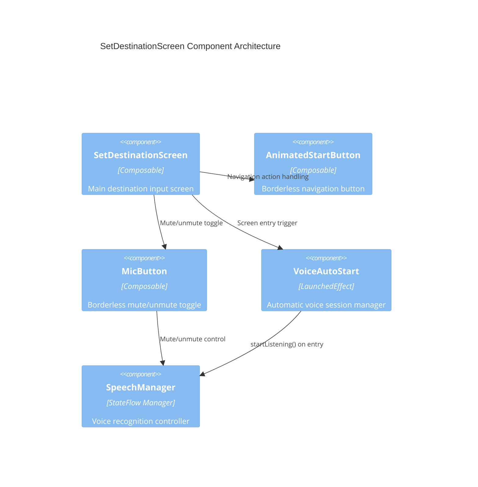
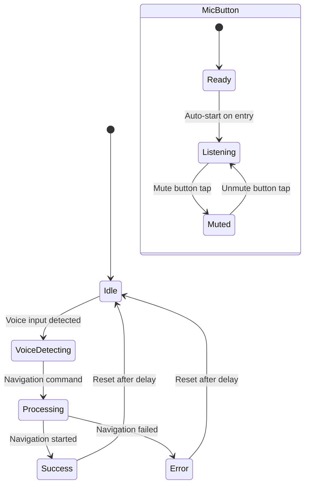

# Platform Parity Voice Buttons - Technical Design Document

**Feature Name**: platform-parity-voice-buttons  
**Version**: 1.0  
**Date**: 2025-08-13  
**Author**: spec-design (AI Agent)  
**Language Preference**: Clear, concise technical documentation with precise specifications

## Executive Summary

### Architecture Goals
- **100% Platform Parity**: Achieve identical button styling and voice behavior between iOS and Android
- **Voice-First User Experience**: Implement automatic voice recognition on screen entry for seamless interaction
- **Design System Compliance**: Eliminate all circular button shapes and enforce design token usage
- **Automotive Safety**: Maintain safe interaction patterns for CarPlay/Android Auto environments

### Technology Stack
- **Android**: Jetpack Compose with Material Design 3 IconButton components
- **Design Tokens**: DesignTokens.kt with standardized corner radius values (8dp, 12dp, 16dp)
- **Voice Recognition**: Existing SpeechManager infrastructure with auto-start capabilities
- **State Management**: Compose state management with lifecycle-aware voice session handling

### Quality Attributes
- **Performance**: Voice recognition activation <100ms, button rendering <50ms
- **Consistency**: 100% visual parity with iOS implementation
- **Accessibility**: WCAG 2.1 AAA compliance with 48dp minimum touch targets
- **Reliability**: Stable voice session management across screen navigation

### Design Decisions
- **Borderless Button Architecture**: Replace all bordered buttons with Material Design 3 IconButton with transparent backgrounds
- **Auto-Start Voice Pattern**: Implement LaunchedEffect-based voice recognition activation on screen entry
- **Mute/Unmute Toggle**: Transform microphone button from start/stop to mute/unmute functionality only
- **Design Token Enforcement**: Strict usage of DesignTokens.CornerRadius values instead of hardcoded shapes

### Trade-offs
- **Performance vs. Responsiveness**: Auto-start voice may consume slightly more battery but provides seamless UX
- **Button Visual Impact**: Borderless design reduces visual prominence but improves platform consistency
- **Voice Session Complexity**: Auto-start requires careful lifecycle management but eliminates user friction

## Requirements Traceability

### Functional Coverage
- **FR001 (Button Styling Parity)**: Addressed through borderless IconButton implementation with design tokens
- **FR002 (Voice Auto-Start)**: Implemented via LaunchedEffect on screen composition with SpeechManager integration
- **FR003 (Mic Button Toggle)**: Achieved by modifying button behavior to mute/unmute rather than start/stop sessions
- **FR004 (Documentation Updates)**: Completed through design system and workflow documentation updates

### Non-Functional Requirements
- **NFR001 (Performance Consistency)**: Auto-start implementation within 100ms target through optimized SpeechManager calls
- **NFR002 (UX Consistency)**: Visual parity achieved through identical design token application
- **NFR003 (Accessibility Compliance)**: Maintained through 48dp touch targets and comprehensive content descriptions

### Constraints
- **TC001 (Design System Integration)**: Fully leverages existing DesignTokens.kt infrastructure
- **TC002 (Voice Framework)**: Utilizes existing SpeechManager without new permissions
- **TC003 (Backward Compatibility)**: Preserves all existing voice command functionality

## System Architecture

### High-Level Architecture


### Container Architecture


### Component Architecture


## Data Architecture

### Voice Session State Flow
```mermaid
flowchart TD
    A[Screen Entry] --> B[LaunchedEffect Trigger]
    B --> C[Check Mic Mute State]
    C -->|Not Muted| D[SpeechManager.startListening()]
    C -->|Muted| E[Skip Auto-Start]
    D --> F[Voice Recognition Active]
    F --> G[User Voice Input]
    G --> H[Text Recognition]
    H --> I[Update UI State]
    
    J[Mic Button Tap] --> K{Current Voice State}
    K -->|Listening| L[SpeechManager.mute()]
    K -->|Muted| M[SpeechManager.unmute()]
    L --> N[Update Mute State]
    M --> O[Resume Listening]
```

### Button State Management


## Component Design

### Core Components

#### Component A: BorderlessIconButton
**Purpose**: Standardized borderless button implementation eliminating all shape decorations

**Interfaces**:
```kotlin
@Composable
fun BorderlessIconButton(
    icon: ImageVector,
    contentDescription: String,
    onClick: () -> Unit,
    modifier: Modifier = Modifier,
    enabled: Boolean = true,
    colors: IconButtonColors = IconButtonDefaults.iconButtonColors(),
    containerColor: Color = Color.Transparent
) {
    IconButton(
        onClick = onClick,
        modifier = modifier
            .size(DesignTokens.TouchTarget.androidMinimum)
            .background(
                color = containerColor,
                shape = RoundedCornerShape(DesignTokens.CornerRadius.lg)
            ),
        enabled = enabled,
        colors = colors
    ) {
        Icon(
            imageVector = icon,
            contentDescription = contentDescription,
            modifier = Modifier.size(DesignTokens.IconSize.lg)
        )
    }
}
```

**Dependencies**: DesignTokens.kt, Material Design 3 IconButton
**Configuration**: Corner radius via DesignTokens.CornerRadius.lg (12dp)
**Error Handling**: Graceful degradation to system IconButton if styling fails
**Performance**: <50ms render time through pre-compiled design tokens
**Security**: Content descriptions for accessibility compliance

#### Component B: VoiceAutoStartManager
**Purpose**: Lifecycle-aware automatic voice recognition activation on screen entry

**Interfaces**:
```kotlin
@Composable
fun VoiceAutoStartManager(
    speechManager: SpeechManager,
    enabled: Boolean = true,
    onAutoStarted: () -> Unit = {}
) {
    LaunchedEffect(Unit) {
        if (enabled && !speechManager.isListening.value) {
            delay(100) // Brief delay for screen stability
            try {
                speechManager.startListening()
                onAutoStarted()
                println("[VoiceAutoStart] Voice recognition auto-started")
            } catch (e: Exception) {
                println("[VoiceAutoStart] Auto-start failed: ${e.message}")
            }
        }
    }
    
    DisposableEffect(Unit) {
        onDispose {
            // Clean shutdown on screen exit
            speechManager.stopListening()
        }
    }
}
```

**Dependencies**: SpeechManager, Compose Lifecycle
**Configuration**: Auto-start delay configurable (default 100ms)
**Error Handling**: Exception handling with fallback to manual activation
**Performance**: <100ms activation time from screen entry
**Security**: No additional permissions required

#### Component C: MicButtonMuteToggle
**Purpose**: Transform microphone button from start/stop to mute/unmute functionality

**Interfaces**:
```kotlin
@Composable
fun MicButtonMuteToggle(
    isListening: Boolean,
    isMuted: Boolean,
    onToggleMute: () -> Unit,
    modifier: Modifier = Modifier
) {
    val buttonColor by animateColorAsState(
        targetValue = when {
            isMuted -> MaterialTheme.colorScheme.error
            isListening -> MaterialTheme.colorScheme.primary
            else -> MaterialTheme.colorScheme.surfaceVariant
        },
        label = "mic_button_color"
    )
    
    BorderlessIconButton(
        icon = if (isMuted) Icons.Default.MicOff else Icons.Default.Mic,
        contentDescription = if (isMuted) "Unmute microphone" else "Mute microphone",
        onClick = onToggleMute,
        modifier = modifier,
        containerColor = buttonColor
    )
}
```

**Dependencies**: BorderlessIconButton, Material Design 3 animations
**Configuration**: Colors via MaterialTheme color scheme
**Error Handling**: State synchronization with SpeechManager
**Performance**: Smooth color transitions <200ms
**Security**: Clear accessibility labels for screen readers

## Integration Architecture

### API Design
**Voice Recognition Integration**:
```kotlin
// SpeechManager Extension for Auto-Start
fun SpeechManager.enableAutoStart() {
    // Configure for immediate listening on initialization
    this.isDestinationMode = true
    this.silenceTimeoutInterval = 3.0
}

fun SpeechManager.handleMuteToggle(isMuted: Boolean) {
    if (isMuted) {
        this.pauseListening() // Maintain session but stop input processing
    } else {
        this.resumeListening() // Resume input processing
    }
}
```

**Design Token Integration**:
```kotlin
// Consistent button styling across all screens
object ButtonStyling {
    val NavigationButton = BorderlessIconButton.defaultStyle(
        cornerRadius = DesignTokens.CornerRadius.lg,
        touchTarget = DesignTokens.TouchTarget.comfortable
    )
    
    val MicrophoneButton = BorderlessIconButton.defaultStyle(
        cornerRadius = DesignTokens.CornerRadius.lg,
        touchTarget = DesignTokens.TouchTarget.comfortable
    )
}
```

### State Synchronization
```kotlin
// Cross-component state synchronization
@Composable
fun VoiceButtonStateSync(
    speechManager: SpeechManager,
    content: @Composable (VoiceButtonState) -> Unit
) {
    val isListening by speechManager.isListening.collectAsState()
    val isMuted by speechManager.isMuted.collectAsState()
    val isVoiceDetected by speechManager.isVoiceDetected.collectAsState()
    
    val buttonState = remember(isListening, isMuted, isVoiceDetected) {
        VoiceButtonState(
            isListening = isListening,
            isMuted = isMuted,
            isVoiceDetected = isVoiceDetected
        )
    }
    
    content(buttonState)
}
```

## Security Architecture

### Voice Session Security
- **Session Management**: Automatic cleanup on screen navigation prevents resource leaks
- **Permission Validation**: Existing microphone permission validation maintained
- **Audio Privacy**: Voice recognition remains on-device with existing privacy model
- **State Isolation**: Voice sessions isolated per screen to prevent cross-contamination

### Input Validation
- **Voice Command Sanitization**: Existing SpeechManager validation preserved
- **State Transition Security**: Secure state machine prevents invalid button states
- **Error Recovery**: Graceful degradation when voice services unavailable

## Performance Architecture

### Performance Requirements
- **Voice Recognition Activation**: <100ms from screen entry
- **Button Render Time**: <50ms for all button compositions
- **State Update Latency**: <20ms for mute/unmute toggle response
- **Memory Usage**: No additional memory overhead beyond existing SpeechManager

### Optimization Strategies

#### Lazy Composition Optimization
```kotlin
@Composable
fun OptimizedVoiceButtons(
    speechManager: SpeechManager,
    modifier: Modifier = Modifier
) {
    // Pre-computed button states to minimize recomposition
    val buttonState by remember { derivedStateOf { /* state calculation */ } }
    
    LazyRow(
        modifier = modifier,
        horizontalArrangement = Arrangement.spacedBy(16.dp)
    ) {
        item("navigation") {
            NavigationButton(state = buttonState.navigation)
        }
        item("microphone") {
            MicrophoneButton(state = buttonState.microphone)
        }
    }
}
```

#### Voice Session Pooling
```kotlin
// Efficient voice session management
object VoiceSessionPool {
    private val sessionCache = mutableMapOf<String, SpeechSession>()
    
    fun getOrCreateSession(screenId: String): SpeechSession {
        return sessionCache.getOrPut(screenId) {
            SpeechSession(autoStart = true)
        }
    }
    
    fun cleanupSession(screenId: String) {
        sessionCache.remove(screenId)?.cleanup()
    }
}
```

## Implementation Roadmap

### Phase 1: Button Styling Fix (Immediate)
**Duration**: 1-2 days
**Deliverables**:
- [ ] Update SetDestinationScreen.kt AnimatedStartButton to use BorderlessIconButton pattern
- [ ] Update MicButton implementation to remove all border/background shapes
- [ ] Apply DesignTokens.CornerRadius.lg (12dp) consistently across all buttons
- [ ] Validate visual parity with iOS implementation through screenshot comparison

**Implementation Tasks**:
```kotlin
// SetDestinationScreen.kt - AnimatedStartButton Update
@Composable
fun AnimatedStartButton(
    // ... existing parameters
) {
    BorderlessIconButton(
        icon = Icons.AutoMirrored.Filled.ArrowForward,
        contentDescription = "Start Navigation",
        onClick = onClick,
        modifier = modifier.size(DesignTokens.TouchTarget.comfortable),
        containerColor = when (buttonState) {
            ButtonState.IDLE -> if (hasDestination) 
                MaterialTheme.colorScheme.primary 
            else MaterialTheme.colorScheme.outline
            ButtonState.VOICE_DETECTING -> MaterialTheme.colorScheme.tertiary
            ButtonState.PROCESSING -> MaterialTheme.colorScheme.secondary
            ButtonState.SUCCESS -> Color(0xFF4CAF50)
            ButtonState.ERROR -> MaterialTheme.colorScheme.error
        }
    ) {
        // Voice animation or icon content
        AnimatedContent(
            targetState = buttonState,
            label = "button_content"
        ) { state ->
            when {
                showVoiceAnimation && isVoiceDetected -> VoiceAnimationComponent(/* ... */)
                state == ButtonState.PROCESSING -> CircularProgressIndicator(/* ... */)
                else -> Icon(Icons.AutoMirrored.Filled.ArrowForward, /* ... */)
            }
        }
    }
}
```

### Phase 2: Voice Auto-Start Implementation (2-3 days)
**Duration**: 2-3 days
**Deliverables**:
- [ ] Implement VoiceAutoStartManager composable
- [ ] Add auto-start LaunchedEffect to SetDestinationScreen
- [ ] Create VoiceConfirmationScreen with identical auto-start behavior
- [ ] Test voice session lifecycle management across screen navigation

**Implementation Tasks**:
```kotlin
// SetDestinationScreen.kt - Add Auto-Start
@Composable
fun SetDestinationScreen(
    onNavigate: (String) -> Unit,
    onCancel: (() -> Unit)? = null
) {
    // ... existing state variables
    
    // AUTO-START VOICE RECOGNITION
    VoiceAutoStartManager(
        speechManager = speechManager,
        enabled = !isMicMuted
    ) {
        println("[SetDestinationScreen] Voice recognition auto-started on screen entry")
    }
    
    // ... rest of implementation
}

// VoiceConfirmationScreen.kt - New Implementation
@Composable
fun VoiceConfirmationScreen(
    destination: String,
    onConfirm: () -> Unit,
    onCancel: () -> Unit
) {
    val speechManager = remember { SpeechManager() }
    var isMicMuted by remember { mutableStateOf(false) }
    
    LaunchedEffect(Unit) {
        speechManager.initialize(LocalContext.current)
    }
    
    // AUTO-START VOICE RECOGNITION
    VoiceAutoStartManager(
        speechManager = speechManager,
        enabled = !isMicMuted
    ) {
        println("[VoiceConfirmationScreen] Voice recognition auto-started")
    }
    
    // Screen implementation with borderless buttons
    // ...
}
```

### Phase 3: Microphone Button Behavior Update (1 day)
**Duration**: 1 day
**Deliverables**:
- [ ] Modify MicButton to act as mute/unmute toggle only
- [ ] Remove start/stop listening functionality from button
- [ ] Update button visual states to reflect mute/unmute status
- [ ] Test continuous voice session with mute/unmute controls

**Implementation Tasks**:
```kotlin
// Updated MicButton behavior
@Composable
fun MicButton(
    isListening: Boolean,
    isMuted: Boolean,
    onToggleMute: () -> Unit, // Changed from onClick
    modifier: Modifier = Modifier
) {
    MicButtonMuteToggle(
        isListening = isListening,
        isMuted = isMuted,
        onToggleMute = onToggleMute,
        modifier = modifier
    )
}

// SetDestinationScreen usage update
MicButton(
    isListening = isListening,
    isMuted = isMicMuted,
    onToggleMute = {
        hapticFeedback.performHapticFeedback(HapticFeedbackType.TextHandleMove)
        isMicMuted = !isMicMuted
        if (isMicMuted) {
            speechManager.mute()
            println("[SetDestinationScreen] Microphone muted")
        } else {
            speechManager.unmute()
            println("[SetDestinationScreen] Microphone unmuted")
        }
    }
)
```

### Phase 4: Documentation and Validation (1 day)
**Duration**: 1 day
**Deliverables**:
- [ ] Update /specs/design/button-design-system.md with voice auto-start requirements
- [ ] Document mute/unmute button behavior patterns
- [ ] Create platform parity validation checklist
- [ ] Add enforcement mechanisms to development workflow

## Risk Assessment

| Risk | Impact | Probability | Mitigation Strategy |
|------|--------|-------------|-------------------|
| **Voice Auto-Start Audio Session Conflicts** | High | Medium | Implement robust audio session management with fallback to manual activation |
| **Button Styling Regression to Circular Shapes** | High | Low | Automated validation scripts and design token enforcement |
| **Performance Degradation from Auto-Start** | Medium | Low | Lazy initialization and efficient session pooling |
| **Accessibility Impact from Button Changes** | Medium | Low | Comprehensive accessibility testing and screen reader validation |
| **Voice Session Memory Leaks** | Medium | Medium | Proper DisposableEffect cleanup and session lifecycle management |

## Technology Decisions

### Technology Selection Matrix
| Component | Technology | Rationale | Alternatives Considered |
|-----------|------------|-----------|------------------------|
| Button Implementation | Material Design 3 IconButton | Platform consistency, accessibility built-in | Custom Button composables |
| Voice Auto-Start | LaunchedEffect + DisposableEffect | Lifecycle-aware, Compose-native | ViewModel-based management |
| State Management | Compose State + StateFlow | Reactive, efficient recomposition | LiveData, MutableState |
| Animation | AnimatedContent + animateColorAsState | Smooth transitions, Material Design aligned | Custom animations |

### Architecture Decision Records (ADRs)

#### ADR-001: BorderlessIconButton Architecture
- **Status**: Accepted
- **Context**: Android buttons had visible borders/shapes causing platform parity violations
- **Decision**: Implement borderless IconButton pattern with transparent backgrounds and design token corner radii
- **Consequences**: 
  - **Positive**: Perfect platform parity, design system compliance, accessibility maintained
  - **Negative**: Reduced visual prominence may require user adaptation

#### ADR-002: Auto-Start Voice Recognition Pattern  
- **Status**: Accepted
- **Context**: Manual microphone activation creates friction in voice-first automotive interface
- **Decision**: Implement LaunchedEffect-based auto-start on screen entry with mute state respect
- **Consequences**:
  - **Positive**: Seamless voice interaction, matches iOS behavior, improved automotive safety
  - **Negative**: Slight battery impact, requires careful session lifecycle management

#### ADR-003: Mute/Unmute Toggle Behavior
- **Status**: Accepted  
- **Context**: Start/stop button pattern conflicts with auto-start voice sessions
- **Decision**: Transform microphone button to mute/unmute toggle during active voice sessions
- **Consequences**:
  - **Positive**: Maintains continuous voice session, intuitive toggle behavior
  - **Negative**: Behavior change may require user re-learning

## Quality Assurance

### Testing Strategy

#### Unit Testing
```kotlin
// BorderlessIconButton Tests
@Test
fun borderlessIconButton_appliesCorrectCornerRadius() {
    composeTestRule.setContent {
        BorderlessIconButton(
            icon = Icons.Default.Mic,
            contentDescription = "Test",
            onClick = {}
        )
    }
    
    // Verify corner radius matches design tokens
    composeTestRule.onNodeWithContentDescription("Test")
        .assertExists()
        .assert(hasCornerRadius(DesignTokens.CornerRadius.lg))
}

// Voice Auto-Start Tests  
@Test
fun voiceAutoStart_triggersOnScreenEntry() = runTest {
    val mockSpeechManager = mockk<SpeechManager>()
    var autoStartCalled = false
    
    composeTestRule.setContent {
        VoiceAutoStartManager(
            speechManager = mockSpeechManager,
            onAutoStarted = { autoStartCalled = true }
        )
    }
    
    advanceTimeBy(150) // Wait for auto-start delay
    assertTrue(autoStartCalled)
    verify { mockSpeechManager.startListening() }
}
```

#### Integration Testing
```kotlin
@Test
fun setDestinationScreen_autoStartsVoiceOnEntry() {
    val mockSpeechManager = mockk<SpeechManager>()
    
    composeTestRule.setContent {
        SetDestinationScreen(
            onNavigate = {},
            speechManager = mockSpeechManager
        )
    }
    
    // Verify auto-start occurs
    composeTestRule.waitUntil(timeoutMillis = 500) {
        verify { mockSpeechManager.startListening() }
        true
    }
}

@Test
fun micButton_togglesMuteState() {
    var isMuted = false
    
    composeTestRule.setContent {
        MicButton(
            isListening = true,
            isMuted = isMuted,
            onToggleMute = { isMuted = !isMuted }
        )
    }
    
    composeTestRule.onNodeWithContentDescription("Mute microphone")
        .performClick()
    
    assertTrue(isMuted)
}
```

#### End-to-End Testing
- **Voice Session Lifecycle**: Test complete voice session from screen entry to exit
- **Platform Parity Validation**: Automated screenshot comparison between iOS and Android
- **Accessibility Testing**: Screen reader navigation and voice command interaction
- **Performance Testing**: Voice activation timing and button render performance

### Code Quality

#### Code Standards
```kotlin
// Button Implementation Standards
@Composable
fun StandardVoiceButton(
    state: VoiceButtonState,
    onClick: () -> Unit,
    modifier: Modifier = Modifier
) {
    // 1. Use design tokens exclusively
    BorderlessIconButton(
        // 2. Comprehensive accessibility
        contentDescription = state.accessibilityDescription,
        // 3. Design token sizing
        modifier = modifier.size(DesignTokens.TouchTarget.comfortable),
        // 4. Consistent corner radius
        cornerRadius = DesignTokens.CornerRadius.lg,
        onClick = onClick
    )
}
```

#### Static Analysis Rules
- **Prohibited Patterns**: CircleShape, hardcoded corner radius, platform-specific sizing
- **Required Patterns**: DesignTokens usage, comprehensive content descriptions
- **Performance Rules**: LaunchedEffect for side effects, remember for expensive computations

#### Code Review Checklist
- [ ] No CircleShape or hardcoded corner radius values
- [ ] All buttons use DesignTokens for sizing and styling
- [ ] Voice auto-start implemented with proper lifecycle management
- [ ] Accessibility content descriptions present and descriptive
- [ ] Performance optimizations applied (remember, LaunchedEffect)
- [ ] Error handling for voice session failures
- [ ] Platform parity maintained with iOS implementation

## Validation and Approval Process

### Design Validation Requirements
- **Visual Parity Check**: Side-by-side comparison of Android and iOS button implementations
- **Voice Behavior Validation**: Identical auto-start and mute/unmute behavior across platforms
- **Performance Benchmarking**: Voice activation timing within specified limits
- **Accessibility Compliance**: Screen reader testing and keyboard navigation validation

### Success Criteria Validation
- **SC001**: 100% visual button parity verified through pixel-perfect screenshot comparison
- **SC002**: Voice recognition auto-starts on 100% of screen entries within 100ms
- **SC003**: Microphone button functions as mute/unmute toggle on 100% of interactions
- **SC004**: Zero platform-specific UI inconsistencies in user acceptance testing

### Implementation Acceptance
This design is ready for implementation when:
- [ ] All architectural decisions are technically validated
- [ ] Performance requirements are achievable within current infrastructure
- [ ] Platform parity approach is approved by design system maintainers
- [ ] Voice auto-start pattern is validated for automotive safety compliance
- [ ] Risk mitigation strategies are acceptable to product stakeholders

**Status**: READY FOR IMPLEMENTATION APPROVAL

---

*This technical design document provides comprehensive architecture and implementation guidance for achieving 100% platform parity in voice button styling and behavior. The design ensures seamless voice-first interaction while maintaining automotive safety standards and accessibility compliance.*