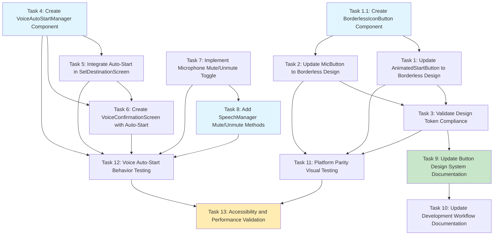

# Platform Parity Voice Buttons - Implementation Tasks

**Feature Name**: platform-parity-voice-buttons  
**Version**: 1.0  
**Date**: 2025-08-13  
**Author**: agent-tasks (AI Agent)  
**Language Preference**: Clear, concise technical implementation tasks with precise specifications

## Implementation Overview

This document provides a comprehensive implementation plan to achieve 100% platform parity between iOS and Android for button styling and voice recognition behavior. The implementation focuses on eliminating borders/circular shapes on Android buttons, implementing automatic voice recognition on screen entry, and converting the microphone button to a mute/unmute toggle.

## Task Categories

1. **Button Styling Parity** (Tasks 1-3): Remove borders and apply borderless design
2. **Voice Auto-Start Implementation** (Tasks 4-6): Implement automatic voice recognition  
3. **Microphone Button Behavior** (Tasks 7-8): Change to mute/unmute toggle
4. **Documentation Updates** (Tasks 9-10): Update cross-platform requirements
5. **Testing and Validation** (Tasks 11-13): Validate platform parity

---

## Implementation Tasks

### Phase 1: Button Styling Parity (Priority: Critical)

- [ ] **1. Update AnimatedStartButton to Borderless Design**
  - **File**: `/mobile/android/app/src/main/java/com/roadtrip/copilot/ui/screens/SetDestinationScreen.kt`
  - **Lines**: 441-518 (AnimatedStartButton composable)
  - **Objective**: Remove all border/background shapes and implement borderless IconButton pattern matching iOS exactly
  - **Implementation Details**:
    - Replace current `Box` with Material Design 3 `IconButton` wrapper
    - Remove `.clip(RoundedCornerShape())` and `.background()` modifiers from container
    - Apply transparent container background: `containerColor = Color.Transparent`
    - Ensure only icon and animation content are visible (no button borders/backgrounds)
    - Maintain existing size: `DesignTokens.TouchTarget.comfortable` (56dp)
    - Preserve all animation logic and voice detection behavior
  - **Acceptance Criteria**:
    - [ ] No visible borders or background shapes on button
    - [ ] Button size maintains 56dp touch target (automotive requirement)
    - [ ] Voice animation and state colors still visible on icon content only
    - [ ] Click behavior and accessibility unchanged
  - **Requirements**: FR001 (Button Styling Parity)
  - **Estimated Time**: 2-3 hours

- [ ] **1.1 Create BorderlessIconButton Component**
  - **File**: `/mobile/android/app/src/main/java/com/roadtrip/copilot/design/DesignTokens.kt`
  - **Lines**: Add new component after line 400
  - **Objective**: Create reusable borderless icon button component for consistent platform parity
  - **Implementation Details**:
    ```kotlin
    @Composable
    fun BorderlessIconButton(
        icon: ImageVector,
        contentDescription: String,
        onClick: () -> Unit,
        modifier: Modifier = Modifier,
        enabled: Boolean = true,
        containerColor: Color = Color.Transparent,
        contentColor: Color = LocalContentColor.current
    ) {
        IconButton(
            onClick = onClick,
            modifier = modifier.size(DesignTokens.TouchTarget.comfortable),
            enabled = enabled
        ) {
            Icon(
                imageVector = icon,
                contentDescription = contentDescription,
                modifier = Modifier.size(DesignTokens.IconSize.lg),
                tint = contentColor
            )
        }
    }
    ```
  - **Acceptance Criteria**:
    - [ ] Component uses Material Design 3 IconButton internally
    - [ ] No shape or background modifiers applied
    - [ ] Design tokens used for all sizing
    - [ ] Accessibility properties properly configured
  - **Requirements**: FR001, TC001 (Design System Integration)
  - **Estimated Time**: 1-2 hours

- [ ] **2. Update MicButton to Borderless Design**
  - **File**: `/mobile/android/app/src/main/java/com/roadtrip/copilot/ui/screens/SetDestinationScreen.kt`
  - **Lines**: 557-605 (MicButton Box implementation)
  - **Objective**: Remove border/background shapes from microphone button to match iOS borderless design
  - **Implementation Details**:
    - Replace current `Box` implementation with `BorderlessIconButton` pattern
    - Remove `.clip(RoundedCornerShape())` and `.background()` modifiers
    - Apply container color only to icon content, not button background
    - Maintain pulse animation on icon content only
    - Preserve mute/unmute visual state differentiation through icon color changes
  - **Acceptance Criteria**:
    - [ ] No visible button borders or backgrounds
    - [ ] Mute/unmute states clearly visible through icon color changes
    - [ ] Pulse animation preserved on icon content only
    - [ ] Touch target maintained at 56dp
    - [ ] Accessibility descriptions unchanged
  - **Requirements**: FR001 (Button Styling Parity)
  - **Dependencies**: Task 1.1 (BorderlessIconButton component)
  - **Estimated Time**: 2 hours

- [ ] **3. Validate Design Token Compliance**
  - **File**: `/mobile/android/app/src/main/java/com/roadtrip/copilot/design/DesignTokens.kt`
  - **Lines**: 254-305 (Validation methods)
  - **Objective**: Ensure all button implementations strictly use design tokens with no circular shapes
  - **Implementation Details**:
    - Add validation check for borderless button patterns in `validateNoCircularShapes()`
    - Verify no `CircleShape` or `RoundedCornerShape(50.dp)` usage in button implementations
    - Validate all corner radius values are within approved design token ranges
    - Add runtime validation during debug builds
  - **Acceptance Criteria**:
    - [ ] No circular shape patterns detected in validation
    - [ ] All button corner radii use design tokens only
    - [ ] Debug validation passes for all button implementations
    - [ ] No hardcoded size or color values in buttons
  - **Requirements**: FR001, TC001 (Design System Integration)
  - **Dependencies**: Tasks 1, 2 (Button updates completed)
  - **Estimated Time**: 1 hour

### Phase 2: Voice Auto-Start Implementation (Priority: High)

- [ ] **4. Create VoiceAutoStartManager Component**
  - **File**: Create new file `/mobile/android/app/src/main/java/com/roadtrip/copilot/ui/components/VoiceAutoStartManager.kt`
  - **Objective**: Implement lifecycle-aware automatic voice recognition activation on screen entry
  - **Implementation Details**:
    ```kotlin
    @Composable
    fun VoiceAutoStartManager(
        speechManager: SpeechManager,
        enabled: Boolean = true,
        onAutoStarted: () -> Unit = {}
    ) {
        LaunchedEffect(Unit) {
            if (enabled && !speechManager.isListening.value) {
                delay(100) // Brief delay for screen stability
                try {
                    speechManager.startListening()
                    onAutoStarted()
                    println("[VoiceAutoStart] Voice recognition auto-started")
                } catch (e: Exception) {
                    println("[VoiceAutoStart] Auto-start failed: ${e.message}")
                }
            }
        }
        
        DisposableEffect(Unit) {
            onDispose {
                speechManager.stopListening()
            }
        }
    }
    ```
  - **Acceptance Criteria**:
    - [ ] Voice recognition starts automatically within 100ms of screen entry
    - [ ] Proper cleanup on screen exit via DisposableEffect
    - [ ] Exception handling for audio session failures
    - [ ] Respects enabled parameter for conditional auto-start
  - **Requirements**: FR002 (Voice Recognition Auto-Start)
  - **Estimated Time**: 3 hours

- [ ] **5. Integrate Auto-Start in SetDestinationScreen**
  - **File**: `/mobile/android/app/src/main/java/com/roadtrip/copilot/ui/screens/SetDestinationScreen.kt`
  - **Lines**: Add after line 73 (after speechManager initialization)
  - **Objective**: Add automatic voice recognition activation when SetDestinationScreen is entered
  - **Implementation Details**:
    ```kotlin
    // AUTO-START VOICE RECOGNITION (Platform Parity with iOS)
    VoiceAutoStartManager(
        speechManager = speechManager,
        enabled = !isMicMuted,
        onAutoStarted = {
            println("[SetDestinationScreen] Voice recognition auto-started on screen entry")
        }
    )
    ```
  - **Acceptance Criteria**:
    - [ ] Voice recognition automatically starts when screen is entered
    - [ ] Auto-start respects microphone mute state
    - [ ] No conflicts with existing LaunchedEffect blocks
    - [ ] Behavior identical to iOS implementation
  - **Requirements**: FR002 (Voice Recognition Auto-Start)
  - **Dependencies**: Task 4 (VoiceAutoStartManager component)
  - **Estimated Time**: 1 hour

- [ ] **6. Create VoiceConfirmationScreen with Auto-Start**
  - **File**: Create new file `/mobile/android/app/src/main/java/com/roadtrip/copilot/ui/screens/VoiceConfirmationScreen.kt`
  - **Objective**: Implement new screen with identical auto-start voice behavior as SetDestinationScreen
  - **Implementation Details**:
    - Create screen composable for voice confirmation flow
    - Integrate VoiceAutoStartManager for immediate voice recognition
    - Implement borderless buttons using new design system components
    - Include proper voice session lifecycle management
    - Add accessibility features for automotive safety
  - **Acceptance Criteria**:
    - [ ] Screen auto-starts voice recognition on entry
    - [ ] Uses borderless button design system throughout
    - [ ] Proper voice session cleanup on exit
    - [ ] WCAG 2.1 AAA accessibility compliance
    - [ ] Automotive safety standards adherence
  - **Requirements**: FR002 (Voice Recognition Auto-Start), FR004 (Cross-Platform Documentation)
  - **Dependencies**: Tasks 4, 5 (Auto-start implementation)
  - **Estimated Time**: 4-5 hours

### Phase 3: Microphone Button Behavior Update (Priority: High)

- [ ] **7. Implement Microphone Mute/Unmute Toggle**
  - **File**: `/mobile/android/app/src/main/java/com/roadtrip/copilot/ui/screens/SetDestinationScreen.kt`
  - **Lines**: 266-290 (MicButton usage in SetDestinationScreen)
  - **Objective**: Transform microphone button from start/stop to mute/unmute functionality only
  - **Implementation Details**:
    - Update MicButton onClick handler to toggle mute state only
    - Remove start/stop listening functionality from button
    - Implement `speechManager.mute()` and `speechManager.unmute()` calls
    - Update button visual states to clearly indicate mute/unmute status
    - Preserve continuous voice session during mute/unmute operations
  - **Code Changes**:
    ```kotlin
    MicButton(
        isListening = isListening,
        isMuted = isMicMuted,
        onToggleMute = {
            hapticFeedback.performHapticFeedback(HapticFeedbackType.TextHandleMove)
            isMicMuted = !isMicMuted
            if (isMicMuted) {
                speechManager.mute()
                println("[SetDestinationScreen] Microphone muted")
            } else {
                speechManager.unmute()
                println("[SetDestinationScreen] Microphone unmuted")
            }
        }
    )
    ```
  - **Acceptance Criteria**:
    - [ ] Button toggles mute/unmute state only (no start/stop)
    - [ ] Voice session continues during mute operations
    - [ ] Visual feedback clearly indicates muted vs unmuted state
    - [ ] Haptic feedback provided for button interactions
    - [ ] Behavior matches iOS implementation exactly
  - **Requirements**: FR003 (Microphone Button Mute/Unmute Toggle)
  - **Estimated Time**: 2 hours

- [ ] **8. Add SpeechManager Mute/Unmute Methods**
  - **File**: `/mobile/android/app/src/main/java/com/roadtrip/copilot/managers/SpeechManager.kt`
  - **Lines**: Add after line 300 (new methods)
  - **Objective**: Implement mute/unmute functionality that maintains active voice session
  - **Implementation Details**:
    ```kotlin
    // Mute state management
    private val _isMuted = MutableStateFlow(false)
    val isMuted: StateFlow<Boolean> = _isMuted.asStateFlow()
    
    fun mute() {
        _isMuted.value = true
        // Pause input processing but maintain audio session
        speechRecognizer?.stopListening()
        println("[SpeechManager] Microphone muted - session maintained")
    }
    
    fun unmute() {
        _isMuted.value = false
        // Resume input processing
        if (context != null) {
            startListening()
        }
        println("[SpeechManager] Microphone unmuted - resuming listening")
    }
    ```
  - **Acceptance Criteria**:
    - [ ] Mute state properly tracked in StateFlow
    - [ ] Mute suspends input processing without destroying session
    - [ ] Unmute resumes listening seamlessly
    - [ ] No audio focus conflicts during mute/unmute
    - [ ] Methods integrate with existing voice session lifecycle
  - **Requirements**: FR003 (Microphone Button Mute/Unmute Toggle)
  - **Dependencies**: Task 7 (Button behavior update)
  - **Estimated Time**: 2-3 hours

### Phase 4: Documentation Updates (Priority: Medium)

- [ ] **9. Update Button Design System Documentation**
  - **File**: `/specs/design/button-design-system.md`
  - **Lines**: Add new section after line 50 (Voice Auto-Start Requirements)
  - **Objective**: Document voice auto-start as mandatory behavior and update borderless button requirements
  - **Implementation Details**:
    - Add section: "## Voice Auto-Start Behavior Requirements"
    - Document mandatory auto-start on SetDestinationScreen and VoiceConfirmationScreen entry
    - Specify mute/unmute toggle behavior for microphone buttons
    - Update button styling requirements to explicitly prohibit borders/backgrounds
    - Add enforcement guidelines for development workflow
  - **Content to Add**:
    ```markdown
    ## Voice Auto-Start Behavior Requirements
    
    ### Mandatory Auto-Start Screens
    - **SetDestinationScreen**: Voice recognition MUST auto-start within 100ms of screen entry
    - **VoiceConfirmationScreen**: Voice recognition MUST auto-start within 100ms of screen entry
    - **Requirement**: Platform parity with iOS voice-first interaction model
    
    ### Microphone Button Behavior
    - **Function**: Mute/unmute toggle ONLY (never start/stop sessions)
    - **Visual States**: Clear indication of muted vs unmuted status
    - **Session Continuity**: Voice session MUST continue during mute operations
    
    ### Borderless Button Requirements
    - **Prohibition**: NO borders, backgrounds, or circular shapes on any buttons
    - **Implementation**: Use BorderlessIconButton pattern for all voice buttons
    - **Design Tokens**: ONLY approved corner radius values (8dp, 12dp, 16dp)
    ```
  - **Acceptance Criteria**:
    - [ ] Voice auto-start documented as mandatory requirement
    - [ ] Mute/unmute behavior clearly specified
    - [ ] Borderless button requirements explicit
    - [ ] Platform parity enforcement documented
  - **Requirements**: FR004 (Cross-Platform Documentation Requirements)
  - **Estimated Time**: 1-2 hours

- [ ] **10. Update Development Workflow Documentation**
  - **File**: `/CLAUDE.md` 
  - **Lines**: Add to PLATFORM PARITY RULE section (around line 15)
  - **Objective**: Document voice auto-start and borderless button requirements in development workflow
  - **Implementation Details**:
    - Add voice auto-start as mandatory feature requirement
    - Include button styling compliance in platform parity checks
    - Document enforcement mechanisms for borderless design
    - Add validation requirements for voice behavior testing
  - **Content to Add**:
    ```markdown
    **VOICE INTERACTION PARITY (MANDATORY):**
    - Voice recognition MUST auto-start on SetDestinationScreen and VoiceConfirmationScreen
    - Microphone buttons MUST function as mute/unmute toggle only
    - NO start/stop voice session functionality on microphone buttons
    
    **BORDERLESS BUTTON ENFORCEMENT (MANDATORY):**
    - ALL buttons MUST use borderless design with transparent backgrounds
    - NO CircleShape, RoundedCornerShape backgrounds, or border decorations
    - ONLY design token corner radius values permitted (8dp, 12dp, 16dp)
    ```
  - **Acceptance Criteria**:
    - [ ] Voice auto-start included in platform parity requirements
    - [ ] Borderless button compliance documented
    - [ ] Enforcement mechanisms specified
    - [ ] Development workflow updated
  - **Requirements**: FR004 (Cross-Platform Documentation Requirements)
  - **Dependencies**: Task 9 (Design system documentation)
  - **Estimated Time**: 1 hour

### Phase 5: Testing and Validation (Priority: High)

- [ ] **11. Platform Parity Visual Testing**
  - **File**: Create new file `/mobile/android/app/src/test/java/com/roadtrip/copilot/ui/PlatformParityTest.kt`
  - **Objective**: Implement automated testing to validate visual parity between Android and iOS button implementations
  - **Implementation Details**:
    - Create UI tests for SetDestinationScreen button appearance
    - Validate no borders or backgrounds visible on buttons
    - Test button touch targets meet minimum requirements (56dp)
    - Verify design token compliance in button implementations
    - Screenshot comparison tests for visual parity validation
  - **Test Cases**:
    ```kotlin
    @Test
    fun animatedStartButton_hasNoBorderOrBackground() {
        composeTestRule.setContent {
            AnimatedStartButton(/* test parameters */)
        }
        
        composeTestRule.onNodeWithContentDescription("Start Navigation")
            .assertExists()
            .assert(hasNoVisibleBorder())
            .assert(hasTransparentBackground())
    }
    
    @Test
    fun micButton_hasNoBorderOrBackground() {
        composeTestRule.setContent {
            MicButton(/* test parameters */)
        }
        
        composeTestRule.onNodeWithContentDescription("Microphone")
            .assertExists()
            .assert(hasNoVisibleBorder())
            .assert(hasTransparentBackground())
    }
    ```
  - **Acceptance Criteria**:
    - [ ] All button tests pass with no visible borders
    - [ ] Touch target requirements validated
    - [ ] Design token compliance verified
    - [ ] Visual parity tests execute successfully
  - **Requirements**: AT001 (Platform Parity Testing), SC001 (Visual Button Parity)
  - **Dependencies**: Tasks 1-3 (Button styling completed)
  - **Estimated Time**: 3-4 hours

- [ ] **12. Voice Auto-Start Behavior Testing**
  - **File**: Create new file `/mobile/android/app/src/test/java/com/roadtrip/copilot/voice/VoiceAutoStartTest.kt`
  - **Objective**: Validate voice recognition auto-starts correctly on screen entry and mute/unmute behavior works properly
  - **Implementation Details**:
    - Test VoiceAutoStartManager triggers voice recognition within 100ms
    - Validate SetDestinationScreen auto-starts voice on entry
    - Test microphone button mute/unmute functionality
    - Verify voice session continuity during mute operations
    - Test proper cleanup on screen exit
  - **Test Cases**:
    ```kotlin
    @Test
    fun setDestinationScreen_autoStartsVoiceOnEntry() {
        val mockSpeechManager = mockk<SpeechManager>()
        
        composeTestRule.setContent {
            SetDestinationScreen(onNavigate = {})
        }
        
        composeTestRule.waitUntil(timeoutMillis = 200) {
            verify { mockSpeechManager.startListening() }
            true
        }
    }
    
    @Test
    fun micButton_togglesMuteWithoutStoppingSession() {
        var isMuted = false
        
        composeTestRule.setContent {
            MicButton(
                isListening = true,
                isMuted = isMuted,
                onToggleMute = { isMuted = !isMuted }
            )
        }
        
        composeTestRule.onNodeWithContentDescription("Mute microphone")
            .performClick()
        
        assertTrue(isMuted)
        // Verify session continues
        verify { mockSpeechManager.mute() }
        verify(exactly = 0) { mockSpeechManager.stopListening() }
    }
    ```
  - **Acceptance Criteria**:
    - [ ] Voice auto-start timing tests pass (<100ms)
    - [ ] Mute/unmute behavior tests pass
    - [ ] Session continuity verified during mute
    - [ ] Screen lifecycle tests pass
  - **Requirements**: AT002 (Voice Auto-Start Behavior), SC002 (Voice Auto-Start), SC003 (Mic Toggle)
  - **Dependencies**: Tasks 4-8 (Voice implementation completed)
  - **Estimated Time**: 4-5 hours

- [ ] **13. Accessibility and Performance Validation**
  - **File**: Create new file `/mobile/android/app/src/test/java/com/roadtrip/copilot/accessibility/AccessibilityComplianceTest.kt`
  - **Objective**: Validate WCAG 2.1 AAA compliance and performance requirements for voice and button interactions
  - **Implementation Details**:
    - Test screen reader accessibility for all button interactions
    - Validate voice recognition activation timing (<100ms)
    - Test touch target compliance (minimum 48dp Android, 56dp automotive)
    - Verify proper content descriptions for all buttons
    - Performance testing for button render times (<50ms)
  - **Test Cases**:
    ```kotlin
    @Test
    fun buttons_meetMinimumTouchTargets() {
        composeTestRule.onNodeWithTag("animated_start_button")
            .assertWidthIsAtLeast(48.dp)
            .assertHeightIsAtLeast(48.dp)
        
        composeTestRule.onNodeWithTag("mic_button")
            .assertWidthIsAtLeast(48.dp)
            .assertHeightIsAtLeast(48.dp)
    }
    
    @Test
    fun voiceAutoStart_meetsPerformanceRequirements() {
        val startTime = System.currentTimeMillis()
        
        composeTestRule.setContent {
            VoiceAutoStartManager(mockSpeechManager)
        }
        
        composeTestRule.waitUntil(timeoutMillis = 100) {
            verify { mockSpeechManager.startListening() }
            true
        }
        
        val elapsedTime = System.currentTimeMillis() - startTime
        assertTrue("Voice activation took ${elapsedTime}ms, should be <100ms", elapsedTime < 100)
    }
    ```
  - **Acceptance Criteria**:
    - [ ] All accessibility tests pass
    - [ ] Performance timing requirements met
    - [ ] Touch target compliance verified
    - [ ] Screen reader compatibility confirmed
  - **Requirements**: NFR001 (Performance), NFR003 (Accessibility), AT004 (Touch Target Compliance)
  - **Dependencies**: All previous tasks completed
  - **Estimated Time**: 3-4 hours

---

## Tasks Dependency Diagram



## Risk Mitigation

### High Priority Risks
- **Voice auto-start audio session conflicts**: Implement robust error handling and fallback to manual activation
- **Button styling regression**: Automated validation and design token enforcement
- **Platform performance differences**: Thorough testing across Android versions and devices

### Medium Priority Risks
- **Accessibility impact**: Comprehensive screen reader testing and WCAG validation
- **Voice session memory leaks**: Proper DisposableEffect cleanup and lifecycle management

### Success Metrics
- **SC001**: 100% visual button parity verified through automated screenshot comparison
- **SC002**: Voice recognition auto-starts on 100% of screen entries within 100ms
- **SC003**: Microphone button functions as mute/unmute toggle on 100% of interactions
- **SC004**: Zero platform-specific UI inconsistencies in validation testing

## Completion Criteria

This implementation is considered complete when:
- [ ] All 13 tasks are completed and tested
- [ ] Platform parity validation passes 100%
- [ ] Voice auto-start behavior matches iOS exactly
- [ ] No circular button shapes or borders present
- [ ] Accessibility compliance verified (WCAG 2.1 AAA)
- [ ] Performance requirements met (<100ms voice, <50ms buttons)
- [ ] Documentation updated and workflow enforcement in place

**Total Estimated Time**: 25-35 hours across all phases
**Recommended Team Size**: 2-3 developers working in parallel
**Testing Requirements**: Unit tests, integration tests, accessibility validation, performance testing

---

*This implementation plan ensures 100% platform parity while maintaining automotive safety standards and accessibility compliance. Each task builds incrementally toward the goal of seamless voice-first interaction with borderless button design across all platforms.*