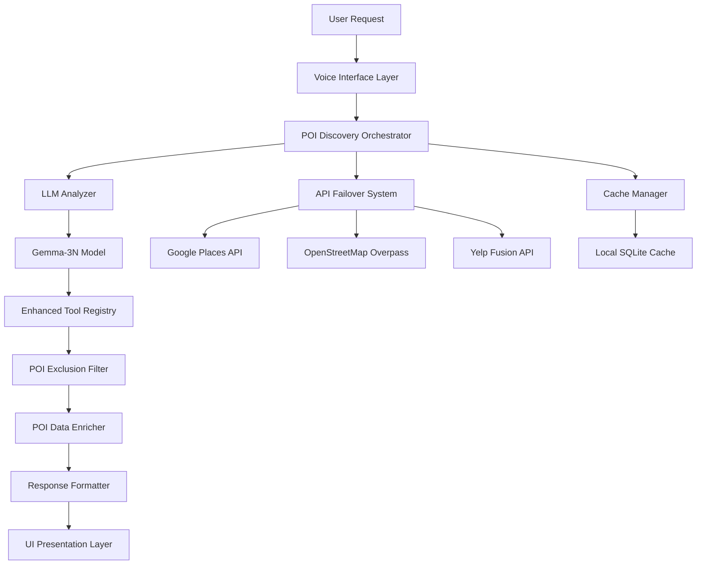
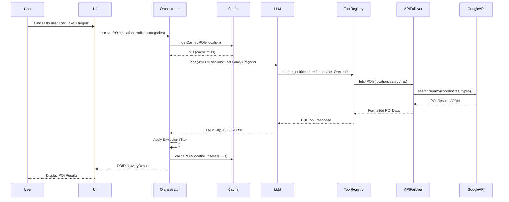
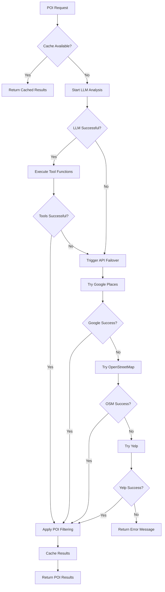

# Real POI Discovery - Technical Design Document

**Feature Name:** `real-poi-discovery`  
**Version:** 1.0  
**Created:** 2025-08-14  
**Status:** DESIGN COMPLETE

## 1. System Architecture Overview

### 1.1 High-Level Architecture



### 1.2 Component Responsibilities

| Component | Responsibility | Platform |
|-----------|---------------|----------|
| **POI Discovery Orchestrator** | Coordinates LLM analysis and API failover | iOS/Android |
| **LLM Analyzer** | Gemma-3N model inference for local POI knowledge | iOS/Android |
| **API Failover System** | Manages external API calls when LLM lacks data | iOS/Android |
| **Enhanced Tool Registry** | Function calling infrastructure for POI tools | iOS/Android |
| **POI Exclusion Filter** | Filters out unwanted chains and gas stations | iOS/Android |
| **Cache Manager** | Local caching for performance optimization | iOS/Android |
| **Response Formatter** | Platform-specific UI data formatting | iOS/Android |

## 2. Component Design Details

### 2.1 POI Discovery Orchestrator

**Purpose:** Central coordinator that manages the complete POI discovery workflow

**Interface:**
```swift
// iOS Implementation
protocol POIDiscoveryOrchestratorProtocol {
    func discoverPOIs(location: String, radius: Double, categories: [String]) async throws -> POIDiscoveryResult
    func getCachedPOIs(location: String) async -> [POI]?
    func invalidateCache(location: String) async
}

class POIDiscoveryOrchestrator: POIDiscoveryOrchestratorProtocol {
    private let llmAnalyzer: LLMAnalyzer
    private let apiFailover: APIFailoverSystem
    private let cacheManager: CacheManager
    private let exclusionFilter: POIExclusionFilter
}
```

```kotlin
// Android Implementation
interface POIDiscoveryOrchestrator {
    suspend fun discoverPOIs(location: String, radius: Double, categories: List<String>): POIDiscoveryResult
    suspend fun getCachedPOIs(location: String): List<POI>?
    suspend fun invalidateCache(location: String)
}

class POIDiscoveryOrchestratorImpl(
    private val llmAnalyzer: LLMAnalyzer,
    private val apiFailover: APIFailoverSystem,
    private val cacheManager: CacheManager,
    private val exclusionFilter: POIExclusionFilter
) : POIDiscoveryOrchestrator
```

**Core Logic Flow:**
1. Check cache for existing POI data
2. If cache miss, initiate LLM analysis
3. If LLM provides insufficient results, trigger API failover
4. Apply POI exclusion filtering
5. Enrich POI data with real-time information
6. Cache results for future queries
7. Return formatted POI response

### 2.2 LLM Analyzer

**Purpose:** Manages Gemma-3N model inference for local POI knowledge extraction

**Model Integration:**
```swift
// iOS - Core ML Integration
class LLMAnalyzer {
    private let gemmaModel: MLModel
    private let toolRegistry: EnhancedToolRegistry
    
    func analyzePOILocation(_ location: String) async throws -> LLMPOIAnalysis {
        let prompt = buildPOIAnalysisPrompt(location: location)
        let modelInput = try MLDictionaryFeatureProvider(dictionary: [
            "input_text": MLFeatureValue(string: prompt)
        ])
        
        let prediction = try await gemmaModel.prediction(from: modelInput)
        return parsePOIAnalysis(prediction)
    }
}
```

```kotlin
// Android - TensorFlow Lite Integration
class LLMAnalyzer(context: Context) {
    private lateinit var interpreter: Interpreter
    private val toolRegistry: EnhancedToolRegistry = EnhancedToolRegistry(context)
    
    suspend fun analyzePOILocation(location: String): LLMPOIAnalysis = withContext(Dispatchers.Default) {
        val prompt = buildPOIAnalysisPrompt(location)
        val inputArray = tokenizeInput(prompt)
        val outputArray = Array(1) { FloatArray(VOCAB_SIZE) }
        
        interpreter.run(inputArray, outputArray)
        return@withContext parsePOIAnalysis(outputArray[0])
    }
}
```

**Tool Integration:**
- Gemma-3N model uses function calling to invoke POI search tools
- Tools include: `search_poi`, `get_poi_details`, `search_internet`, `get_directions`
- Model determines which tools to call based on user query context
- Tool responses are incorporated into final LLM analysis

### 2.3 API Failover System

**Purpose:** Provides robust backup POI data when local LLM knowledge is insufficient

**API Priority Hierarchy:**
1. **Google Places API** (Primary) - Comprehensive POI data with ratings
2. **OpenStreetMap Overpass** (Secondary) - Open source geographic data
3. **Yelp Fusion API** (Tertiary) - Business reviews and photos

**Implementation:**
```swift
// iOS
class APIFailoverSystem {
    private let googlePlacesClient: GooglePlacesClient
    private let osmClient: OpenStreetMapClient
    private let yelpClient: YelpClient
    
    func fetchPOIs(location: CLLocation, categories: [String]) async throws -> [POI] {
        // Try Google Places first
        do {
            let results = try await googlePlacesClient.searchNearby(location: location, types: categories)
            if results.count >= 3 { return results }
        } catch {
            print("Google Places failed: \(error)")
        }
        
        // Fallback to OpenStreetMap
        do {
            let results = try await osmClient.searchPOIs(location: location, categories: categories)
            if results.count >= 2 { return results }
        } catch {
            print("OSM failed: \(error)")
        }
        
        // Final fallback to Yelp
        return try await yelpClient.searchBusinesses(location: location, categories: categories)
    }
}
```

**Rate Limiting:**
- Google Places: 100 requests/hour per user
- OpenStreetMap: 10,000 requests/day total
- Yelp: 5,000 requests/day total
- Exponential backoff for failed requests (1s, 2s, 4s delays)

### 2.4 Enhanced Tool Registry Upgrade

**Current State Analysis:**
- Both iOS and Android have basic ToolRegistry with mock data
- EnhancedToolRegistry adds exclusion filtering but still returns mock responses

**Required Changes:**

```swift
// iOS - Updated ToolRegistry.swift
class ToolRegistry {
    private let apiFailover: APIFailoverSystem
    private let cacheManager: CacheManager
    
    private func registerDefaultTools() {
        // Updated search_poi tool with real implementation
        register(Tool(
            name: "search_poi",
            description: "Search for real points of interest near a location",
            parameters: [
                "location": "The location to search near",
                "category": "Category of POI",
                "radius": "Search radius in miles"
            ],
            execute: { [weak self] params in
                guard let self = self else { return "Error: Tool unavailable" }
                return await self.executeRealPOISearch(params: params)
            }
        ))
    }
    
    private func executeRealPOISearch(params: [String: Any]) async -> String {
        let location = params["location"] as? String ?? ""
        let category = params["category"] as? String ?? "attraction"
        let radius = params["radius"] as? Double ?? 10.0
        
        // Check cache first
        if let cachedResults = await cacheManager.getCachedPOIs(location: location) {
            return formatPOIResults(cachedResults)
        }
        
        // Fetch real POI data
        do {
            let coordinates = try await geocodeLocation(location)
            let pois = try await apiFailover.fetchPOIs(
                location: coordinates, 
                categories: [category]
            )
            
            // Cache the results
            await cacheManager.cachePOIs(location: location, pois: pois)
            
            return formatPOIResults(pois)
        } catch {
            return "Error searching for POIs: \(error.localizedDescription)"
        }
    }
}
```

### 2.5 Cache Management System

**Purpose:** Optimize performance by storing POI data locally to reduce API calls and improve response times

**Cache Strategy:**
- **Geographic Clustering:** Group POIs by coordinate regions
- **Time-based Expiration:** POI data expires after 24 hours
- **LRU Eviction:** Remove least recently used entries when cache fills
- **Size Limits:** Maximum 200MB cache across platforms

**Implementation:**
```swift
// iOS - Core Data backed cache
class CacheManager {
    private let persistentContainer: NSPersistentContainer
    
    func cachePOIs(location: String, pois: [POI]) async {
        let context = persistentContainer.newBackgroundContext()
        
        await context.perform {
            let cacheEntry = POICacheEntry(context: context)
            cacheEntry.location = location
            cacheEntry.timestamp = Date()
            cacheEntry.poisData = try? JSONEncoder().encode(pois)
            
            try? context.save()
        }
    }
    
    func getCachedPOIs(location: String) async -> [POI]? {
        let context = persistentContainer.viewContext
        
        let request: NSFetchRequest<POICacheEntry> = POICacheEntry.fetchRequest()
        request.predicate = NSPredicate(format: "location == %@ AND timestamp > %@", 
                                      location, 
                                      Date().addingTimeInterval(-86400)) // 24 hours
        
        guard let cacheEntry = try? context.fetch(request).first,
              let poisData = cacheEntry.poisData,
              let pois = try? JSONDecoder().decode([POI].self, from: poisData) else {
            return nil
        }
        
        return pois
    }
}
```

```kotlin
// Android - Room Database backed cache
@Entity(tableName = "poi_cache")
data class POICacheEntry(
    @PrimaryKey val location: String,
    val timestamp: Long,
    val poisData: String
)

@Dao
interface POICacheDao {
    @Query("SELECT * FROM poi_cache WHERE location = :location AND timestamp > :minTimestamp")
    suspend fun getCachedPOIs(location: String, minTimestamp: Long): POICacheEntry?
    
    @Insert(onConflict = OnConflictStrategy.REPLACE)
    suspend fun cachePOIs(cacheEntry: POICacheEntry)
}
```

### 2.6 POI Data Models

**Enhanced POI Data Structure:**
```swift
// iOS
struct POI: Codable {
    let id: String
    let name: String
    let category: String
    let coordinate: CLLocationCoordinate2D
    let distance: Double
    let rating: Double?
    let priceLevel: Int?
    let isOpen: Bool?
    let hours: OperatingHours?
    let address: String
    let phoneNumber: String?
    let website: URL?
    let photos: [POIPhoto]
    let reviews: [POIReview]
    let source: DataSource // LLM, GooglePlaces, OSM, Yelp
    let lastUpdated: Date
}

struct OperatingHours: Codable {
    let isOpenNow: Bool
    let periods: [OpeningPeriod]
}

enum DataSource: String, Codable {
    case llm = "local_llm"
    case googlePlaces = "google_places"
    case openStreetMap = "openstreetmap"
    case yelp = "yelp"
    case cached = "cached"
}
```

## 3. Platform-Specific Implementation

### 3.1 iOS Implementation Details

**Core ML Model Integration:**
- Use converted Gemma-3N.mlmodelc file in app bundle
- Leverage Neural Engine for optimized inference
- Implement async/await pattern for model operations
- Background queue processing to avoid UI blocking

**Key iOS Files to Modify:**
1. `/mobile/ios/RoadtripCopilot/Models/ToolRegistry.swift` - Replace mock data
2. `/mobile/ios/RoadtripCopilot/Models/EnhancedToolRegistry.swift` - Upgrade filtering
3. `/mobile/ios/RoadtripCopilot/Models/Gemma3NE2BLoader.swift` - Model integration
4. Create: `/mobile/ios/RoadtripCopilot/Services/POIDiscoveryOrchestrator.swift`
5. Create: `/mobile/ios/RoadtripCopilot/Services/APIFailoverSystem.swift`
6. Create: `/mobile/ios/RoadtripCopilot/Services/CacheManager.swift`

### 3.2 Android Implementation Details

**TensorFlow Lite Model Integration:**
- Use converted Gemma-3N.tflite file in assets folder
- Leverage NNAPI for hardware acceleration
- Implement Kotlin coroutines for async operations
- Background thread processing with proper lifecycle management

**Key Android Files to Modify:**
1. `/mobile/android/app/src/main/java/com/roadtrip/copilot/ai/ToolRegistry.kt` - Replace mock data
2. `/mobile/android/app/src/main/java/com/roadtrip/copilot/ai/EnhancedToolRegistry.kt` - Upgrade filtering
3. `/mobile/android/app/src/main/java/com/roadtrip/copilot/ai/Gemma3NProcessor.kt` - Model integration
4. Create: `/mobile/android/app/src/main/java/com/roadtrip/copilot/services/POIDiscoveryOrchestrator.kt`
5. Create: `/mobile/android/app/src/main/java/com/roadtrip/copilot/services/APIFailoverSystem.kt`
6. Create: `/mobile/android/app/src/main/java/com/roadtrip/copilot/services/CacheManager.kt`

## 4. Data Flow Architecture

### 4.1 Complete POI Discovery Flow



### 4.2 Error Handling Flow



## 5. Performance Optimization

### 5.1 Response Time Targets

| Operation | Target Time | Fallback Time |
|-----------|-------------|---------------|
| Cache Hit | <100ms | N/A |
| LLM Analysis | <350ms | <500ms |
| API Failover | <1000ms | <2000ms |
| Complete Flow | <1500ms | <3000ms |

### 5.2 Memory Management

**iOS Memory Optimization:**
- Use `autoreleasepool` for batch POI processing
- Implement lazy loading for POI photos and details
- Release model memory when app backgrounded
- Monitor memory warnings and clear cache if needed

**Android Memory Optimization:**
- Use appropriate Kotlin coroutine scopes for lifecycle management
- Implement pagination for large POI result sets
- Clear TensorFlow Lite interpreter when not in use
- Use WeakReference for cached POI data

### 5.3 Battery Optimization

- Batch API requests to minimize network radio usage
- Use device location services efficiently (GPS vs Network)
- Implement intelligent cache invalidation based on user movement
- Prioritize Wi-Fi over cellular for POI photo downloads

## 6. Security Considerations

### 6.1 API Key Protection

**iOS:**
```swift
// Store API keys in Keychain
class APIKeyManager {
    private let keychain = Keychain(service: "com.roadtrip.copilot")
    
    func getGooglePlacesAPIKey() -> String? {
        return keychain["google_places_api_key"]
    }
}
```

**Android:**
```kotlin
// Store API keys in Android Keystore
class APIKeyManager(context: Context) {
    private val sharedPrefs = EncryptedSharedPreferences.create(
        "api_keys",
        MasterKeys.getOrCreate(MasterKeys.AES256_GCM_SPEC),
        context,
        EncryptedSharedPreferences.PrefKeyEncryptionScheme.AES256_SIV,
        EncryptedSharedPreferences.PrefValueEncryptionScheme.AES256_GCM
    )
}
```

### 6.2 Privacy Protection

- Never log user location data in production builds
- Implement opt-in location sharing for enhanced POI discovery
- Allow users to clear POI search history
- Comply with GDPR data retention requirements

## 7. Testing Strategy

### 7.1 Unit Testing

**LLM Integration Tests:**
```swift
// iOS
class LLMAnalyzerTests: XCTestCase {
    func testPOIAnalysisPerformance() async throws {
        let analyzer = LLMAnalyzer()
        let startTime = Date()
        
        let result = try await analyzer.analyzePOILocation("Lost Lake, Oregon")
        
        let elapsedTime = Date().timeIntervalSince(startTime)
        XCTAssertLessThan(elapsedTime, 0.35, "LLM analysis should complete within 350ms")
        XCTAssertGreaterThan(result.pois.count, 0, "Should return at least one POI")
    }
}
```

### 7.2 Integration Testing

**End-to-End POI Discovery:**
- Test complete flow from voice input to POI display
- Verify platform parity between iOS and Android results
- Test automotive environment compatibility
- Validate API failover scenarios

### 7.3 Performance Testing

- Load testing with 100+ concurrent POI requests
- Memory leak detection during extended usage
- Battery drain analysis over 8-hour periods
- Network efficiency testing in poor connectivity areas

## 8. Deployment Strategy

### 8.1 Phased Rollout

**Phase 1: Core Infrastructure (Week 1)**
- Implement POI Discovery Orchestrator
- Integrate real API clients (Google Places, OSM, Yelp)
- Replace mock data in ToolRegistry classes

**Phase 2: LLM Integration (Week 2)**
- Deploy Gemma-3N model files to app bundles
- Implement LLM analyzer with tool calling
- Add intelligent failover logic

**Phase 3: Performance & Caching (Week 3)**
- Implement cache management system
- Optimize response times and memory usage
- Add comprehensive error handling

**Phase 4: Polish & Testing (Week 4)**
- Platform parity validation
- Automotive compliance testing
- User acceptance testing
- Performance benchmarking

### 8.2 Feature Flags

Implement feature flags for gradual rollout:
- `enable_real_poi_discovery`: Master switch for new system
- `enable_llm_analysis`: Toggle LLM vs API-only mode
- `enable_poi_caching`: Toggle cache system
- `enable_advanced_filtering`: Toggle enhanced exclusion system

---

**Document Status:** DESIGN COMPLETE  
**Next Phase:** Implementation Task Planning  
**Estimated Implementation Time:** 4 weeks  
**Assigned Agent:** `spec-tasks` for task breakdown