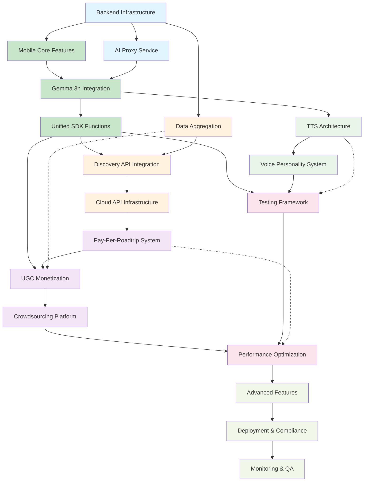

# Roadtrip-Copilot Implementation Roadmap
## Consolidated Mobile + Backend Development Tasks

> **Version**: 3.0  
> **Last Updated**: January 2025  
> **Current Foundation**: 70% Mobile Implementation Ready  
> **Target Platforms**: iOS 14+, Android 8+, CarPlay, Android Auto  
> **Backend Infrastructure**: Cloudflare Workers + Supabase  
> **Core AI Model**: Google Gemma 3n (E2B/E4B)

---

## Executive Summary

This consolidated implementation roadmap merges the mobile development tasks from `/specs/mobile/implementation-tasks.md` with the backend infrastructure tasks from `/specs/backend/implementation-tasks.md`. The roadmap is structured for parallel development across backend infrastructure and mobile platforms while maintaining strict platform parity requirements.

### Implementation Status Overview
**✅ COMPLETED (70% Mobile Foundation)**
- iOS and Android project structures with complete native architecture
- Speech recognition system with 7 voice commands
- 4-step onboarding flow with destination selection
- App icons and testing framework validated
- CarPlay/Android Auto integration foundations

**🔄 REMAINING IMPLEMENTATION (30%)**
- Backend infrastructure and cloud services
- AI model integration and optimization
- Revenue and monetization systems
- Testing framework deployment
- Performance optimization and production readiness

---

## Phase 1: Serverless Backend & Cloud Infrastructure
*Priority: CRITICAL | Timeline: 2-3 weeks | Dependencies: None*

### 1.1 Backend Infrastructure Foundation

- [ ] **1.1.1 Set up Cloudflare Workers & Supabase backend infrastructure**
  - Create Cloudflare Workers project with TypeScript configuration
  - Set up Workers KV for caching and session storage (1GB quota)
  - Implement Durable Objects for real-time coordination
  - Configure environment variables for API keys and secrets
  - Set up edge computing routing with global deployment across 6+ regions
  - _Requirements: Sub-200ms response times, global deployment, session management_
  - _Acceptance Criteria: Health check endpoint operational, load testing 1000 concurrent requests_
  - _Deliverables: `cloudflare/workers/` directory structure, environment template_

- [ ] **1.1.2 Implement Supabase backend integration**
  - Set up Supabase project with PostgreSQL 14+ database
  - Configure PostGIS 3.0+ spatial extensions for location queries
  - Configure Supabase Auth with social providers (Google, Apple, GitHub)
  - Implement Row Level Security (RLS) policies for user data protection
  - Set up Supabase Edge Functions for custom database logic
  - Configure real-time subscriptions for live data synchronization
  - _Requirements: Spatial indexing <50ms within 25 miles, RLS compliance, real-time sync_
  - _Acceptance Criteria: Database schema operational, auth flows tested, spatial queries optimized_
  - _Deliverables: `database/schema.sql`, `database/policies.sql`, migration scripts_

- [ ] **1.1.3 Build core API endpoints infrastructure**
  - Create RESTful endpoints for users, POIs, discoveries, earnings
  - Implement OpenAPI 3.0 specification with complete documentation
  - Add rate limiting (1000 requests/hour per user) and request validation
  - Build error handling with consistent error codes and CORS configuration
  - Implement JWT token generation, validation, and refresh rotation
  - Create session management across devices with GDPR/CCPA compliance
  - _Requirements: <200ms API response times, comprehensive error handling, security compliance_
  - _Acceptance Criteria: API endpoints functional, documentation complete, rate limiting validated_
  - _Deliverables: `api/users.ts`, `api/discoveries.ts`, `api/earnings.ts`, `openapi.yaml`_

### 1.2 Multi-Provider AI Proxy Service

- [ ] **1.2.1 Build multi-provider AI proxy service**
  - Create Cloudflare Workers proxy for OpenAI, Claude, Gemini, xAI APIs
  - Implement rate limiting and cost tracking per user
  - Build intelligent fallback routing between providers
  - Add usage analytics and billing tracking
  - Implement user API token management and validation
  - _Requirements: Provider failover, cost tracking, usage analytics_
  - _Acceptance Criteria: Multi-provider routing functional, cost tracking accurate_
  - _Deliverables: AI proxy service, usage analytics, billing integration_

- [ ] **1.2.2 Create data aggregation pipeline**
  - Build Cloudflare Workers for external API integration (Yelp, Google Reviews)
  - Implement caching strategy using Workers KV for performance optimization
  - Set up data normalization and storage in Supabase with quality scoring
  - Build real-time data processing pipeline with 4-hour refresh cycles
  - Add monitoring and alerting for data quality and service availability
  - _Requirements: Multi-source integration, data quality scoring, real-time processing_
  - _Acceptance Criteria: Data flowing from all sources, quality metrics operational_
  - _Deliverables: Data ingestion pipeline, normalization service, quality monitoring_

---

## Phase 2: Mobile AI Integration - Gemma 3n Unified Architecture
*Priority: HIGH | Timeline: 6-8 weeks | Dependencies: Phase 1 backend foundation*

### 2.1 Complete Core Mobile Features

- [ ] **2.1.1 Enhance existing speech recognition for automotive environments**
  - Improve noise cancellation algorithms for road/engine noise
  - Implement voice activity detection for better wake word performance
  - Add context-aware voice command processing with natural language variations
  - Optimize for 95% accuracy in automotive conditions with confirmation system
  - Create voice command learning system based on user patterns
  - _Requirements: >95% accuracy, <200ms response time, 50+ command variations_
  - _Acceptance Criteria: Automotive testing passed, voice command accuracy validated_
  - _Deliverables: Enhanced speech recognition, voice feedback system, automotive optimization_

- [ ] **2.1.2 Complete discovery and POI system implementation**
  - Complete Apple MapKit integration for iOS POI discovery
  - Implement Google Places API integration for Android POI discovery
  - Build battery-efficient location monitoring (30-60 second intervals, <5% battery impact)
  - Create intelligent POI filtering based on user preferences with 5-mile discovery radius
  - Implement local similarity checking against cached POI database
  - _Requirements: <5% battery impact per hour, 85% accuracy in discovery validation_
  - _Acceptance Criteria: Background monitoring functional, POI validation operational_
  - _Deliverables: Location monitoring service, POI discovery interface, validation system_

- [ ] **2.1.3 Build revenue and earnings system foundation**
  - Build DiscoveryStatus data model with validation, video, and earnings states
  - Create real-time status updates via WebSocket connection with offline capability
  - Implement earnings dashboard showing potential vs actual earnings
  - Build platform-specific revenue breakdown (YouTube, TikTok, Instagram, Facebook)
  - Create roadtrip credits management with transaction history and usage tracking
  - _Requirements: Real-time updates, offline capability, accurate credit accounting_
  - _Acceptance Criteria: Status tracking operational, earnings dashboard functional_
  - _Deliverables: Revenue data models, earnings dashboard, credit management system_

### 2.2 Gemma 3n Model Integration and Optimization

- [x] **2.2.1 Implement iOS Core ML Gemma 3n integration** ✅ COMPLETED
  - Convert Gemma 3n models (E2B/E4B variants) to Core ML format
  - Implement Neural Engine acceleration with hardware capability detection
  - Build dynamic model selection based on device capabilities (4GB+ for E2B, 8GB+ for E4B)
  - Create memory management system with 2-3GB footprint limits
  - Implement unified SDK interface: `initializeModel()`, `loadModel()`, `unloadModel()`
  - _Requirements: <350ms inference time, 2-3GB memory usage, Neural Engine optimization_
  - _Acceptance Criteria: Model conversion complete, hardware acceleration functional_
  - _Deliverables: `models/ios/gemma-3n-e2b.mlmodel`, `sdk/RoadtripLLMSDK.swift`_

- [x] **2.2.2 Implement Android MediaPipe/TensorFlow Lite integration** ✅ COMPLETED
  - Convert Gemma 3n models to MediaPipe .task format and TensorFlow Lite
  - Implement NPU/AICore acceleration with NNAPI delegate
  - Build GPU delegate fallback for non-NPU devices with OpenCL optimization
  - Create dynamic quantization system (INT8, INT4, INT2 based on device)
  - Implement unified SDK interface matching iOS implementation
  - _Requirements: <350ms inference time, NPU acceleration, memory optimization_
  - _Acceptance Criteria: Model conversion complete, NPU acceleration functional_
  - _Deliverables: `models/android/gemma-3n-e2b.task`, `sdk/RoadtripLLMSDK.kt`_

- [x] **2.2.3 Build unified multimodal processing pipeline** ✅ COMPLETED
  - Implement text, image, and audio tokenization for Gemma 3n
  - Create multimodal input preparation and batching system
  - Build unified output parsing for all AI tasks across platforms
  - Implement session management with LRU caching (<50ms model switching)
  - Replace multi-agent architecture with single unified Gemma 3n processing
  - _Requirements: Multimodal input support, efficient tokenization, unified processing_
  - _Acceptance Criteria: Multimodal pipeline functional, session management operational_
  - _Deliverables: Unified processing pipeline, tokenization system, session manager_

### 2.3 Unified SDK Function Implementation

- [x] **2.3.1 Implement unified POI discovery and validation** ✅ COMPLETED
  - Replace existing validation agents with single Gemma 3n inference
  - Build comprehensive prompt engineering for discovery validation
  - Implement `processDiscovery()` function across all 4 platforms
  - Implement `validatePOI()` function with >85% accuracy and confidence scoring
  - Create similarity scoring and new discovery determination system
  - _Requirements: Single model validation, 85% accuracy, confidence scoring_
  - _Acceptance Criteria: Unified validation functional, accuracy targets met_
  - _Deliverables: Discovery validation service, confidence scoring system_

- [x] **2.3.2 Build unified content generation system** ✅ COMPLETED
  - Replace content generation agents with Gemma 3n dialogue creation
  - Implement `generateContent()` function for 6-second conversational scripts
  - Build revenue estimation based on historical data with quality assessment
  - Create A/B testing framework for content variants and optimization
  - Implement platform-specific content formatting for video upload APIs
  - _Requirements: Natural dialogue generation, accurate revenue estimation_
  - _Acceptance Criteria: Content generation functional, revenue estimation accurate_
  - _Deliverables: Content generation service, revenue estimation, A/B testing framework_

- [x] **2.3.3 Implement unified audio processing pipeline** ✅ COMPLETED
  - Implement `transcribeAudio()` and `synthesizeVoice()` functions
  - Build streaming inference with <350ms first token across platforms
  - Create context management and conversation history preservation
  - Implement error handling and graceful degradation with cloud fallback
  - Integrate with TTS system for voice personality and context awareness
  - _Requirements: <350ms first token, context preservation, error handling_
  - _Acceptance Criteria: Audio processing functional, performance targets met_
  - _Deliverables: Audio processing pipeline, context management, error handling_

---

## Phase 3: System Integration & Data Processing
*Priority: HIGH | Timeline: 4-5 weeks | Dependencies: Phase 1-2 completion*

### 3.1 Multi-Source Data Aggregation Service

- [ ] **3.1.1 Implement comprehensive data ingestion pipeline**
  - Establish connections to Yelp, Google Reviews, TripAdvisor, and social media APIs
  - Build data normalization pipeline for consistent 5-star rating scale
  - Implement weighted conflict resolution (70% recent data priority)
  - Create intelligent throttling and request queuing with KV storage
  - Add service availability monitoring and logging to Supabase
  - Maintain 4-hour update intervals for active locations using Durable Objects
  - _Requirements: Multi-source integration, data normalization, conflict resolution_
  - _Acceptance Criteria: Data flowing from all sources, normalization operational_
  - _Deliverables: Data ingestion service, normalization pipeline, conflict resolution_

- [ ] **3.1.2 Build real-time data processing pipeline**
  - Process social media mentions, review updates within 5 minutes using edge computing
  - Implement trend analysis and operational status change detection
  - Create auto-scaling across global edge locations for sub-5-minute updates
  - Build automated quality filtering with Supabase Edge Functions
  - Process regional data at nearest edge locations (<200ms API response)
  - Provide delta updates to minimize mobile data consumption
  - _Requirements: Sub-5-minute updates, automated quality filtering, delta updates_
  - _Acceptance Criteria: Real-time processing functional, quality filtering operational_
  - _Deliverables: Real-time processing service, quality filtering, delta update system_

### 3.2 Mobile Discovery API Integration

- [ ] **3.2.1 Build discovery submission API integration**
  - Implement POI discovery submission with privacy-preserving data transmission
  - Create multimodal data upload (photos, voice descriptions, context)
  - Build real-time validation response handling with offline queue capability
  - Implement retry mechanism for failed submissions with exponential backoff
  - Create discovery data collection interface with voice recording and photo capture
  - _Requirements: Privacy-preserving transmission, multimodal upload, offline capability_
  - _Acceptance Criteria: Discovery submission functional, offline capability validated_
  - _Deliverables: Discovery submission API, multimodal upload, offline queue system_

- [ ] **3.2.2 Create discovery status and tracking system**
  - Implement WebSocket integration for real-time status updates
  - Build discovery validation status tracking (pending, validated, duplicate, rejected)
  - Create video generation status tracking (queued, generating, uploaded, earning, failed)
  - Implement push notification system for key status changes
  - Build discovery history with filtering (all, new only, earning) and management
  - _Requirements: Real-time status updates, comprehensive tracking, push notifications_
  - _Acceptance Criteria: Status tracking operational, notifications functional_
  - _Deliverables: Status tracking service, WebSocket integration, notification system_

### 3.3 Cloud API Infrastructure

- [ ] **3.3.1 Build high-performance spatial API infrastructure**
  - Build sub-200ms POI queries within 25-mile radius using global edge network
  - Implement spatial indexing (PostGIS) for location-based searches
  - Create secure token-based authentication with automatic refresh via Cloudflare Workers
  - Maintain backward compatibility with graceful migration paths
  - Implement eventual consistency with conflict resolution for distributed updates
  - Provide bulk data endpoints for offline synchronization with KV storage caching
  - _Requirements: <200ms spatial queries, secure authentication, eventual consistency_
  - _Acceptance Criteria: Spatial queries optimized, authentication functional_
  - _Deliverables: Spatial API service, authentication system, caching layer_

- [ ] **3.3.2 Implement user management and analytics service**
  - Track anonymous usage metrics with Supabase RLS for user data protection
  - Aggregate POI discovery patterns and feature usage using real-time analytics
  - Monitor API response times and system utilization with edge analytics
  - Generate trending POIs and geographic hotspots using PostgreSQL analytics
  - Implement GDPR/CCPA compliant data handling with automatic retention policies
  - Create live system health dashboards accessible via Cloudflare Workers API
  - _Requirements: Privacy compliance, real-time analytics, system health monitoring_
  - _Acceptance Criteria: Analytics operational, privacy compliance validated_
  - _Deliverables: Analytics service, privacy compliance system, health monitoring_

---

## Phase 4: Revenue & Monetization Systems
*Priority: MEDIUM | Timeline: 5-6 weeks | Dependencies: Phase 2-3 completion*

### 4.1 Pay-Per-Roadtrip and Credit System

- [ ] **4.1.1 Implement pay-per-roadtrip and credit system backend**
  - Build the backend logic for the pay-per-roadtrip model with $0.50 pricing
  - Create the credit system for earning and spending roadtrip credits
  - Integrate with payment gateways for roadtrip purchases and subscription management
  - Implement credit conversion and balance management system with transaction history
  - Build referral system with 10th roadtrip popup trigger and tracking analytics
  - _Requirements: Accurate credit accounting, transaction history, referral tracking_
  - _Acceptance Criteria: Credit system functional, payment integration operational_
  - _Deliverables: Credit management system, payment integration, referral tracking_

- [ ] **4.1.2 Build mobile revenue features and payment integration**
  - Implement roadtrip credits management with balance tracking and usage system
  - Create earnings dashboard with real-time analytics and performance metrics
  - Build payment integration flows for iOS (StoreKit) and Android (Google Play Billing)
  - Implement automatic 10th roadtrip popup trigger system with sharing methods
  - Create referral code generation, sharing, and tracking with fraud prevention
  - _Requirements: Cross-platform payment integration, referral system, fraud detection_
  - _Acceptance Criteria: Payment flows functional, referral system operational_
  - _Deliverables: Mobile payment integration, earnings dashboard, referral system_

### 4.2 UGC Monetization Pipeline

- [ ] **4.2.1 Implement first-discovery validation and tracking**
  - Implement the "First-Discovery" validation service with blockchain-like verification
  - Create first-discovery timestamp and location verification with geofencing
  - Build duplicate discovery prevention and fraud detection algorithms
  - Implement discovery ownership and attribution system with audit trail
  - Create discovery status tracking (pending, validated, earning, paid)
  - _Requirements: Accurate validation, fraud prevention, comprehensive tracking_
  - _Acceptance Criteria: Validation service operational, fraud detection functional_
  - _Deliverables: Discovery validation service, fraud detection, tracking system_

- [ ] **4.2.2 Build automated content generation and distribution**
  - Create the automated video generation pipeline for 6-second podcast content
  - Build the social media distribution engine with platform-specific optimization
  - Implement multi-format content creation (video scripts, social media posts)
  - Create content quality assessment and regeneration system
  - Build platform-specific content formatting for video upload APIs
  - _Requirements: Automated content generation, multi-platform distribution_
  - _Acceptance Criteria: Content pipeline functional, distribution operational_
  - _Deliverables: Content generation pipeline, distribution engine, quality assessment_

- [ ] **4.2.3 Implement revenue tracking and sharing system**
  - Implement the revenue tracking and 50/50 sharing system with precision accounting
  - Build real-time revenue tracking from YouTube, TikTok, Instagram, Facebook
  - Create platform-specific revenue attribution and analytics with tax reporting
  - Implement revenue reconciliation and dispute resolution with audit trail
  - Build international payout support via Stripe Connect with tax compliance
  - _Requirements: 50/50 revenue accuracy, multi-platform tracking, tax compliance_
  - _Acceptance Criteria: Revenue sharing accurate, multi-platform tracking functional_
  - _Deliverables: Revenue sharing engine, multi-platform tracking, tax system_

### 4.3 POI-Discovery Crowdsourcing Platform

- [ ] **4.3.1 Develop POI owner portal and business features**
  - Build the Chrome extension with the AI-powered discovery agent
  - Implement the community review and validation system
  - Create the self-service portal for business owners with analytics dashboard
  - Build promotional tools and business intelligence features
  - Integrate with Stripe Connect for international payouts and business accounts
  - _Requirements: Chrome extension functional, business portal operational_
  - _Acceptance Criteria: Extension deployed, business features functional_
  - _Deliverables: Chrome extension, business portal, promotional tools_

- [ ] **4.3.2 Build viral referral and growth system**
  - Build the API endpoints for generating referral links and attribution
  - Implement referral completion validation and reward distribution
  - Integrate with the database to store and manage referral data
  - Implement the fraud detection and prevention logic with machine learning
  - Create viral marketing features and social sharing optimization
  - _Requirements: Referral tracking, fraud prevention, viral features_
  - _Acceptance Criteria: Referral system operational, fraud detection functional_
  - _Deliverables: Referral API, fraud detection, viral marketing features_

---

## Phase 5: TTS Integration - Deploy Kitten TTS System
*Priority: MEDIUM | Timeline: 4-5 weeks | Dependencies: Phase 2 AI integration*

### 5.1 Three-Tier TTS Architecture

- [ ] **5.1.1 Implement Kitten TTS primary engine**
  - Deploy <25MB Kitten TTS models to iOS (Core ML) and Android (TensorFlow Lite)
  - Implement 8-voice system with automotive-optimized voice configurations
  - Build LoRA adaptation system for automotive domain optimization
  - Create real-time synthesis system achieving <350ms response times
  - Implement memory optimization with <25MB footprint and <1% battery per hour
  - _Requirements: <25MB models, 8 voices, <350ms synthesis, automotive optimization_
  - _Acceptance Criteria: TTS models deployed, performance targets met_
  - _Deliverables: Kitten TTS integration, voice configurations, performance optimization_

- [ ] **5.1.2 Deploy Kokoro TTS premium engine**
  - Implement ~330MB Kokoro TTS with on-demand download system
  - Build 6-language support system (EN, FR, KO, JA, ZH, ES)
  - Create WiFi-based download and local caching system with intelligent management
  - Implement premium quality synthesis for content creation with voice cloning
  - Build dynamic engine selection based on context, battery, and network conditions
  - _Requirements: Premium quality synthesis, multi-language support, intelligent downloading_
  - _Acceptance Criteria: Premium TTS functional, multi-language support operational_
  - _Deliverables: Kokoro TTS integration, multi-language support, download system_

- [ ] **5.1.3 Build XTTS Cloud fallback integration**
  - Implement cloud-based XTTS API integration with secure token management
  - Build voice cloning capabilities for custom user voices
  - Create intelligent fallback logic for network-based synthesis
  - Implement user API token management and security with usage tracking
  - Build comprehensive TTS integration testing and validation framework
  - _Requirements: Voice cloning capability, secure API integration, intelligent fallback_
  - _Acceptance Criteria: Cloud fallback functional, voice cloning operational_
  - _Deliverables: XTTS integration, voice cloning, fallback system_

### 5.2 Voice Personality and Context System

- [ ] **5.2.1 Build voice personality and automotive optimization**
  - Implement 4 personality types (Friendly Guide, Professional Assistant, Casual Companion, Enthusiastic Explorer)
  - Create voice parameter mapping for different contexts and use cases
  - Build personality consistency across different TTS engines with user preference learning
  - Implement road noise compensation and audio enhancement for automotive environments
  - Create CarPlay and Android Auto audio session management with emergency protocols
  - _Requirements: 4 distinct personalities, context-aware selection, automotive integration_
  - _Acceptance Criteria: Voice personalities functional, automotive optimization complete_
  - _Deliverables: Personality system, automotive audio optimization, emergency protocols_

- [ ] **5.2.2 Implement 6-second podcast generation system**
  - Build automated content template system for different POI categories
  - Create duration optimization algorithms for exactly 6-second output
  - Implement voice selection strategy based on content type with quality assessment
  - Build performance monitoring for TTS (<200ms startup, <350ms first token)
  - Create intelligent TTS selection system with performance-based switching
  - _Requirements: Exactly 6-second output, automated generation, quality optimization_
  - _Acceptance Criteria: Podcast generation functional, duration control accurate_
  - _Deliverables: Content template system, duration control, voice selection_

---

## Phase 6: Testing Implementation & Performance Optimization
*Priority: HIGH | Timeline: 4-5 weeks | Dependencies: Phase 2-5 completion*

### 6.1 Comprehensive Testing Framework

- [ ] **6.1.1 Deploy automated testing suite**
  - Deploy automated testing for all 7 core voice commands with pattern matching validation
  - Build voice command pattern matching validation tests with noise tolerance
  - Create automated testing for multimodal input processing with Gemma 3n model validation
  - Implement performance testing for <200ms voice response and <350ms AI inference
  - Build cross-platform consistency testing for iOS/Android feature parity
  - _Requirements: 95% voice command accuracy, multimodal testing, cross-platform parity_
  - _Acceptance Criteria: Automated tests functional, performance validated_
  - _Deliverables: Automated test suite, performance validation, parity testing_

- [ ] **6.1.2 Implement CarPlay/Android Auto testing and compliance**
  - Deploy voice-only interface testing for automotive safety with NHTSA compliance
  - Build template rendering and interaction testing for CarPlay/Android Auto
  - Create audio ducking and session management testing with emergency scenarios
  - Implement 2-second visual display time limit and 12-second task limit validation
  - Build speed-based interface restrictions (audio-only above 5 mph) with safety protocols
  - _Requirements: Automotive safety compliance, emergency handling, NHTSA validation_
  - _Acceptance Criteria: Safety compliance validated, emergency protocols functional_
  - _Deliverables: Automotive testing suite, safety compliance validation, emergency protocols_

- [ ] **6.1.3 Build real-world and accessibility testing**
  - Build testing framework for various vehicle types and audio systems
  - Create road noise and vibration testing scenarios with different lighting conditions
  - Deploy automated accessibility testing (VoiceOver/TalkBack) with automotive optimization
  - Build large touch target optimization (min 44pt iOS / 48dp Android)
  - Implement high contrast and visibility optimization with voice interaction acceleration
  - _Requirements: Real-world validation, accessibility compliance, automotive usability_
  - _Acceptance Criteria: Real-world testing passed, accessibility validated_
  - _Deliverables: Real-world testing framework, accessibility compliance, usability optimization_

### 6.2 Performance and Resource Optimization

- [ ] **6.2.1 Implement comprehensive performance optimization**
  - Build intelligent memory management with automatic cleanup and leak prevention
  - Create CPU usage optimization for background processing with thermal throttling
  - Implement battery-aware processing with quality scaling and power saving modes
  - Build network and connectivity optimization with offline capability and bandwidth awareness
  - Create response time optimization (sub-200ms voice, <350ms AI, <100ms UI)
  - _Requirements: Memory optimization, thermal management, battery efficiency_
  - _Acceptance Criteria: Performance targets met, resource usage optimized_
  - _Deliverables: Performance optimization system, resource management, efficiency monitoring_

- [ ] **6.2.2 Build monitoring and analytics infrastructure**
  - Implement comprehensive performance metrics collection with real-time monitoring
  - Create system health monitoring and alerting with automated incident response
  - Build user behavior analytics and engagement tracking with retention analysis
  - Implement A/B testing framework for feature optimization with conversion tracking
  - Create executive dashboard and key performance indicator tracking
  - _Requirements: Real-time monitoring, automated alerting, comprehensive analytics_
  - _Acceptance Criteria: Monitoring operational, analytics functional_
  - _Deliverables: Monitoring system, analytics platform, executive dashboard_

---

## Phase 7: Production Readiness & Launch Preparation
*Priority: HIGH | Timeline: 4-5 weeks | Dependencies: All previous phases*

### 7.1 Advanced Features & Technical Infrastructure

- [ ] **7.1.1 Implement over-the-air model update system**
  - Build delta model updates (only changed weights) with version management
  - Create A/B testing framework for new models with gradual rollout capability
  - Implement gradual rollout with monitoring and automatic rollback on regression
  - Add background download during off-peak hours with WiFi preference
  - Build model versioning and compatibility checks with validation
  - _Requirements: Delta updates, A/B testing, automatic rollback_
  - _Acceptance Criteria: OTA updates functional, rollback system operational_
  - _Deliverables: OTA update system, A/B testing framework, rollback mechanism_

- [ ] **7.1.2 Build global multi-region infrastructure**
  - Implement multi-region deployment (NA, EU, APAC, LATAM) with data residency
  - Create CDN integration for static content with edge computing optimization
  - Add edge computing for real-time processing with automatic region failover
  - Build data residency compliance per region with cross-region synchronization
  - Create comprehensive monitoring and analytics across all regions
  - _Requirements: Multi-region deployment, data residency, edge computing_
  - _Acceptance Criteria: Global infrastructure operational, compliance validated_
  - _Deliverables: Multi-region deployment, CDN integration, compliance system_

### 7.2 Deployment Infrastructure and Compliance

- [ ] **7.2.1 Build automated deployment and security**
  - Implement continuous integration with automated testing and build verification
  - Create automated app store submission and review process with compliance verification
  - Build staged deployment (alpha, beta, production) with rollback capability
  - Implement comprehensive security audit and penetration testing
  - Create privacy policy implementation and GDPR/CCPA compliance with data encryption
  - _Requirements: Automated deployment, security compliance, privacy protection_
  - _Acceptance Criteria: Deployment pipeline operational, security audit passed_
  - _Deliverables: CI/CD pipeline, security audit, compliance verification_

- [ ] **7.2.2 Create app store optimization and launch strategy**
  - Build app store listing optimization with keyword research and promotional materials
  - Create compliance verification for iOS App Store and Google Play policies
  - Implement soft launch in select markets for validation and user feedback
  - Build user onboarding optimization and conversion tracking with A/B testing
  - Create influencer and partnership marketing integration with viral features
  - _Requirements: App store optimization, soft launch, user acquisition_
  - _Acceptance Criteria: Store listings optimized, soft launch successful_
  - _Deliverables: App store materials, launch strategy, marketing integration_

### 7.3 System Monitoring & Quality Assurance

- [ ] **7.3.1 Deploy production monitoring and support**
  - Deploy comprehensive app performance monitoring with crash reporting
  - Create user experience monitoring and satisfaction tracking with feedback collection
  - Build system health monitoring with automated alerting and escalation
  - Implement in-app help and support system with customer service integration
  - Create user community and knowledge base with continuous improvement process
  - _Requirements: Production monitoring, user support, continuous improvement_
  - _Acceptance Criteria: Monitoring operational, support system functional_
  - _Deliverables: Production monitoring, support system, community platform_

- [ ] **7.3.2 Build post-launch optimization and scaling**
  - Build rapid iteration capability for post-launch improvements
  - Implement user feedback integration and feature prioritization with data-driven decisions
  - Create scaling preparation for increased user load with performance optimization
  - Build competitive analysis and market response capability with feature tracking
  - Implement comprehensive test infrastructure with chaos engineering for resilience
  - _Requirements: Rapid iteration, scaling preparation, competitive analysis_
  - _Acceptance Criteria: Post-launch optimization ready, scaling prepared_
  - _Deliverables: Iteration framework, scaling infrastructure, competitive monitoring_

---

## Cross-Platform Dependencies Diagram

---

## Resource Allocation and Timeline Summary

### Team Structure (10-12 Developers)

**Backend Infrastructure Team (3-4 developers)**
- 1 Senior Backend Engineer (Cloudflare Workers/Supabase)
- 1 Database Architect (PostgreSQL/PostGIS/Spatial)
- 1 DevOps Engineer (CI/CD/Multi-region deployment)
- 1 API/Integration Engineer (External APIs/Data aggregation)

**Mobile Development Team (4-5 developers)**
- 2 Senior iOS Developers (Swift/SwiftUI/CarPlay/Core ML)
- 2 Senior Android Developers (Kotlin/Compose/Android Auto/TensorFlow)
- 1 Mobile AI/ML Engineer (Cross-platform model optimization)

**AI/ML Integration Team (2 developers)**
- 1 Senior AI/ML Engineer (Gemma 3n conversion/optimization)
- 1 Voice AI Engineer (TTS integration/Voice processing)

**Quality Assurance Team (2 developers)**
- 1 Senior QA Engineer (Cross-platform/Automotive testing)
- 1 Performance Engineer (Load testing/Performance optimization)

### Implementation Timeline Overview
- **Total Duration**: 26-33 weeks (6.5-8.25 months)
- **Critical Path**: Backend → Mobile AI → Revenue → Testing → Production
- **Parallel Development**: TTS, Testing, and Performance phases run concurrently
- **Risk Buffer**: 25% timeline buffer for integration challenges

### Success Criteria by Phase
**Phase 1-2 (Weeks 1-10)**: Backend operational + AI integration complete
**Phase 3-4 (Weeks 11-20)**: Discovery system + Revenue features functional
**Phase 5-6 (Weeks 21-28)**: TTS deployed + Testing/Performance optimized
**Phase 7 (Weeks 29-33)**: Production ready + Launch prepared

### Business Success Metrics
- **Technical Performance**: <350ms AI inference, <200ms API response, >85% discovery accuracy
- **Platform Parity**: 100% feature consistency across iOS/Android/CarPlay/Android Auto
- **Revenue Accuracy**: 100% accurate 50/50 revenue sharing with financial audit compliance
- **User Experience**: >70% retention at 30 days, >4.2 app store rating
- **Business Growth**: >2 discoveries per user per month, >15% referral conversion

This consolidated implementation roadmap provides a comprehensive development strategy that merges backend infrastructure with mobile application development while maintaining strict platform parity and performance requirements across all four target platforms.