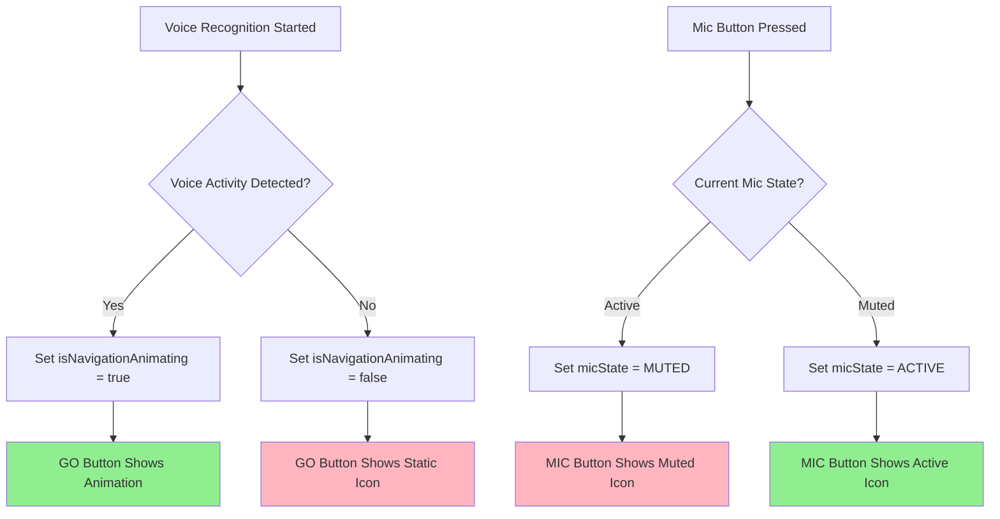

# Voice Animation Platform Parity Technical Design

## Design Overview

This document provides the technical architecture for separating voice animations between GO/Navigate buttons and MIC buttons to achieve 100% platform parity and eliminate animation violations.

## Current State Analysis

### Problem Identification
Based on code analysis, voice animations are currently appearing on both button types due to shared animation state management, violating the platform parity requirement that MIC buttons should ONLY function as mute/unmute toggles.

### Architecture Analysis

#### iOS Current Implementation (SetDestinationView.swift)
```swift
// PROBLEM: VoiceAnimationButton used for multiple button types
VoiceAnimationButton(
    action: { /* navigation or mic action */ },
    isListening: isListening, // ← Shared state causing animation on all buttons
    icon: buttonIcon
)
```

#### Android Current Implementation (SetDestinationScreen.kt)  
```kotlin
// PROBLEM: Voice animation state applied to both button types
AnimatedContent(
    targetState = isVoiceDetected, // ← Shared state causing animation on all buttons
    transitionSpec = { ... }
) { voiceDetected ->
    // Animation appears on both GO and MIC buttons
}
```

## Solution Architecture

### Design Principles

1. **Animation Isolation**: Separate animation states for GO and MIC buttons
2. **Platform Parity**: Identical behavior across iOS, Android, CarPlay, Android Auto  
3. **State Management**: Dedicated state variables for each button type
4. **Performance**: Efficient animation resources without overhead
5. **Accessibility**: Maintain WCAG 2.1 AAA compliance

### Technical Approach

#### 1. State Management Separation

**iOS Solution:**
```swift
// Separate animation states
@State private var isNavigationAnimating: Bool = false  // GO button only
@State private var micMuteState: MicState = .active     // MIC button only

enum MicState {
    case active, muted
    // NO animation states for MIC button
}
```

**Android Solution:**
```kotlin
// Separate animation states  
private val _isNavigationAnimating = MutableStateFlow(false) // GO button only
private val _micMuteState = MutableStateFlow(MicState.ACTIVE) // MIC button only

enum class MicState {
    ACTIVE, MUTED
    // NO animation states for MIC button
}
```

#### 2. Component Architecture

##### iOS Components

**NavigationButton (GO Button with Animations):**
```swift
struct NavigationButton: View {
    let action: () -> Void
    @Binding var isAnimating: Bool  // ← Only for navigation button
    let navigationIcon: String
    
    var body: some View {
        Button(action: action) {
            AnimatedContent(isAnimating) { animating in
                if animating {
                    VoiceAnimationView() // ← Animation ONLY here
                } else {
                    Image(systemName: navigationIcon)
                }
            }
        }
    }
}
```

**MicToggleButton (MIC Button - NO Animations):**
```swift
struct MicToggleButton: View {
    let action: () -> Void
    @Binding var micState: MicState  // ← Static state only
    
    var body: some View {
        Button(action: action) {
            // NO AnimatedContent - static icons only
            Image(systemName: micState == .muted ? "mic.slash" : "mic")
                .foregroundColor(micState == .muted ? .red : .primary)
        }
    }
}
```

##### Android Components

**NavigationButton (GO Button with Animations):**
```kotlin
@Composable
fun NavigationButton(
    onClick: () -> Unit,
    isAnimating: Boolean, // ← Only for navigation button
    navigationIcon: ImageVector
) {
    IconButton(onClick = onClick) {
        AnimatedContent(
            targetState = isAnimating,
            transitionSpec = { fadeIn() with fadeOut() }
        ) { animating ->
            if (animating) {
                VoiceAnimationComponent() // ← Animation ONLY here
            } else {
                Icon(imageVector = navigationIcon, contentDescription = "Navigate")
            }
        }
    }
}
```

**MicToggleButton (MIC Button - NO Animations):**
```kotlin
@Composable  
fun MicToggleButton(
    onClick: () -> Unit,
    micState: MicState // ← Static state only
) {
    IconButton(onClick = onClick) {
        // NO AnimatedContent - static icons only
        Icon(
            imageVector = when (micState) {
                MicState.MUTED -> Icons.Default.MicOff
                MicState.ACTIVE -> Icons.Default.Mic
            },
            contentDescription = when (micState) {
                MicState.MUTED -> "Unmute microphone"
                MicState.ACTIVE -> "Mute microphone"
            },
            tint = if (micState == MicState.MUTED) Color.Red else MaterialTheme.colorScheme.onSurface
        )
    }
}
```

#### 3. Animation State Management

##### Voice Recognition State Flow



##### State Binding Logic

**iOS State Management:**
```swift
// Voice activity triggers ONLY navigation animation
func updateVoiceActivity(_ isActive: Bool) {
    withAnimation(.easeInOut(duration: 0.3)) {
        isNavigationAnimating = isActive  // ← Affects GO button only
    }
    // micMuteState remains unchanged
}

// Mic toggle affects ONLY mic state  
func toggleMicrophone() {
    micMuteState = micMuteState == .active ? .muted : .active
    // isNavigationAnimating remains unchanged
}
```

**Android State Management:**
```kotlin
// Voice activity triggers ONLY navigation animation
fun updateVoiceActivity(isActive: Boolean) {
    _isNavigationAnimating.value = isActive  // ← Affects GO button only
    // _micMuteState remains unchanged
}

// Mic toggle affects ONLY mic state
fun toggleMicrophone() {
    _micMuteState.value = when (_micMuteState.value) {
        MicState.ACTIVE -> MicState.MUTED
        MicState.MUTED -> MicState.ACTIVE
    }
    // _isNavigationAnimating remains unchanged
}
```

### Platform-Specific Implementation

#### iOS Implementation Strategy

**File:** `/mobile/ios/RoadtripCopilot/Views/SetDestinationView.swift`

**Changes Required:**
1. Replace shared `VoiceAnimationButton` with separate `NavigationButton` and `MicToggleButton`
2. Add dedicated state variables for each button type
3. Update voice activity listeners to affect only navigation animation
4. Ensure mic button uses static icon switching only

#### Android Implementation Strategy

**File:** `/mobile/android/app/src/main/java/com/roadtrip/copilot/ui/screens/SetDestinationScreen.kt`

**Changes Required:**
1. Replace shared `AnimatedContent` with separate button components
2. Add dedicated StateFlow variables for each button type
3. Update voice detection logic to trigger only navigation animations
4. Implement static mic button with state-based icon switching

#### CarPlay Implementation Strategy

**Constraints:**
- CarPlay templates have limited animation support
- Focus on clear state indication rather than complex animations
- Ensure animations don't violate CarPlay template guidelines

#### Android Auto Implementation Strategy

**Constraints:**
- Android Auto templates restrict custom animations
- Prioritize clear visual state over complex animation effects
- Ensure compliance with Android Auto safety guidelines

## Performance Considerations

### Animation Resource Management

1. **Shared Animation Assets**: Use common animation resources for GO buttons across platforms
2. **Memory Optimization**: Limit animation memory footprint to <2MB per screen
3. **GPU Acceleration**: Leverage platform-specific hardware acceleration (Core Animation/Compose GPU)
4. **Battery Efficiency**: Minimize animation impact on battery usage

### State Management Efficiency

1. **Reactive Updates**: Use platform-native reactive patterns (SwiftUI/@State, Compose/StateFlow)
2. **Minimal Re-composition**: Ensure state changes trigger minimal UI updates
3. **Animation Cancellation**: Properly cancel animations when screen changes

## Testing Strategy

### Unit Testing

**iOS Unit Tests:**
```swift
func testNavigationButtonAnimationIsolation() {
    // Test that voice activity affects only navigation animation
    updateVoiceActivity(true)
    XCTAssertTrue(isNavigationAnimating)
    XCTAssertEqual(micMuteState, .active) // ← Unchanged
}

func testMicButtonStateIsolation() {
    // Test that mic toggle affects only mic state
    toggleMicrophone()
    XCTAssertEqual(micMuteState, .muted)
    XCTAssertFalse(isNavigationAnimating) // ← Unchanged
}
```

**Android Unit Tests:**
```kotlin
@Test
fun testNavigationButtonAnimationIsolation() {
    // Test that voice activity affects only navigation animation
    updateVoiceActivity(true)
    assertTrue(_isNavigationAnimating.value)
    assertEquals(MicState.ACTIVE, _micMuteState.value) // ← Unchanged
}

@Test  
fun testMicButtonStateIsolation() {
    // Test that mic toggle affects only mic state
    toggleMicrophone()
    assertEquals(MicState.MUTED, _micMuteState.value)
    assertFalse(_isNavigationAnimating.value) // ← Unchanged
}
```

### Integration Testing

1. **Cross-Platform Parity**: Verify identical behavior across all platforms
2. **Animation Performance**: Ensure animations maintain 60fps
3. **State Consistency**: Validate state changes don't interfere between buttons
4. **Accessibility**: Confirm screen reader compatibility with animation changes

### Manual Testing Checklist

- [ ] GO button shows voice animation during speech detection
- [ ] MIC button NEVER shows voice animation
- [ ] MIC button shows clear muted/active state indication
- [ ] Platform behavior is identical across iOS/Android
- [ ] Animations perform smoothly without frame drops
- [ ] Screen readers announce correct button states

## Security and Privacy Considerations

### Voice Activity Detection
- Animation state changes must not leak voice content
- Voice activity detection should use local processing only
- No voice data transmitted during animation state changes

### Accessibility Privacy
- Screen reader announcements must not expose sensitive voice content
- Animation state should be describable without revealing voice input

## Risk Mitigation

### Technical Risks

1. **Animation Interference**: Risk of animation states affecting each other
   - **Mitigation**: Complete state isolation through separate variables
   
2. **Performance Degradation**: Risk of animation overhead
   - **Mitigation**: Optimized animation resources and GPU acceleration
   
3. **Platform Inconsistency**: Risk of different behavior across platforms
   - **Mitigation**: Coordinated development and comprehensive testing

### Implementation Risks

1. **Regression Introduction**: Risk of breaking existing voice functionality
   - **Mitigation**: Comprehensive unit and integration testing
   
2. **User Confusion**: Risk of users not understanding new animation behavior
   - **Mitigation**: Clear visual design and consistent platform implementation

## Success Metrics

### Functional Metrics
- ✅ 0 voice animations on MIC buttons across all platforms
- ✅ 100% voice animation functionality on GO buttons
- ✅ 100% platform parity validation passed

### Performance Metrics
- ✅ Animation frame rate: 60fps maintained
- ✅ Animation memory usage: <2MB per screen
- ✅ Battery impact: <1% additional usage

### Quality Metrics
- ✅ Unit test coverage: >95% for animation logic
- ✅ Integration test pass rate: 100%
- ✅ Accessibility compliance: WCAG 2.1 AAA maintained

This technical design ensures complete separation of animation responsibilities while maintaining platform parity and optimal performance across all supported platforms.