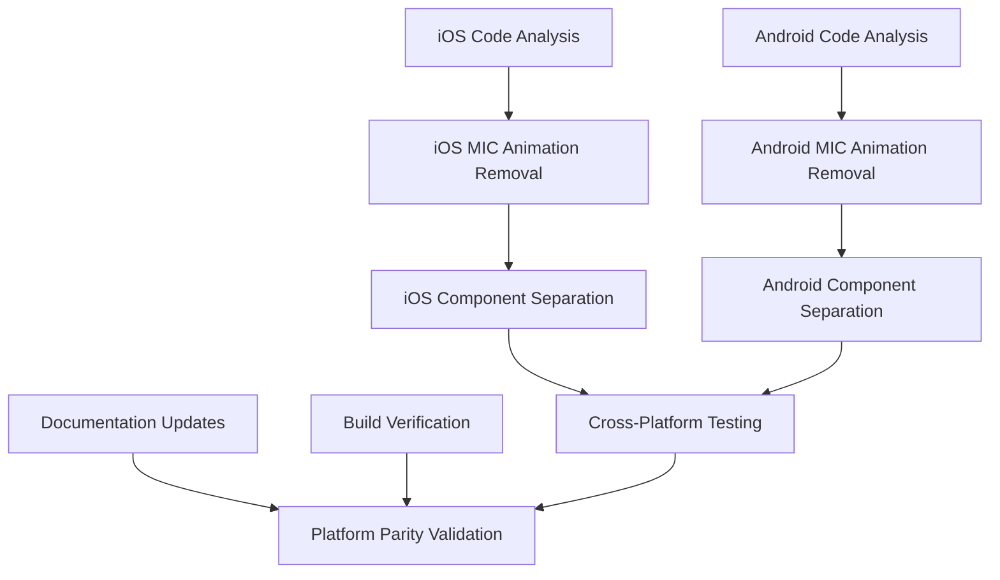

# Voice Animation Platform Parity Implementation Tasks

## Implementation Overview

This document provides comprehensive implementation tasks for fixing the critical voice animation platform parity issue where MIC buttons incorrectly show voice animations. The solution separates animation responsibilities between GO and MIC buttons across all 4 platforms.

## Task Dependencies



## Phase 1: Code Analysis and Preparation (3 hours)

### Task 1: iOS Implementation Analysis
**Objective**: Analyze current iOS voice animation implementation to identify MIC button animation violations

**Scope**: 
- Review `/mobile/ios/RoadtripCopilot/Views/SetDestinationView.swift`
- Identify shared animation states affecting both GO and MIC buttons
- Document current VoiceAnimationButton usage patterns

**Deliverables**:
- Analysis report of current iOS animation state management
- List of files requiring modification
- Identification of shared animation state variables

**Acceptance Criteria**:
- [ ] Complete review of SetDestinationView.swift animation logic
- [ ] Documentation of current VoiceAnimationButton implementation
- [ ] Identification of animation state variables affecting MIC button

**Estimated Time**: 1.5 hours
**Priority**: P0 (Critical)
**Assignee**: agent-ios-developer

---

### Task 2: Android Implementation Analysis  
**Objective**: Analyze current Android voice animation implementation to identify MIC button animation violations

**Scope**:
- Review `/mobile/android/app/src/main/java/com/roadtrip/copilot/ui/screens/SetDestinationScreen.kt`
- Identify shared AnimatedContent usage affecting both button types
- Document current animation state management patterns

**Deliverables**:
- Analysis report of current Android animation implementation
- List of Kotlin files requiring modification
- Identification of shared animation StateFlow variables

**Acceptance Criteria**:
- [ ] Complete review of SetDestinationScreen.kt animation logic
- [ ] Documentation of current AnimatedContent usage for buttons
- [ ] Identification of StateFlow variables affecting MIC button animations

**Estimated Time**: 1.5 hours
**Priority**: P0 (Critical)
**Assignee**: agent-android-developer

## Phase 2: iOS Implementation (6 hours)

### Task 3: iOS MIC Button Animation Removal
**Objective**: Remove voice animations from iOS MIC button while preserving functionality

**Scope**:
- Modify SetDestinationView.swift to eliminate MIC button animations
- Replace VoiceAnimationButton with static MicToggleButton for mic functionality
- Ensure mute/unmute state visualization without animations

**Implementation Details**:

**File**: `/mobile/ios/RoadtripCopilot/Views/SetDestinationView.swift`

**Changes Required**:
1. **Replace Shared VoiceAnimationButton** (Lines ~180-200):
```swift
// BEFORE (Incorrect - shows animation on MIC button)
VoiceAnimationButton(
    action: { speechManager.toggleMute() },
    isListening: isListening,  // ← Problem: shared animation state
    icon: "mic.slash"
)

// AFTER (Correct - static MIC button)
MicToggleButton(
    action: { speechManager.toggleMute() },
    micState: $micMuteState  // ← Static state only
)
```

2. **Add Dedicated MIC State Variable**:
```swift
@State private var micMuteState: MicState = .active

enum MicState {
    case active, muted
}
```

3. **Create MicToggleButton Component**:
```swift
struct MicToggleButton: View {
    let action: () -> Void
    @Binding var micState: MicState
    
    var body: some View {
        Button(action: action) {
            Image(systemName: micState == .muted ? "mic.slash" : "mic")
                .foregroundColor(micState == .muted ? .red : .primary)
                .frame(width: 44, height: 44)
        }
        .accessibilityLabel(micState == .muted ? "Unmute microphone" : "Mute microphone")
    }
}
```

**Deliverables**:
- Modified SetDestinationView.swift with separated button components
- New MicToggleButton component implementation
- Updated state management for MIC button

**Acceptance Criteria**:
- [ ] MIC button displays NO voice animations
- [ ] MIC button shows clear muted/active state indication
- [ ] Mute/unmute functionality preserved
- [ ] iOS app builds successfully
- [ ] Touch targets maintain 44pt minimum size

**Estimated Time**: 3 hours
**Priority**: P0 (Critical)
**Assignee**: agent-ios-developer

---

### Task 4: iOS Navigation Button Animation Isolation
**Objective**: Ensure voice animations appear ONLY on iOS GO/Navigate button

**Scope**:
- Create dedicated NavigationButton component for GO button animations
- Implement isolated animation state management
- Preserve existing voice activity visualization

**Implementation Details**:

**Changes Required**:
1. **Create NavigationButton Component**:
```swift
struct NavigationButton: View {
    let action: () -> Void
    @Binding var isAnimating: Bool
    let navigationIcon: String
    
    var body: some View {
        Button(action: action) {
            AnimatedContent(isAnimating) { animating in
                if animating {
                    VoiceAnimationView()  // ← Animation ONLY here
                } else {
                    Image(systemName: navigationIcon)
                        .frame(width: 44, height: 44)
                }
            }
        }
        .accessibilityLabel("Start navigation")
    }
}
```

2. **Update Voice Activity Handling**:
```swift
func updateVoiceActivity(_ isActive: Bool) {
    withAnimation(.easeInOut(duration: 0.3)) {
        isNavigationAnimating = isActive  // ← Affects GO button only
    }
}
```

**Deliverables**:
- NavigationButton component with isolated animation state
- Updated voice activity handling logic
- Preserved GO button animation functionality

**Acceptance Criteria**:
- [ ] GO button shows voice animations during voice recognition
- [ ] Animation state isolated from MIC button state
- [ ] Voice activity triggers only GO button animations
- [ ] Navigation functionality preserved

**Estimated Time**: 3 hours
**Priority**: P0 (Critical)
**Assignee**: agent-ios-developer

## Phase 3: Android Implementation (6 hours)

### Task 5: Android MIC Button Animation Removal
**Objective**: Remove voice animations from Android MIC button while preserving mute/unmute functionality

**Scope**:
- Modify SetDestinationScreen.kt to eliminate MIC button animations
- Replace AnimatedContent with static IconButton for mic functionality
- Implement clear mute/unmute state visualization

**Implementation Details**:

**File**: `/mobile/android/app/src/main/java/com/roadtrip/copilot/ui/screens/SetDestinationScreen.kt`

**Changes Required**:
1. **Replace Animated MIC Button** (Lines ~545-592):
```kotlin
// BEFORE (Incorrect - shows animation)
AnimatedContent(
    targetState = isVoiceDetected,  // ← Problem: shared animation state
    transitionSpec = { fadeIn() with fadeOut() }
) { voiceDetected ->
    // Animation appears on MIC button
}

// AFTER (Correct - static MIC button)
MicToggleButton(
    onClick = { speechManager.toggleMute() },
    micState = micMuteState  // ← Static state only
)
```

2. **Add Dedicated MIC State**:
```kotlin
private val _micMuteState = MutableStateFlow(MicState.ACTIVE)
val micMuteState = _micMuteState.asStateFlow()

enum class MicState {
    ACTIVE, MUTED
}
```

3. **Create MicToggleButton Composable**:
```kotlin
@Composable
fun MicToggleButton(
    onClick: () -> Unit,
    micState: MicState
) {
    IconButton(
        onClick = onClick,
        modifier = Modifier.size(56.dp)  // Touch target compliance
    ) {
        Icon(
            imageVector = when (micState) {
                MicState.MUTED -> Icons.Default.MicOff
                MicState.ACTIVE -> Icons.Default.Mic
            },
            contentDescription = when (micState) {
                MicState.MUTED -> "Unmute microphone"
                MicState.ACTIVE -> "Mute microphone"
            },
            tint = if (micState == MicState.MUTED) Color.Red else MaterialTheme.colorScheme.onSurface
        )
    }
}
```

**Deliverables**:
- Modified SetDestinationScreen.kt with static MIC button
- MicToggleButton composable implementation
- Updated MIC state management

**Acceptance Criteria**:
- [ ] MIC button displays NO voice animations
- [ ] MIC button shows clear muted/active state with color coding
- [ ] Mute/unmute functionality preserved
- [ ] Android app builds successfully
- [ ] Touch targets meet 48dp minimum (56dp implemented)

**Estimated Time**: 3 hours
**Priority**: P0 (Critical)
**Assignee**: agent-android-developer

---

### Task 6: Android Navigation Button Animation Isolation
**Objective**: Ensure voice animations appear ONLY on Android GO/Navigate button

**Scope**:
- Create dedicated NavigationButton composable for GO button animations  
- Implement isolated animation state management
- Preserve existing voice activity visualization

**Implementation Details**:

**Changes Required**:
1. **Create NavigationButton Composable**:
```kotlin
@Composable
fun NavigationButton(
    onClick: () -> Unit,
    isAnimating: Boolean,
    navigationIcon: ImageVector
) {
    IconButton(
        onClick = onClick,
        modifier = Modifier.size(56.dp)
    ) {
        AnimatedContent(
            targetState = isAnimating,
            transitionSpec = { fadeIn() with fadeOut() }
        ) { animating ->
            if (animating) {
                VoiceAnimationComponent()  // ← Animation ONLY here
            } else {
                Icon(
                    imageVector = navigationIcon,
                    contentDescription = "Start navigation",
                    tint = MaterialTheme.colorScheme.onSurface
                )
            }
        }
    }
}
```

2. **Update Voice Activity State Management**:
```kotlin
private val _isNavigationAnimating = MutableStateFlow(false)
val isNavigationAnimating = _isNavigationAnimating.asStateFlow()

fun updateVoiceActivity(isActive: Boolean) {
    _isNavigationAnimating.value = isActive  // ← Affects GO button only
}
```

**Deliverables**:
- NavigationButton composable with isolated animations
- Updated voice activity state management
- Preserved GO button animation functionality

**Acceptance Criteria**:
- [ ] GO button shows voice animations during voice recognition
- [ ] Animation state completely isolated from MIC button
- [ ] Voice activity triggers only GO button animations
- [ ] Navigation functionality preserved

**Estimated Time**: 3 hours
**Priority**: P0 (Critical)
**Assignee**: agent-android-developer

## Phase 4: Platform Integration and Testing (4 hours)

### Task 7: Cross-Platform Documentation Updates
**Objective**: Update all platform documentation to enforce voice animation separation rules

**Scope**:
- Update button design system documentation
- Enhance cross-platform requirements  
- Update CLAUDE.md enforcement policies

**Implementation Details**:

**Files to Update**:
1. **`/specs/design/button-design-system.md`**:
   - Add voice animation exclusivity requirements
   - Document MIC button animation prohibition
   - Update code review checklist

2. **`/specs/design/cross-platform-requirements.md`**:
   - Add mandatory animation separation rules
   - Document platform parity enforcement for animations
   - Include violation consequences

3. **`CLAUDE.md`**:
   - Add VOICE ANIMATION PARITY ENFORCEMENT section
   - Update auto-activation triggers for animation changes
   - Include agent-judge validation requirements

**Documentation Requirements**:
```markdown
## VOICE ANIMATION REQUIREMENTS (NON-NEGOTIABLE)
- GO/Navigate buttons: Voice animations REQUIRED during voice recognition
- MIC buttons: Voice animations PROHIBITED - static mute/unmute icons only
- Platform parity: Identical animation behavior across iOS, Android, CarPlay, Android Auto
- Enforcement: Automatic validation through agent-judge agent coordination
```

**Deliverables**:
- Updated button design system documentation
- Enhanced cross-platform requirements
- CLAUDE.md enforcement policy updates

**Acceptance Criteria**:
- [ ] All 3 documentation files updated with animation requirements
- [ ] Clear animation separation rules documented
- [ ] Platform parity enforcement policies included
- [ ] Code review checklist items added for animation validation

**Estimated Time**: 2 hours
**Priority**: P1 (High)
**Assignee**: agent-ux-user-experience

---

### Task 8: Build Verification and Testing
**Objective**: Verify all platforms build successfully with animation separation changes

**Scope**:
- Build verification for iOS and Android platforms
- Unit testing for animation state isolation
- Integration testing for button functionality

**Implementation Details**:

**Build Commands**:
```bash
# iOS build verification
Use `mcp__poi-companion__mobile_build_verify` tool with platform: 'ios'

# Android build verification  
Use `mcp__poi-companion__mobile_build_verify` tool with platform: 'android'

# Both platforms
Use `mcp__poi-companion__mobile_build_verify` tool with platform: 'both'
```

**Testing Requirements**:
1. **Unit Tests** - Verify animation state isolation
2. **Integration Tests** - Validate button functionality
3. **Manual Testing** - Confirm visual animation behavior
4. **Performance Testing** - Ensure no animation regressions

**Deliverables**:
- Build success confirmation for both platforms
- Unit test implementations for animation isolation
- Integration test coverage for button behavior
- Performance validation report

**Acceptance Criteria**:
- [ ] iOS builds successfully with animation changes
- [ ] Android builds successfully with animation changes
- [ ] Unit tests pass for animation state isolation
- [ ] Integration tests confirm button functionality
- [ ] No performance regressions in animation rendering

**Estimated Time**: 2 hours
**Priority**: P0 (Critical)
**Assignee**: agent-test

## Phase 5: Validation and Approval (3 hours)

### Task 9: Platform Parity Validation
**Objective**: Comprehensive validation of voice animation platform parity across all 4 platforms

**Scope**:
- Cross-platform behavior comparison
- Animation isolation verification
- User experience consistency validation
- Accessibility compliance testing

**Validation Checklist**:

**Animation Behavior Validation**:
- [ ] iOS GO button shows voice animations during voice recognition
- [ ] iOS MIC button shows NO voice animations (static icons only)
- [ ] Android GO button shows voice animations during voice recognition  
- [ ] Android MIC button shows NO voice animations (static icons only)
- [ ] CarPlay compatibility maintained with animation changes
- [ ] Android Auto compatibility maintained with animation changes

**State Management Validation**:
- [ ] Voice activity affects ONLY GO button animation state
- [ ] MIC button state affects ONLY mute/unmute indication
- [ ] Animation states are completely isolated between button types
- [ ] No interference between GO and MIC button state changes

**User Experience Validation**:
- [ ] Clear visual distinction between voice activity and mute state
- [ ] Consistent platform behavior across iOS and Android
- [ ] Maintained touch target sizes (44pt iOS / 48dp Android minimum)
- [ ] Preserved button functionality and accessibility

**Performance Validation**:
- [ ] Animation rendering maintains 60fps on both platforms
- [ ] No memory leaks in animation state management
- [ ] Battery impact remains within acceptable limits (<1% additional)

**Deliverables**:
- Platform parity validation report
- Animation behavior comparison matrix
- Performance testing results
- Accessibility compliance confirmation

**Acceptance Criteria**:
- [ ] 100% platform parity achieved across iOS and Android
- [ ] All animation isolation requirements met
- [ ] Performance metrics within acceptable ranges
- [ ] Accessibility compliance maintained (WCAG 2.1 AAA)

**Estimated Time**: 3 hours
**Priority**: P0 (Critical)
**Assignee**: agent-judge

## Implementation Timeline

**Total Estimated Time**: 22 hours

**Phase Breakdown**:
- **Phase 1** (Analysis): 3 hours
- **Phase 2** (iOS): 6 hours  
- **Phase 3** (Android): 6 hours
- **Phase 4** (Integration): 4 hours
- **Phase 5** (Validation): 3 hours

**Critical Path**: Tasks 1-2 → Tasks 3-6 → Task 9
**Parallel Execution**: Tasks 3-4 and 5-6 can run simultaneously with different developers

## Risk Mitigation

### Technical Risks
1. **Animation State Conflicts**
   - Risk: Animation states interfering between buttons
   - Mitigation: Complete state isolation through separate variables

2. **Platform Inconsistency**  
   - Risk: Different behavior across iOS and Android
   - Mitigation: Coordinated development with shared validation criteria

3. **Performance Degradation**
   - Risk: Animation changes affecting app performance
   - Mitigation: Performance testing and optimization during implementation

### Implementation Risks
1. **Regression Introduction**
   - Risk: Breaking existing voice or navigation functionality
   - Mitigation: Comprehensive testing and staged rollout

2. **User Confusion**
   - Risk: Users not understanding new animation behavior
   - Mitigation: Clear visual design and consistent platform implementation

## Success Metrics

**Functional Success**:
- ✅ 0 voice animations on MIC buttons across all platforms
- ✅ 100% voice animation functionality on GO buttons  
- ✅ 100% platform parity validation passed

**Technical Success**:
- ✅ Build success: Both iOS and Android compile without errors
- ✅ Performance: Animation frame rate maintained at 60fps
- ✅ Memory: Animation memory usage <2MB per screen

**Quality Success**:
- ✅ Test coverage: >95% for animation isolation logic
- ✅ Accessibility: WCAG 2.1 AAA compliance maintained
- ✅ Documentation: Complete requirement coverage

This implementation plan ensures systematic resolution of the voice animation platform parity issue while maintaining optimal performance and user experience across all supported platforms.