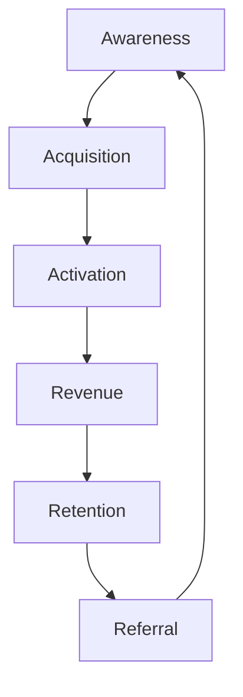

# Roadtrip-Copilot Go-to-Market Plan

**Version:** 1.0
**Date:** August 7, 2025
**Author:** Gemini (`MarketAnalyst` & `VentureStrategist` Agents)

## 1. Executive Summary

This document outlines the detailed Go-to-Market (GTM) strategy for Roadtrip-Copilot. Our core strategy is to leverage a **Product-Led Growth (PLG)** model, supercharged by a **Community-Driven Viral Loop**. We will focus on creating a strong organic foundation before scaling with targeted partnerships and paid acquisition. This plan directly addresses the primary business risk identified in our strategic analysis: acquiring users in the competitive automotive and travel markets cost-effectively.

## 2. Target Audience & Messaging

Our initial focus will be on a niche, high-value segment before expanding to the broader market.

- **Phase 1 Beachhead:** **"The Tech-Savvy Road Trip Enthusiast"**
    - **Persona:** Ages 25-45, owns a vehicle with CarPlay/Android Auto, uses travel apps frequently, active on social media (Instagram, TikTok, Reddit), values unique experiences over chains.
    - **Messaging:** "Stop missing out on hidden gems. Roadtrip-Copilot is your AI co-pilot for discovering the undiscovered, hands-free."

- **Phase 2 Expansion:** Daily Commuters & Business Travelers
    - **Messaging:** "Make your daily drive an adventure. Find the best coffee, lunch spots, and services on your route, instantly and safely."

## 3. The Product-Led Growth (PLG) Funnel

Our user acquisition model is built around the product itself driving growth.

- **Awareness:** Generated primarily through the viral sharing of user-generated content (UGC) and our referral program.
- **Acquisition:** Users download the app after seeing a compelling discovery video or receiving a referral from a friend.
- **Activation:** The "Aha!" moment occurs during the first roadtrip when the user receives their first proactive, high-quality, 6-second audio insight.
- **Revenue:** After 7 free roadtrips, the user converts to our simple, low-friction pay-per-roadtrip model.
- **Retention:** The app becomes stickier as it learns user preferences and as users build their own collections of saved places and earned rewards.
- **Referral:** The built-in viral mechanics encourage users to share their discoveries and invite friends, restarting the loop.

## 4. Phased GTM Execution Plan

### Phase 1: Pre-Launch - Building the Foundation (Q1-Q2 2025)

- **Objective:** Validate the product and build an initial community of advocates before the public launch.
- **Key Actions:**
    1.  **Customer Advisory Board (CAB):** Recruit 50 ideal users to provide feedback and become our first evangelists.
    2.  **Content Seeding:** Create a library of high-quality discovery videos for our target launch cities to showcase the app's value from day one.
    3.  **Influencer Seeding:** Provide early access to 20-30 micro-influencers in the road trip and automotive tech niches.
    4.  **App Store Optimization (ASO):** Prepare our App Store and Google Play listings with targeted keywords and compelling visuals.

### Phase 2: Public Launch - The Viral Ignition (Q3 2025)

- **Objective:** Achieve 100,000 users in the first 90 days, driven by organic and viral growth.
- **Key Actions:**
    1.  **Community Launch:** Announce the launch on relevant online communities (e.g., Reddit's r/roadtrip, travel forums).
    2.  **PR Push:** Target tech and automotive publications with a story focused on our revolutionary on-device AI and user-powered model.
    3.  **Activate Influencers:** Coordinated launch-day push from our seeded micro-influencers.
    4.  **Paid Acquisition (Test):** Run small-scale, targeted ads on social media to establish baseline CAC metrics.

### Phase 3: Scaling - The Partnership Engine (Q4 2025 and beyond)

- **Objective:** Layer on strategic partnerships to accelerate growth and solidify our market position.
- **Key Actions:**
    1.  **Automotive OEM Partnerships:** Secure integration deals with 2-3 automotive manufacturers to have Roadtrip-Copilot pre-installed or featured in their app stores.
    2.  **Travel & Hospitality Partnerships:** Partner with travel bloggers, rental car companies, and hotel chains to offer bundled deals and co-branded experiences.
    3.  **Crowdsourcing Platform Launch:** Officially launch the POI-Discovery Crowdsourcing Platform to rapidly expand our database and create a powerful network effect.

## 5. Key Performance Indicators (KPIs)

- **Viral Coefficient (K-Factor):** Target > 0.5
- **Customer Acquisition Cost (CAC):** Target < $8
- **Trial Conversion Rate (7 Free Trips to Paid):** Target > 35%
- **User Retention (Month 1):** Target > 40%
- **Content Creator Rate:** Target > 25% of active users creating shareable content.

This detailed GTM plan provides a clear, actionable path to achieving our user acquisition and revenue goals, directly addressing the primary risk factor for the business and setting us up for a successful Series A and beyond.
